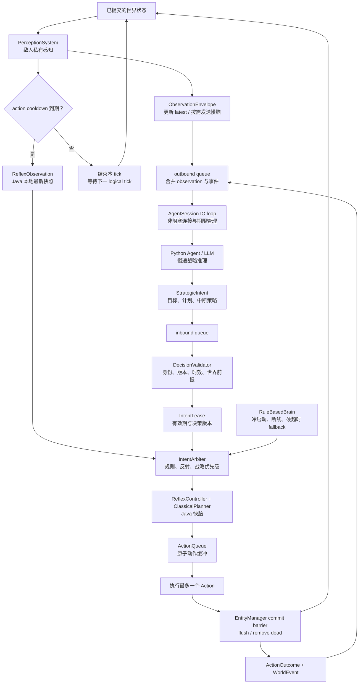

# AI Tick 架构优化设计

> 状态：Draft — 基于 Intent + Roadmap 的架构决策
>
> 日期：2026-07-22
>
> 依据文档：`PROJECT_INTENT_zh-CN.md` §6-7、`DEVELOPMENT_ROADMAP.md` §3 INV-04/05/07、`PHASE_2_SPEC.md`

---

## 0. 问题诊断：当前架构的三个方向性错误

### 错误一：Java 僭越了 Agent 的决策循环

当前 `Enemy.updateAI()` 以同步函数调用的方式驱动 Agent 生命周期：

```text
Java: "给你 observation，现在立刻给我 intent"          ← Java 是调度者
Brain: think(obs) → StrategicIntent
Java: "好，我帮你规划，我帮你执行，你不用管了"           ← Java 包办了执行
```

这是**主从架构**——Brain 只是一个被调用的函数。Agent MVP（Intent §6）要求 Agent 拥有自己的推理循环，Java 应该是**能力提供者**而非**决策调度者**。

### 错误二：think/plan/act 耦合在单一调用栈

```text
updateAI() {
    perception() → brain.think() → planner.translate() → action.execute() × 4
}
```

四个阶段全部在同一个帧内完成，导致：
- 决策节奏被帧率绑架——Agent 无法控制何时思考（违背 INV-07）
- 无法支持 Tool Calling——Agent 没有"查询→思考→再查询→再思考"的循环（Phase 3 硬需求）
- 没有反馈回路——action 结果不回传给 Agent（违背 Intent §6.7 §7）
- MAX_RETRY=4 让一个 AI 帧执行多个动作，帧边界语义混乱

### 错误三：单意图模型过于粗糙

`StrategicIntent` 只有一个 goal + 一个 target。Agent 无法表达：
- 条件行为（"巡逻，但如果听到声音就调查"）
- 序列化子目标（"先移动到掩体，再观察，再决定"）
- 行为分支（"如果玩家血量 < 20 就追击，否则撤退"）

这些在 RuleBasedBrain 下不需要，但对 LLM Agent 是基本表达能力。

---

## 1. 目标架构：对等事件模型

### 核心原则

| 当前（主从） | 目标（对等） |
|-------------|-------------|
| Java 调用 Brain 函数 | Agent 向 Java 请求服务 |
| Java 同步要求立即回答 | Java 推送受限事件；Agent 决定是否以及如何深度思考 |
| 一次调用给出最终答案 | 多轮 Tool Call 逐步推理 |
| 执行结果不反馈 | ActionOutcome 写回 Agent |
| 帧计数器驱动 AI | 事件驱动 AI |

### 角色定义

```text
┌─────────────────────────────────────────────┐
│                  Java 引擎                    │
│                                              │
│  职责：世界事实的唯一权威（INV-04）            │
│                                              │
│  提供的服务（Server 端）：                     │
│   1. 感知服务 —— 按需提供 ObservationEnvelope  │
│   2. 执行服务 —— 接受 StrategicIntent，       │
│       翻译为 Action，逐帧执行，反馈结果         │
│   3. 反射服务 —— 提供快速路径查询、碰撞检测等    │
│   4. 事件通知 —— 推送世界事件给 Agent           │
│                                              │
│  不做的事：                                   │
│   ✗ 不决定 Agent 何时思考                     │
│   ✗ 不代 Agent 做任何高于反射层的决策           │
│   ✗ 不在 Agent 思考时阻塞游戏循环               │
└─────────────────────────────────────────────┘
                        ↕ 双向消息流
┌─────────────────────────────────────────────┐
│              Agent（Python 侧）                │
│                                              │
│  职责：拥有自己的推理循环（INV-01, INV-02）      │
│                                              │
│  核心循环：                                   │
│  收到事件 → 推理 → 可能调用 Tool → 推理         │
│  → 产生 Intent → 等待反馈 → 重新规划            │
│                                              │
│  拥有：                                       │
│   - 私有信念状态                              │
│   - 工作记忆                                  │
│   - 当前计划和执行上下文                        │
│   - 消息历史                                  │
└─────────────────────────────────────────────┘
```

这与 Intent §7 的层级完全对齐：

```text
敌人感知与信念
  → Agent 推理与工具使用          ← Agent 侧，Java 提供查询接口
  → 结构化 StrategicIntent         ← 跨进程传输
  → 确定性规划器 / 技能             ← Java 侧
  → ActionQueue 与原子动作         ← Java 侧
  → 将执行反馈返回 Agent           ← 跨进程传输，闭环
```

---

## 2. 大模型推理延迟：双速大脑与非阻塞控制

LLM 的推理延迟不是异常路径，而是正常运行条件。一次真实推理可能持续数秒，Tool Calling
会进一步拉长时间；因此架构不能把“模型及时回复”作为敌人能继续行动的前提。

本章锁定四个目标：

1. **游戏线程永不等待模型或 socket**。
2. **模型思考期间敌人不发呆**，仍能执行旧计划和快速反射。
3. **慢响应不会污染新世界状态**，迟到决策必须可识别并丢弃。
4. **高延迟不会造成请求风暴**，同一敌人始终只有一个有效 in-flight 推理。

### 2.1 架构概览

模型是异步的战略顾问，不在游戏主循环上。Java 快脑始终按 action tick 运行；模型思考时，
快脑继续执行仍有效的旧 intent，或使用本地规则追击、避险和绕路。模型返回的新 intent 必须
先通过身份、时效和世界前提校验，才能在安全动作边界替换当前计划。



（从“已提交的世界状态”向下看：感知结果分成慢脑使用的 `ObservationEnvelope` 异步链路，以及 cooldown 到期后供 Java 快脑使用的 `ReflexObservation` 实时链路。慢脑返回的 Intent 经校验和仲裁后参与下一次行动，动作提交后的结果再反馈给慢脑，形成闭环。）

图中术语速查：

| 概念 | 简单解释 | 详细说明 |
|------|----------|----------|
| `ObservationEnvelope` | 可序列化给慢脑的敌人私有感知；cooldown 期间可以替换 `latestObservation`，但只按事件、低水位或 heartbeat 调度入队。 | §2.5、§6.2 |
| `ReflexObservation` | cooldown 到期、即将选择动作时为单个敌人生成的 Java 本地快照；不发送给 Python，也不包含隐藏信息。 | §2.10 |
| `ReflexController`（reflex，快脑） | 毫秒级本地控制器；等待模型时仍能继续旧计划，并处理攻击、追击、避险和局部绕行。 | §2.2、§2.10 |
| `ClassicalPlanner` | 把 `StrategicIntent` 翻译成若干可执行的原子动作，本身不负责长期战略。 | §8 |
| `ActionQueue` | 跨 action tick 保存原子动作；每次 cooldown 到期最多消费一个动作。 | §8 |
| action cooldown | 敌人的行动节拍限制；未到期就不执行新动作，但感知、消息轮询和模型推理仍可继续。 | §2.3、§2.8 |
| world commit barrier | 动作执行后统一提交实体移动、生成和死亡；只有提交完成的世界才能用于下一次感知与反馈。 | §2.8、§4.2 |
| outbound queue | Java 发给 Agent 的有界队列，承载 observation、动作反馈和世界事件；入队不等于同步写 socket。 | §2.5、§2.7 |
| inbound queue | 后台 IO 已接收并解析的 Agent 消息队列；游戏线程只轮询它，不直接读 socket。 | §2.7 |
| `AgentSession` IO loop | 每个 Agent 的异步通信会话，负责连接、读写、重连、请求期限和双向队列搬运。 | §2.7、§5.1 |
| `StrategicIntent` | 模型给出的高层意图，描述目标、计划有效期以及允许快脑何时打断它，不是直接修改世界的命令。 | §6.3 |
| `DecisionValidator` | 新 intent 的入口校验器，检查身份、session、序号、版本、时效与世界前提，拒绝迟到响应。 | §2.6 |
| `IntentLease` | Java 接受 intent 后保存的有期限执行许可，绑定决策版本和中断策略，过期后不能继续支配动作。 | §2.10 |
| `IntentArbiter` | 仲裁器，在世界硬规则、紧急反射、当前可见目标、有效 lease 和本地 fallback 之间决定优先级。 | §2.10 |
| `RuleBasedBrain` | 无计划、冷启动、断线或硬超时时使用的本地低阶大脑，不与远程 Agent 平级争夺长期战略。 | §4.5、§7 |
| `ActionOutcome` / `WorldEvent` | 动作结果与重要环境变化的结构化反馈，使 Agent 知道计划成功、失败或被快脑覆盖。 | §6.2 |

图的前半段是 Java 实时闭环：`PerceptionSystem` 从已提交世界生成两种不同用途的私有视图。
`ObservationEnvelope` 更新慢脑的 latest snapshot，但只有满足事件、计划低水位或 heartbeat 等
调度条件时才进入 outbound queue；已有 in-flight 时只合并最新值，不制造并发请求。
`ReflexObservation` 则在 cooldown 到期、即将选择动作时提供给 Java 快脑。快脑至多执行一个动作，
然后经过 `EntityManager` 的提交屏障统一刷新世界。整个闭环只读取本地状态，不访问 socket，
也不等待模型。

异步链路通过两个有界队列与游戏线程隔离。`AgentSession` 负责 IO、重连和请求期限；Python
慢脑只返回战略 intent，不直接操作世界。返回值依次经过 `DecisionValidator` 和 `IntentLease`，
最后才由 `IntentArbiter` 与当前反射、本地 fallback 一起决定快脑接下来执行什么。

因此等待模型不会暂停实时闭环。模型返回得太晚时，`DecisionValidator` 会按 session、序号和
世界前提拒绝陈旧 intent；玩家突然进入视野等高优先级事件，则由 `IntentArbiter` 允许 Java
快脑覆盖旧战略。每次动作产生的 `ActionOutcome` 和 `WorldEvent` 会异步反馈给模型，使下一次
推理能够解释计划为何成功、失败或被反射层打断。后续各节用文字定义具体的优先级、超时、
请求生命周期和失效条件。

### 2.2 双速大脑

每个敌人同时拥有两个不同层级的控制器，但它们不是两个平级、互相争抢控制权的大脑：

| 层级 | 实现位置 | 节奏 | 职责 |
|------|----------|------|------|
| 慢速思考层 | Python Agent / LLM | 事件触发，秒级 | 目标、策略、沟通、长期取舍、结构化 `StrategicIntent` |
| 快速反射层 | Java `ReflexController` | 每个 action tick，毫秒级 | 继续计划、选择下一原子动作、局部绕行、紧急反应、失效检测 |

控制链固定为：

```text
Observation / WorldEvent
        → 慢速 Agent 推理（异步）
        → StrategicIntent
        → IntentArbiter 校验并采纳
        → ReflexController + ClassicalPlanner
        → ActionQueue
        → 每个动作的 ActionOutcome 返回 Agent
```

`ReflexController` 可以：

- 在当前 intent 下选择下一步移动、攻击或等待；
- 处理碰撞、非法动作和短距离局部绕行；
- 在模型思考时继续执行尚未过期的旧计划；
- 检测 `PLAYER_LOST`、`PLAN_BLOCKED`、`HEAVY_DAMAGE` 等重规划事件；
- 在没有远程计划时调用本地 `RuleBasedBrain` 产生短期 fallback。

`ReflexController` 不可以：

- 读取私有 observation 以外的隐藏世界信息；
- 每帧用本地 CHASE/PATROL 覆盖仍有效的 Agent intent；
- 擅自进行长期战略、跨敌人通信或地图记忆；
- 绕过 Java 对动作、权限、知识来源和可达性的校验。

### 2.3 等待模型时敌人做什么

| 当前情况 | 等待期间行为 |
|----------|--------------|
| 已有有效计划且 queue 非空 | 按 action cooldown 继续执行，每个 action tick 最多一个动作 |
| 计划即将耗尽 | 继续剩余动作，同时后台请求下一 intent |
| 计划执行失败 | 快脑先尝试允许范围内的局部修正，并发送 `PLAN_BLOCKED`；必要时停止旧计划 |
| 首次启动、没有任何计划 | 使用基于私有 observation 的 `RuleBasedBrain` 短期接管 |
| 软超时 | 不取消推理；继续旧计划或本地反射，并记录延迟状态 |
| 硬超时 | 当前 request generation 失效；本地 Brain 接管，允许调度下一次请求 |
| 连接断开 | Session 保留并进入 `DISCONNECTED`，后台重连；本地 Brain 临时接管 |

fallback 的优先顺序是：**继续安全的旧计划 → 本地规则反射 → WAIT/PATROL**。不能因为模型短暂变慢就立即清空一个仍然合理的计划。

### 2.4 三组正交状态

单一 `IDLE / WAITING / EXECUTING` 状态机会错误地假设“等待模型”和“执行计划”互斥。
实际实现必须拆成三组正交状态：

```text
ConnectionState = DISABLED | CONNECTING | CONNECTED | DISCONNECTED
RequestState    = NO_REQUEST | AWAITING_INTENT | SOFT_TIMED_OUT
ExecutionState  = NO_PLAN | EXECUTING | BLOCKED | EXHAUSTED
```

因此一个敌人可以同时处于：

```text
CONNECTED + AWAITING_INTENT + EXECUTING
```

即 Agent 在思考下一计划，而 Enemy 仍执行上一计划。这是隐藏模型延迟的主要机制。

### 2.5 请求生命周期与 observation 合并

每个敌人最多一个有效 in-flight 请求。新 observation 不应按每个 `moveInterval` 自动覆盖正在进行的推理。

请求触发条件：

- 第一次进入活动楼层；
- 当前计划低于 queue low-water mark；
- 计划完成或失败；
- 玩家出现/消失、受伤、声音、盟友消息等重要事件；
- 可配置的低频 heartbeat。

in-flight 期间出现新事件时：

1. 保存最新 observation；
2. 将重要事件合并到有界 `pendingEvents`；
3. 不立即启动第二个模型调用；
4. 当前响应到达或硬超时后，再决定采纳响应还是用最新快照发起下一请求。

只有楼层切换、Agent 死亡、显式取消或会使原决策明显失效的关键事件，才立即 supersede 当前请求。

supersede 也不能制造并发推理：Java 必须先发送 cancel 并等待 runtime 确认；如果 Phase 2 fake runtime
尚不支持取消，则关闭并重建该 Agent 的 Session、增加 `sessionEpoch`，再发送新请求。禁止旧请求仍在
Python 中运行时，仅靠增加 observationSeq 就持续追加新的模型调用。

### 2.6 软超时、硬超时与过期响应

超时使用单调时钟计算，不使用 wall-clock 参与正确性判断。建议分别配置：

| deadline | 含义 | 行为 |
|----------|------|------|
| soft deadline | 推理比期望慢，但仍可能有价值 | 记录 `AGENT_SLOW`，继续旧计划/快脑，不取消请求 |
| hard deadline | 响应对当前玩法已经太旧 | 增加 request generation，旧响应失效，本地 Brain 接管 |

hard deadline 只代表旧结果不再可采纳，不代表可以无限并发创建新推理；下一请求仍须遵守 §2.5 的 cancel/重建 Session 规则。

迟到的 `submit_intent` 必须同时匹配：

```text
runId + floorId + agentId + sessionEpoch
      + observationSeq + decisionId + requestGeneration
```

任一字段不匹配都只能记录为 `STALE_RESPONSE_DROPPED`，不得清空当前 ActionQueue、改变 intent 或重置 cooldown。

### 2.7 非阻塞 IO 的硬约束

“方法名叫 poll”并不能保证非阻塞。`AgentSession` 必须使用独立 IO 线程或 non-blocking `SocketChannel`：

- 游戏线程的 `sendObservation()` / `sendActionFeedback()` 只向有界 outbound queue 入队；
- 游戏线程的 `pollInbound()` 只消费已经完成解析的 inbound message；
- 游戏线程禁止直接调用阻塞式 socket `read`、`write`、`connect` 或等待 Future；
- 队列满时按消息优先级丢弃/合并 heartbeat 和旧 observation，不能阻塞游戏；
- intent、cancel 和 action feedback 不得静默丢失，失败时进入 trace 并触发降级；
- 连接对象不能在断线时置为 `null`，它必须保存重连退避和 `sessionEpoch`。

### 2.8 正确的帧顺序

延迟架构下，每帧的顺序必须保证快脑持续运行，并且 observation 读取的是已经提交的位置索引：

```text
1. poll inbound queue（非阻塞）
2. validate + adopt 最新有效 intent（只在安全动作边界切换）
3. action cooldown 到期时，ReflexController 执行最多一个 action
4. EntityManager.flushPendingChanges / removeDeadEntities   ← world commit barrier
5. 生成 ActionOutcome、重要事件和必要的新 observation
6. enqueue outbound messages（只入队，不做阻塞 IO）
```

动作频率由独立的 `nextActionTick/actionCooldown` 控制，不能因为拆出 `executeOneAction()` 就让敌人每个渲染帧移动一次。observation 调度与动作冷却也是两个独立概念。

### 2.9 延迟相关 trace 与验收门槛

必须记录但不进入 deterministic canonical evidence 的诊断字段：`queueDelayMs`、`transportMs`、`inferenceMs`、`totalLatencyMs`。canonical trace 使用逻辑 tick 和离散事件：

- `AGENT_REQUEST_SENT`
- `AGENT_SLOW`
- `AGENT_HARD_TIMEOUT`
- `STALE_RESPONSE_DROPPED`
- `LOCAL_BRAIN_TAKEOVER`
- `REMOTE_AGENT_RESUMED`
- `REFLEX_OVERRIDE_STARTED`
- `REFLEX_OVERRIDE_ENDED`

Phase 2 的延迟验收至少包括：

1. Fake Agent 延迟数秒时，逻辑 tick、玩家输入和渲染继续推进；
2. 有旧计划的 Enemy 在等待期间继续按原 action cooldown 行动；
3. 无旧计划的 Enemy 使用本地 Brain，而不是静止；
4. 连续 observation 不会制造多个并发请求；
5. 硬超时后的迟到响应不会改变当前 intent；
6. outbound queue 满或 Python 停止读取时，游戏线程仍不阻塞；
7. Python 恢复后 Session 重连，新的有效 intent 可以重新接管。

### 2.10 陈旧 Intent 与高优先级反射仲裁

模型返回的 intent 即使通过了 `observationSeq` 校验，也可能在推理期间变得**语义过时**。例如模型根据
tick 100 的 observation 决定巡逻，而 tick 104 时玩家已经出现在 Enemy 眼前。Java 不能机械执行旧 PATROL，
也不能等待下一次模型调用才对当前可见玩家作出反应。

为此，Java 将远程 intent 包装为有期限的 lease，而不是永久命令：

```java
public final class IntentLease {
    StrategicIntent intent;
    String decisionId;
    long basedOnObservationSeq;
    long adoptedAtTick;
    long validUntilTick;
    InterruptPolicy interruptPolicy;
}
```

`ReflexController` 在每个 action tick 获取一份新的私有 `ReflexObservation`。这份观察可以复用
`PerceptionSystem`，但只在 Java 内使用，不代表要向 LLM 发起新请求。**本地感知刷新频率和模型请求频率必须分离**。

控制权按以下优先级仲裁：

| 优先级 | 来源 | 示例 | 权限 |
|--------|------|------|------|
| P0 | Java 世界规则 | 死亡、越界、碰撞、非法动作 | 无条件拒绝任何非法动作 |
| P1 | 紧急反射 | 玩家已相邻、正在受击、即将受到致命伤害 | 可暂时中断慢脑动作并立即攻击、防御或脱离 |
| P2 | 新鲜直接感知 | 当前 FOV 中出现玩家 | 在策略允许时进入短时 `REFLEX_ENGAGE`，追击当前可见位置 |
| P3 | 有效 IntentLease | CHASE、GUARD、INVESTIGATE、RETREAT | 正常的长期目标与计划来源 |
| P4 | 本地 fallback | 无 lease、模型超时或断线 | RuleBasedBrain 维持基本行为 |

P2 追杀不是无限制覆盖。仍然新鲜的 `RETREAT`、`AVOID_CONTACT`、`HOLD_POSITION` 等 intent 可以通过
`InterruptPolicy` 禁止主动追击；P1 的保命或相邻战斗反射仍可执行。这样快脑不会把模型的撤退策略每帧
改回 CHASE，同时也不会面对贴身玩家继续执行陈旧 PATROL。

Intent 被判定为语义过时的条件包括：

- `validUntilTick` 已过期；
- 当前直接感知与 intent 的关键前提冲突，例如玩家已在眼前但 intent 仍假设区域安全；
- intent 目标来自旧 observation，且新 observation 已确认目标位置改变；
- 当前计划连续受阻或动作前提已经不成立；
- 更高优先级的 P1/P2 反射已经触发。

仲裁结果不是偷偷改写远程 intent，而是产生显式的短期覆盖：

```text
REFLEX_OVERRIDE_STARTED
  overriddenDecisionId = model-decision-17
  reason = VISIBLE_PLAYER | ADJACENT_THREAT | HEAVY_DAMAGE | STALE_PRECONDITION
  reflexMode = ENGAGE | ATTACK | EVADE | WAIT
  expiresAtTick = 108
```

覆盖期间：

1. 原 IntentLease 标记为 `SUSPENDED` 或 `STALE`，不立即销毁；
2. 快脑只能使用当前私有感知追击，不能访问隐藏玩家坐标；
3. `PLAYER_SPOTTED` / `REFLEX_OVERRIDE_STARTED` 合并进发给慢脑的下一批事件；
4. 每个反射动作仍生成 ActionOutcome；
5. 玩家丢失、override TTL 到期或新远程 intent 安全接管时，记录 `REFLEX_OVERRIDE_ENDED`；
6. 若原 lease 前提仍成立可以恢复，否则转入本地 fallback 等待慢脑重规划。

典型时序：

```text
tick 100  → 向模型发送 observation#5，Enemy 继续 PATROL
tick 103  → 玩家进入当前 FOV
tick 104  → P2 触发 REFLEX_ENGAGE，快脑追击可见玩家；同时排队 PLAYER_SPOTTED
tick 106  → 模型返回基于 observation#5 的旧 PATROL
          → IntentArbiter 判定关键前提过时，拒绝覆盖当前追杀
tick 108  → 模型基于合并后的新 observation 返回 CHASE，安全接管
```

该机制的验收必须增加：

8. 模型延迟期间玩家进入 FOV，Enemy 在下一个 action tick 开始追击或攻击；
9. 基于旧 observation 返回的 PATROL 不会压过正在进行的 `REFLEX_ENGAGE`；
10. 新鲜 RETREAT intent 能阻止非紧急主动追击，但不能绕过 P0 世界规则；
11. 玩家离开 FOV 后，快脑不会继续读取或追踪其真实隐藏位置；
12. 每次优先级覆盖都能通过 decisionId、reason、起止 tick 和 ActionOutcome 追踪。

Phase 2 先用 deterministic fake runtime 验证上述基础设施；Phase 3 接入真实 LLM；Phase 4 再扩大重要事件触发和反馈驱动重规划。延迟安全不能推迟到 Phase 4，因为它是接入任何真实模型的前置条件。

---

## 3. 通信协议：双向事件流

### 3.1 传输层

复用 Phase 2 Spec 的 localhost TCP 决策（D2-01），但升级为**持久连接**——每个 Agent 一条 TCP 连接，在整个楼层生命周期内保持。

### 3.2 消息格式（NDJSON）

每行一个 JSON 消息，`\n` 分隔。每条消息有 `type` 字段决定语义：

```json
{"type": "observation", "data": { ... }}
{"type": "action_feedback", "data": { ... }}
{"type": "world_event", "data": { ... }}
```

**Java → Agent（下行）**：

| type | 触发时机 | data 内容 | Phase |
|------|----------|-----------|-------|
| `observation` | 首次、计划低水位、重要事件或低频 heartbeat；in-flight 时合并 | ObservationEnvelope 序列化 | 2 |
| `action_feedback` | 一个 action 执行完成后 | 原始 intent 的 decisionId、action 序号、ActionResult、当前位置、HP 变化 | 2（Phase 4 时 Agent 利用此反馈重规划） |
| `world_event` | 检测到有意义的世界事件 | 事件类型（PLAYER_SPOTTED / SOUND_HEARD / ATTACKED / PLAN_COMPLETED / PLAN_BLOCKED / ALLY_MESSAGE）、相关数据 | 2 定义类型，Phase 4+ 触发 |
| `heartbeat` | 定期（可配置） | 当前 turn 号 | 2 |
| `cancel_request` | hard timeout、关键前提失效或 Session 关闭 | 被取消 request 的 decisionId、requestGeneration 和 reason | 2 |

**Agent → Java（上行）**：

| type | 触发时机 | data 内容 | Phase |
|------|----------|-----------|-------|
| `submit_intent` | Agent 做出决策 | decisionId、observationSeq、版本化 skill proposal、validity、interruptPolicy | 2 |
| `cancel_ack` | Agent runtime 已停止对应推理 | 被取消 request 的 decisionId、requestGeneration | 2 |
| `cancel_intent` | Agent 想中止当前计划 | 要取消的 decisionId | 4 |
| `tool_call` | Agent 需要查询信息（Phase 3） | tool 名称、参数 | 3 |

### 3.3 消息流示意（一条完整的 Agent 决策闭环）

```text
Java                                  Agent（Python）
 │                                        │
 ├─ observation ──────────────────────→  │  ← 新帧的感知数据
 │                                        │
 │                                   [推理中]
 │                                        │
 │                              [可选: tool_call 查询地形/记忆]
 │                                        │
 │                                   [推理完成]
 │                                        │
 │  ←──────────────────────── submit_intent ┤  ← Agent 的决策
 │                                        │
 ├─ [ClassicalPlanner.translate()]         │
 ├─ [逐帧执行 action]                      │
 │                                        │
 ├─ action_feedback ────────────────→     │  ← 第1个action结果
 │                                        │
 │                                   [Agent 确认]
 │                                        │
 ├─ [执行下一个 action]                    │
 │                                        │
 ├─ action_feedback ────────────────→     │  ← 第2个action结果
 │                                        │
 ├─ world_event (PLAYER_LOST) ──────→     │  ← 玩家跑出视野
 │                                        │
 │                                   [Agent 决定重新规划]
 │                                        │
 │  ←──────────────────────── cancel_intent ┤  ← 中止当前计划
 │                                        │
 ├─ [清空 ActionQueue]                    │
 │                                        │
 │                            (Agent 重新推理...)
```

Phase 2 实现 `observation` → `submit_intent` → `action_feedback` 的最小决策闭环，以及
`cancel_request` → `cancel_ack` 的请求取消握手。Tool Calling、`cancel_intent` 和完整
world event 消费在 Phase 3/4 接入；精确 Phase 2 schema 见 `PHASE_2_SPEC.md` §8。

---

## 4. Java 侧重构：Enemy 作为 Agent 的"身体"

### 4.1 新模型：Enemy 不再拥有慢速决策

当前 Enemy 持有 `brain` 字段，`updateAI()` 调用 `brain.think()`。新模型：

```java
public class Enemy extends Entity {
    // 慢速决策与快速反射同时存在，但权限不同
    private EnemyBrain localBrain;             // 冷启动/超时/断线 fallback
    private ReflexController reflexController; // 每个 action tick 运行
    private IntentArbiter intentArbiter;        // 校验与安全切换
    private AgentSession agentSession;         // bridge 启用时始终保留，断线不置 null

    // 当前执行的计划
    private IntentLease currentIntentLease; // 带期限与中断策略的当前意图
    private String currentDecisionId;       // 与 lease 关联的 decisionId

    // 执行状态
    private ActionQueue actionQueue;
    private long nextActionTick;            // 保持原有动作速度
    private int actionsExecuted;            // 当前意图下已执行的动作数
    private Action.ActionResult lastActionResult;
}
```

### 4.2 Game Loop 重构：提交屏障后的五阶段模型

```java
if (currentState == GameState.PLAYING) {
    // 阶段 0：处理玩家输入（已有，不变）
    player.updateCharge();
    player.updateHitTimer();

    // 阶段 1：只消费已在 inbound queue 中的消息；不读 socket
    for (Enemy enemy : enemies) {
        enemy.pollAgentMessages();
    }

    // 阶段 2：动作冷却到期时，由快脑执行最多 1 个 action
    for (Enemy enemy : enemies) {
        enemy.executeOneAction(logicalTick, world, entityMgr, random);
    }

    // 阶段 3：提交本帧实体变化，之后的 observation 才能看到新位置
    entityMgr.flushPendingChanges();
    entityMgr.removeDeadEntities();

    // 阶段 4：从已提交世界生成 outcome / event / 必要的 observation
    for (Enemy enemy : enemies) {
        enemy.collectAgentUpdates(gameTickContext, world, entityMgr, player);
    }

    // 阶段 5：send* 只入 outbound queue，真实 IO 由 AgentSession 后台线程完成
}
```

关键变化：
- **每个 action tick 最多 1 个 action**：消除帧内 MAX_RETRY，但保留 `moveInterval` 等价的动作冷却。
- **pollAgentMessages()**：只消费已解析消息，不接触阻塞 socket。
- **executeOneAction()**：快脑继续旧计划或执行本地 fallback，并缓存 outcome。
- **world commit barrier**：实体索引提交后才生成 observation 和反馈位置。
- **collectAgentUpdates()**：按事件/计划低水位调度慢脑，不按渲染帧无条件发请求。

### 4.3 Enemy 运行状态

不再使用单一 `AgentState`。Enemy 同时保存 §2.4 定义的 Connection、Request、Execution
状态；状态转换分别由 Session、请求生命周期和动作结果驱动。`AWAITING_INTENT + EXECUTING`
是正常状态，不应被当作冲突。

### 4.4 新方法签名

```java
// Enemy.java

/** 阶段 1：非阻塞地消费已解析的 Agent 消息并交给 IntentArbiter。 */
public void pollAgentMessages();

/** 阶段 2：动作冷却到期时，由快脑执行最多 1 个动作。 */
public void executeOneAction(long logicalTick, TETile[][] world,
        EntityManager entityMgr, Random random);

/** 阶段 4：在 world commit 后生成反馈、事件，并按需调度慢脑。 */
public void collectAgentUpdates(GameTickContext context, TETile[][] world,
        EntityManager entityMgr, Player player);
```

### 4.5 与 RuleBasedBrain 的共存

`RuleBasedBrain` 是短期 fallback，不是与远程 Agent 平级竞争的第二个战略来源：

```java
public void ensureExecutablePlan(ObservationEnvelope latestObservation) {
    if (hasValidCurrentPlan()) {
        return; // 模型思考期间继续执行旧计划
    }

    if (requestState == RequestState.AWAITING_INTENT
            || connectionState != ConnectionState.CONNECTED) {
        StrategicIntent fallback = localBrain.thinkFromObservation(latestObservation);
        intentArbiter.adoptLocalFallback(fallback);
    }
}

public void executeOneAction(long logicalTick, TETile[][] world,
        EntityManager entityMgr, Random random) {
    if (logicalTick < nextActionTick) return;
    if (currentIntentLease == null || actionQueue.size() == 0) return;

    ReflexObservation reflexObs = computeReflexObservation();
    Action action = reflexController.chooseNextAction(
            currentIntentLease, reflexObs, actionQueue);
    Position before = this.getPosition();
    Action.ActionResult result = action.execute(world, this);
    nextActionTick = logicalTick + moveInterval;
    actionsExecuted++;
    pendingOutcomes.add(ActionOutcome.from(currentDecisionId,
            actionsExecuted, result, before, this.getPosition()));
}
```

---

## 5. AgentSession：Java 侧的 Agent 连接抽象

### 5.1 接口

```java
package byog.Bridge;

/**
 * 单个敌人与远程 Agent 的连接会话。
 * 封装了 TCP 连接、消息序列化、和 Agent 状态追踪。
 * 
 * 这是一个"能力提供者"接口——Agent 通过它获得感知数据、提交意图、
 * 接收执行反馈和世界事件。
 */
public class AgentSession implements AutoCloseable {

    // ── 生命周期 ──
    public AgentSession(String host, int port, String agentId);
    public ConnectionState getConnectionState();
    public long getSessionEpoch();
    public void close();

    // ── 上行（Agent → Java）：poll 模型，非阻塞 ──
    
    /** 只消费 inbound queue 中已解析的消息；不直接读取 socket。 */
    public void pollInbound(EnemyHandler handler);

    // ── 下行（Java → Agent）──
    
    /** 向有界 outbound queue 入队；不得在游戏线程执行 socket write。 */
    public EnqueueResult sendObservation(ObservationEnvelope obs);

    /** 推送 action 执行反馈到 Agent */
    public EnqueueResult sendActionFeedback(String decisionId, int actionIndex,
            Action.ActionResult result, Position beforePos, Position afterPos);

    /** 推送世界事件到 Agent（Phase 4+） */
    public EnqueueResult sendWorldEvent(WorldEvent event);

    // ── 状态查询 ──
    
    public RequestState getRequestState();

    /** 当前请求经过的单调时钟时间；仅用于 deadline，不进入 canonical trace。 */
    public long currentRequestElapsedMillis();
}
```

### 5.2 Agent 消息处理器接口

```java
/**
 * AgentSession 收到消息后的回调接口。由 Enemy 实现。
 */
public interface AgentHandler {
    /** Agent 提交了新意图 */
    void onIntentSubmitted(AgentDecision decision);

    /** Agent 取消了当前意图 */
    void onIntentCancelled(String decisionId);
}
```

### 5.3 Phase 2 vs Phase 3+ 的差异

Phase 2 的 `AgentSession` 实现：
- TCP 连接 + NDJSON 解析
- `pollInbound()` 处理 `submit_intent` 和 `cancel_ack` 消息
- `sendObservation()` / `sendActionFeedback()` / `sendCancelRequest()` 发送对应消息
- 独立 IO loop + 有界收发队列 + 软/硬超时 + 重连状态

Phase 3+ 新增：
- `pollInbound()` 额外处理 `tool_call` 消息，执行后返回 `tool_result`
- Agent 状态机（THINKING / TOOL_CALLING / DONE）

---

## 6. 消息 Schema 定义

### 6.1 通用信封

所有消息共享外层字段：

```json
{
  "schemaVersion": "phase2.session.v1",
  "messageId": "uuid",
  "messageSeq": 18,
  "runId": "run-uuid",
  "floorId": 1,
  "agentId": "guard-a",
  "sessionEpoch": 3,
  "logicalTick": 42,
  "type": "observation | action_feedback | world_event | heartbeat | cancel_request | submit_intent | cancel_ack | cancel_intent | tool_call | tool_result",
  "data": { ... }
}
```

wall-clock timestamp 和毫秒耗时只能放入非 canonical diagnostics，不能用于消息身份或过期判断。

### 6.2 下行消息 (Java → Agent)

**observation**：

```json
{
  "type": "observation",
  "data": {
    "observationSeq": 5,
    "requestGeneration": 2,
    "observedAtTurn": 42,
    "floorId": 1,
    "self": { "position": {"x": 9, "y": 2}, "hp": 20 },
    "visibleTiles": [
      {"x": 9, "y": 2, "type": "FLOOR"},
      {"x": 10, "y": 2, "type": "FLOOR"}
    ],
    "visibleEntities": [
      {"type": "PLAYER", "position": {"x": 3, "y": 2}, "visibleHp": 100}
    ],
    "heardEvents": [],
    "config": { "sightRange": 7, "attackDamage": 10, "moveInterval": 5 }
  }
}
```

**action_feedback**：

```json
{
  "type": "action_feedback",
  "data": {
    "decisionId": "uuid-of-the-intent",
    "actionIndex": 1,
    "actionType": "MOVE",
    "result": "SUCCESS",
    "beforePosition": {"x": 9, "y": 2},
    "afterPosition": {"x": 10, "y": 2},
    "selfHp": 20
  }
}
```

**world_event**（Phase 2 定义 schema，Phase 4+ 触发）：

```json
{
  "type": "world_event",
  "data": {
    "eventType": "PLAYER_LOST | PLAYER_SPOTTED | ATTACKED | PLAN_COMPLETED | PLAN_BLOCKED | SOUND_HEARD",
    "relatedEntity": { "type": "PLAYER", "position": {"x": 3, "y": 2} },
    "message": "Player moved out of sight range"
  }
}
```

### 6.3 上行消息 (Agent → Java)

**submit_intent**：

```json
{
  "type": "submit_intent",
  "data": {
    "decisionId": "uuid",
    "observationSeq": 5,
    "requestGeneration": 2,
    "intent": {
      "intentVersion": "strategic-intent.v1",
      "skill": "CHASE",
      "parameters": {
        "targetPosition": {"x": 3, "y": 2}
      },
      "confidence": 0.8,
      "validForTicks": 20,
      "interruptPolicy": {
        "engageVisiblePlayer": true,
        "respondToAdjacentThreat": true,
        "allowLocalReroute": true
      }
    }
  }
}
```

Java 必须限制 `validForTicks` 的最大值，按 `skill` 白名单校验 parameters 和
`interruptPolicy`；缺失策略时使用该 skill 的安全默认值，不能让 Agent 通过这些字段绕过 P0
世界规则。Phase 2 的精确白名单和字段约束见 `PHASE_2_SPEC.md` §8.9；Phase 3 再通过 Skill
Registry 扩展能力。

`cancel_request` / `cancel_ack` 的精确 Phase 2 schema 与 generation 匹配规则见
`PHASE_2_SPEC.md` §8.7、§8.10。它们取消尚未完成的推理请求，不等同于下面 Phase 4 的
`cancel_intent`。

**cancel_intent**（Phase 4+）：

```json
{
  "type": "cancel_intent",
  "data": {
    "decisionId": "uuid-of-intent-to-cancel"
  }
}
```

---

## 7. Fallback 策略：三层防线

fallback 的目标是隐藏模型延迟，同时保持行为连续和 Java 权威：

| 层级 | 触发条件 | 行为 | 体现 |
|------|----------|------|------|
| **L1: Agent 变慢/软超时** | 超过 soft deadline | 保留请求；旧计划和 ReflexController 继续运行 | `RequestState.SOFT_TIMED_OUT` |
| **L2: 硬超时或无可执行计划** | 超过 hard deadline，或 queue 已耗尽 | 旧 generation 失效；基于最新私有 observation 的 RuleBasedBrain 短期接管 | `LOCAL_BRAIN_TAKEOVER` |
| **L3: 连接断开/启动不可用** | TCP 断开或 Python 不可达 | AgentSession 进入 DISCONNECTED 并后台重连；本地 Brain 接管 | Session 保留，不置 `null` |

关键规则：fallback 不清空仍有效的远程计划；本地 intent 必须标记 `decisionSource=LOCAL_FALLBACK`；远程 Agent 恢复后只能在安全动作边界重新接管。固定 PATROL 只是 RuleBasedBrain 也无法形成合法动作时的最终降级。

---

## 8. ActionQueue 的角色变化

当前 `ActionQueue` 是一个"既跨帧缓冲、又帧内批量消费"的矛盾体。新架构明确其角色：

- **ActionQueue 是纯粹的跨帧缓冲**：每个 action tick `executeOneAction()` 最多取出 **1 个** action 执行。
- `needRefill()` 改为可配置 low-water mark；低水位触发后台思考，队列为空才必须本地补位。
- 策略切换时 `actionQueue.clear()` 仍然保留（清空旧计划）。
- `ClassicalPlanner.translate()` 每次生成 3-5 个 action，足够覆盖多帧执行，避免每帧调 planner。

这与 Intent §7 的层级对齐：**"ActionQueue 与原子动作"**——它是一个缓冲层，不是批量执行层。

---

## 9. 对 Phase 2 Spec 的影响

### 9.1 需要修改的部分

| Phase 2 Spec 原设计 | 新架构 | 变化量 |
|---------------------|--------|--------|
| `PythonBridgeBrain` 实现 `EnemyBrain` | `AgentSession` 独立于 Brain 接口 | 新类替代 |
| `AgentMailbox` 管理请求/响应 | `AgentSession` 管理双向流 | 重命名 + 扩展 |
| `consumeAsyncDecision()` 分离路径 | `pollAgentMessages()` 统一入口 | 语义更清晰 |
| `updateAI()` 双路径分支 | `pollAgentMessages()` + `executeOneAction()` + `collectAgentUpdates()` | 拆分方法 |
| 每帧 2 个循环（消费 + AI tick） | 五阶段循环 + world commit barrier | 防止旧位置 observation |
| 响应式 fallback（connection failed → PATROL） | 旧计划 → 快脑 → 本地 Brain → WAIT/PATROL | 延迟期间保持行为连续 |
| 单 request/response JSON schema | 双向事件流 schema + 消息信封 | 扩展 |
| MAX_RETRY=4 | 每个 action tick 1 action，保留原动作冷却 | 核心行为变化 |

### 9.2 不需要修改的部分

- TCP localhost 传输方式（D2-01 保留）
- JSON 序列化格式（D2-02 保留）
- 每敌人单连接模型（D2-04 保留，升级为持久连接）
- `DecisionValidator` 校验规则（D2-08 保留）
- Trace 事件类型（D2-09 保留，新增 `ACTION_FEEDBACK_SENT`）
- Python fake runtime（D2-06 保留，接口从 request/response 变为 session）
- Phase 2 测试矩阵（基本保留，测试调整为实现细节变化）

### 9.3 Phase 2 的交付边界不变

Phase 2 仍然只交付：
- 通信链路（TCP + JSON schema）
- 异步不阻塞验证
- 过期决策丢弃
- fallback 正确性
- fake Python runtime

新架构**不**在 Phase 2 实现 Tool Calling（Phase 3）、事件驱动重规划（Phase 4）、消息传播（Phase 5）。

---

## 10. 迁移路径

### Step 2A（Phase 2 前）：先更新并审批 Phase 2 Spec

先把本文锁定的双速大脑、非阻塞 IO、软/硬 deadline、请求合并、world commit barrier 和验收矩阵写入 `PHASE_2_SPEC.md`。Spec 审批前不开始通信或主循环重构。

### Step 2B（Phase 2 内）：实现双速控制 + AgentSession

重构 `Enemy.updateAI()` 为 `pollAgentMessages()` + `executeOneAction()` + `collectAgentUpdates()`，引入 `ReflexController`、`IntentArbiter` 和 `AgentSession`。

这一步的验证基准：
- `bridgeEnabled=false` 时，`RuleBasedBrain` 的动作速度和 Phase 1 行为保持一致；
- Fake Agent 慢响应时，Enemy 继续旧计划或本地 fallback，游戏循环不阻塞；
- Fake Agent 返回迟到结果时，当前计划不受影响；
- Fake Agent 恢复后，远程 intent 可在安全边界重新接管。

### Phase 3 自然延伸

Phase 3 接入 LangGraph 时：
- `AgentSession.pollInbound()` 新增 `tool_call` 消息处理
- Python 侧 Agent 拥有真正的推理循环（LLM + Tool Calling）
- Java 侧新增 Tool 注册和执行机制
- **通信架构无需再动**——Phase 2 已经建立了正确的事件流模型

### Phase 4 自然延伸

Phase 4 接入执行反馈和事件驱动重规划时：
- `world_event` 消息开始被实际触发和消费
- Agent 利用 `action_feedback` 进行重规划
- `cancel_intent` 消息开始被使用
- **通信架构无需再动**

---

## 11. 设计决策记录

| 决策 | 理由 | 来源 |
|------|------|------|
| Java 是能力提供者，不是决策调度者 | Agent 拥有自己的推理循环（Intent §6.1） | Intent |
| 双向事件流而非 request/response | 支持异步反馈和事件推送（INV-07） | Roadmap |
| 持久 TCP 连接，每 Agent 一条 | 避免短连接开销，支持有状态 Agent | INV-01 |
| 每个 action tick 最多 1 个 action | 帧边界清晰，同时保留既有动作冷却与游戏平衡 | Intent §7 |
| 双速大脑 | 模型思考期间由快脑继续计划和局部反射，敌人不因延迟发呆 | INV-05/07 |
| 软/硬 deadline | 区分“响应变慢”和“响应已经失去玩法价值” | INV-07 |
| 一个 in-flight + observation 合并 | 防止慢模型下请求堆积和持续自我作废 | INV-07 |
| Session 断线不置 null | 保留重连、退避和 sessionEpoch，支持远程恢复接管 | INV-07 |
| AgentSession 独立于 EnemyBrain | 桥接模式与本地模式是不同的交互范式，不应通过接口统一 | 架构清洁性 |
| observation 主动推送而非 Agent pull | Agent 不应需要轮询——事件驱动更高效 | INV-07 |
| action_feedback 每个 action 都发送 | Agent 需要细粒度反馈来调整计划（Phase 4 需求） | Intent §6.7 |

---

## 12. 当前架构的已知缺憾与后续补强

本方案已经确定了 Java 权威、双速大脑、非阻塞通信、时效校验和反馈闭环，但它仍是一个
**可扩展骨架**，不是完整复杂战术系统。下列问题必须显式保留在设计债务清单中，不能因为主流程图
已经连通就视为解决。

| 当前缺憾 | 影响 | 补强要求 | Roadmap 时点 |
|----------|------|----------|----------------|
| 超时状态只有三组正交状态和文字规则，没有完整的“状态 × 事件 → 新状态/副作用”转换表 | soft timeout、hard timeout、cancel、断线和迟到响应可能在实现中产生互相矛盾的分支 | Phase 2 Spec 必须列出转换表，并锁定 generation 递增、请求释放、Session 重建和迟到消息处理 | Phase 2 |
| queue 与背压只有原则，没有固定容量、消息优先级、合并键和溢出结果 | 高延迟或 Python 停止读取时，可能丢失关键反馈、积压内存或重新阻塞游戏线程 | 为 inbound/outbound/pendingEvents 分别定义容量、可丢弃类型、不可静默丢失类型和 trace | Phase 2 |
| `AgentSession` 的线程所有权和关闭次序尚未形式化 | 楼层切换、Enemy 死亡、重连和游戏退出时可能出现旧 IO 回调、线程泄漏或跨 session 污染 | 明确创建者、唯一写入线程、close/cancel handshake、join 上限和 `sessionEpoch` 切换点 | Phase 2 |
| `DecisionValidator` 的身份校验已定义，但“语义过时”的机器可判定前提仍不完整 | 身份字段都匹配的旧 PATROL、CHASE 或目标位置仍可能与当前世界事实冲突 | 最小阶段使用 lease TTL、当前 FOV 和目标可达性；后续为 intent/skill 增加受约束前提与失效原因，禁止执行任意模型表达式 | Phase 2–4 |
| Phase 2 的版本化 `skill + parameters + validity + interruptPolicy` 仍只表达单个受限 skill | 尚不能稳定表达条件行为、序列子目标、备用方案和完整战术参数 | 在保持版本化与白名单校验的前提下增加 plan metadata 和 Skill Registry，不能靠不断添加零散可选字段维持 | Phase 3 |
| `ClassicalPlanner.translate()` 被视为执行入口，但技能注册、参数 schema、能力查询和失败分类尚未定义 | 每新增伏击、绕后、守门等战术都可能继续扩大枚举和 `switch`，最终把复杂性重新塞回 Enemy | 建立 Skill Registry/Tactical Executor seam；每个 skill 声明参数、前提、终止条件、允许的局部修正和标准失败原因 | Phase 3 |
| 当前只有单个 `IntentLease`，没有正式的多步骤计划模型 | `planId`、`stepId`、步骤反馈、暂停/恢复、分支与整体重规划的关系不明确 | 引入有界计划契约；Java 只执行受支持的步骤和条件，不接受任意脚本或模型生成代码 | Phase 4 |
| 每敌人单 in-flight 只能限制单体请求，不能限制整个遭遇的模型并发 | 敌人数增加时仍可能同时产生大量 LLM 调用，造成延迟、成本和限流雪崩 | 增加全局推理调度器、并发/队列/调用预算和优先级；调度器不得合并 Agent 私有上下文 | Phase 3、6 |
| 多 Agent 目前只有 `ALLY_MESSAGE`/`world_event` 入口，没有角色协商和协作协议 | 可以传播“看见玩家”，但难以可靠表达谁牵制、谁截击、协作何时过期或失败 | 通过可被阻断的世界内消息增加 `coordinationId`、提议/确认、角色和有效期；每个 Agent 独立形成自己的 `RoleIntent` | Phase 5 |
| 每 Agent 一条持久 TCP 连接的规模上限尚未验证 | 少量守卫合理，但大量敌人时连接、线程、序列化和 trace 成本可能成为瓶颈 | 用完整遭遇测量并发、队列、连接和 token 指标；需要复用传输时只能复用连接/模型服务，不能共享意识或上下文 | Phase 3、6 |
| 复杂战术尚无玩家可见性和可反制性的统一验收 | 技术上能执行战术不代表玩家能理解、欺骗或打断它 | 每个新增战术必须有固定场景、trace 因果链、玩家识别信号和至少一种反制路径，并与规则基线比较 | Phase 6–7 |

这些缺憾不要求 Phase 2 提前实现完整战术库。Phase 2 必须闭合的是并发、时效、背压、Session
生命周期和最小语义失效规则；Phase 3–5 在不改变通信骨架和 Java 权威的前提下逐层扩展
intent、skill、plan 与世界内协作。任何补强都不得采用以下捷径：

- 让模型直接提交原子动作或修改世界；
- 用任意脚本、任意条件表达式绕过 Java validator；
- 用共享上下文、自动队伍黑板或全知小队大脑替代世界内通信；
- 为追求“更聪明”而取消快脑、cooldown、IntentLease 或 P0–P4 仲裁；
- 通过增加并发请求掩盖模型延迟。

---

## 附录：与已被替换的旧版 Phase 2 Spec 的差异对照

下表记录本架构最初否决的旧方案。当前 `PHASE_2_SPEC.md` 已按右栏重写，不再存在这些结构性差异。

| 主题 | 旧版 Phase 2 Spec | 本文档与当前 Spec |
|------|------------------|------------------|
| 通信模型 | 请求/响应（RPC 风格） | 双向事件流（Event-driven） |
| Java 角色 | 调用 Brain 函数（主从） | 提供能力服务（对等） |
| 决策注入 | `consumeAsyncDecision()` 独立路径 | `pollAgentMessages()` → `onIntentSubmitted()` 回调 |
| AI 帧 | `updateAI()` 单体方法 | `pollAgentMessages()` + `executeOneAction()` + `collectAgentUpdates()` |
| 模型等待期间 | 每次同步调用必须立即返回 | 旧计划/ReflexController/本地 Brain 持续运行 |
| 每帧动作数 | MAX_RETRY=4 | 每个 action tick 1 个，保留 cooldown |
| Agent 接口 | `PythonBridgeBrain implements EnemyBrain` | `AgentSession` + `AgentHandler` 回调 |
| Fallback | 请求超时 → PATROL | 继续旧计划 → 快脑 → RuleBasedBrain → WAIT/PATROL |
| 消息 Schema | 单次 request/response | 消息信封 + 类型化 data（6 种下行 + 3 种上行） |
