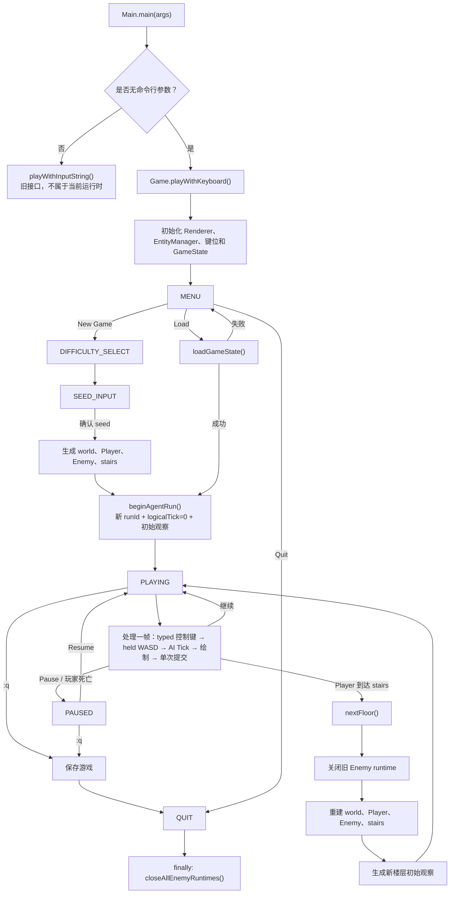
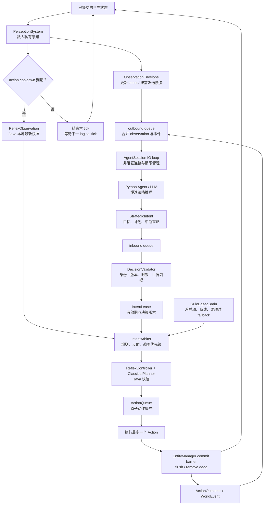
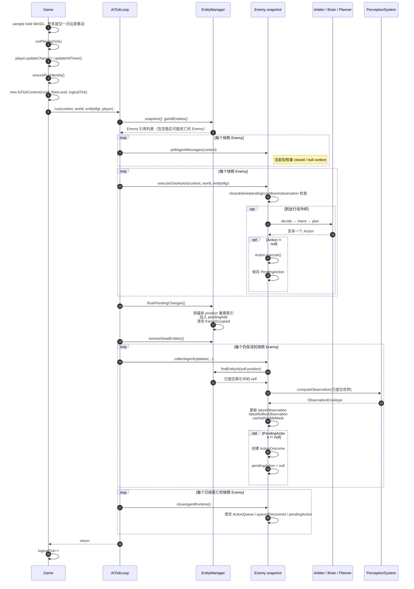
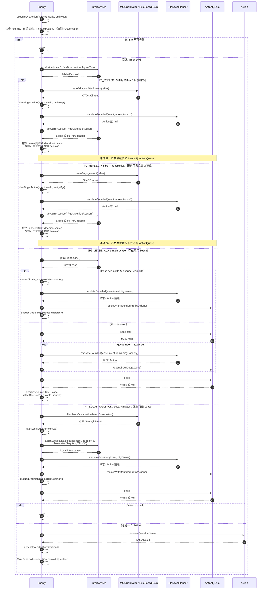
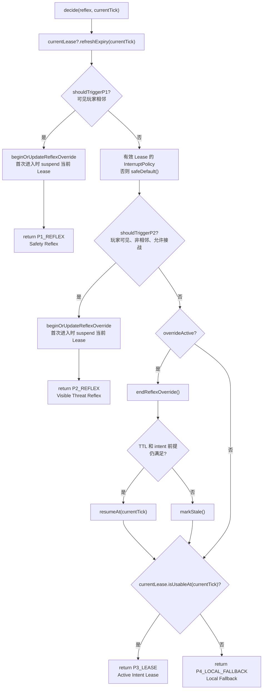
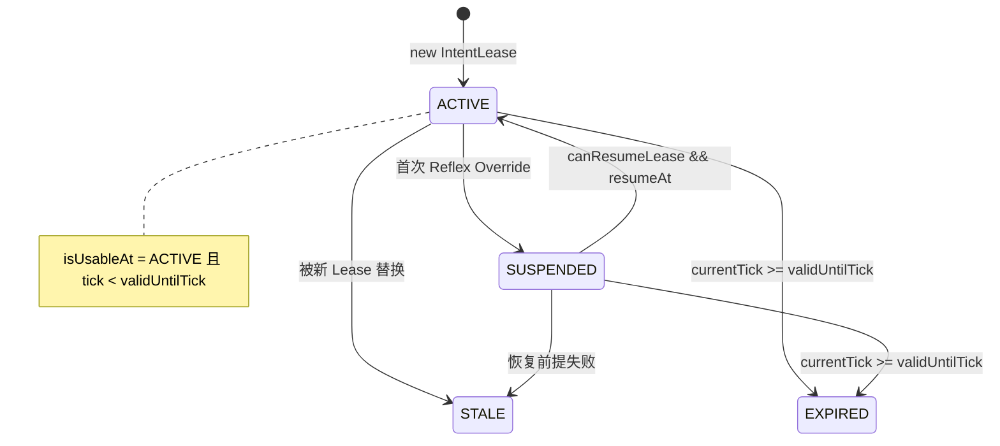
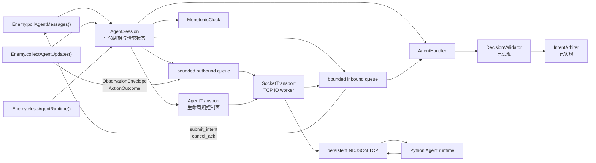

# DungeonMind Game Loop 与 AI 控制架构

> 状态：当前实现说明
>
> 更新时间：2026-08-23
>
> 范围：交互式游戏入口、玩家连续移动、Game Loop、双速控制链，以及已接入生产 Game/Enemy 的 AgentSession
>
> 不包含：`playWithInputString()` 的旧字符串输入接口、多 Agent 协作和具体模型供应商

---

## 0. 先读这一页

当前交互式 Game/Enemy 已具备完整远程 Agent 接线；传入启用的
`AgentSessionConfig` 时，每个存活 Enemy 会建立独立 Session。普通 `Main` 仍使用
默认关闭配置，因此直接启动游戏时继续使用本地双速控制链。

### 0.1 文中术语

| 术语 | 在本文中的意思 |
|------|----------------|
| Game Loop（游戏循环） | 游戏反复执行输入、更新世界、运行 AI 和绘制画面的主循环 |
| Tick（逻辑更新） | AI 世界推进一次；它是游戏内顺序单位，不等于现实中的一毫秒或一帧画面 |
| Agent（智能体） | 游戏进程外部、只提出战略意图的决策组件；它不是 `Entity`，也不能直接改世界 |
| runtime（运行时进程） | 承载外部 Agent 的独立程序和执行环境，当前实现是 Python 进程 |
| Bridge（桥接层） | Java 游戏与外部 Agent 之间的协议、会话和传输边界，即 `byog/Bridge` |
| `poll`（轮询） | 非阻塞地取出已经到达的消息；没有消息就立即继续 |
| `execute`（执行） | 根据当前控制权选择并执行至多一个动作 |
| `commit`（提交） | 让本轮排队的移动、伤害和死亡变更正式成为权威世界状态 |
| `collect`（收集） | 从提交后的世界生成下一份私有观察和动作结果 |
| intent / proposal（意图 / 提案） | Agent 给出的高层建议，例如追击或巡逻；不是可直接执行的移动命令 |
| Action（原子动作） | Java 世界实际执行的一次移动或攻击，是规划器输出的最小执行单位 |
| cooldown（冷却） | Enemy 两次可执行动作之间必须等待的逻辑时间 |
| Reflex（反射控制） | 遇到危险或近距离目标时立即采用、优先级高于慢速计划的本地规则 |
| Policy（控制策略） | 规定当前行为能否被更高优先级决策打断的规则 |
| Lease（控制权租约） | 在有限逻辑时间内有效、允许持续执行某个 intent 的记录 |
| Arbiter（仲裁器） | 在反射、现有 Lease、本地策略和远程提案之间决定谁获得控制权 |
| Validator（校验器） | 检查远程提案的身份、权限、知识范围和当前世界前提 |
| fallback（降级策略） | 远程 Agent 不可用时继续采用的本地决策 |
| deadline（截止时间） | 远程请求进入“过慢”或“必须取消”状态的时间界线 |
| backpressure（背压） | 消费速度跟不上时，用有界队列、合并或拒绝阻止消息无限堆积 |
| worker（工作线程） | 专门负责 Socket 连接、读取和写出的后台线程，不执行游戏规则 |
| NDJSON | 每行一个 JSON 对象的消息格式；换行符就是消息边界 |
| `logicalTick`（逻辑时刻） | 游戏内的因果序号，用于判断先后，不用于计算现实网络等待 |
| `runId`（对局标识） | 每次新游戏或重新建立运行上下文时生成的身份，用于拒绝旧对局消息 |
| private observation（私有观察） | 只包含某个 Enemy 合法可见或可知信息的世界快照 |
| outcome（动作结果） | 世界提交后确认的动作成败、位置、伤害等反馈 |

| 能力 | 状态 | 当前行为 |
|------|------|----------|
| 交互式 Game Loop | **已实现** | `Main → Game.playWithKeyboard()` 持续处理输入、AI、绘制和生命周期 |
| 玩家连续移动 | **已实现** | PLAYING 采样 WASD 当前状态；按下立即、持有每 60ms 最多一格、松开无积压 |
| AI Tick 调度 | **已实现** | 所有 Enemy 按 `poll → execute → commit → collect → close dead` 执行 |
| 每次冷却至多一个 Action | **已实现** | 不再在一次 Enemy 更新中连续尝试多个动作 |
| 私有观察与提交后反馈 | **已实现** | execute 使用旧观察，collect 从已提交世界生成新观察和 outcome |
| Reflex / Lease / Arbiter / Validator | **已实现** | 纯 Java 控制链已经参与真实游戏运行 |
| 本地 RuleBasedBrain fallback | **已实现** | 无可用 Lease 时仍能行动 |
| 远程 proposal 校验入口 | **已接入** | `pollAgentMessages()` 在游戏线程把合法 proposal 交给 Validator 和 Arbiter |
| AgentSession / 有界队列 | **已接入** | 每个 Enemy 可持有独立 Session；poll/collect/close 已进入生产生命周期 |
| AgentTransport / TCP worker | **已实现** | `SocketTransport` 独占 Socket，负责 NDJSON、退避重连和有界关闭 |
| Python Agent runtime | **端到端接通** | 支持真实进程往返、延迟、背压、断线和恢复；不会阻塞游戏线程 |
| 事件式多步计划 | **已实现** | Python 维护有限计划；Java 对当前步骤执行、提交、反馈和局部恢复保持权威 |

读图时使用以下约定：

- **实线**：当前代码真实执行的调用。
- **虚线**：仍属于后续模型或工具扩展，不参与当前生产调用。
- **commit barrier（提交屏障）**：`EntityManager` 完成待处理变更和死亡清理后，
  世界状态才可用于观察与反馈。

---

## 1. 完整 Game Loop

### 1.1 游戏生命周期



关键入口：

1. [`Main.main`](byog/Core/Main.java) 无参数时调用 `Game.playWithKeyboard()`。
2. [`Game.playWithKeyboard`](byog/Core/Game.java) 持有状态机和渲染循环。
3. 菜单、世界名、种子和攻击仍消费 typed 字符；PLAYING 的 WASD 由 `PlayerMoveController`
   根据当前按键状态和单调时间生成移动，因此不依赖操作系统键盘重复率。
4. 一次新按下立即移动；持续按住每 60ms 最多移动一格，约 16.7 格/秒。慢帧不追赶错过次数，松键后没有积压移动。
5. 新游戏或读档成功后，`beginAgentRun()` 创建新的 `runId`、清零 `logicalTick`，并调用
   `primeEnemyObservations()`。
6. 暂停和菜单仍会绘制，但不会调用 `runPlayingTick()`，因此不会推进 `logicalTick`。
7. 换层会关闭旧 Enemy runtime，重建实体并生成新楼层的初始观察。
8. 游戏每轮只在主循环末尾调用一次 `StdDraw.show()`；退出使用 `finally` 关闭所有 Enemy Session。

---

## 2. Game Loop 与 AI 架构

### 2.1 架构概览

下图展示当前 Java 实时闭环和已经接通的异步 Agent 链路；脚本 adapter 已驱动真实执行图，
具体模型供应商仍由 Builder 选择。



### 2.2 本地决策与远程 Agent 如何配合

无论 Bridge 是否开启，Java 都会完成下面这条本地决策路径：

```text
已提交世界
  → latest ObservationEnvelope
  → ReflexObservation / RuleBasedBrain
  → IntentArbiter
  → StrategicIntent
  → ClassicalPlanner
  → ActionQueue
  → 一个 Action
  → EntityManager commit
  → 新 ObservationEnvelope + ActionOutcome
```

启用 Bridge 后，游戏还会异步执行下面的消息往返：

```text
世界提交完成
  → Enemy 生成私有观察和动作反馈
  → 放入有限容量的发送队列
  → 网络线程通过 TCP 发给 Python Agent

Python Agent 根据执行 inbox 推进当前计划步骤，必要时才调用模型生成战略 intent
  → 网络线程放入有限容量的接收队列
  → 下一次游戏 tick 的 poll 环节读取
  → Java 校验后决定是否采纳
```

这里的关键是“异步”：游戏线程只把消息放入队列，然后继续运行。网络线程负责与
Python 通信；Python 返回 intent 后，Java 在后续 tick 的 poll 环节读取、校验并决定
是否采纳。配置关闭时不会创建网络线程，敌人完全使用本地 AI。

---

## 3. AI Tick 代码执行图

Phase 2.2 把一个 `PLAYING` tick 固定为 `poll → execute → commit → collect`。
每个 Enemy 使用上一次提交后的 Observation 做决定，达到冷却时最多执行一个 Action；
所有 Enemy 执行完后统一提交位置和死亡状态，再生成下一轮 Observation 与 ActionOutcome。
因此动作、空间索引、反馈和下一轮感知都对应同一个明确的世界版本。

### 3.1 正式 AI Tick



### 3.2 `executeOneAction()` 调用链与分支

Arbiter 只决定本次由谁控制；具体 Action 仍由 Java Planner 生成。
Reflex 分支直接规划单步，Lease 和 Local Fallback 分支则通过跨 tick 的 ActionQueue 延续计划。



| Arbiter 返回值 | 实际调用链 | `ActionQueue` | 每次冷却执行量 |
|---|---|---|---|
| `P1_REFLEX` | `createAdjacentAttackIntent` → `translateBounded(..., 1)` | 不读、不写 | 0 或 1 |
| `P2_REFLEX` | `createEngageIntent` → `translateBounded(..., 1)` | 不读、不写 | 0 或 1 |
| `P3_LEASE` | Lease intent → 必要时规划/补充 → `poll()` | 跨 tick 保留 | 0 或 1 |
| `P4_LOCAL_FALLBACK` | `thinkFromObservation` → 本地 Lease → 重新规划 → `poll()` | 替换旧队列 | 0 或 1 |

### 3.3 `execute` 与 `collect` 的补充说明

- `executeOneAction()` 先检查 runtime、存活状态、`PendingAction` 和冷却；满足条件后按 P1–P4 选择控制来源，经 Java Planner 得到并执行至多一个 Action。
- P1/P2 直接规划单步，不修改被暂挂 Lease 的 `ActionQueue`；P3/P4 从有界队列中消费动作。
- 动作执行后只保存 `PendingAction`。`collectAgentUpdates()` 在 commit 后校验空间索引和 tick context，生成新 Observation，并把 `PendingAction` 补全为 `ActionOutcome`。

### 3.4 一个 Action 前后的字段

| 字段 | execute 前 | `Action.execute()` 后 | commit + collect 后 |
|---|---|---|---|
| `Entity.position` | 上次已提交位置 | Move 成功时已改变 | 空间索引与其一致 |
| `positionIndex` | 上次提交结果 | 仍是旧索引 | `flushPendingChanges()` 重建 |
| `frameOccupied` | 本 tick 已 claim 位置 | Move 成功时加入新位置 | flush 时清空 |
| `pendingAction` | 必须为 `null` | 保存原始 result 和 beforePosition | 转成 `ActionOutcome` 后清空 |
| `latestObservation` | 上次 collect 的快照 | 不变 | 替换为已提交世界的新快照 |
| `latestReflexObservation` | 上次 collect 的切片 | 不变 | 从新 Observation 重建 |
| `lastActionOutcome` | 上一个完成结果 | 不变 | 有动作时被本次结果替换 |

### 3.5 代码阅读捷径

| 看到的代码 | 当前真实行为 |
|---|---|
| `pollAgentMessages()` | 有界 drain Session 入站；合法 proposal 在游戏线程进入 Validator/Arbiter |
| `tickCounter++` | 先计数，达到 `moveInterval` 才进入仲裁；随后清零 |
| `latestObservation == null` | 直接跳过动作；初始值由 `primeEnemyObservations()` 提前生成 |
| `translateBounded()` | 相邻 `ATTACK` 直接生成 `AttackAction`；其他情况走 BFS，只取有界前缀 |
| `ActionQueue(2, 5)` | 长度 `<= 2` 时补充，最多保存 5 个动作 |
| `flushPendingChanges()` | 重建索引前，刚离开的旧位置仍会阻挡同 tick 后行动 Enemy |
| `removeDeadEntities()` | 死亡实体在所有 execute 结束后统一移出索引 |
| `lastActionOutcome` | 单值字段，不是反馈队列；可被下一次结果覆盖 |

---

## 4. 控制权决策图

Phase 2.3 负责决定当前动作的控制权。代码先处理 Safety Reflex 和
Visible Threat Reflex，再尝试继续 Active Intent Lease；没有可用 Lease 时，
由 Local Fallback 生成一份短期本地 Lease。Reflex Override 暂时覆盖原计划，
但不会直接销毁其 ActionQueue。

### 4.1 `IntentArbiter.decide()` 实际分支



### 4.2 四个返回值落到 `Enemy` 后做什么

| Level | intent 来源 | decision 归属 | 队列变化 | Action 来源 |
|---|---|---|---|---|
| `P1_REFLEX` | `ReflexController.createAdjacentAttackIntent()` | 有效 Lease；否则本地 decision | 保留不动 | Planner 直接返回至多一个 |
| `P2_REFLEX` | `ReflexController.createEngageIntent()` | 有效 Lease；否则本地 decision | 保留不动 | Planner 直接返回至多一个 |
| `P3_LEASE` | `currentLease.getIntent()` | Lease 的 ID 和 Source | 新 decision 时 replace；低水位时 append | `actionQueue.poll()` |
| `P4_LOCAL_FALLBACK` | `RuleBasedBrain.thinkFromObservation()` | 新建 `local-{agentId}-tick-{tick}` | replace，并安装 30 tick 本地 Lease | `actionQueue.poll()` |

### 4.3 Reflex 与 Policy 的实际使用

| 代码项 | 实际是否影响运行 | 用途 |
|---|---|---|
| `ReflexObservation.canSeePlayer()` | 是 | P2、CHASE/ATTACK Lease 恢复 |
| `ReflexObservation.isPlayerAdjacent()` | 是 | P1 |
| `InterruptPolicy.engageVisiblePlayer()` | 是 | 允许或禁止 P2 |
| `InterruptPolicy.respondToAdjacentThreat()` | P1 不读取 | Java 始终允许 Safety Reflex |
| `InterruptPolicy.allowLocalReroute()` | 是 | 第一次 blocked 清空动作队列并在 Java 本地重规划；重复 blocked 要求远程重规划 |
| `Enemy.reflexController` | 是 | 创建 P1/P2 intent |
| `IntentArbiter.reflexController` | 是 | 判断 P1/P2 是否触发 |

### 4.4 `IntentLease` 状态变化



### 4.5 Lease 恢复条件

| Strategy | `canResumeLease()` 返回 true 的条件 |
|---|---|
| `CHASE` / `ATTACK` | 玩家仍可见，且 intent 目标等于当前可见玩家位置 |
| `PATROL` | 玩家仍不可见 |
| `GUARD` | 始终满足策略前提 |
| 任意 Strategy | Lease 必须仍在 TTL 内 |

### 4.6 远程 intent 代码路径

远程 proposal 进入 Java 后必须先通过身份、知识边界和当前世界状态校验，
校验成功只会安装 Lease，不会绕过 Planner 或直接操作实体。
`pollAgentMessages()` 已在游戏线程安全边界接到该入口。

```mermaid
flowchart LR
    POLL["pollAgentMessages()"] --> ENTRY["EnemyAgentHandler → IntentArbiter.tryAdoptRemoteIntent()"]
    ENTRY --> CLOSED{"runtime closed?"}
    CLOSED -->|是| IDERR["IDENTITY_MISMATCH"]
    CLOSED -->|否| VALIDATE["DecisionValidator.validate()"]

    VALIDATE --> ID["schema / identity / epoch<br/>generation / decision / observation"]
    ID --> DATA["skill / confidence / TTL / policy<br/>target 类型"]
    DATA --> WORLD["已知目标 / 边界 / tile / BFS"]
    WORLD --> NOW["当前 Reflex 前提"]
    NOW --> RESULT{"ACCEPTED?"}

    RESULT -->|否| KEEP["不修改 Lease / Queue / cooldown"]
    RESULT -->|是| CONVERT["toStrategicIntent()<br/>fromData()<br/>计算 validUntilTick"]
    CONVERT --> NEW["旧 Lease → STALE<br/>currentLease → REMOTE_AGENT Lease"]
    NEW --> NEXT["下次 P3 发现 decisionId 变化<br/>replace ActionQueue"]
```



### 4.7 当前游戏实际覆盖

| 路径 | 游戏运行时 |
|---|---|
| Safety Reflex (`P1`) | 已启用 |
| Visible Threat Reflex (`P2`) | 已启用 |
| Active Intent Lease (`P3`) | 已启用；可执行本地或已校验的远程 Lease |
| Local Fallback (`P4`) | 已启用 |
| Remote Agent Lease | 已在 poll 安全边界校验和采纳 |

---

## 5. AgentSession 与生产接线

### 5.1 模块连接图

实线表示当前正式运行路径中已经实现的关系。



### 5.2 模块状态

| 模块 | 状态 | 责任 |
|------|------|------|
| `AgentProtocol` / `AgentProtocolCodec` | **已实现** | 类型化消息和 NDJSON 编解码 |
| `DecisionValidator` | **已实现** | proposal 身份、权限、知识和世界前提校验 |
| `IntentArbiter` / `IntentLease` | **已实现** | 采纳后的控制权与有效期 |
| `AgentSession` | **核心已实现** | single in-flight、deadline、cancel、队列和生命周期 |
| `AgentSessionConfig` | **已实现** | 地址、容量、deadline 和重连配置快照 |
| `AgentHandler` | **已实现** | 在游戏线程接收消息，并显式返回 intent 接受/拒绝结果 |
| `MonotonicClock` | **已实现** | 为 deadline 提供不受系统时间回拨影响的单调时间 |
| `AgentTransport` | **已实现** | `SocketTransport` 绑定 endpoint、请求物理重建、永久关闭 transport |
| inbound/outbound queues | **已实现** | 隔离游戏线程与 IO，提供有界背压 |
| TCP IO worker | **已实现** | 唯一操作 connect/read/write 的线程；短读超时保证双向推进 |
| Python Agent runtime | **端到端接通** | 可消费 observation/feedback 并返回受限 intent；故障模式不会阻塞游戏线程 |
| Python execution graph | **已实现** | 有界 inbox、多步计划、无模型步骤推进、事件触发重规划和两阶段消费 |

更完整的 Session 状态机和失败语义见 [`session.md`](session.md)；
外部 runtime、Python brain 和跨语言边界见 [`agentarchitecture.md`](agentarchitecture.md)。

### 5.3 当前 Session API

以下代码块概括当前源码的主要接口：

```java
public final class AgentSession implements AutoCloseable {
    public void pollInbound(AgentHandler handler, long logicalTick);

    public RequestStartResult requestIntent(
            ObservationEnvelope observation,
            List<AgentProtocol.WorldEventData> pendingEvents,
            long logicalTick);

    public EnqueueResult sendActionFeedback(
            ActionOutcome outcome, long logicalTick);

    public EnqueueResult sendWorldEvent(
            AgentProtocol.WorldEventData event, long logicalTick);

    public void advanceRequestLifecycle(long logicalTick);

    public void supersedeCurrentRequest(
            SupersedeReason reason, long logicalTick);

    @Override
    public void close();
}
```

```java
public interface AgentHandler {
    IntentHandlingResult onIntentSubmitted(
            AgentProtocol.SubmitIntentData data,
            AgentProtocol.Envelope envelope,
            AgentSession.RequestContext requestContext);

    void onCancelAcknowledged(
            AgentProtocol.CancelAckData data,
            AgentProtocol.Envelope envelope,
            AgentSession.RequestContext cancelledRequest);

    void onProtocolRejected(ProtocolFailure failure);
}
```

```java
public interface AgentTransport extends AutoCloseable {
    void start(AgentSession.TransportEndpoint endpoint);
    void requestRebuild();
    void close();
}
```

```java
@FunctionalInterface
public interface MonotonicClock {
    long nanoTime();
}
```

### 5.4 接入当前 Game Loop 的位置

当前实现没有另建第二套 Game Loop，而是在现有循环的四个固定位置处理 Agent：

| 当前位置 | 接入行为 |
|----------|----------|
| `Enemy.pollAgentMessages()` | drain 已解析 inbound；调用 Handler；合法 proposal 进入 Validator/Arbiter |
| `Enemy.collectAgentUpdates()` | 将最新 observation 和已完成 outcome 有界入队 |
| `Enemy.closeAgentRuntime()` | 取消请求、关闭 Session、解除阻塞 IO，并有界等待线程退出 |
| `Game.beginAgentRun()` | 为新游戏/读档创建新的 Session identity |
| `Game.nextFloor()` | 关闭旧楼层 Session；新 Enemy 使用新 floor identity |
| `Game.playWithKeyboard()` 的 `finally` | 无论正常退出还是异常都关闭 Session |

游戏线程必须遵守：

```text
允许：queue.offer / drain 已解析消息 / 读取 Session 状态
禁止：Socket.connect / read / write / Future.get / 等待 Python
```

### 5.5 队列与失败语义

最小接口必须显式区分：

```text
ACCEPTED
COALESCED
DROPPED_LOW_PRIORITY
REJECTED_CRITICAL
CLOSED
```

- observation 可以合并为最新值；
- heartbeat 可以低优先级丢弃；
- action feedback 和 cancel 不能静默覆盖；
- 反馈使用稳定 `feedbackId`，事件使用稳定 `eventId`；Python 重复收到时只消费一次；
- 队列满也不能阻塞游戏线程；
- 关键消息无法入队时必须进入 degraded/reconnect 路径并记录原因。

---

## 6. 架构约束

### 6.1 Java 是世界权威

Agent 只能提交受限 `StrategicIntent`，不能：

- 直接移动实体；
- 直接提交任意原子 Action；
- 绕过碰撞、边界或知识来源校验；
- 关闭 Java 强制执行的 Safety Reflex；
- 读取 Enemy 私有观察之外的信息。

### 6.2 游戏线程永不等待外部 Agent

Python 慢、断线或未启动时：

```text
可用旧 Lease → 继续
没有可用 Lease → Local Fallback
当前出现紧急威胁 → Safety / Visible Threat Reflex
```

模型延迟只能影响战略新鲜度，不能暂停输入、AI Tick 或渲染。

### 6.3 时间和身份必须分开

| 数据 | 用途 |
|------|------|
| `logicalTick` | 游戏因果顺序、Lease TTL、proposal 时效 |
| monotonic time | 网络 soft/hard deadline；交互式玩家移动的 60ms cadence |
| `runId + floorId + agentId` | 世界身份 |
| `sessionEpoch + requestGeneration` | Session 和请求身份 |
| `observationSeq + decisionId` | 观察与决策关联 |

wall-clock 不能参与 canonical 正确性判断。

### 6.4 当前实现必须长期保持的五条不变量

1. 一个 Enemy 每次冷却最多执行一个 Action。
2. 所有 Enemy execute 完成后，世界只统一 commit 一次。
3. collect 只能读取 commit 后的世界。
4. Reflex 只能使用私有 observation。
5. 任何远程 proposal 必须先通过 Validator，再成为 Lease。

---

## 7. 最短代码阅读顺序

想理解当前运行时，只需按以下顺序：

1. [`Main.main`](byog/Core/Main.java)
2. [`Game.playWithKeyboard` 与 `runPlayingTick`](byog/Core/Game.java)
3. [`AiTickLoop.run`](byog/AI/AiTickLoop.java)
4. [`Enemy.pollAgentMessages / executeOneAction / collectAgentUpdates`](byog/Entity/Enemy.java)
5. [`IntentArbiter.decide`](byog/AI/IntentArbiter.java)
6. [`ReflexController`](byog/AI/ReflexController.java)
7. [`IntentLease`](byog/AI/IntentLease.java)
8. [`DecisionValidator`](byog/AI/DecisionValidator.java)
9. [`ActionQueue`](byog/Action/ActionQueue.java) 与
   [`ClassicalPlanner`](byog/AI/ClassicalPlanner.java)
10. [`AgentSession`](byog/Bridge/AgentSession.java) 与
    [`session.md`](session.md)
11. [`EntityManager.flushPendingChanges`](byog/Entity/EntityManager.java) 与
    [`PerceptionSystem.computeObservation`](byog/Perception/PerceptionSystem.java)

读完第 4 项可以理解 Game Loop 与 Session 接线；读完第 8 项可以理解当前双速控制链；
第 10 项说明 Session 的请求、超时、背压和重连状态机。
