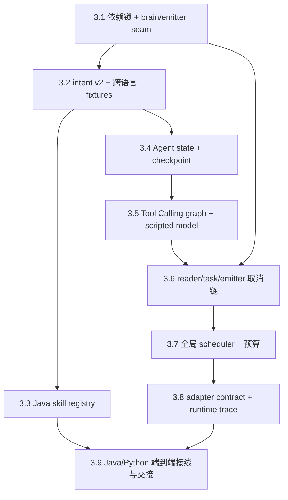

# DungeonMind Phase 3 构建指南

> 状态：Draft 配套指南。只有 [PHASE_3_SPEC.md](PHASE_3_SPEC.md) 获批、Roadmap 里程碑状态
> 对齐，且 `PHASE_2DOT5_COMPLETION.md` 已记录完整验收与最终基线后，才开始实现。

## 先读这里

这份指南面向负责实现 Phase 3 的 Builder。读者应已经理解 Java 的类、接口、JUnit 4、
Python typing/unittest，以及当前 `AgentSession` 的基本职责；不要求预先熟悉 LangGraph，
后文会在首次出现时解释 graph state、node、conditional edge、ToolNode 和 checkpointer。

实现结果不是“Python 成功调用了一次 LLM”。你要交付的是一个可运行、可取消、可预算、
可追踪的单 Enemy Agent：它只读自己的 observation，使用有界工具循环形成
`strategic-intent.v2`，由 Java skill registry 二次校验和确定性执行。模型慢或失败时，
现有 Game Loop、反射、Lease 和本地 fallback 继续运行。

开始前完整阅读：

1. [PHASE_3_SPEC.md](PHASE_3_SPEC.md)，这是行为和验收的唯一阶段契约。
2. [PHASE_2DOT5_SPEC.md](PHASE_2DOT5_SPEC.md) 与
   [PHASE_2DOT5_BUILD_GUIDE.md](PHASE_2DOT5_BUILD_GUIDE.md)，理解 Phase 3 可以依赖的新世界/敌人契约。
3. `PHASE_2DOT5_COMPLETION.md`，以实际实现、测试命令和最终 commit 替换规划假设。
4. [PHASE_2_COMPLETION.md](PHASE_2_COMPLETION.md)，理解更早的 Session 基础设施。
5. [AI_TICK_ARCHITECTURE.md](AI_TICK_ARCHITECTURE.md) 2、4、5、6 节，理解不能改坏的运行边界。
6. [agentarchitecture.md](agentarchitecture.md) 2、4、6、14、16 节，理解 Python runtime 边界。
7. [session.md](session.md) 4、7、9、10、11、12 节，理解 request identity、取消与背压。

本文不重复列出每个测试断言。Test ID、完整矩阵和 Definition of Done 见 Spec 11、15 节。

### 文档分工

| 文档 | 回答的问题 |
|------|------------|
| `PROJECT_INTENT_zh-CN.md` | 为什么每个 Enemy 必须是有限知识的独立 Agent |
| `DEVELOPMENT_ROADMAP.md` | Phase 3 做到哪里停止，交给 Phase 4 什么 |
| `AI_TICK_ARCHITECTURE.md` | 当前 Game/Session/tick 如何真实运行 |
| `PHASE_3_SPEC.md` | 必须实现和验证的确切契约 |
| 本指南 | 按什么依赖顺序安全地实现这些契约 |
| `PHASE_3_COMPLETION.md` | 最终实际完成、证据、偏差与遗留问题 |

### 当前到目标的变化

| 当前 | 目标 |
|------|------|
| `server.py` 每连接写死 `DeterministicAgent()` | factory 每连接创建 deterministic 或 model brain |
| handler 同步等待 `brain.handle()` | reader 持续读消息，模型任务异步执行，emitter 串行写 response |
| Python 无第三方依赖和 lock | Python 3.14 + 固定 LangGraph/LangChain/provider/checkpointer/Pydantic lock |
| brain 只保存内存列表 | graph state 按 world/floor/agent checkpoint，同世界同层读档可恢复 |
| 一次 observation 直接返回 intent | model → evidence tool → model → submit 的有界条件循环 |
| 全脑仍输出 v1 enum skill，参数只支持 targetPosition | 全脑硬切 v2 string skill + 受限 JSON 参数 + plan metadata |
| validator/planner 分别硬编码 skill switch | immutable `TacticalSkillRegistry` 统一校验、转换、规划和恢复 |
| 无全局模型资源边界 | runtime 级并发、队列、调用和 token 预算 |
| Java `agent-runtime.trace.v2` 只看到 Session/Action | Python model trace 看到 model/tool/token/预算，并关联 Java `agent-runtime.trace.v3` |

### 完成后的最短可见闭环

```text
Java 发送含 worldId、guard-a、朝向和 hp/maxHp 的私有 Observation v2
  → Python 用 worldId/floorId/guard-a 的 thread_id 加载 checkpoint
  → model 请求 read_self / inspect_visible_tile / list_visible_entities
  → ToolNode 只从该 observation 返回结果
  → model 调用 submit_strategic_intent
  → Python 生成 v2 proposal 并严格编码
  → Java Session 在 poll 阶段读取
  → DecisionValidator + TacticalSkillRegistry 校验
  → IntentArbiter 安装 Lease
  → skill planner 产生至多一个原子 Action
  → commit 后 ActionOutcome 反馈到同一 Agent state
```

Phase 3 只要求保存反馈并在下一次已存在的请求中可见；“反馈事件立即触发持续 replan”属于 Phase 4。

### Phase 3 不做什么

- 不补做 Phase 2.5 的命名世界、血包、朝向/FOV、巡视或底部 UI。
- 不实现多步骤计划执行、反馈事件立即 replan 或技能脚本。
- 不加入跨 Agent 共享 prompt、共享 memory、通信或 squad coordinator。
- 不加入跨楼层长期记忆、向量检索、embedding 或云端 checkpoint。
- 不让 Python 直接生成 Java Action，也不让游戏线程等待 provider。

## 六条不可破坏的边界

### 1. Java 游戏线程不等待 Python 或模型

保持现有规则：游戏线程只 `offer`、drain 已解析消息和读取 Session 状态。不得在
`Enemy`、`AiTickLoop` 或 `Game` 中调用 provider、等待 Future、访问 checkpoint 或读取 socket。

### 2. Python 只提议，Java 才执行

工具不能返回 `MoveAction`、`AttackAction`、类名、脚本或任意 Java 命令。
Python 只返回 skill proposal；Java registry、validator、planner 和 world commit 决定实际结果。

### 3. 工具和 prompt 只读当前 Agent 的知识

工具只能访问当前 graph state 中的 observation 与相同 thread_id 的有界 checkpoint。
不允许工具读取完整地图、其他连接、其他 Agent state、Java 内存或 checkpoint 全表。

### 4. 共享预算不等于共享意识

多个 Agent 可以共享一个 provider client、线程池、semaphore 和预算计数器；scheduler 不得查看或合并
messages、observation、tool result 或 intent。资源共享与知识共享是两件不同的事。

### 5. 取消结果与取消资源要分开

Java identity/generation 能保证迟到结果无效，但不能保证 provider 已停止计费。
Python 必须尽力取消 queued work；running call 若无法中止，仍占用 scheduler slot 直到返回，
随后丢弃结果。绝不能因为 ack 已发送就提前释放并发名额。

### 6. 新源码命名表达领域职责

新增类、方法、字段、测试、日志、schema 和配置键不得出现 `Phase`、`Step` 或路线编号。
可以使用 `AgentRuntimeTestSuite`、`TacticalSkillRegistry`、`InferenceScheduler` 等领域名称。

## 先理解三组不同的“循环”

实现中最容易混淆的是 Game Loop、连接读循环和 Agent graph loop。它们不在同一线程，也不共享停止条件。

| 循环 | 运行位置 | 频率/终止 | 负责什么 |
|------|----------|-----------|----------|
| Game Loop | Java 游戏线程 | 每 logical tick；游戏退出终止 | poll、execute、commit、collect |
| Connection reader | Python 每连接 handler | 收到 NDJSON；连接/Server 关闭终止 | decode、分派 observation/cancel/feedback/event |
| Agent graph | scheduler/model worker | 每次决策；submit、deadline、cancel 或轮数耗尽终止 | model/tool 条件转换与 checkpoint |

如果 connection reader 直接运行 graph，它就无法在模型等待时读取 cancel；如果 graph 直接写 socket，
多个完成回调会争用 messageSeq 和 frame。因而必须引入 `RuntimeBrain` 与 `ResponseEmitter` 两条 seam。

## 实施路线

本指南的阶段编号直接对应 [PHASE_3_SPEC.md](PHASE_3_SPEC.md) 第 10 节：

| Build Guide 阶段 | Spec 实施 Step | 阶段产物 |
|------------------|----------------|----------|
| 3.1 | Step 3.1 | 可重建 Python 环境与 brain/emitter seam |
| 3.2 | Step 3.2 | 全脑 `strategic-intent.v2` contract |
| 3.3 | Step 3.3 | Java immutable skill registry |
| 3.4 | Step 3.4 | world/floor/Agent checkpoint state |
| 3.5 | Step 3.5 | 有界 Tool Calling graph |
| 3.6 | Step 3.6 | reader/task/emitter 取消链 |
| 3.7 | Step 3.7 | 全局 inference scheduler 与预算 |
| 3.8 | Step 3.8 | provider-neutral adapter contract 与 model trace |
| 3.9 | Step 3.9 | 生产接线、完整回归、真实 smoke 与 Completion |

下图只表达阶段依赖；每个阶段的“阶段闸门”决定是否可以继续。



顺序的核心原因是：先让每一层能由 deterministic double 验证，再引入真实 provider。
任何一步都应留下可编译、可测试、可回退的仓库状态。

## 3.1 固定环境，并提取可替换 brain seam

先让 Python 环境可重建，并把 brain 与 Socket 写入分开。后续 graph、provider 和取消链都依赖这两个稳定 seam。

### 3.1.1 先建立可重建 Python 环境

创建 `agent/python/pyproject.toml`，按 Spec 8.1 固定直接依赖。用当前 Python 3.14.6 和 pip 26.1.2
生成 `agent/python/pylock.toml`。`uv` 当前不存在，不要为了追求另一套工具改写流程。

规划命令：

```powershell
python -m venv agent/python/.venv
& agent/python/.venv/Scripts/python.exe -m pip install --upgrade pip==26.1.2
& agent/python/.venv/Scripts/python.exe -m pip lock `
    -e agent/python `
    -o agent/python/pylock.toml
& agent/python/.venv/Scripts/python.exe -m pip install `
    -r agent/python/pylock.toml
```

生成后在干净 venv 中打印并保存实际版本：

```powershell
& agent/python/.venv/Scripts/python.exe -c `
    "import langgraph, langchain, pydantic; print('imports-ok')"
& agent/python/.venv/Scripts/python.exe -m pip list
```

不要把 `.venv` 提交。更新根 `.gitignore`，同时忽略 SQLite checkpoint、runtime trace 和 `.env`。

### 3.1.2 提取 `RuntimeBrain`、factory 和 emitter

当前 `server.py:67` 直接创建 `DeterministicAgent`。先创建：

- `brain/base.py`：`RuntimeBrain`、`BrainFactory`、`ResponseEmitter`、结果 enum。
- `brain/factory.py`：按已验证 config 构造每连接 brain。
- `config.py`：只实现 `--brain deterministic` 所需最小配置；model 参数先声明但不接 provider。

把 `DeterministicAgent.handle()` 适配到 `on_message()`。本增量暂不改变 Phase 2.5 的 v1 payload，但 response 必须通过
emitter 写出，不能自行操作 socket。每个连接仍创建独立 instance，现有 messageSeq/feedback/event 行为不变。

接口草图：

```python
# 伪代码：只表达职责
class DeterministicBrain:
    def on_message(self, envelope):
        for response in self._agent.handle(envelope):
            self._emitter.emit(response)

    def close(self):
        self._closed = True
```

### 3.1.3 保持不变

- Phase 2.5 wire bytes、五种故障模式和 ready 基本字段；它们会在阶段 3.2 一次性切换，不在阶段 3.1 新增兼容逻辑。
- Java Session、SocketTransport 和 Game Loop。
- deterministic brain 的选择、排序和 response correlation。

### 3.1 阶段闸门

- 干净 venv 能从 lock 安装。
- 当前 Python 23 tests 全部通过。
- 两连接仍分别从 messageSeq 0 开始。
- deterministic 模式不创建 provider、scheduler 或 checkpoint DB。

详细验收：Spec `REGRESSION-01`、`STATE-ISOLATION-02` 的已有部分。

## 3.2 全脑硬切 v2 intent，但不改变 Session

Graph、registry 和 model brain 必须共享同一 intent DTO，因此在引入模型状态前先完成双语言 v2 contract。

### 3.2.1 为什么先做 contract

Graph、provider 和 Java registry 都要依赖同一份 intent 结构。如果先写模型 prompt，再决定 wire，
会出现 Python 能生成但 Java 无法严格验证的临时格式。

### 3.2.2 在 Python 中定义 v2 DTO

在 `graph/state.py` 或独立 schema 模块使用 Pydantic 定义：

- `StrategicIntentModel`
- `InterruptPolicyModel`
- `PlanMetadataModel`
- 受限 `JsonValue`

`planMetadata` 由 runtime 根据当前 decisionId 生成。模型 tool schema 不允许自行提供或覆盖
world/run/floor/agent/session/generation/observation/decision identity。

在 `protocol.py` 中严格分派：

```text
strategic-intent.v2 → string skill、generic bounded parameters、planMetadata
strategic-intent.v1/其他 → UNKNOWN_PAYLOAD_VERSION
```

Generic 不等于宽松。实现统一限制：最大嵌套深度、object key 数、array 长度、string 长度和 signed 数值范围。
限制值写成 protocol 常量，并在 Java/Python fixtures 中一致。

### 3.2.3 在 Java 中增加 v2 数据表达

修改 `AgentProtocol.IntentData` 时只保留一个 v2 规范化内部表达；不要为减少测试改动提供 v1 convenience
constructor。Bridge 只知道：

- intent version（只允许 v2）；
- string skill ID；
- immutable JSON-like parameters；
- confidence、TTL、policy、plan metadata。

Bridge 不知道 CHASE 是否要求玩家可见，也不运行 BFS。这些语义稍后进入 registry。

如果 Java 直接用 `Map<String,Object>`，务必在构造时递归复制为不可变值，禁止调用方在 decode 后修改
nested map/list。codec 必须拒绝未知 v2 顶层字段、duplicate key、非有限数和超限结构。

### 3.2.4 建立共享 fixture

在 `agent/contract/fixtures/` 至少加入：

- `strategic-intent.v1` PATROL 拒绝样例；
- 合法 v2 CHASE；
- 合法 v2 PATROL 无 target；
- v2 unknown version；
- v2 duplicate/unknown field；
- v2 参数过深/过大；
- v2 non-finite；
- v2 model 试图伪造 identity。

旧版拒绝 fixture 必须在 Java/Python 两侧得到同一个 `UNKNOWN_PAYLOAD_VERSION`。合法 v2 fixture 可以
byte-for-byte canonical；非法 fixture 只锁 rejection code，不锁内部异常文本。

### 3.2.5 保持不变

- Envelope 的 `agent-session.v1`、`worldId` 与 Observation `private-observation.v2`。
- 八种 message type、NDJSON framing、64KiB frame guard。
- Session identity/deadline/cancel 状态机。
- deterministic brain 与 model brain 都发送 v2；不存在 v1 输出路径。

### 3.2 阶段闸门

- `INTENT-CONTRACT-01–06` 全部通过。
- Java/Python 对 fixture 的接受/拒绝一致。
- 旧 v1 fixture 在双语言中明确拒绝，Phase 2.5 的其他 integration 行为不变。
- deterministic brain 已发送 v2；model brain 后续复用同一 DTO/encoder。

## 3.3 把四个硬编码 skill 迁入 Java registry

在模型能够产生任意字符串 skill 前，Java 必须先有唯一的校验与执行入口；否则 v2 只会扩大硬编码分支。

### 3.3.1 先建立规范化 `SkillInvocation`

wire v2 decode 后转换为：

```text
skillId
immutable parameters
confidence
validForTicks
interruptPolicy
planMetadata
```

`SkillInvocation` 不能携带 raw JSON parser 对象或 Socket DTO。这样 registry tests 可以直接构造领域输入，
也避免规划层依赖 Bridge。

### 3.3.2 创建 `TacticalSkill` 和 immutable registry

按 Spec 8.9 创建：

- `TacticalSkill.java`
- `TacticalSkillRegistry.java`
- `BuiltinTacticalSkills.java`
- `PlanMetadata.java`

`standard()` 在构造结束后不可注册新定义。新增 skill 的正常扩展路径是创建一个 definition，
再在 composition root 注册；不是在 codec、validator、arbiter 和 planner 各加一个 switch。

### 3.3.3 按一个 skill 一次迁移

建议顺序：PATROL → CHASE → ATTACK → GUARD。

每迁移一个 skill，definition 同时承担：

1. 参数字段、类型与范围；
2. source observation 的知识来源；
3. current observation/world 的前提与可达性；
4. wire invocation 到内部 `StrategicIntent` 的转换；
5. 有界 Action 规划；
6. Reflex override 后是否可恢复。

通用身份、intent version、confidence、TTL 和安全 policy 仍在 `DecisionValidator`，不要复制到每个 skill。

### 3.3.4 让 validation 与 translation 原子化

现状先 `validate()`，再通过另一个 switch `toStrategicIntent()`。改为 detailed result 后，
接受结果直接携带已经验证的内部 intent 与 policy。Arbiter 只消费这一个对象。

伪代码：

```java
// 伪代码：只表达控制流
DecisionValidation validation = validator.validateDetailed(...);
if (!validation.accepted()) {
    return validation.result();
}
installLease(validation.intent(), validation.interruptPolicy());
```

拒绝发生时，先后快照以下状态并断言完全相同：current Lease、queuedDecisionId、ActionQueue size、
tickCounter、Enemy position/HP。

### 3.3.5 处理当前 planner 的随机不可达 fallback

`ClassicalPlanner.translate()` 当前在 BFS 为空时插入随机 MoveAction。对已校验远程 skill，
不可达必须在 registry validation 阶段拒绝，不能走这个随机分支。

保留旧 local behavior 时要把路径明确分开：

- registry-validated remote intent：不可达无 Action、明确 rejection；
- legacy/local planner：如果暂时保留随机 fallback，记录为兼容行为，不能被远程 proposal 触发。

### 3.3 阶段闸门

- 四个现有 skill 的 Phase 2.5 行为回归通过。
- `SKILL-AUTHORITY-01–04` 和 `SKILL-EXECUTION-01` 通过。
- 添加测试用 fake skill 不需要修改 Bridge codec。
- `DecisionValidator`、`IntentArbiter`、`ClassicalPlanner` 不再各有远程 skill switch。

## 3.4 建立隔离的 Agent state 与 checkpoint

Intent 与 Java authority 已稳定后，再加入持久 graph state；这样 checkpoint 只保存 Agent 上下文，不承担游戏世界权威。

### 3.4.1 LangGraph 中的 state 和 checkpoint 是什么

State 是一次 graph 运行中节点共享的类型化数据；checkpointer 在每个 graph step 后把 state 保存到
某个 `thread_id`。之后使用相同 `thread_id` 调用 graph，就能加载先前 state。

这里的 thread 不是操作系统线程，也不是 TCP connection。它代表一个稳定世界内的敌人身份：
`worldId/floorId/agentId`。Session 重连或读同一世界同一楼层只会改变 run/session identity，不应创建
新的 Agent 意识；换 floor、创建新世界或覆盖同名世界得到新 `worldId` 时必须使用新的 thread。

### 3.4.2 实现无歧义 thread_id

不要直接 `f"{world}:{floor}:{agent}"`。ID 内部可能包含分隔符。使用 canonical JSON + URL-safe base64，
或长度前缀编码，并写 collision tests。

checkpoint metadata 同时记录原始三字段，让 trace viewer 不必反解 ID。

### 3.4.3 先用 `InMemorySaver`

先在 tests 中编译最小 graph：输入 observation，增加 decision_count，保存 previous_intent。
验证相同 key 恢复、不同 world/agent/floor 隔离。再模拟同世界同层读档：使用新 `runId` 加载相同 thread，
确认 state 恢复，同时旧 run/generation 的迟到结果被抑制。只有这些 contract 稳定后再接 SQLite。

### 3.4.4 再接 `SqliteSaver`

在 `checkpoint.py` 集中管理 saver 连接和关闭。不要让每个 tool 或 graph node 自行打开数据库。
当前规模使用一个 `sqlite3.Connection(check_same_thread=False)` 和一个共享 `SqliteSaver`；
LangGraph 的实现带锁，但仍要通过并发 contract 验证。保存的 state 只用受限 DTO/基础类型，启用严格
serializer 设置，避免任意模块反序列化。

checkpoint 文件是 runtime 工作数据：

- 默认放在显式 `--checkpoint-db` 路径；
- 不进入 Git；
- 不能当作 Java save；
- 损坏时 model brain 启动/决策明确失败，不能读到一半后继续。

### 3.4.5 有界 state

不要把每次完整 observation 和所有模型消息无限追加。每次新 decision：

- 替换 current observation；
- 保留 previous_intent；
- recent_feedback 最多一条；
- graph messages 只保留当前工具循环需要的窗口；
- decision_count 单调增加；
- 不保存 raw prompt、provider response 或 reasoning。

### 3.4 阶段闸门

- `STATE-ISOLATION-01–04` 通过。
- 相同 Agent 断线重连、runtime 重启和同层读档后加载同 thread；不同 world/floor 不加载旧 state。
- 两 Agent 并发写 SQLite 不报错、不串 state。
- checkpoint 中搜索不到其他 Agent observation 和 API key。

## 3.5 用 scripted model 建立有界 Tool Calling graph

State 与 thread identity 稳定后，先用 scripted model 证明节点、工具权限和停止条件，再允许真实 provider 进入。

### 3.5.1 为什么先不用真实模型

真实模型输出不确定、需要凭据并可能收费。Graph 的节点、条件边、工具权限、轮数和停止行为都可以用
scripted model 精确验证。只有 deterministic contract 全部通过后，真实 provider 才有资格进入。

Scripted model 只模拟模型消息和 tool_calls，不复制 ToolNode、Pydantic、graph routing 或 Java validator。

### 3.5.2 创建五个工具

工具通过 LangChain runtime state 注入取得当前 observation。模型看不到 runtime 参数本身。

实现顺序：

1. `list_visible_entities`：按稳定顺序返回当前 visible entities。
2. `inspect_visible_tile`：只在 observed tile 集合查找；未知返回类型化错误。
3. `read_self`：返回 Observation v2 已提供的位置、`hp/maxHp`、正式朝向与 `visionMode`。
4. `check_skill_candidate`：检查 capabilities 与 Python schema，明确说明 Java 仍会二次校验。
5. `submit_strategic_intent`：终止工具，写 candidate，不修改游戏。

`read_self` 不读取 Java Entity 或存档；其他工具也不得补全背后玩家、苹果或完整地图。模型看到的是
半菱形 FOV 已裁剪后的 Observation，而不是“完整数据加一句不要作弊”的 prompt。

工具返回结构化 dict，不返回自由文本堆栈。错误使用稳定 code，例如 `UNKNOWN_TO_AGENT`、
`UNSUPPORTED_SKILL`、`INVALID_ARGUMENTS`、`EVIDENCE_REQUIRED`。

### 3.5.3 编译 graph

节点职责：

```text
prepare_context
  → invoke_model
      → 有 tool_calls 且未超限：execute_tools
      → 有 candidate：finalize_intent
      → 无 tool_calls / 超限 / deadline：reject_decision
  → execute_tools
      → invoke_model
```

每经过 ToolNode 一次，增加 tool_batches；每个 tool_call 增加 tool_calls；每次 provider/model adapter 调用
增加 model_call_index。所有路由先检查 cancellation token 和 monotonic deadline。

### 3.5.4 强制真实 model-tool-model 证据

正常 scripted script 固定为：

```text
model call 0 → inspect_visible_tile
tool batch 0 → tile result
model call 1 → submit_strategic_intent
tool batch 1 → candidate stored
finalize       → v2 proposal
```

直接第一次调用 submit 必须得到 `EVIDENCE_REQUIRED`，然后模型可在剩余轮数内修正。这样能防止
“声明有工具但实际从不调用”的假实现。

### 3.5 阶段闸门

- `TOOL-LOOP-01–04`、`KNOWLEDGE-BOUNDARY-01/02` 通过。
- 无限 tool script 在三种上限中最先命中的一项明确终止。
- tool 无法访问完整地图、checkpoint store 或其他 brain。
- graph 输出必须通过同一 Pydantic v2 model 和 protocol codec。

## 3.6 让模型运行时连接仍可取消

Graph 已能产生结果后，才能完整验证 reader、decision task 与 emitter 的并发职责，并证明模型等待不会阻塞取消消息。

### 3.6.1 改造 server 的线程职责

保持 `ThreadingTCPServer`，但 handler 的 reader 不执行 graph。收到 observation 时：

1. 验证并交给 model brain；
2. brain 提交 decision task 后立即返回；
3. reader 继续读取同一连接；
4. task 完成后调用 `ResponseEmitter.emit()`；
5. emitter 在锁内检查 connection/decision 状态、分配 messageSeq、encode、write、flush。

不要为每个 response 创建一个临时线程。模型执行统一进入 scheduler；emitter 只做短小的有界写入。

### 3.6.2 response 写入必须串行

同一连接可能几乎同时产生 `cancel_ack`、`protocol_error` 和 model intent。若它们各自递增 messageSeq 并写
Socket，会产生重复序号或 frame 交错。Emitter 必须持有一个连接级 lock，并成为唯一 messageSeq owner。

### 3.6.3 queued 与 running cancel

`cancel_request` 到达时：

- 核对 decisionId/requestGeneration；
- 标记 cancellation token；
- 调用 scheduler.cancel；
- 通过 emitter 立即发送 correlated ack；
- 清除该 decision 的可写资格；
- 不删除整个 Agent checkpoint。

running provider call 即使稍后成功，completion callback 也只能记录 `DECISION_ABANDONED`，不能 emit intent。

### 3.6.4 close 顺序

连接 EOF 或 server shutdown：

1. 将 brain 标为 closed；
2. 取消 queued work；
3. running result 改为 abandoned；
4. 禁止新的 emitter 写入；
5. 关闭 connection；
6. server 最终有界关闭 scheduler/checkpointer。

不要无限等待不可取消 provider。scheduler shutdown 的总等待必须配置化；超时后记录剩余 call，进程可退出。

### 3.6 阶段闸门

- `CANCEL-01–04` 全部通过。
- provider 阻塞时 reader 仍处理 cancel/heartbeat。
- cancel ack 的 messageSeq 与其他 response 严格单调。
- connection close 后没有 intent 写入已关闭 socket。
- Java 原 hard deadline/generation tests 不变。

## 3.7 加入全局 inference scheduler 与预算

所有 model node 已走同一任务路径后，再集中限制并发、队列和 token；过早加入预算会让调用绕过统计入口。

### 3.7.1 scheduler 的资源模型

每个 graph 的每次 model node 都向同一个 `InferenceScheduler` 提交 `ModelCallRequest`。
Scheduler 只看身份、预算和 callable；prompt/messages 由 callable 闭包持有，不暴露给 scheduler 的统计或其他 Agent。

资源顺序：

```text
检查 encounter call/token budget
  → 尝试进入有限等待队列
  → 等待 global concurrency slot
  → 再次检查 cancel/deadline
  → provider call
  → 用 usage metadata 结算预留 token
  → 释放 slot
```

### 3.7.2 encounter key

预算按 `runId/floorId` 统计，表示一次楼层遭遇。agentId 不在 key 中，否则每个 Enemy 都能获得一整份预算；
messages/observation 不进入 budget record，否则形成共享知识容器。

### 3.7.3 token 预留

在调用前预留：预计输入 token + `max_output_tokens`。实际返回后：

- 有 usage：以实际 input/output 结算，不能让负差额把计数降到 0 以下；
- 无 usage：保留估计值并标记 `usageEstimated=true`；
- provider error：实际已发出的调用仍计入 call budget；token 依据可用 usage 或预留估计。

重试是新的 provider call，必须计入 call budget。不要在 adapter 内隐藏无限 retry。

### 3.7.4 用 barrier 测并发，不用 sleep

Scripted provider 使用 `threading.Event`/barrier：前两个 call 进入后阻塞，第三个停在 queue，第四个触发 queue full。
测试读取 scheduler 的 observable counters，然后释放 barrier。不要靠 `time.sleep()` 猜调用是否开始。

### 3.7 阶段闸门

- `SCHED-CONCURRENCY-01`、`SCHED-QUEUE-01`、`SCHED-BUDGET-01/02` 通过。
- 峰值 active、queue depth、call/token 不超过配置。
- queue full 立即返回，connection reader 可继续工作。
- 双 Agent prompt capture 无交叉内容。

## 3.8 固定 provider-neutral adapter contract 与 runtime trace

Deterministic graph、取消和预算边界全部通过后，具体 provider 只需适配统一 `ModelAdapter`，不会渗入 Agent state 或 Session。

### 3.8.1 ModelAdapter 先于具体 provider

`model/adapter.py` 定义统一输入、输出、usage 和错误分类。Graph 只依赖 adapter，不 import
任何具体 provider SDK。`adapter.py` 固定调用、usage、错误分类与取消语义；scripted adapter 负责默认验收。
具体 SDK、模型 ID、鉴权环境变量和 tool binding 由 Builder 后续配置时增加，不能渗入 graph、Session
或 Java validator。

### 3.8.2 ready 前校验

`--brain model` 时，在绑定端口和输出 ready 之前检查：

- provider adapter 与 model ID 已显式配置；
- provider 所需凭据存在但不打印；
- checkpoint path 可创建/打开；
- runtime trace path 可创建；
- 所有上限为正且关系合法；
- Python decision timeout 小于 Java hard deadline 配置输入。

失败应返回非零 exit code，并在 stderr 给出不含 secret 的可操作原因。不能悄悄切回 deterministic brain，
否则真实模型验收会产生假阳性。

### 3.8.3 runtime trace sink

在 `observability.py` 实现 `agent-model.trace.v1`、线程安全、单调 eventSeq 的 NDJSON sink。Scripted tests 注入 in-memory sink；
生产 model 模式写显式路径。字段按 Spec 12.1 白名单输出。

Trace 只记录可验证事实：

- model call 是否开始/结束/失败；
- tool 名称、call ID、结果 code；
- queue/active/budget；
- usage 与是否 estimated；
- intent 是否通过 Python schema、是否 emitted；
- decision 是否 cancel/deadline/abandoned。

不要保存模型“思考过程”。需要调试 prompt 时，使用本地受控的临时诊断开关，并确保它不进入默认配置、
canonical evidence 或提交文件。

### 3.8 阶段闸门

- provider/model 未配置时 model 模式不输出 ready，deterministic 与 scripted 模式仍正常。
- `TRACE-CORRELATION-01–04` 使用 scripted model 通过。
- Trace 中搜索不到 API key、authorization、raw prompt 或其他 Agent 数据。
- Provider adapter error 能被分类为 transient/permanent/timeout/cancelled，不泄露 provider response body。

## 3.9 生产接线、回归与交接

最后把已经独立验证的 v2、registry、graph、scheduler 和 provider seam 接入真实 Java/Python 闭环并形成 Completion。

### 3.9.1 Python 到 Java 的路径不新建第二条通信

Model brain 的 v2 intent 继续通过现有 `submit_intent` message。不要新增 HTTP endpoint、WebSocket、
MCP server 或 Java callback。Session 已经提供 identity、single in-flight、deadline、cancel 和背压。

### 3.9.2 Java poll 阶段采用 detailed validation

`EnemyAgentHandler.onIntentSubmitted()` 仍是唯一生产入口。调用链改为：

```text
Session identity validation
  → DecisionValidator common checks
  → TacticalSkillRegistry lookup
  → skill parameter/knowledge/current-world validation
  → DecisionValidation(intent, policy)
  → IntentArbiter install Lease
```

在接受 trace 中补 `skillId/planId/stepId`，并把 Java canonical schema 从 Phase 2.5 的
`agent-runtime.trace.v2` 升到 `agent-runtime.trace.v3`。拒绝只记录类型化 ValidationResult，
不能把异常堆栈当作语义。

### 3.9.3 Action 仍遵守 cadence 和 commit barrier

Registry 的 `planBounded()` 返回前缀，`Enemy.executeOneAction()` 每次冷却仍只 poll 一个 Action。
所有 Enemy execute 后统一 commit，collect 后才生成 outcome/observation。不要为“模型计划”允许同 tick 多动作。

### 3.9.4 建立端到端 scripted integration

`AgentRuntimeIntegrationTest` 使用真实 Python 子进程和 TCP，并增加 scripted adapter 场景：

1. Java 发送含 `worldId`、`hp/maxHp`、朝向与 `visionMode` 的 Observation v2；
2. Python trace 证明两次 model call 与至少一个 evidence tool；
3. v2 intent 被 Java registry 接受；
4. Action 执行并 commit；
5. feedback 回到 Python state；
6. model/Java trace 的 world/run/floor/agent identity、decisionId、planId 对齐；
7. 保存并读回同一世界同一楼层后，checkpoint 恢复而旧 run 的迟到结果被拒绝。

测试必须使用端口 0、ready envelope、4 秒以内分段等待和总超时；只关闭自己创建的子进程。

### 3.9.5 自动化接线闸门

- provider smoke 之外的全部自动化 matrix 通过。
- v2 accepted/rejected 都不会改变 Session 状态机语义。
- bridge disabled 不构建 provider/scheduler 调用。
- Phase 2.5 Completion 记录的 normal/delay/malformed/disconnect/no-read 与 gameplay 回归通过。

### 3.9.6 延后真实 provider smoke

Scripted integration 证明控制流正确。Builder 已裁决实际 API/provider 后续自行配置；实现完成时必须提醒
Builder，再用一次有界 smoke 证明其 provider、模型和 tool calling API 实际兼容。未配置前记为未验证，
不阻断本阶段的确定性代码交付，也不得伪造真实 provider 证据。

### 3.9.7 安全准备

- 凭据只在进程环境中提供，不写入命令、properties、`.env` 提交或 trace。
- 设置显式 model ID、一次决策、8 秒以内 graph deadline、512 output tokens 和小 encounter budget。
- 使用固定单守卫 headless observation，内容不含真实用户数据。
- 启动前确认 Java hard deadline 大于 Python decision timeout。

实际运行入口由后续 provider adapter 文档定义。本指南不猜测 Builder 的 API 协议、鉴权变量或模型 ID。

### 3.9.8 smoke 只断言稳定事实

- 至少一个 provider model call 成功；
- 至少一个非终止 evidence tool 被调用；
- 之后有新的 model call；
- 最终 v2 proposal 通过 Python schema；
- Java 接受或以明确 gameplay validation 拒绝；验收主场景必须至少一次接受并产生 Action；
- runtime trace 和 Java trace 可关联；
- 调用数、token、耗时和 model ID 被记录；
- 无 secret/raw reasoning 被保存。

不要断言模型的自然语言或完整逐步轨迹等于 golden。

### 3.9.9 编写 Completion

`PHASE_3_COMPLETION.md` 必须记录：

- 分支、起始 commit、最终 commit 或未提交工作树说明；
- Python/pip/五个直接包和 lock artifact；
- 各入口测试数、结果和耗时；
- scripted integration 的 ID 关联片段；
- 真实 model ID、工具、调用、token、延迟和 budget；
- cancellation、queue full、budget exhausted、provider failure 和 Java fallback 证据；
- 与 Spec 的偏差、未完成项和已知限制；
- Phase 4 可依赖/不得假设的 artifacts。

在真实 smoke、预算边界或 v2 Java authority 任一项缺失时，状态不能写 Accepted。

### 3.9 阶段闸门

- Spec 11.2–11.5 的自动化矩阵（延后 provider smoke 除外）全部通过。
- 下文“验证命令”中的默认 gate、scripted integration 和 Socket 回归得到记录。
- `PHASE_3_COMPLETION.md` 明确记录 provider 未配置、预算、trace 关联、偏差与 Phase 4 交接。
- 未满足任何一项时不得关闭 Phase 3，也不得把缺失证据写成 Accepted。

## 文件导航

### Python 最短阅读顺序

1. `dungeonmind_agent/config.py`
2. `dungeonmind_agent/brain/base.py`
3. `dungeonmind_agent/server.py`
4. `dungeonmind_agent/brain/factory.py`
5. `dungeonmind_agent/brain/graph_agent.py`
6. `dungeonmind_agent/graph/state.py`
7. `dungeonmind_agent/graph/workflow.py`
8. `dungeonmind_agent/graph/tools.py`
9. `dungeonmind_agent/model/scheduler.py`
10. `dungeonmind_agent/checkpoint.py`
11. `dungeonmind_agent/observability.py`
12. `dungeonmind_agent/protocol.py`

### Java 最短阅读顺序

1. `byog/Bridge/AgentProtocol.java`
2. `byog/Bridge/AgentProtocolCodec.java`
3. `byog/AI/SkillInvocation.java`
4. `byog/AI/TacticalSkill.java`
5. `byog/AI/TacticalSkillRegistry.java`
6. `byog/AI/BuiltinTacticalSkills.java`
7. `byog/AI/DecisionValidator.java`
8. `byog/AI/IntentArbiter.java`
9. `byog/AI/ClassicalPlanner.java`
10. `byog/Entity/Enemy.java`
11. `byog/Trace/AgentTrace.java`

逐文件完整变更范围以 Spec 第 9 节为准；若实际实现采用不同领域类名，在 Completion 中记录偏差并同步本节。

## 验证命令

阶段 3.9 按以下顺序执行。真实 provider smoke 等 Builder 后续配置实际 API 后单独运行。

```powershell
# 1. Python contracts
& agent/python/.venv/Scripts/python.exe -m unittest discover `
    -s agent/python/tests -v

# 2. Java compile
$javaSources = Get-ChildItem byog -Recurse -Filter *.java |
    ForEach-Object { $_.FullName }
javac -encoding UTF-8 -cp "..\library-sp18\javalib\*" -d out $javaSources

# 3. 单一 deterministic gate，直接列 leaf tests
java "-Dfile.encoding=UTF-8" `
    -cp "out;..\library-sp18\javalib\*" `
    org.junit.runner.JUnitCore byog.Test.AgentRuntimeTestSuite

# 4. 真实 Python/TCP + scripted model integration
java "-Dfile.encoding=UTF-8" `
    -cp "out;..\library-sp18\javalib\*" `
    org.junit.runner.JUnitCore byog.Test.AgentRuntimeIntegrationTest

# 5. 原 SocketTransport 独立入口
java "-Dfile.encoding=UTF-8" `
    -cp "out;..\library-sp18\javalib\*" `
    org.junit.runner.JUnitCore byog.Bridge.SocketTransportTest

# 6. 真实 provider smoke：待 Builder 配置实际 API/adapter 后按其文档执行
```

## 出问题时先看这里

| 症状 | 第一检查点 | 不要先做什么 |
|------|------------|--------------|
| model 模式没有 ready | stderr config/provider/checkpoint 校验 | 放宽 Java validator |
| ready 但无 model call | brain factory、graph task 是否提交 | 改 SocketTransport |
| cancel 到了但仍返回 intent | reader 是否阻塞、emitter eligibility | 只依赖 Java stale drop |
| tool 看到隐藏 tile | ToolRuntime state 和 observation index | 给工具完整 world 方便调试 |
| v2 Python 接受但 Java codec 拒绝 | contract fixture 和 generic JSON limit | 宽松忽略 unknown field |
| Java codec 接受但 registry 拒绝 | skill schema、source/current observation | 绕过 registry 直接 planner |
| 双 Agent state 串线 | thread_id、factory instance、checkpoint key | 给每 Agent 独立 provider key |
| 并发超过上限 | slot 是否覆盖整个真实 provider call | cancel ack 后提前释放 slot |
| token budget 负数/超限 | 预留与 usage reconciliation | 忽略缺失 usage |
| trace 无法关联 Action | decisionId/planId 是否贯穿 emitter/registry/Lease | 记录 raw reasoning 代替 ID |

## 最终验收清单

### 环境与兼容

- [ ] 干净 Python 3.14 venv 可从 committed lock 安装。
- [ ] deterministic brain 与 model brain 全部输出 v2；v1 fixture 被严格拒绝，没有兼容层。
- [ ] `agent-session.v1` Envelope、Observation v2、Session、Game Loop 和 bridge-disabled 默认行为不变。
- [ ] 新源码标识符和测试名没有开发阶段编号。

### Agent graph 与 state

- [ ] 每 world/floor/Agent checkpoint 隔离；同层读档和 runtime 重启可恢复，新 world/floor 冷启动。
- [ ] 新 run/session/generation/decision 能阻止旧请求或迟到结果污染已恢复 state。
- [ ] 正常路径真实经过 model → evidence tool → model → submit。
- [ ] Tool/model/deadline 上限能终止恶意或错误循环。
- [ ] Tool/prompt 只包含当前 Observation v2 与本 Agent 有界 state。
- [ ] 模型能读取 self 的 `hp/maxHp`、朝向和 `visionMode`，但看不到背后玩家、苹果或完整地图。

### Java authority

- [ ] v2 双语言 contract、全脑 encoder 和旧版拒绝一致。
- [ ] 四个 built-in 已进入 immutable registry。
- [ ] unknown/illegal/unknown-to-agent/stale/unreachable intent 无副作用拒绝。
- [ ] 支持 skill 经统一 seam 产生有界确定性 Action。

### 调度、取消和失败

- [ ] reader 在 provider 运行时仍能处理 cancel。
- [ ] queued cancel、running abandoned、close 和新 generation 均不发送迟到 intent。
- [ ] concurrency、queue、call/token budget 不超配置。
- [ ] 模型失败不伪装成 deterministic remote success；Java fallback 继续。

### 证据与交接

- [ ] 默认 deterministic gate leaf-only、无重复、成功输出简洁。
- [ ] 真实进程 integration 有界关闭，不遗留 Python 进程或监听端口。
- [ ] scripted integration 记录 model/tool/token/latency/validation/action 证据；真实 provider 证据待配置后补充。
- [ ] `agent-model.trace.v1` 与 `agent-runtime.trace.v3` 可关联，且无 API key、raw prompt、raw response 或自由 reasoning。
- [ ] `PHASE_3_COMPLETION.md` 已记录实际结果、偏差、commit 与 Phase 4 输入。

完成这些条件后，Phase 4 才能在稳定的 state/tool/intent/skill seam 上加入 ActionOutcome 驱动的
事件触发、多步骤执行和重新规划；不要在本指南实施过程中提前把这些后续行为塞入 graph。
