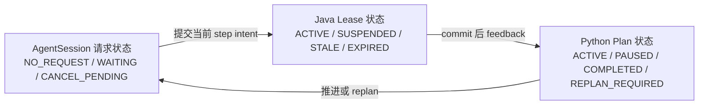
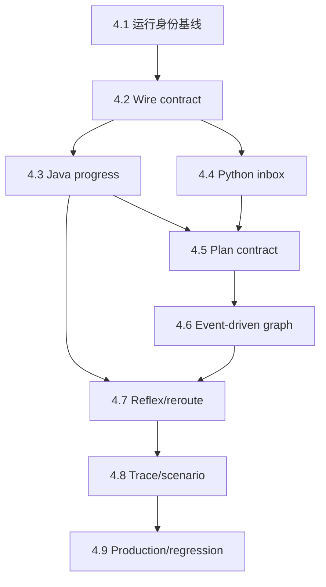

# DungeonMind Phase 4 构建指南

> 配套 Spec：[`PHASE_4_SPEC.md`](PHASE_4_SPEC.md)
>
> 状态：已执行。自动化结果与未验证项见 [`PHASE_4_COMPLETION.md`](PHASE_4_COMPLETION.md)。

## 先读这里

### 读者与目标

本文面向接手 `result` 分支、准备实现执行反馈与事件驱动重规划的 Builder 或下一名 Agent。
完成后，scripted model 应能在真实 LangGraph 中创建一个有界多步骤计划；Java 执行当前 step，
把 commit 后反馈写回同一 Agent；runtime 在简单 step 边界直接推进，在失败或重要事件时才重新调用模型。

最短验收闭环是：

```text
scripted model 提交 [PATROL, GUARD]
  → Java 只收到 PATROL step
  → 多个 action tick 后 PATROL 成功
  → Python 不调用模型，直接提交 GUARD step
  → 路径被阻挡时先本地 reroute 一次
  → 再次失败才产生一次带原因的 replan
```

### 文档分工

- [`PROJECT_INTENT_zh-CN.md`](PROJECT_INTENT_zh-CN.md)：为什么要做真实 Agent 循环。
- [`DEVELOPMENT_ROADMAP.md`](DEVELOPMENT_ROADMAP.md)：Phase 4 的阶段出口。
- [`PHASE_4_SPEC.md`](PHASE_4_SPEC.md)：锁定行为、schema、范围和 Definition of Done。
- 本文：按依赖顺序告诉实现者在哪里改、为何现在改、每一步如何过闸。
- 未来 `PHASE_4_COMPLETION.md`：只记录实际完成和真实证据。

遇到冲突时，按仓库 `AGENTS.md` 和 Roadmap 第 1 节的优先级处理。不要用本 Guide 覆盖 Spec 的锁定决定。

### 当前到目标的变化

| 当前 Phase 3 基线 | Phase 4 目标 |
|---|---|
| `ActionOutcome` 只有 action/decision 关联 | feedback 带 plan/step/status/reason |
| plan metadata 只是 trace correlation | Python 有 bounded active plan 和 step cursor |
| Graph 每次 observation 都进入模型 | 先 reduce；能推进就不调用模型 |
| Graph 只记录最近 feedback | 有界 inbox、去重、两阶段消费 |
| standalone world event 被 Graph 忽略 | event 进入同一 Agent reducer |
| heartbeat 可以触发 request/model | heartbeat 只保活 |
| `allowLocalReroute` 未进入生产执行 | 每 step 一次局部修正上限 |
| reflex 能 suspend/resume Lease | pause/resume/cancel 产生结构化 feedback |
| provider 未配置 | 继续未配置，最终 smoke 单独提醒 |

### 完成后的玩家可见变化

默认 `agent.bridge.enabled=false` 时，玩家行为与 Phase 3 基线保持一致。启用 Bridge 并运行 scripted/model
brain 后，敌人应更少出现无休止撞墙或每次动作都重新“想一遍”的抖动：它会承诺一个短计划，受阻时先
局部修正，关键前提改变时再换计划；临近威胁仍由 Java 反射即时处理。

### 本阶段不做什么

- 不选择或安装具体 provider SDK；
- 不写 API key、endpoint 或 `.env`；
- 不实现多敌人共享意识或 Phase 5 消息传播；
- 不实现完整声音传播，只消费已有私有声音事实；
- 不新增复杂战术 skill；
- 不把 future Action/path 发给 Java；
- 不改 `playWithInputString(String)`。

## 不可破坏的边界

### 1. Java 游戏线程永不等待 Python 或模型

只允许 queue offer、drain 已解析消息和读取状态。禁止在 AI Tick 中 connect/read/write、Future.get 或等待模型。

### 2. Java 仍是世界和 step progress 的权威

Python 可以保存计划、选择当前 step 和请求 replan；碰撞、伤害、目标是否仍满足前提、动作是否提交、
step 是否成功都由 Java 判定。

### 3. wire 只携带当前 step

完整 plan 保留在 Python checkpoint state。`strategic-intent.v2` 只发送当前 step，不能携带未来路径或动作。

### 4. 事件驱动不等于无限事件历史

feedback、event、消费 ID 和 plan revision 全部有界。不得用普通 list 无限追加解决去重或重试。

### 5. heartbeat 不是思考理由

heartbeat 只用于连接活性。首次冷启动、重要事件、step 失败或计划结束才允许进入模型节点。

### 6. 快脑覆盖保留关联

P1/P2 反射优先级不变。覆盖原计划时必须记录 plan/step/decision；恢复失败必须产生 replan reason。

### 7. 新 run 不恢复旧执行现场

相同命名世界读档可以复用 checkpoint key，但 `runId` 改变时 active plan、inbox 和 cursor 必须清空。

### 8. provider 配置不进入本阶段默认路径

`--brain model` 继续 fail-fast，直到 Builder 后续实现自己的 adapter。自动化使用 scripted adapter。

## 必要心智模型

### 三个状态机不要混在一起



- Session 管外部请求是否有效；
- Lease 管 Java 当前控制权；
- Plan 管 Agent 的多步骤战略状态。

任何一个状态机都不能直接修改另一个对象。它们只通过 immutable message 和 correlation ID 协作。

### 一次 step 的完整生命周期

```text
PENDING
  → current step 被编码为 v2 intent
  → Java validator 接受
  → ACTIVE Lease 跨 action tick 执行
  → commit 后 progress evaluator
      → ACTIVE：继续
      → SUCCEEDED：Python 推进下一 step
      → FAILED：Python replan
      → PAUSED：等待 reflex 结束
```

### 输入消费采用两阶段提交

```text
receive feedback/event
  → bounded inbox stage
  → decision snapshot
  → graph 成功产生 eligible result
  → emitter 成功写回或本地状态转换完成
  → commit consumed IDs
```

取消、超时、异常或迟到结果不得提前吞掉输入。

## 实施路线

依赖顺序如下：



不要先写“完整 Agent planner”再补 schema。Phase 4 的高风险点是 correlation、run boundary 和重复消费；
这些必须先由 contract 和 deterministic tests 固定。

## 4.1 固定基线并修复交互式运行身份

### 为什么现在实施

当前新世界路径在 `worldId` 生成前调用 `beginAgentRun()`。默认 Bridge 关闭时不会建 Session，
因此 Phase 3 自动化没有暴露；Phase 4 要做真实生产闭环，必须先修复，否则后续所有 feedback/plan 测试
都可能只验证 harness 而非交互式 composition。

### 生产代码入口

- [`byog/Core/Game.java`](byog/Core/Game.java)：`SEED_INPUT`、`beginAgentRun()`、
  `attachEnemySessions()`、`primeEnemyObservations()`、`loadGameState()`、`nextFloor()`。
- [`byog/IO/GameConfig.java`](byog/IO/GameConfig.java)：Bridge enabled 配置快照。
- [`byog/Bridge/AgentProtocol.java`](byog/Bridge/AgentProtocol.java)：Identity 非空契约。

### 职责与接口

把新世界顺序固定为：

```text
生成 world/entities/stairs/apples
  → 生成新 worldId
  → 创建 runId
  → attach enabled Sessions
  → prime committed observations
  → 首次保存
```

读档继续先恢复稳定 `worldId`，再创建新 `runId`。换层保留 worldId、关闭旧 Session、使用新 floor identity。

测试通过 package-visible composition seam 或小型 factory 验证顺序；不要启动 GUI，也不要用反射调用私有方法。

### 保持不变

- 覆盖同名世界仍生成新 worldId；
- 读档仍保留存档 worldId、生成新 runId；
- Bridge disabled 不创建网络线程；
- Java runtime state 不进存档。

### 4.1 阶段闸门

- enabled Session identity 的 worldId/runId/floorId/agentId 全部合法；
- 新世界、读档、换层各有一个 deterministic identity 测试；
- `GameConfigTest` 和 `CoreGameplayRegressionSuite` 通过；
- 没有改动 `playWithInputString(String)` 的 runtime 行为。

详细验证：Spec `RUN-01`、`ID-02`、`ID-03`。

## 4.2 硬切反馈、事件与 observation contract

### 为什么现在实施

Java progress 和 Python inbox 都依赖稳定 ID、plan/step 和状态字段。先改某一侧业务逻辑会制造无法可靠
验证的半协议，因此三种 payload 必须同次硬切。

### 生产代码入口

- [`byog/Bridge/AgentProtocol.java`](byog/Bridge/AgentProtocol.java)
- [`byog/Bridge/AgentProtocolCodec.java`](byog/Bridge/AgentProtocolCodec.java)
- [`agent/python/dungeonmind_agent/protocol.py`](agent/python/dungeonmind_agent/protocol.py)
- [`agent/contract/README.md`](agent/contract/README.md)
- [`agent/contract/fixtures/`](agent/contract/fixtures/)

### 职责与接口

版本矩阵：

| Contract | 目标版本 | 行为 |
|---|---|---|
| Envelope | `agent-session.v1` | 不变 |
| Observation | `private-observation.v3` | pending event 改为 event v1 |
| Intent | `strategic-intent.v2` | 不变 |
| Feedback | `action-feedback.v2` | plan/step/status/reason/feedbackId |
| Event | `agent-event.v1` | eventId、correlation、reason |

先在 Java records 中固定字段顺序和 enum，再同步 Java codec、Python validator、fixtures。
exact-field 规则下，所有 nullable 字段也必须显式出现，不允许省略后猜默认。

至少新增 fixtures：

```text
valid-observation-v3.json
valid-action-feedback-v2.json
valid-world-event-v1.json
invalid-old-observation-version.json
invalid-old-feedback-version.json
invalid-missing-event-id.json
invalid-unknown-step-status.json
```

### 保持不变

- 65,536-byte 默认 frame 限制和深度/数组/字符串上限；
- envelope identity 和 message direction；
- v2 intent 的 skill、parameters 和 plan metadata；
- no-cheat observation 内容。

### 4.2 阶段闸门

- Java/Python 对每个 valid fixture 归一化为相同语义；
- 旧 feedback/event/observation 被明确拒绝；
- duplicate key、unknown field、unknown enum、非法 null 和超限输入有稳定 rejection；
- `AgentProtocolContractTest`、`AgentContractFixtureTest`、Python protocol/fixture tests 通过。

详细验证：Spec `FB-02`、`FB-03`、`EVT-01`、`EVT-02`。

## 4.3 建立 Java 权威 progress 与关联冻结

### 为什么现在实施

现在 `Enemy.collectAgentUpdates()` 通过当前 Lease 补 trace plan 字段。若 Lease 在 execute 与 collect 之间被替换，
结果可能关联错 step。必须先在动作执行点冻结关联，再引入 progress evaluator。

### 生产代码入口

- [`byog/Entity/Enemy.java`](byog/Entity/Enemy.java)：`PendingAction`、execute、collect、publish。
- [`byog/Action/ActionOutcome.java`](byog/Action/ActionOutcome.java)
- [`byog/AI/TacticalSkill.java`](byog/AI/TacticalSkill.java)
- [`byog/AI/TacticalSkillRegistry.java`](byog/AI/TacticalSkillRegistry.java)
- [`byog/AI/BuiltinTacticalSkills.java`](byog/AI/BuiltinTacticalSkills.java)

### 职责与接口

新增稳定领域类型：

```text
SkillProgressContext
StepProgress
StepStatus
PlanStatus
OutcomeReason
```

不要在类名、方法名、字段、测试或日志中使用 `Phase4`、`Step4` 等开发编号。

执行顺序：

```text
choose Lease/action
  → capture decision + source + skill + PlanMetadata
  → Action.execute()
  → PendingAction
  → commit barrier
  → create provisional committed outcome
  → registry.evaluateProgress()
  → create final immutable ActionOutcome
```

progress evaluator 只读 committed private observation 和执行计数。若需要判断可达性，继续走 registry/planner
已有 seam，不在 Enemy 中复制四套 skill if/else。

### skill progress 默认语义

- PATROL：到达目标成功；第一次 blocked 可 reroute；重复 blocked 失败。
- CHASE：玩家仍是私有可见目标且已相邻时成功；目标丢失或变化失败。
- ATTACK：`DAMAGE` 成功；`BLOCKED` 失败。
- GUARD：完成固定 guard commitment 后成功。

若某 skill 无法用私有 observation 判断，返回 `REPLAN_REQUIRED`，不能读取全局 Player 补答案。

### 保持不变

- 每个 cooldown 至多一个 Action；
- 所有 Enemy execute 后统一 commit；
- collect 只读 commit 后世界；
- random damage 和碰撞仍由现有 Action/EntityManager 处理；
- local fallback 不伪造 remote plan metadata。

### 4.3 阶段闸门

- action feedback 使用 execute 时冻结的 plan/step；
- positions、HP 和 DAMAGE/BLOCKED 来自 commit 后世界；
- 四个 built-in skill 正常、失败和边界 progress 测试通过；
- local fallback feedback 的 plan 字段为 null、状态 UNTRACKED；
- 不存在第二份 planner 或测试专用 progress 规则。

详细验证：Spec `FB-01`、`FB-02`、`PLAN-04`、`PLAN-06`、`PLAN-07`。

## 4.4 建立 Python 有界 inbox、去重和 run reset

### 为什么现在实施

直接从 reader 调 `graph.update_state()` 会让反馈与正在运行的 graph 并发写同一 checkpoint，也无法保证取消时
不吞输入。先建立独立有界 inbox，再让一次 decision 获取 immutable snapshot。

### 生产代码入口

- [`agent/python/dungeonmind_agent/brain/graph_agent.py`](agent/python/dungeonmind_agent/brain/graph_agent.py)
- [`agent/python/dungeonmind_agent/graph/state.py`](agent/python/dungeonmind_agent/graph/state.py)
- [`agent/python/dungeonmind_agent/graph/workflow.py`](agent/python/dungeonmind_agent/graph/workflow.py)
- [`agent/python/dungeonmind_agent/checkpoint.py`](agent/python/dungeonmind_agent/checkpoint.py)

### 职责与接口

建议新增 `ExecutionInbox`，由 `GraphAgentBrain` 每连接持有：

```python
# 伪代码：只表达职责
snapshot = inbox.stage_and_snapshot(envelope)
result = workflow.decide(observation, snapshot, cancellation)
if emitter.emit_response(...) == EMITTED:
    inbox.commit(snapshot)
```

inbox 的 key 仍是当前连接 Agent identity；不能创建全局共享 mailbox。feedback/event 以 stable ID 去重，
窗口满时按 oldest-consumed-first 清理；未消费 critical feedback 不得被低优先级 event 挤掉。

当 observation.runId 与 checkpoint `last_run_id` 不同：

1. 清 active plan；
2. 清 feedback/event window 和 consumed IDs；
3. 把 replan reason 设为 `COLD_START`；
4. 写入新 runId；
5. 不删除 checkpoint 文件本身。

### standalone 与 pending duplicate

同一 `eventId` 可能先作为 standalone `world_event` 到达，随后又出现在 observation.pendingEvents。
inbox 必须只保留一次，但新 eventId 即使 eventType/entity 相同也必须视为新 occurrence。

### 保持不变

- 每连接独立 brain、executor state 和 emitter；
- reader 在模型运行时继续处理 cancel；
- late result 由 cancellation + Java generation 双重抑制；
- checkpoint key 仍是 `worldId/floorId/agentId`。

### 4.4 阶段闸门

- Graph brain 接收 `world_event`；
- duplicate event/feedback 只消费一次；
- cancelled/failed decision 不提交 consumption；
- 两 Agent 交错输入不串线；
- 同 key 新 run 清 active execution；新 floor 自然冷启动；
- inbox、history 和 consumed IDs 全部受配置上限约束。

详细验证：Spec `EVT-01`、`EVT-02`、`ID-01`、`ID-02`、`ID-03`。

## 4.5 建立有界 plan contract 与当前-step emitter

### 为什么现在实施

有了权威 feedback 和可靠 inbox，才可以安全保存多步骤计划。若先写计划生成，无法证明 step 何时推进、
取消或失败。

### 生产代码入口

- [`agent/python/dungeonmind_agent/graph/state.py`](agent/python/dungeonmind_agent/graph/state.py)
- [`agent/python/dungeonmind_agent/graph/tools.py`](agent/python/dungeonmind_agent/graph/tools.py)
- [`agent/python/dungeonmind_agent/model/adapter.py`](agent/python/dungeonmind_agent/model/adapter.py)
- [`agent/python/dungeonmind_agent/model/adapter.py`](agent/python/dungeonmind_agent/model/adapter.py) 中 scripted adapter

### 职责与接口

Pydantic 类型：

```text
PlanStep
ActivePlan
StepStatus
PlanStatus
PlanSubmission
```

`submit_plan` 接收 1..6 个 step。每个 step 只允许 skill、parameters、validForTicks、interruptPolicy。
tool 读取当前 observation capabilities，校验所有 step 后一次性创建 immutable plan；任何一步非法则整体拒绝。

ID 所有权：

```text
planId     = runtime 生成
stepId     = runtime 生成，plan 内唯一
revision   = runtime 递增
decisionId = Java Session 为每次 observation request 生成
```

输出当前 step 时继续构造 `strategic-intent.v2`：

```json
{
  "intentVersion": "strategic-intent.v2",
  "skill": "PATROL",
  "parameters": {"targetPosition": {"x": 5, "y": 4}},
  "confidence": 0.9,
  "validForTicks": 12,
  "interruptPolicy": {
    "engageVisiblePlayer": true,
    "respondToAdjacentThreat": true,
    "allowLocalReroute": true
  },
  "planMetadata": {
    "planId": "runtime-plan-7",
    "stepId": "step-0",
    "revision": 0
  }
}
```

`submit_strategic_intent` 保留并内部创建单-step plan。不要维护两套 finalize 路径。

scripted adapter 至少产生：

- 无玩家：PATROL → GUARD；
- 玩家可见且非相邻：CHASE → ATTACK；
- 相邻玩家：单-step ATTACK。

它仍必须先使用 evidence tool，再调用 terminal plan tool。

### 保持不变

- tool 只读当前 observation；
- Java registry 再校验当前 step；
- Pydantic JSON 深度、数组、对象和字符串上限；
- ModelAdapter 不暴露 Socket、Java 对象或 provider secret。

### 4.5 阶段闸门

- 0、7 steps 整体拒绝；1、6 合法；
- 任一未知 skill/非法参数使整个 plan 不生效；
- runtime ID 稳定且模型输入无法覆盖；
- wire 只包含当前 step；
- scripted adapter 完成真实 model→tool→model/terminal loop；
- 单-step 兼容路径与多-step 共用同一 reducer/emitter。

详细验证：Spec `PLAN-01`、`PLAN-02`、`PLAN-03`。

## 4.6 改造 graph 为事件驱动执行/重规划

### 为什么现在实施

当前 graph 的固定入口是 `prepare_context → invoke_model`。Phase 4 的核心价值是先处理执行状态，
仅在不能确定性推进时使用模型，因此路由必须在模型节点之前。

### 生产代码入口

- [`agent/python/dungeonmind_agent/graph/workflow.py`](agent/python/dungeonmind_agent/graph/workflow.py)
- [`agent/python/dungeonmind_agent/graph/state.py`](agent/python/dungeonmind_agent/graph/state.py)
- [`agent/python/dungeonmind_agent/model/scheduler.py`](agent/python/dungeonmind_agent/model/scheduler.py)
- [`byog/Entity/Enemy.java`](byog/Entity/Enemy.java)：request trigger 与 heartbeat。

### 职责与接口

graph 目标节点：

```text
ingest_inputs
reset_on_run_change
reduce_execution
route_execution
emit_current_step
advance_step
invoke_model
execute_tools
finalize_plan
reject_decision
```

conditional route：

| 条件 | 路径 | 模型调用 |
|---|---|---:|
| 当前 step ACTIVE，无 terminal feedback | emit current/keep Lease | 0 |
| step SUCCEEDED，还有下一 step | advance + emit next | 0 |
| reflex PAUSED/RESUMED | update plan state | 0 |
| cold start | replan | 1 个有界 loop |
| step FAILED/target lost | replan | 1 个有界 loop |
| plan COMPLETED | replan | 1 个有界 loop |
| 多 trigger 同 batch | 合并 replan | 1 个有界 loop |

Java 侧把 `isHeartbeatDue()` 从 `requestIntent()` 条件移出，改为 `sendHeartbeat()`。首次 observation、
step terminal、重要 event 和 queue 需要新当前 step 才请求 intent。

`ModelInput` 增加结构化且有界的：active plan summary、feedback batch、event batch、replan triggers。
不把 raw trace 或无限 message history塞进 prompt 输入。

### 保持不变

- scheduler 的 encounter concurrency、queue、call 和 token 预算；
- 每 decision 的 model/tool round 上限和 deadline；
- reader/task/emitter 取消链；
- Java Session single in-flight 和 generation 校验。

### 4.6 阶段闸门

- step success 推进下一 step 时 adapter invoke 计数不增加；
- repeated blocked/target lost 只产生一次模型调用；
- 无事件且 active plan 正常时，跨多个 heartbeat 不调用模型；
- 多 trigger 固定排序、合并且不丢原因；
- cancel、timeout、queue budget 和 non-blocking tests 保持通过。

详细验证：Spec `PLAN-01`、`PLAN-05`、`BUDGET-01`、`BUDGET-02`、`FAIL-01`。

## 4.7 固定反射暂停、恢复、取消与局部修正

### 为什么现在实施

事件驱动 graph 已能理解 terminal feedback 后，才能安全把现有 Lease suspend/resume 变成 plan 级行为。
否则反射事件只会被记录，仍可能重复调用模型或恢复错误队列。

### 生产代码入口

- [`byog/AI/IntentLease.java`](byog/AI/IntentLease.java)
- [`byog/AI/IntentArbiter.java`](byog/AI/IntentArbiter.java)
- [`byog/Entity/Enemy.java`](byog/Entity/Enemy.java)
- [`byog/Action/ActionQueue.java`](byog/Action/ActionQueue.java)
- [`byog/AI/InterruptPolicy.java`](byog/AI/InterruptPolicy.java)

### 职责与接口

让 Arbiter 的 transition 返回 typed disposition，而不是让 Enemy 通过前后 boolean 猜：

```text
OVERRIDE_STARTED
OVERRIDE_ESCALATED
LEASE_RESUMED
LEASE_INVALIDATED
NO_CHANGE
```

Enemy 用 disposition 生成 event/feedback：

- started：plan `PAUSED`，保留原 queue；
- resumed：plan `ACTIVE`，继续同 step；
- invalidated：清当前 step queue，plan `REPLAN_REQUIRED`；
- reflex action：带原 plan/step/decision + overrideReason。

局部 reroute：

```text
MoveAction BLOCKED
  → policy.allowLocalReroute?
  → rerouteCount < 1?
  → clear only stale ActionQueue prefix
  → registry replan same step from committed world
  → no model
```

若重新规划为空、目标失效或再次 blocked，立即 terminal failure。不要随机走一步掩盖失败。

### 保持不变

- P1 Safety Reflex 永远不能被远程 policy 关闭；
- P2 继续读取 `engageVisiblePlayer`；
- Reflex 只读 private `ReflexObservation`；
- 一次 cooldown 仍至多执行一个 action；
- local fallback 在远程不可用时继续工作。

### 4.7 阶段闸门

- P1/P2 开始、升级、结束都有 typed transition；
- 可恢复 Lease 保留 plan/step 和未消费 queue；
- 不可恢复 Lease 清 queue、反馈原因并触发一次 replan；
- 每 step 最多一次 local reroute；
- repeated blocked 不无限重复同一错误；
- trace 中 reflex action 和原 decision/plan/step 可关联。

详细验证：Spec `PLAN-04`、`PLAN-05`、`REFLEX-01`、`REFLEX-02`。

## 4.8 升级 trace 并建立固定场景证据

### 为什么现在实施

trace 必须在完整状态转换稳定后升级，否则会为中间实现冻结错误字段。固定场景是 Phase 4 是否真实闭环的
证据，不是漂亮日志。

### 生产代码入口

- [`byog/Trace/AgentTrace.java`](byog/Trace/AgentTrace.java)
- [`agent/python/dungeonmind_agent/observability.py`](agent/python/dungeonmind_agent/observability.py)
- [`byog/Test/EncounterHarness.java`](byog/Test/EncounterHarness.java)
- 新 `ExecutionFeedbackContractTest`、`PlanProgressTest`、`EventDrivenAgentIntegrationTest`
- 新 Python `test_execution_loop.py`

### 职责与接口

版本：

- Java gameplay trace：`agent-runtime.trace.v4`
- Python model trace：`agent-model.trace.v2`

固定场景至少覆盖：

1. scripted PATROL → GUARD 跨多个 action tick；
2. 动态占位导致一次 local reroute；
3. 第二次 blocked 导致一次 model replan；
4. 可见玩家触发 reflex pause，离开 FOV 后恢复或明确失效；
5. 同一 event standalone/pending 重复只消费一次；
6. 新 run 和新 floor 不复用 active plan。

trace assertion 只检查稳定关联和状态转换：

```text
eventId / feedbackId
runId / floorId / agentId
decisionId / planId / stepId / revision
stepStatus / planStatus / reasonCode
replanTrigger
```

不要 golden 完整寻路序列、随机伤害值、模型文本或 wall-clock。

### 保持不变

- Java production 日志只走 `Logger`；
- Python diagnostics 使用 logging/stderr，stdout 只放协议/ready；
- canonical trace 不含 thread name、绝对时间或本机路径；
- tests 不用 GUI、默认玩家存档或真实 provider。

### 4.8 阶段闸门

- 同一固定输入生成相同 canonical Java trace；
- Java 与 Python trace 能以稳定 IDs 交叉关联；
- trace whitelist 拒绝 rawPrompt/rawResponse/authorization；
- integration 使用 barrier/fake clock/有界进程等待，不使用 `Thread.sleep()`；
- default gate 成功输出简洁。

详细验证：Spec `TRACE-01`、`TRACE-02`、`PLAY-01`。

## 4.9 生产接线、回归、provider 提醒与交接

### 为什么现在实施

只有局部 contract、progress、inbox、plan、graph、reflex 和 trace 闸门都通过后，才适合运行真实进程和
完整回归。这样 integration 失败可以定位到接线，而不是基础语义。

### 生产代码入口

- [`agent/python/dungeonmind_agent/server.py`](agent/python/dungeonmind_agent/server.py)
- [`agent/python/dungeonmind_agent/brain/factory.py`](agent/python/dungeonmind_agent/brain/factory.py)
- [`byog/Bridge/SocketTransport.java`](byog/Bridge/SocketTransport.java)
- [`byog/Core/Game.java`](byog/Core/Game.java)
- [`config/game.properties`](config/game.properties)
- 当前架构文档和未来 `PHASE_4_COMPLETION.md`

### 职责与接口

真实 scripted integration 必须使用：

```text
Java Game/Enemy
  → real AgentSession
  → real SocketTransport
  → real Python server
  → GraphAgentBrain
  → real LangGraph + ScriptedModelAdapter
```

不能用进程内 fake 跳过 NDJSON、Session generation 或 emitter。

同步更新：

- `agent/contract/README.md` 的版本矩阵；
- `AI_TICK_ARCHITECTURE.md` 中过时的“Tool Calling 尚未实现”和空 poll 描述；
- `agentarchitecture.md` 的 Graph feedback/event 行为；
- `session.md` 的 event ID、合并和 critical semantics；
- `DEVELOPMENT_ROADMAP.md` 的 Phase 4 completion 状态；
- `PHASE_4_COMPLETION.md` 的实际证据。

### provider 配置提醒

Phase 4 默认仍不接具体 API。完成 provider-neutral gate 后，必须提醒 Builder：

1. 在 `agent/python/dungeonmind_agent/model/` 实现自己的 `ModelAdapter`；
2. 在 BrainFactory 的 model 路径注入 adapter；
3. ready 前校验 endpoint、模型 ID 和凭据；
4. 凭据只进本地环境变量或 secret store，不提交 `.env`；
5. 运行一次有界真实 smoke，确认 plan tool、current-step intent、feedback 和 replan；
6. 将 provider 名称、模型、命令、费用边界和结果补到 Completion，但不记录 key 或原始响应。

不要假设 Builder 使用 OpenAI API，也不要添加 OpenAI-specific 配置名。

### 保持不变

- 默认 `agent.bridge.enabled=false`；
- Python server 不由生产 Main 自动启动；
- `--brain model` 未配置时 bind/ready 前失败；
- Socket failure 不阻塞游戏，Java fallback 继续；
- 生成物、checkpoint DB、trace 和 secret 不提交。

### 4.9 阶段闸门

- Python 全部 contract/unit tests 通过；
- UTF-8 Java 全量编译通过；
- leaf-only `AgentRuntimeTestSuite` 通过且无重复计数；
- 真实 Python/TCP scripted integration 通过；
- `SocketTransportTest` 与 `CoreGameplayRegressionSuite` 通过；
- 固定多-step/blocked/reflex 场景通过；
- Completion 只记录实际执行命令和结果；
- 真实 provider smoke 若未执行，明确写成未验证并提醒 Builder 配置。

详细验证：Spec 全部自动 Test ID、`PLAY-01`；`PROVIDER-01` 可延后。

## 文件导航

### 最短 Python 阅读顺序

1. [`agent/python/dungeonmind_agent/protocol.py`](agent/python/dungeonmind_agent/protocol.py)
2. [`agent/python/dungeonmind_agent/brain/graph_agent.py`](agent/python/dungeonmind_agent/brain/graph_agent.py)
3. [`agent/python/dungeonmind_agent/graph/state.py`](agent/python/dungeonmind_agent/graph/state.py)
4. [`agent/python/dungeonmind_agent/graph/workflow.py`](agent/python/dungeonmind_agent/graph/workflow.py)
5. [`agent/python/dungeonmind_agent/graph/tools.py`](agent/python/dungeonmind_agent/graph/tools.py)
6. [`agent/python/dungeonmind_agent/model/adapter.py`](agent/python/dungeonmind_agent/model/adapter.py)
7. [`agent/python/dungeonmind_agent/model/scheduler.py`](agent/python/dungeonmind_agent/model/scheduler.py)
8. [`agent/python/dungeonmind_agent/observability.py`](agent/python/dungeonmind_agent/observability.py)

### 最短 Java 阅读顺序

1. [`byog/Core/Game.java`](byog/Core/Game.java)
2. [`byog/Entity/Enemy.java`](byog/Entity/Enemy.java)
3. [`byog/Action/ActionOutcome.java`](byog/Action/ActionOutcome.java)
4. [`byog/AI/TacticalSkill.java`](byog/AI/TacticalSkill.java)
5. [`byog/AI/BuiltinTacticalSkills.java`](byog/AI/BuiltinTacticalSkills.java)
6. [`byog/AI/IntentArbiter.java`](byog/AI/IntentArbiter.java)
7. [`byog/AI/IntentLease.java`](byog/AI/IntentLease.java)
8. [`byog/Bridge/AgentProtocol.java`](byog/Bridge/AgentProtocol.java)
9. [`byog/Bridge/AgentSession.java`](byog/Bridge/AgentSession.java)
10. [`byog/Trace/AgentTrace.java`](byog/Trace/AgentTrace.java)

## 验证命令

以下命令只在实现阶段执行。生成或修改本 Guide 本身时不运行编译和测试。

```powershell
# 1. Python contract/unit gate
$env:PYTHONPATH = (Resolve-Path agent/python).Path
Push-Location agent/python
& .venv/Scripts/python.exe -m unittest discover -s tests -v
Pop-Location

# 2. UTF-8 Java full compile
$javaSources = Get-ChildItem byog -Recurse -Filter *.java |
    ForEach-Object { $_.FullName }
javac -encoding UTF-8 -cp "..\library-sp18\javalib\*" -d out $javaSources

# 3. Deterministic Agent gate
java "-Dfile.encoding=UTF-8" `
    -cp "out;..\library-sp18\javalib\*" `
    org.junit.runner.JUnitCore byog.Test.AgentRuntimeTestSuite

# 4. Real Python/TCP scripted integration
java "-Dfile.encoding=UTF-8" `
    "-Ddungeonmind.python=$((Resolve-Path agent/python/.venv/Scripts/python.exe).Path)" `
    -cp "out;..\library-sp18\javalib\*" `
    org.junit.runner.JUnitCore byog.Test.EventDrivenAgentIntegrationTest

# 5. Transport regression
java "-Dfile.encoding=UTF-8" `
    -cp "out;..\library-sp18\javalib\*" `
    org.junit.runner.JUnitCore byog.Bridge.SocketTransportTest

# 6. Core gameplay regression
java "-Dfile.encoding=UTF-8" `
    -cp "out;..\library-sp18\javalib\*" `
    org.junit.runner.JUnitCore byog.Test.CoreGameplayRegressionSuite

# 7. Real provider smoke
# 等 Builder 配置自己的 API/adapter 后，按该 adapter 的本地说明单独执行。
```

## 出问题时先看这里

| 症状 | 第一检查点 | 常见原因 |
|---|---|---|
| 新游戏 enabled Bridge 立即失败 | Game 中 worldId/beginAgentRun 顺序 | identity 仍在 worldId 前创建 |
| Java 能发 feedback，Python 不推进 | feedback version/inbox snapshot | 一端仍读旧 payload 或未 commit consumption |
| event 触发两次模型 | eventId 与 pending duplicate | standalone/pending 未去重 |
| 每个 heartbeat 都调用模型 | Enemy request 条件 | heartbeat 仍走 requestIntent |
| step 成功但又调用模型 | graph route | success 没走 advance_step |
| plan/step 关联偶尔错位 | PendingAction capture | collect 时反查当前 Lease |
| blocked 永远重复 | reroute counter/terminal policy | queue 未清或失败未升级 |
| reflex 后原计划消失 | Arbiter transition | started 直接 mark stale 或错误清 queue |
| reflex 后恢复错误目标 | `canResume`/progress | 没检查 commit 后 private observation |
| 读档继续旧 step | run reset | 只看 checkpoint key，没比较 runId |
| 两敌人共享 plan | inbox/checkpoint ownership | 使用了全局 mutable state |
| model mode 无法 ready | RuntimeConfig | 这是 provider 未配置时的预期防护 |
| trace 含 prompt/key | trace whitelist | 直接写了 provider request/response |

## 最终验收清单

### Contract 与身份

- [ ] new-world worldId 在 Session 前生成。
- [ ] feedback v2、event v1、observation v3 双语言硬切。
- [ ] intent 仍是 v2，future steps 不上 wire。
- [ ] old payload 和 unknown fields 明确拒绝。

### Java authority

- [ ] execute 时冻结 plan/step，collect 后补全结果。
- [ ] 四个 skill progress policy 有界且只读私有 committed facts。
- [ ] blocked 先一次 reroute，再失败 replan。
- [ ] P1/P2、Action cadence 和 commit barrier 不变。

### Agent plan 与 graph

- [ ] plan 1..6 steps，runtime-owned IDs。
- [ ] feedback/event inbox、history、cursor 全部有界。
- [ ] step success 无模型推进。
- [ ] failure/event 只触发一次合并 replan。
- [ ] heartbeat 不触发模型。
- [ ] new run/floor 不恢复旧执行状态。

### 异步与失败

- [ ] 游戏线程不等待 Python/model。
- [ ] cancel/timeout 不吞输入，late result 不生效。
- [ ] critical feedback 不静默丢失。
- [ ] provider 未配置时 model 模式 fail-fast，本地游戏继续。

### 证据与交接

- [ ] Java/Python trace 可关联完整闭环且不含敏感文本。
- [ ] deterministic、integration、transport、core regression 全部通过。
- [ ] 固定 multi-step/blocked/reflex 场景通过。
- [ ] 架构文档同步当前事实。
- [ ] `PHASE_4_COMPLETION.md` 记录实际命令、测试数、耗时、偏差和未验证项。
- [ ] 若未配置真实 API，已明确提醒 Builder 后续补 adapter 和 provider smoke。
