# DungeonMind 外部 Agent Runtime 架构

> 状态：外部 Agent 目录边界、Python 确定性 runtime 与扩展边界说明
>
> 更新时间：2026-08-02
>
> 范围：跨语言目录、Python codec、TCP server、每连接大脑、消息语义、
> 故障模式、进程生命周期、未来 TypeScript 与模型大脑扩展
>
> 不展开：`AgentSession` 内部 deadline 状态机、Java `SocketTransport` 实现细节、
> 真实模型调用、Tool Calling 和多 Agent 协作

---

## 0. 先读这一页

外部 Agent runtime 可以作为独立 Python 进程启动，也已经通过真实 localhost TCP
与 Game/Enemy 完成 `observation → intent → action → feedback` 闭环。该能力由
`AgentSessionConfig` 控制；普通 `Main` 使用默认关闭配置，所以“Python server ready”
仍不等于当前交互式游戏进程已经连接。

### 0.1 文中术语

| 术语 | 在本文中的意思 |
|------|----------------|
| Agent（智能体） | 根据私有观察提出战略意图的外部决策组件，不能直接修改 Java 世界 |
| runtime（运行时进程） | 承载 Agent、协议和服务器的独立程序及执行环境，当前实现是 Python 进程 |
| process / thread（进程 / 线程） | 进程拥有独立内存；线程共享所属进程的内存。Java 与 Python 分进程，每条 Python 连接使用独立处理线程 |
| client / server（客户端 / 服务器） | Java 主动连接，所以是客户端；Python 监听端口并接受连接，所以是服务器 |
| protocol / wire contract（协议 / 线路契约） | 两个进程共同遵守的消息格式、方向、字段和兼容规则 |
| codec（编解码器） | 在类型化对象与 NDJSON 字节之间转换，并严格校验字段 |
| schema（结构契约） | 一类消息允许出现的字段、类型、版本和嵌套结构 |
| envelope / payload（消息信封 / 消息内容） | envelope 保存通用身份和类型；payload 是 `data` 中某类消息自己的字段 |
| handler（连接处理器） | Python 中负责一条 TCP 连接读取、校验、决策和写回的对象 |
| context（上下文） | 只属于一条连接的状态，例如消息序号、反馈记录和将来的模型记忆 |
| deterministic（确定性） | 相同私有观察产生相同决策，不依赖随机数、模型波动或外部网络 |
| intent（战略意图） | `ATTACK`、`CHASE`、`PATROL` 等高层建议；Java 仍要校验并规划具体 `Action` |
| DTO（数据传输对象） | 只承载固定字段、没有任意执行能力的协议对象 |
| ready signal（就绪信号） | Python 成功监听端口后写出的单行 JSON，供启动它的程序确认可以连接 |
| bind / listener（绑定 / 监听器） | server 占用指定地址和端口，并等待客户端连接 |
| framing（分帧） | 从连续 TCP 字节流中识别一条完整 NDJSON 消息的过程 |
| backpressure（背压） | 消费跟不上时，通过有限队列和停止读取把压力传回发送端，避免无限堆积 |
| fault mode（故障模式） | `delay`、`malformed`、`disconnect`、`no-read` 等主动表现异常的运行方式 |
| CLI（命令行入口） | 通过终端参数启动和配置 runtime 的程序接口，这里是 `run.py` |
| factory（工厂） | 根据连接上下文创建一个 Brain 实例的组件，避免 server 写死具体大脑类型 |
| provider / SDK（模型服务商 / 开发工具包） | 提供大模型推理服务的一方，以及调用该服务的客户端代码库 |
| Tool Calling（工具调用） | 模型请求程序执行已注册工具的机制；当前尚未接入 |
| canonical evidence（权威运行证据） | 可稳定关联游戏因果的数据；线程名、现实耗时和日志顺序不属于它 |
| stdout / stderr（标准输出 / 标准错误） | stdout 输出机器可读 ready 信号；stderr 输出供人诊断的日志 |
| epoch / generation（连接代次 / 请求代次） | 分别隔离旧连接消息和已经失效的旧请求结果 |
| `logicalTick`（逻辑时刻） | 游戏内因果序号，不等同于现实时间或网络耗时 |
| Reflex / Lease / fallback（反射 / 控制权租约 / 降级策略） | Java 的即时本地规则、限时持续意图，以及远程不可用时的本地行为 |
| TTL（存活时长） | intent 最多能保持有效的逻辑 Tick 数量 |
| event loop（事件循环） | 单线程按事件队列依次处理任务的并发模型，Node.js 常用 |
| API key（接口密钥） | 调用模型服务的凭据，不能进入协议消息或游戏存档 |

| 能力 | 状态 | 当前行为 |
|------|------|----------|
| 跨语言目录边界 | **已实现** | `agent/contract`、`agent/python`、`agent/typescript` 按契约和语言实现分离 |
| Python 严格 codec | **已实现** | 校验 UTF-8、frame、JSON、字段集合、类型、版本、枚举和数值范围 |
| 多连接 TCP server | **已实现** | 使用 `ThreadingTCPServer`，每条连接由独立 handler thread 服务 |
| 每连接独立大脑 | **已实现** | 每个 handler 创建自己的 `DeterministicAgent` 和 outbound `messageSeq` |
| 确定性战略决策 | **已实现** | 相邻玩家 `ATTACK`、可见玩家 `CHASE`、否则确定性 `PATROL` |
| cancel/feedback/event | **已实现** | cancel 返回 ack；feedback 和 event 在连接内记录 |
| 五种故障模式 | **已实现** | `normal`、`delay`、`malformed`、`disconnect`、`no-read` |
| 结构化 ready 信号 | **已实现** | bind 成功后向 stdout 写出单行 JSON |
| 可插拔 brain factory | **未实现** | server 当前直接构造 `DeterministicAgent` |
| 真实模型大脑 | **未实现** | 不调用 LLM、LangGraph、工具、记忆或外部网络 |
| TypeScript runtime | **未实现** | 只有稳定目录边界和职责约定 |
| Game/Enemy 生产接线 | **已实现** | poll/collect/close 接入 Session；Game 管理新局、读档、换层和退出生命周期 |

最重要的边界：

```text
Java Game / EntityManager
  = 世界事实、碰撞、攻击、伤害、提交顺序的唯一权威

AgentSession / SocketTransport
  = Java 侧会话、身份、deadline、队列和物理 TCP

外部 Agent runtime
  = 只消费私有 observation，只提出受限战略 intent
```

相关文档：

- [`session.md`](session.md)：Java 会话身份、请求、deadline、背压和关闭语义。
- [`socket.md`](socket.md)：Java Socket worker、NDJSON framing、重连和传输失败。
- [`AI_TICK_ARCHITECTURE.md`](AI_TICK_ARCHITECTURE.md)：游戏循环、仲裁、动作与 commit 顺序。
- [`agent/python/README.md`](agent/python/README.md)：Python runtime 的启动与快速使用。
- [`agent/contract/README.md`](agent/contract/README.md)：跨语言契约变更规则。

---

## 1. 外部 Agent Runtime 是什么

### 1.1 它是独立决策进程，不是 Java 游戏模块

外部 runtime 回答的是：

```text
怎样接收并严格校验 observation？
怎样为每条 Enemy 连接维护独立决策上下文？
根据可见信息应该提出 ATTACK、CHASE 还是 PATROL？
怎样把 intent 与原 decision、observation 和 generation 关联？
故障模式怎样表现延迟、坏帧、断线和背压？
启动 runtime 的程序怎样确认 server 已经 ready？
```

它不回答：

```text
目标是否仍属于当前 run、floor 和 session epoch？
远程 intent 是否有权覆盖当前 reflex？
目标位置是否合法、可达或仍然可见？
一步移动是否撞墙或撞到另一个 Enemy？
攻击是否命中、造成多少伤害？
本 tick 何时 flush 实体变化和清理死亡？
```

后面这些职责仍属于 Java：

| 职责 | 所有者 |
|------|--------|
| 世界事实与实体提交 | `Game` / `EntityManager` |
| 私有感知生成 | `PerceptionSystem` |
| 会话身份与迟到响应拒绝 | `AgentSession` |
| 物理 TCP 与重连 | `SocketTransport` |
| intent 权限与语义校验 | `DecisionValidator` |
| reflex、lease 与 fallback 优先级 | `IntentArbiter` |
| 路径和原子动作 | `ClassicalPlanner` / `Action` |

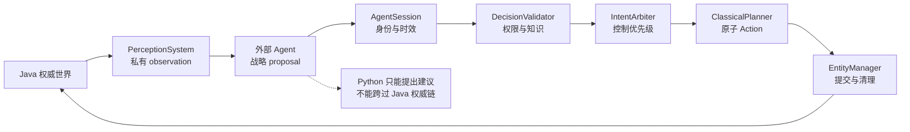

实线是当前已经接通的生产边界；Python 仍只能提出建议，不能跨过 Java 权威链。

### 1.2 为什么必须是独立进程

Python runtime 与 Java 游戏分进程，目的不是“为了使用 Python 而使用 Python”，
而是把不可预测的慢推理与稳定游戏循环隔开：

- 模型依赖、提示词和工具链不会进入 JVM；
- Python 卡住、崩溃或重启时，Java 仍能本地行动；
- Java 不需要信任 Python 返回的目标和策略；
- 同一 wire contract 可以由 Python、TypeScript 或其他语言实现；
- 确定性大脑提供可重复的本地策略基准，不受模型抖动和外部网络影响。

进程隔离不是权限授予。localhost TCP 只是一条 transport，Python 仍只能提交
Java 白名单允许的消息。

---

## 2. 仓库与语言边界

### 2.1 当前目录

```text
agent/
  README.md
  contract/
    README.md
  python/
    README.md
    run.py
    dungeonmind_agent/
      __init__.py
      protocol.py
      server.py
      brain/
        __init__.py
        deterministic.py
  typescript/
    README.md
```

### 2.2 三层职责

| 层 | 当前内容 | 不应包含 |
|----|----------|----------|
| `agent/contract` | 跨语言兼容规则和稳定 wire contract | 模型提示词、Socket 生命周期、语言 DTO |
| `agent/python` | Python codec、server、brain 和 CLI | Java 世界对象、Java 会话状态机 |
| `agent/typescript` | 未来平行实现的位置和约束 | 对 Python 源码的运行时依赖 |

Java 侧仍位于：

```text
byog/Bridge/
  AgentProtocol.java
  AgentProtocolCodec.java
  AgentSession.java
  AgentTransport.java
  SocketTransport.java
```

`byog/Bridge` 是游戏侧 client 边界；`agent/<language>` 是外部 server 与大脑。
两边通过 wire contract 连接，不通过源代码 import 连接。

### 2.3 当前契约的权威来源

当前 schema 的权威实现仍是 Java 的 `AgentProtocol` 与 `AgentProtocolCodec`。
Python `protocol.py` 对称实现相同规则，但还没有由两种语言在运行时共同读取的机器可读
schema 文件。

因此当前存在一项需要长期关注的维护风险：

```text
Java codec 修改字段
  → Python codec 必须在同一次兼容变更中修改
  → agent/contract 文档必须同步说明兼容规则
```

未来可以为 `agent/contract` 增加语言无关的机器可读 schema，但不要为了“单一来源”
强迫 Java 在运行时读取 Python 文件，或让 Python import Java 生成物。

---

## 3. 当前模块连接图

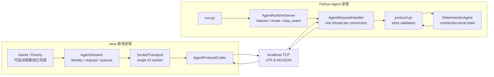

图中 Java `Game/Enemy → AgentSession`、TCP 和 Python runtime 均已实现。配置关闭时
不创建 worker，游戏继续使用本地 Brain。

正式消息往返经过以下组件：

```text
世界提交后，Enemy 生成私有观察
  → AgentSession 建立请求
  → SocketTransport 通过 TCP 发给 Python runtime
  → Python 返回战略 intent
  → 下一次 Enemy poll 读取回复
  → Java 校验并决定是否采纳
  → Java planner 生成并执行具体动作
  → 世界提交后，动作结果通过同一 Session 发回 Python
```

Python runtime 只负责解码、决策和编码；Java 仍负责身份时效、提案校验、动作规划和
世界提交。

---

## 4. 进程、线程与数据所有权

### 4.1 四类执行上下文

| 执行上下文 | 所在进程 | 当前职责 |
|------------|----------|----------|
| Game thread | Java | 世界更新、Session game-thread API、仲裁和动作 |
| SocketTransport worker | Java | connect/read/write/codec/enqueue |
| server 主线程 | Python | bind、ready、accept 调度、关闭 listener |
| connection handler thread | Python | 一条 TCP 连接的读、校验、决策和写回 |

正常往返跨越四个执行上下文：

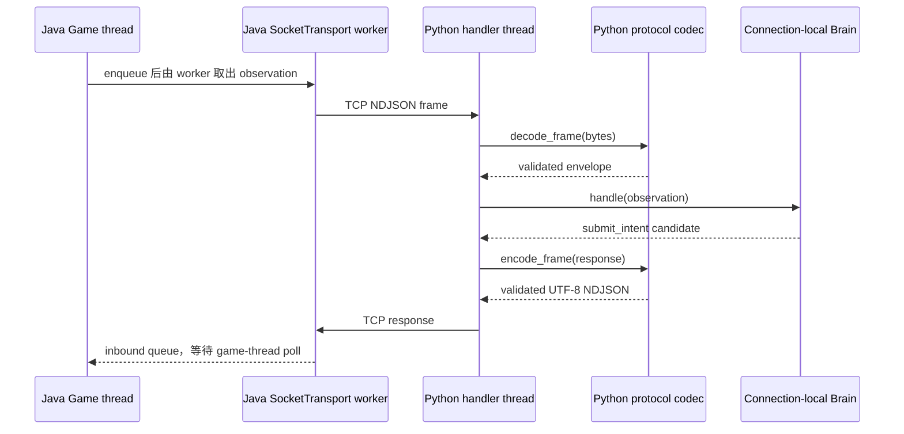

Python handler 不调用 Game thread；Java worker 也不直接调用 brain。

Python 使用 `socketserver.ThreadingTCPServer`。每个连接对应一个
`AgentRequestHandler`，每个 handler 创建一个 `DeterministicAgent`：

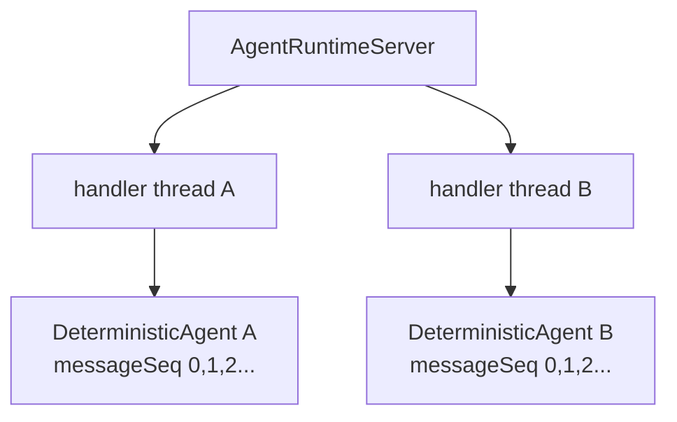

### 4.2 不共享的连接状态

两条连接不能共享：

- outbound `messageSeq`；
- `action_feedback` 记录；
- `world_event` 记录；
- `cancelled_decisions`；
- 将来的模型对话、工作记忆或工具状态。

当前 server 级共享状态只有：

- `mode`；
- `delay_seconds`；
- `max_frame_bytes`；
- `stop_event`；
- listener 生命周期。

故障模式是整个 server 的配置，不是某个连接单独选择的能力。

### 4.3 为什么当前 handler 内同步决策仍可接受

确定性大脑立即返回，因此 handler 中直接调用 `agent.handle()` 不会造成显著等待。
即使 `delay` 模式阻塞一个 handler，其他连接仍由其他 thread 服务。

但这不是未来真实模型的最终并发结构。真实模型可能长时间推理；如果 handler 正在
同步等待模型，同一连接上的 `cancel_request` 也无法及时被读取。接入模型前需要引入：

```text
connection reader
  → bounded request queue / single in-flight controller
  → model worker or cancellable task
  → connection writer
```

这项扩展不能把 Session 的 generation/deadline 语义复制成另一套互相冲突的状态机。
Python 可以节省推理资源，Java 仍是“结果是否还有效”的最终裁判。

---

## 5. CLI 与 Server 生命周期

### 5.1 启动路径

```text
python agent/python/run.py ...
  → dungeonmind_agent.server.main()
  → parse args
  → create_server()
  → bind host/port
  → stdout 写 ready JSON
  → serve_forever(poll_interval=0.1)
```

`run.py` 只是一层稳定 CLI 入口，server 实现位于包内，避免其他入口依赖
脚本路径中的私有细节。

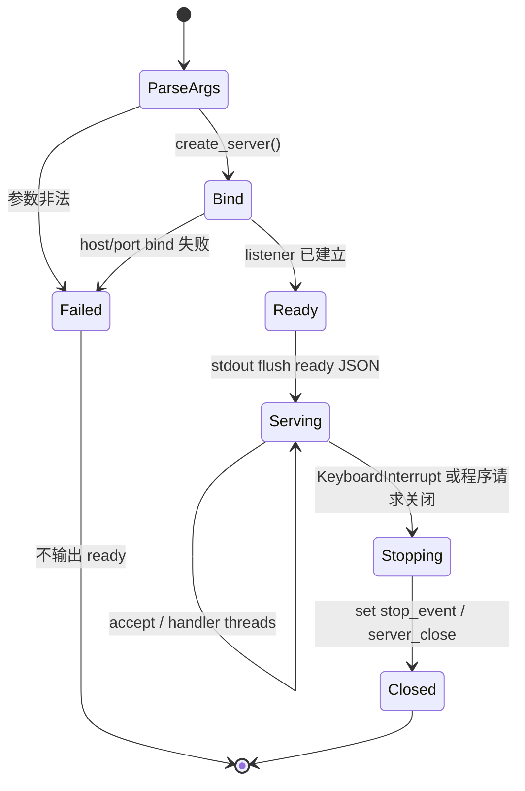

ready 是“bind 已成功”的状态转换证据，不是普通启动日志。

### 5.2 参数

| 参数 | 默认值 | 校验或语义 |
|------|--------|------------|
| `--host` | `127.0.0.1` | 不能为空白 |
| `--port` | `9876` | 传 `0` 时由操作系统分配空闲端口，并在 ready 信号中返回实际端口 |
| `--mode` | `normal` | 必须属于五种已注册模式 |
| `--delay-seconds` | `2.0` | 不能为负数 |
| `--max-frame-bytes` | `65536` | 必须为正数 |

启动示例：

```powershell
python agent/python/run.py `
    --host 127.0.0.1 `
    --port 9876 `
    --mode normal
```

### 5.3 ready 信号

bind 成功后，runtime 向 stdout 写出并立即 flush：

```json
{"event":"ready","host":"127.0.0.1","port":9876,"mode":"normal"}
```

负责启动 runtime 的父进程应解析这行 JSON，不应使用：

```text
启动子进程
sleep 500ms
猜测 server 应该已经可连接
```

端口为 `0` 时，ready 中返回操作系统实际分配的端口。

### 5.4 关闭路径

程序化关闭可以调用：

```text
stop_server(server)
  → stop_event.set()
  → server.shutdown()
  → server.server_close()
```

`shutdown()` 必须由 `serve_forever()` 之外的线程调用。CLI 在主线程收到
`KeyboardInterrupt` 后直接离开 `serve_forever()`，在 `finally` 中设置 stop event
并关闭 server，不从同一 serving thread 调用 `shutdown()`。

当前 server 设置：

| 设置 | 值 | 作用 |
|------|----|------|
| `allow_reuse_address` | `True` | 重启时减少旧地址仍被占用的等待 |
| `daemon_threads` | `True` | handler 不阻止 Python 进程终止 |
| `block_on_close` | `False` | server close 不无界等待 handler |

`no-read` handler 在 `stop_event` 上等待，所以关闭时必须先设置 event，才能让它
退出而不残留等待线程。

### 5.5 谁不负责启动 Python

生产 `Main` 当前不自动创建 Python 子进程。原因是：

- runtime 是可选外部依赖；
- 用户可能使用 Python、TypeScript 或远程受控实现；
- 进程日志、API key 和模型配置不应由游戏偷偷管理；
- bridge disabled 时游戏必须仍可启动和退出。

若某个上层程序主动创建 Python 子进程，它只拥有并清理自己创建的进程；Java 游戏不能
结束用户在终端中手工启动的 runtime。

---

## 6. Wire Protocol 与 Python Codec

### 6.1 版本

当前版本常量：

| 层 | 值 |
|----|----|
| Envelope | `phase2.session.v1` |
| Observation payload | `private-observation.v1` |
| Intent payload | `strategic-intent.v1` |

Envelope 版本名称包含历史阶段编号。它已经成为 Java/Python wire 兼容值，不能只在
一端重命名。新类型、方法和日志仍必须使用稳定领域命名。

### 6.2 Frame 契约

```text
transport = TCP
encoding  = strict UTF-8
framing   = one JSON object + '\n'
limit     = 65,536 UTF-8 bytes，不含换行符
depth     = 16
```

TCP 没有消息边界。Python server 先用有界 `readline(max + 2)` 查找换行，避免在
知道超限之前构造任意大的 frame：

```text
EOF 且没有 bytes       → 正常结束连接
没有换行且 bytes 超限  → FRAME_TOO_LARGE
没有换行但未超限       → JSON_SYNTAX，frame 不完整
有换行但 payload 超限  → FRAME_TOO_LARGE
合法 payload            → decode_frame()
```

### 6.3 decode 流水线

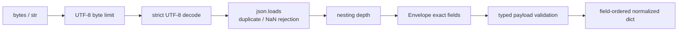

`json.loads()` 使用：

- `object_pairs_hook` 拒绝重复 key；
- `parse_constant` 拒绝 `NaN`、`Infinity` 和 `-Infinity`；
- 解析后递归检查最大嵌套深度；
- schema 层拒绝未知字段，而不是静默忽略。

Frame size 在 JSON 解析前有界；depth 在 JSON 解析后检查。两者解决的问题不同：
前者限制单帧内存规模，后者限制结构复杂度。

### 6.4 encode 流水线

```text
candidate envelope
  → validate_envelope()
  → field-ordered normalized dict
  → json.dumps(
        ensure_ascii=False,
        allow_nan=False,
        separators=(",", ":")
    )
  → UTF-8 bytes
  → byte limit
  → append '\n'
```

编码前再次校验，防止 Python 自己产生 Java 会拒绝的 response。

### 6.5 Envelope 字段

每条消息必须且只能包含：

```text
schemaVersion
messageId
messageSeq
runId
floorId
agentId
sessionEpoch
logicalTick
type
data
```

整数不会接受 Python `bool`。这是必要的，因为 Python 中 `bool` 是 `int` 的子类；
若只写 `isinstance(value, int)`，`true` 会错误通过 `messageSeq` 校验。

### 6.6 失败分类

`ProtocolViolation` 保存稳定的 `reason` 和诊断 `detail`。当前可能出现：

| reason | 含义 |
|--------|------|
| `FRAME_TOO_LARGE` | UTF-8 frame 超过上限 |
| `JSON_SYNTAX` | JSON、UTF-8 或非有限数字非法 |
| `DEPTH_EXCEEDED` | 嵌套层级超过上限 |
| `DUPLICATE_KEY` | object 中出现重复字段 |
| `SCHEMA_MISMATCH` | schema version 或受限枚举不匹配 |
| `UNKNOWN_MESSAGE_TYPE` | 未注册消息类型 |
| `UNKNOWN_PAYLOAD_VERSION` | observation/intent payload 版本未知 |
| `UNKNOWN_SKILL` | skill 不在白名单 |
| `UNKNOWN_EVENT_TYPE` | world event 不在白名单 |
| `UNKNOWN_FIELD` | object 出现契约外字段 |
| `MISSING_REQUIRED` | 必填字段缺失 |
| `TYPE_MISMATCH` | 字段 JSON 类型错误 |
| `OUT_OF_RANGE` | 数值不在 Java 对应范围或业务范围 |
| `DIRECTION_MISMATCH` | runtime 收到只应由 runtime 发出的消息 |

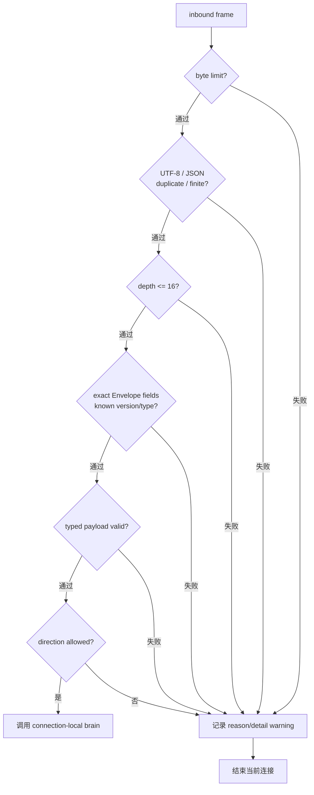

失败只终止对应连接，不让 Python handler 尝试修复或补字段。

Handler 收到违反协议的 frame 时记录 warning 并关闭该连接，不尝试“猜测”或
自动修复输入。

---

## 7. 消息方向与语义

### 7.1 当前八种消息

| type | 主要方向 | Python 当前行为 |
|------|----------|-----------------|
| `observation` | Java → Python | 决策并返回一条 `submit_intent` |
| `action_feedback` | Java → Python | 深拷贝记录，不回复 |
| `world_event` | Java → Python | 深拷贝记录，不回复 |
| `heartbeat` | Java → Python | 接受，不回复 |
| `cancel_request` | Java → Python | 记录 decision，并返回 `cancel_ack` |
| `submit_intent` | Python → Java | 若从连接入站收到则拒绝方向 |
| `cancel_ack` | Python → Java | 若从连接入站收到则拒绝方向 |
| `protocol_error` | 双方诊断 | Python 接受并忽略；当前不主动发送 |

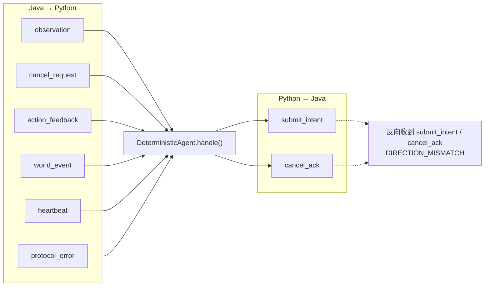

箭头表示当前 runtime 的行为方向，不表示 `protocol.py` 只能解析单一方向。

`protocol.py` 可以校验全部八种 payload；`DeterministicAgent.handle()` 再执行方向
约束和行为语义。codec 能解码某种消息，不代表 server 允许对端在该方向发送它。

### 7.2 observation 是私有快照

当前 observation payload 包括：

```text
observationVersion
decisionId
observationSeq
requestGeneration
observedAtTurn
self
visibleTiles
visibleEntities
heardEvents
pendingEvents
capabilities
```

Python 不持有 `Player`、`Enemy`、`EntityManager` 或 `TETile[][]` 引用。它能看到的
事实必须已经序列化在 observation 中。

私有知识边界：

- `self.position/hp`：当前 Enemy 自身；
- `visibleTiles`：FOV 内格子，不是完整地图；
- `visibleEntities`：FOV 内实体；
- `heardEvents`：显式提供的听觉线索；
- `pendingEvents`：Java 允许发送的有限事件；
- `capabilities`：允许 skill 和数值能力描述。

### 7.3 submit_intent 是建议，不是 Action

Intent payload 包含：

```text
intentVersion
skill
parameters
confidence
validForTicks
interruptPolicy
```

当前白名单：

```text
PATROL
CHASE
ATTACK
GUARD
```

Python 不能返回：

```text
MoveAction 实例
任意 Java 类名
直接伤害数值命令
完整路径绕过 planner
修改地图或实体的工具调用
```

Java 收到 intent 后仍需验证身份、私有知识、skill、target、TTL 和当前世界语义。

### 7.4 cancel、feedback 与 event

`cancel_request` 的 ack 复制：

- `decisionId`；
- `requestGeneration`。

当前 deterministic brain 把 cancelled decision id 追加到连接本地列表。它不会真正
取消后台模型任务，因为当前没有模型任务。

`action_feedback` 和 `world_event` 被深拷贝保存，使大脑可以维护连接内上下文，同时避免
调用者后续修改原始对象。当前大脑不根据这些记录持续重规划，也不做持久化。

---

## 8. DeterministicAgent 决策模型

### 8.1 决策流程

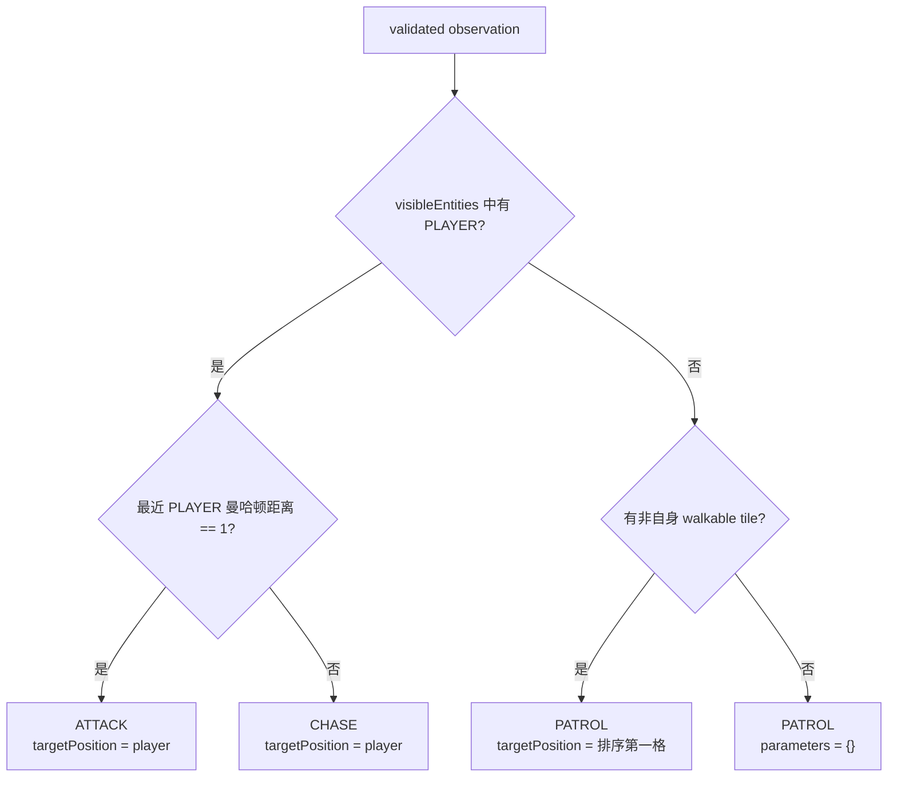

### 8.2 确定性排序

可见玩家按以下 key 排序：

```text
(曼哈顿距离, x, y)
```

巡逻候选：

1. `walkable == true`；
2. 排除自身位置；
3. 按 `(x, y, type)` 排序；
4. 选择第一项。

不使用：

- 随机数；
- `set` 迭代顺序；
- Python object hash；
- wall-clock；
- 连接建立顺序；
- 全局共享计数器。

### 8.3 固定 intent 参数

| skill | confidence | validForTicks | allowLocalReroute |
|-------|------------|---------------|-------------------|
| `ATTACK` | `1.0` | `2` | `false` |
| `CHASE` | `0.9` | `12` | `true` |
| `PATROL` | `0.75` | `20` | `true` |

所有当前 intent 都设置：

```text
engageVisiblePlayer = true
respondToAdjacentThreat = true
```

### 8.4 当前大脑保存什么

每个实例只保存：

```text
_next_message_seq
action_feedback[]
world_events[]
cancelled_decisions[]
```

决策本身只依赖当前 observation。相同 observation 在两个全新 Agent 实例中会产生
完全相同的第一条 response，包括 `runtime-message-0`。

### 8.5 当前限制

当前算法会严格校验 `capabilities.supportedSkills` 中的 skill 名称，但决策分支没有
根据该列表降级；当前确定性大脑按四种 skill 全部可用设计。真实或更通用的大脑必须：

- 只选择 observation 声明且 Java 白名单允许的 skill；
- 在 capability 缺失时给出确定的安全降级；
- 不把 Java 的最终 Validator 当作产生明显非法提案的借口。

当前也没有 `GUARD` 生成规则。`GUARD` 属于协议白名单，但 deterministic brain 不会
主动选择它。

---

## 9. Response 身份与关联

### 9.1 Envelope 身份复制

Python response 从 request 复制：

```text
runId
floorId
agentId
sessionEpoch
logicalTick
```

并生成连接本地：

```text
messageId  = runtime-message-<messageSeq>
messageSeq = 0, 1, 2, ...
```

新 TCP 连接创建新 Agent，因此 response sequence 从 0 重新开始。Java 成功重连后也会
进入新 session epoch，从而隔离旧连接的 message sequence。

### 9.2 决策关联复制

`submit_intent.data` 从 observation 复制：

```text
decisionId
observationSeq
requestGeneration
```

`cancel_ack.data` 从 cancel request 复制：

```text
decisionId
requestGeneration
```

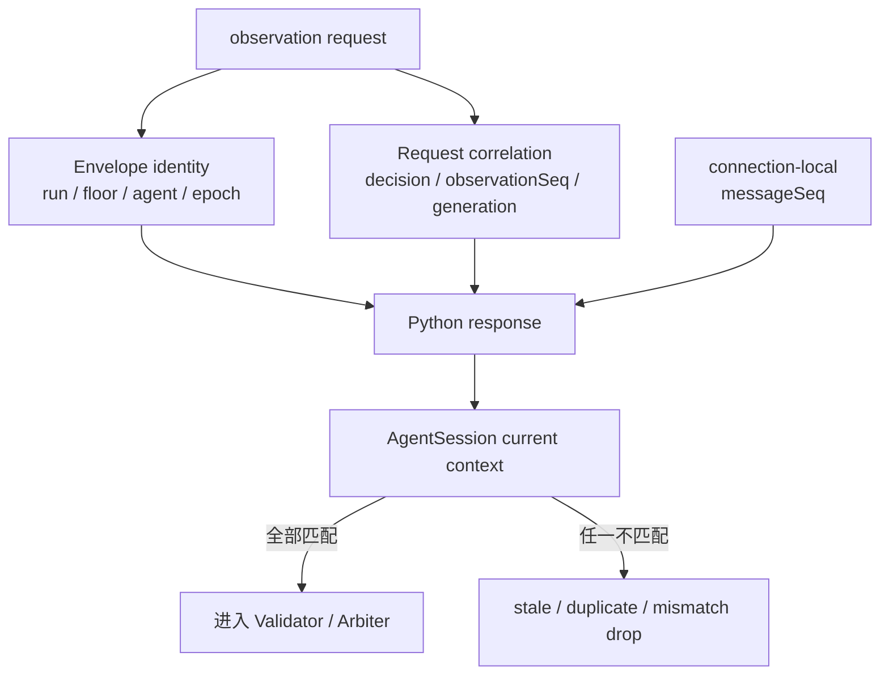

Python 负责复制关联证据，Java 负责与当前事实比较。

复制不是“Python 验证通过后 Java 必须接受”。Java `AgentSession` 仍要比较当前
run/floor/agent/epoch/generation/request/decision/observation，拒绝迟到、重复或旧连接响应。

### 9.3 为什么 Python 不生成新的 decisionId

`decisionId` 代表 Java 发起的一个远程决策请求。Python 只提交该请求的答案；如果
Python自行生成新的 decision id，Java 无法证明 response 属于哪个 in-flight request。

---

## 10. 五种 Runtime 模式

### 10.1 总表

| 模式 | 收到 observation 后 | 表现的运行边界 |
|------|----------------------|----------------|
| `normal` | 立即走 codec → brain → response | 正常协议与确定性决策 |
| `delay` | 可中断地等待，再正常回复 | soft deadline、迟到响应和本地接管 |
| `malformed` | 写出固定非法 JSON 后结束连接 | Java codec 拒绝该连接的消息 |
| `disconnect` | 不回复，直接结束 handler | EOF、generation 失效和重连 |
| `no-read` | 接受连接后完全不读取 | OS buffer、outbound 背压和非阻塞游戏线程 |

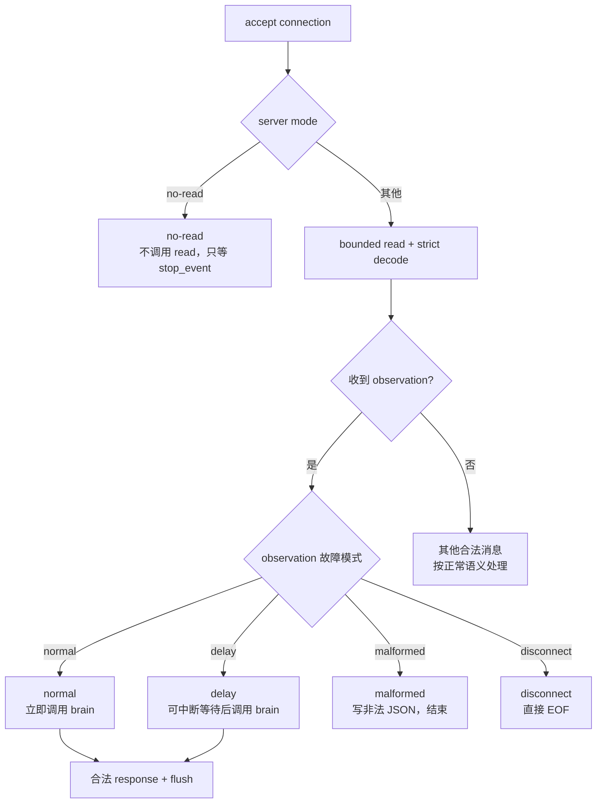

`no-read` 在读取前分支；其他故障模式在成功解码 observation 后分支。

### 10.2 normal

```text
read bounded frame
  → strict decode
  → DeterministicAgent.handle()
  → strict encode
  → write + flush
```

同一连接可以处理多条消息，不是“一次 request 一个 TCP connection”。

### 10.3 delay

使用：

```text
stop_event.wait(delay_seconds)
```

而不是不可中断的 `time.sleep()`。关闭 server 时设置 event，可以提前结束等待。

`delay` 使用现实时间主动推迟响应；Java Session 则使用独立的单调时钟判断 deadline，
两者不能共用状态或互相修改时间。

### 10.4 malformed

固定写出：

```text
{"type": malformed]\n
```

它故意同时破坏 JSON token 和结构，迫使 Java 区分“收到 bytes”和“收到合法 intent”。

### 10.5 disconnect

收到 observation 后直接 return，`StreamRequestHandler` 结束并关闭连接。它不发送
半帧或 protocol error，因此 Java 看到的是纯 EOF/连接丢失。

### 10.6 no-read

handler 接受连接后：

```text
不调用 recv/read/readline
只等待 server.stop_event
```

“收到 bytes 但不解析”不是 no-read，因为 OS receive buffer 仍会被消费。真正停止读取
才能让 Java 写端和队列逐渐感受到背压。

小消息起初仍可能进入 OS buffer；只有持续写入，Java 写端和上层有界队列才会逐步感受到背压。

---

## 11. Framing、吞吐与背压边界

### 11.1 Python 没有第二套无限 mailbox

当前 handler 是顺序循环：读取一条、处理一条、写出 response，然后读取下一条。
它没有在 Python 内为每个连接建立无限 request list。

TCP 和 `rfile` 有缓冲，但应用层读取有明确上限。Java 侧真正负责 gameplay 不阻塞的
有界 outbound/inbound queue 与合并规则。

### 11.2 每条 response 都 flush

当前写出：

```text
wfile.write(encode_frame(response))
wfile.flush()
```

这样短消息不会长时间停在 Python buffer 中，可降低响应延迟并保持清晰的因果顺序。未来若
追求吞吐进行批量 flush，必须重新证明 latency 与关闭语义。

### 11.3 单连接公平性

一个 handler 同时负责该连接的 read 和 write。确定性 brain 每次最多返回一条 response，
所以当前不会出现一个请求生成无限 outbound 流。

真实模型接入后，如果要支持 streaming token，不应直接把 token 当协议消息写给 Java；
Java 需要的是完成且可验证的战略 intent，而不是模型内部生成过程。

### 11.4 多连接隔离不是无限扩展

`ThreadingTCPServer` 为每条连接创建 thread，适合当前少量 Enemy 和确定性 runtime。它不代表
可以无上限接收连接。大规模 Agent 数量出现前，应评估：

- 最大连接数；
- thread 数量；
- 模型并发限制；
- 每连接内存；
- 全局限流和公平性；
- 关闭时的任务取消。

这些资源策略不能通过偷偷让不同 Enemy 共享大脑状态来解决。

---

## 12. 错误处理与可观测性

### 12.1 Handler 错误边界

| 失败位置 | 当前行为 |
|----------|----------|
| frame/schema `ProtocolViolation` | warning 日志，结束当前连接 |
| read/write `OSError` | 静默结束当前连接 |
| direction mismatch | warning 日志，结束当前连接 |
| server 参数非法 | 启动失败，不输出 ready |
| KeyboardInterrupt | 关闭 listener，退出 0 |

协议错误不会调用 brain，brain 产生的 response 也必须再次通过 codec 才能写出。

### 12.2 stdout 与日志

stdout 的稳定机器可读输出是 ready JSON。`logging` 默认写 stderr，用于诊断：

```text
Rejected inbound frame: <reason> - <detail>
Rejected message: <reason> - <detail>
Recorded action_feedback for agentId=<id>
Recorded world_event for agentId=<id>
```

这些日志不是 deterministic canonical trace。线程调度、连接时机和日志顺序可能变化，
不能用它们做 gameplay 相等性证据。

### 12.3 当前缺少的运行证据

生产接线能够沿关联键追踪：

```text
observationSeq
  → decisionId / requestGeneration
  → submit_intent
  → Java validation / adoption
  → actionIndex / outcome
  → action_feedback
```

Python 可记录诊断耗时，但 wall-clock、thread name、socket address 不应混入 Java 的
canonical gameplay evidence。

---

## 13. 与 Game、Enemy、Session 的接线边界

### 13.1 当前 Java 状态

`Game` 已使用正式 AI tick 顺序，也会调用：

```text
Enemy.pollAgentMessages()
Enemy.executeOneAction()
commit / cleanup
Enemy.collectAgentUpdates()
```

`Enemy.pollAgentMessages()` 有界 drain Session 入站并把 proposal 交给 Validator/Arbiter；
`collectAgentUpdates()` 生成 committed observation、补全 ActionOutcome 并异步发送；
`closeAgentRuntime()` terminal close Session，同时清理本地 queue 和 pending action。

因此启用 Bridge 时的生产行为是：

```text
private observation
  → remote proposal / reflex / active lease / local fallback
  → Java planner
  → Java Action
```

### 13.2 当前接线位置

当前实现保持：

```text
poll 阶段
  bounded drain inbound
  validate correlation
  adopt valid remote intent

execute 阶段
  reflex / lease / fallback arbitration
  at most one Action

commit 阶段
  flush entity changes
  remove dead entities

collect 阶段
  complete ActionOutcome from committed world
  compute next private observation
  enqueue observation / feedback / events
```

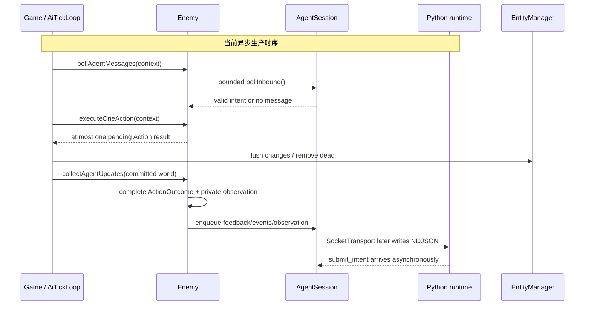

图中的 Python 往返跨 tick 发生，不能把请求和响应压进同一个同步 execute 调用。

Python 不能被调用在 world commit 之前观察“半提交”状态，也不能在 execute 中同步等待。

### 13.3 生命周期所有者

当前生产所有权是：

| 事件 | Java 必须做什么 | Python 看到什么 |
|------|-----------------|-----------------|
| 新游戏 | 新 runId；为每个 Enemy 建立 Session | 新连接、新 epoch、新 observation |
| 读档 | 不恢复旧 Socket；重新冷启动 Session | 新 runId，不接受旧 response |
| 换层 | 先关闭旧楼 Session | 旧连接结束，新楼新连接 |
| Enemy 死亡 | cleanup 边界关闭其 Session | 对应连接结束 |
| 游戏退出 | 有界关闭全部 Session | 客户端连接全部 EOF |

生产 `Main` 不自动结束用户启动的 Python server；只关闭 Java 自己拥有的连接。

---

## 14. 真实模型大脑的扩展路径

### 14.1 不要直接替换 server.py 为模型脚本

稳定分层应继续保持：

```text
protocol.py
  = 语言侧通信契约

server.py
  = 连接、framing、mode、生命周期

brain/
  = 根据 validated observation 产生 intent
```

真实模型实现应进入：

```text
agent/python/dungeonmind_agent/brain/
  deterministic.py
  model_agent.py        # 示例职责名，实际按领域命名
```

### 14.2 需要补出的稳定接口

当前 server 直接写死：

```text
agent = DeterministicAgent()
```

在出现第二种 brain 前，应提取最小接口和 factory，例如概念上的：

```text
Brain.handle(validated_envelope) -> list[validated_envelope]
BrainFactory.create(connection_context) -> Brain
```

接口不应暴露 Socket、handler、Java 对象或完整 world。factory 必须保证每连接创建
独立实例，除非未来明确设计只读共享模型资源与隔离会话状态。

### 14.3 模型大脑额外需要解决

- single in-flight 与取消；
- 推理超时和资源释放；
- 模型输出到 intent DTO 的严格转换；
- prompt 只包含私有 observation；
- API key 和 provider 配置隔离；
- 工具白名单与副作用边界；
- 连接断开后的任务取消；
- restart 后不恢复无效 request；
- 模型并发、速率限制和成本；
- 诊断日志与 canonical evidence 分离。

Java deadline 到期并不自动取消 Python provider 请求；Python 需要利用
`cancel_request` 尽力停止资源消耗，但即使停止失败，Java generation 仍保证旧结果
不能重新获得控制权。

---

## 15. TypeScript 与其他语言实现

### 15.1 平行实现，不是 Python 包装层

未来结构：

```text
agent/typescript/
  src/
    protocol/
    brain/
    server/
  package.json
```

TypeScript runtime 应直接实现相同 NDJSON contract，不启动 Python 子进程，也不通过
HTTP 再包一层 Python server。

### 15.2 必须共享的语义

不同语言必须一致：

- envelope 和 payload 版本；
- exact fields 与 unknown-field rejection；
- int32/int64 范围；
- UTF-8 byte frame limit；
- duplicate key 和非有限数字策略；
- message type、skill、event 白名单；
- identity/correlation 复制规则；
- 每连接隔离；
- 确定性大脑对相同 observation 的决策规则。

### 15.3 不要求共享的实现细节

可以不同：

- Python thread 与 Node event loop；
- DTO 表达方式；
- JSON 库；
- 日志库；
- CLI 参数解析库；
- 模型 provider SDK。

只要 wire 行为和生命周期不变量一致，就不需要逐行翻译 Python 代码。

---

## 16. 安全与信任边界

### 16.1 localhost 不是可信输入

当前 server 默认监听 `127.0.0.1`，没有 TLS、认证或授权。这适合本地开发 runtime，
但不意味着可以放宽 schema。任何本机进程都可能连接端口并发送坏输入。

如果未来允许非 localhost：

- 必须重新设计认证和传输安全；
- 不能只把 `--host` 改成 `0.0.0.0`；
- 必须限制连接数和请求率；
- 错误日志不能泄露敏感 observation；
- API key 不能进入 wire message。

### 16.2 Java 永远不执行远程任意代码

Python 返回的是封闭 DTO：

```text
skill + targetPosition + confidence + TTL + interruptPolicy
```

Java 不应接受：

- 类名；
- 方法名；
- shell 命令；
- Python/JavaScript 表达式；
- 任意工具参数；
- 未注册的 skill；
- 直接世界 patch。

### 16.3 私有观察是最小权限

模型越强，越不能给它完整世界“图方便”。所有语言 runtime 都必须只依据协议明确
提供的 observation；调试模式也不能偷偷附带完整玩家坐标，否则调试环境与正式运行的
知识边界会分叉。

---

## 17. 常见错误实现

### 17.1 把大脑放回 `byog/Bridge`

结果是 Java 会话层依赖 Python/模型概念，其他语言无法平行实现。大脑应位于
`agent/<language>/.../brain`。

### 17.2 全局共享一个 DeterministicAgent

会让不同 Enemy 共享 message sequence、cancel 和 feedback 状态，破坏每连接隔离。

### 17.3 宽松解析 JSON

自动忽略未知字段、把字符串数字转成整数、接受 NaN 或重复 key，会掩盖跨语言 schema
漂移，并把错误推迟到 Java gameplay 层。

### 17.4 先完整 readLine 再检查大小

攻击者可以在换行前发送任意大数据。必须在读取时设置上限。

### 17.5 no-read 模式仍调用 recv

只是不解析并不能制造真实写端背压；必须完全停止读取。

### 17.6 Python 直接返回 Action

这会绕过 Java planner、碰撞和安全规则。Python 只能返回战略 intent。

### 17.7 使用随机或 hash 顺序巡逻

相同 observation 会产生不同结果，运行轨迹也无法稳定复现。候选必须稳定排序。

### 17.8 生产 Main 自动启动固定 Python

会把游戏生命周期绑定到某个语言和环境，也让用户进程和日志所有权混乱。

### 17.9 把诊断日志当 canonical trace

handler thread 和 socket 时序不是稳定 gameplay evidence。关联必须依赖协议身份字段。

### 17.10 为 TypeScript 复用 Python 进程

这只是增加一层代理，不是跨语言实现。TypeScript 应直接实现 contract。

### 17.11 在源码命名中写开发阶段编号

类、方法、变量、日志和配置必须表达长期领域职责。开发路线图编号不得进入
runtime 源码；历史 wire version 只能作为兼容常量保留。

---

## 18. 长期不变量

1. Java 是世界状态与动作合法性的唯一权威。
2. 外部 Agent 只读取私有 observation，不读取完整 world 或实时 Java 对象。
3. 外部 Agent 只提出白名单战略 intent，不提交任意代码或直接 Action。
4. 每条 TCP 连接拥有独立的 Agent 状态与 outbound message sequence。
5. 所有入站和出站 envelope 都经过严格 codec。
6. Frame 在 JSON 解析前按 UTF-8 bytes 有界。
7. 相同 observation 在确定性 brain 中产生相同 intent。
8. Response 必须复制完整身份和 request correlation 字段。
9. Python 接受 response 不代表 Java 必须采纳；Java Session 仍拒绝 stale 数据。
10. 一个连接的延迟或错误不得阻塞其他连接或 Java game thread。
11. Server 只有 bind 成功后才输出 ready。
12. 关闭必须唤醒 `delay` 和 `no-read` 等待路径。
13. 故障模式只用于诊断异常边界，不得改变 normal 的协议语义。
14. 语言实现可以不同，wire contract 和不变量必须相同。
15. 生产 `Main` 不偷偷拥有用户手工启动的外部 runtime 进程。
16. 模型日志和 wall-clock 指标不进入 deterministic gameplay evidence。

---

## 19. 故障定位

### 19.1 进程没有 ready

检查：

1. CLI 参数是否合法；
2. host 是否可 bind；
3. port 是否被占用；
4. Python import 是否从项目根目录启动；
5. stderr 是否有启动异常。

没有 ready 时，启动它的程序或操作者不应继续尝试发送 observation。

### 19.2 已 ready，但 Java 连不上

检查：

- Java 与 Python host/port 是否一致；
- Python 是否只监听 IPv4，而 Java 使用了其他地址；
- server 是否已经被其他进程关闭；
- 防火墙或本机安全软件是否阻止 localhost；
- Java reconnect backoff 是否仍在等待。

### 19.3 Python 收到连接但没有 intent

检查日志中的 `ProtocolViolation`：

- frame 是否以 `\n` 结束；
- schemaVersion 是否匹配；
- type 是否为小写协议值；
- data 是否有未知或缺失字段；
- int 字段是否错误编码为 string/bool；
- observationVersion 是否匹配；
- frame 是否超过 byte 上限。

### 19.4 Python 已写 response，但 Java 丢弃

优先比较：

```text
runId
floorId
agentId
sessionEpoch
messageSeq
decisionId
observationSeq
requestGeneration
```

Java 丢弃 stale response 通常是正确行为，不要通过放宽身份校验“修复”。

### 19.5 malformed 没触发协议错误

确认启动参数确实是 `--mode malformed`，并且客户端发送的是 `observation`。该模式只在
收到 observation 后写坏帧。

### 19.6 no-read 没有立刻产生背压

小消息可能仍能进入 OS send buffer（操作系统发送缓冲区）。no-read 首先表现为
server 不消费 bytes、也不返回响应；只有持续有界发送，Java queue 才会逐步饱和。

### 19.7 server 关闭后还有 handler

检查：

- 是否先设置 `stop_event`；
- `stop_server()` 是否从 serving thread 之外调用；
- 启动方是否等待自己创建的 server thread 结束；
- 子进程所有者是否在清理路径中 terminate/kill；
- 新 brain 是否有不响应取消的非 daemon worker。

---

## 20. 最短代码阅读顺序

第一次阅读建议按以下顺序：

1. [`agent/python/README.md`](agent/python/README.md)：启动、模式和目录概览。
2. [`agent/python/run.py`](agent/python/run.py)：稳定 CLI 入口。
3. [`agent/python/dungeonmind_agent/server.py`](agent/python/dungeonmind_agent/server.py)：连接、模式、framing 和生命周期。
4. [`agent/python/dungeonmind_agent/protocol.py`](agent/python/dungeonmind_agent/protocol.py)：严格 codec 和全部 payload。
5. [`agent/python/dungeonmind_agent/brain/deterministic.py`](agent/python/dungeonmind_agent/brain/deterministic.py)：确定性决策与连接本地状态。
6. [`session.md`](session.md) 与 [`socket.md`](socket.md)：回到 Java 会话和 transport 边界。
7. [`byog/Entity/Enemy.java`](byog/Entity/Enemy.java)：确认 poll/collect/close 的生产 Session 接线。

只想定位一种问题时：

| 问题 | 先读 |
|------|------|
| Python 为什么拒绝 frame | `protocol.py` 的 `decode_frame()` 与字段校验函数 |
| 为什么选择 ATTACK/CHASE/PATROL | `deterministic.py` 的 `handle()` 与目标排序逻辑 |
| 为什么没有 ready | `run.py`、`server.main()` |
| 为什么一条连接影响另一条 | `AgentRequestHandler.handle()` 与每连接 `DeterministicAgent` 的创建位置 |
| 为什么 Java 丢弃 response | `session.md` 的身份校验章节 |
| 为什么 no-read 没立即阻塞 | 本文 §10.6、`socket.md` 的背压章节 |
| 未来模型大脑放哪里 | 本文 §14 |
| TypeScript 如何接入 | 本文 §15、`agent/typescript/README.md` |
