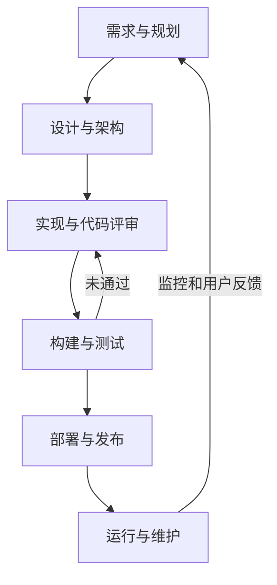

# 用 AI 做游戏 AI，写到后面代码看不过来了

> 一个地牢游戏 AI 项目的 Vibe Coding 工程化实践与代价

最近我整理这个项目的文档，移动、分类了 40 份文件，又检查了正式文档范围内的 59 个 Markdown。目录清楚了，
哪些文档仍然有效、哪些只属于历史，也终于有了说法。

整理完我才发现，最麻烦的问题还在：我还是看不过来。

这个项目最初是 Berkeley CS61B 18 spring 的 Project 2，一个用 Java 写的二维肉鸽地牢游戏。最早一段是我自己
手写的。后来我开始用 Trae 接 DeepSeek API，接着完成输入处理、存档、敌人、战斗、多楼层，以及传统的游戏 AI。
这一时期生成的代码，我仍然能够逐行阅读，编程过程依旧是面向函数、对象等等代码块的，一切尽在掌控。


*这是项目后来的运行画面：玩家 `@` 在左下角，敌人 `E` 分布在房间和走廊里。顶部显示楼层、生命值和剩余敌人数。
红色区域是敌人视野的调试显示，后面会讲到它为什么重要。*

然后卡住我的并不是 AI 写得太快、我 review 不过来。而是下一步该怎么设计：怎样让传统规则敌人接入 LLM，让其真正具备可玩性。

能参考的现成路线也很少。游戏 AI 本就是小众细分赛道，用大模型的 API 接入游戏更是不成熟甚至鲁莽的路线。所以成熟的项目资料很少很少，基本没有。

我手上有一份早期构建指南。前面的章节确实能带着项目往前走，我也照着一步步做。到了感知层，它开始失灵。文档还在
给方向，内容却越来越空；代码也在增加，却很难说清楚它最终要服务什么玩法。模型还能生成局部实现，但已经组织
不起整个问题。

我后来换用了 Codex，并通过 Grilling skill 和 GPT-5.6-sol 重新讨论这个项目。这一次，最先出现的不是更多代码，
而是一整套由海量文字构成的文档。

## 先让 Agent 知道自己在做什么

长期项目很难只靠对话推进。一次聊天可以解决一个方法、一处报错，甚至一个功能，但它很难稳定保存项目为什么存在、
哪些边界不能破坏、当前阶段明确不做什么。对话越长，旧决定越容易被新的局部需求盖过去。

项目后来形成了一条文档链：

```text
Intent
→ Roadmap
→ Phase Spec
→ Build Guide
→ Implementation
→ Completion
```

Intent 先回答我为什么还要继续做这个已经超出课程要求的项目：我想借一个真实、可玩的游戏 AI 系统学习现代
Agent 工程。一次 LLM API 调用显然不够，所以文档才继续要求敌人在有限信息下感知和推理，通过游戏引擎行动，
再根据结果调整。可这些技术也不是目的，最后仍要看它们有没有让游戏更有趣。

Roadmap 把这个目标拆成阶段。先建立可以重复运行的基线，再限制敌人的感知，然后处理跨进程通信、模型延迟、状态、
执行反馈，最后才谈多个敌人之间的通信。它最有用的地方是阻止项目同时建设所有看起来有关的东西。

Spec (specification，规格说明书) 只管当前阶段。它写清要实现的行为、不能破坏的规则和验收条件。Build Guide 再把这些要求翻译成施工顺序，
告诉 Agent 先动哪里，每一步保留什么，在哪个节点停下来验证。Completion 则记录实际执行过的命令、测试结果和
尚未完成的人工检查。计划中的验证不能提前写成已经完成。

这套流程不是预先设计好的，是项目卡住以后一点点补出来的，也没必要让所有 Vibe Coding 项目照搬。小改动写五份
文档，只会让事情变慢。这个项目横跨游戏循环、Java 与 Python 两个运行时，还要处理异步模型调用和多敌人状态，
才需要把约束放到聊天之外。

把它和常见的软件开发流程放在一起看，大致是下面这样：



*这张图综合了 AWS (Amazon Web Services) 对 SDLC (Software Development Life Cycle) 阶段的划分和 Microsoft 的 DevOps (Development + Operations) 生命周期。箭头只表示主线；实际开发中，编码、评审和测试经常同时进行。*

套进上面的工业流程，这条文档链可以逐项对应：

- Intent 对应产品目标和问题定义：为什么做，什么结果才有价值。
- Roadmap 对应路线图和 Backlog：先做什么，后做什么。
- Phase Spec 对应当前阶段的需求、技术设计和验收条件。
- Build Guide 对应实施计划和任务拆分：代码从哪里改，按什么顺序推进。
- Implementation 对应编码、代码评审和集成。
- Completion 对应 Definition of Done、测试结果和阶段验收记录。

区别主要在 Build Guide 和 Completion。普通团队可以靠会议、工单和经验补足上下文；Agent 接手后，这些信息需要
写得更细，还要留下能复查的完成证据。

结果很直接：原先说不清楚的 LLM AI 被拆成了有顺序、有边界、可以测试的工程阶段，项目又能往前走了。

## 怎么写”大模型”游戏 AI？

文档链有没有用，最后还是要看它怎样改变代码。

把 LLM 接进游戏时，最省事的做法是把整张地图和玩家坐标都交给它。这样生成的敌人会一直知道玩家在哪里，哪怕中间隔着几堵墙。它也许追得很准，但这种“聪明”来自游戏引擎提前泄露的信息。

我想要的敌人应该受到和游戏角色一致的限制：看不见墙后的玩家，只能根据当前视野和已经获得的信息决定下一步。

开头截图里的红色区域，就是把敌人的视野画出来供人检查。沿着房间和走廊看，就能观察视野覆盖到了哪里、在哪里被墙
挡住。这让“敌人能看见什么”有了直观的检查入口。不过，画面显示正确还不够，传给模型的数据也必须遵守同样的限制。

要让 Agent 实现这个玩法，它还需要更具体的规则：每个敌人只能收到自己的 Observation；
墙后的玩家不能出现在这份 Observation 中；不同敌人的视野不能混在一起；外部模型只能提出意图，不能直接修改
游戏世界。

最后我把边界定在这里：Java 保留世界状态和动作合法性的最终决定权。Python Agent 收到经过裁剪的私有感知，
返回战略意图或一个有界计划。移动、碰撞、攻击是否成立，仍由 Java 检查和提交。跨语言 contract、固定场景和
测试负责确认这些限制没有只停留在文档里。

这条链路让我第一次比较清楚地看到，面向 Agent 的文档不只是“把需求写详细一点”。它把一句产品判断逐层压实为
系统不变量、模块权限和可执行的测试。Agent 可以在这些边界内自行展开实现，而不需要我决定每个类和方法。

其他设计也沿用了类似方法。模型响应比游戏 tick 慢，游戏不能站在原地等，于是高层决策和本地反射被拆开。模型
回复可能到达得太晚，于是请求需要携带世界、楼层、敌人和观察序号，过期结果直接丢弃。通俗点讲就是游戏 AI 具有了两个速度的大脑。

接入真实的外部 LLM 服务后，我设计下面这段运行日志。只看游戏画面，很难分辨敌人这一步是在执行本地规则，还是
采用了远程模型的决定。日志把这层区别显示了出来。


*阅读时可以先跟着同一个敌人 `enemy-2` 看，忽略穿插其中的其他敌人日志。当然不阅读也可以，注意有 "[AI]" 代表的是接入大模型的慢脑就行。*

- `t=994`（t 是游戏 tick），`REQUEST sent`：发出一次观察请求。
- `t=997`，`REMOTE intent=GUARD`：游戏侧采用了远程慢脑的”守卫“意图。
- `t=998`，`STEP SUCCEEDED skill=GUARD`：守卫计划中的一个步骤执行成功。

日志会同时输出多个敌人的状态，因此中间穿插的 `enemy-1` 和 `enemy-6` 并不属于这次远程决策。这个日志同时记录了快脑和慢脑的事实，后期可能会设计一个多层的日志结构。

这段记录说明真实模型返回的意图已经进入了游戏执行流程。它还不能回答敌人是否更有趣，也不代表整个阶段通过了
正式验收。游戏画面让我检查看得见的行为，日志让我追踪背后的决策；即使两边都有明显的成果，要解释完整架构仍然很费劲。

## 每个设计都有理由，项目还是变得难以理解

强模型很擅长发现问题。一个异步 Agent 可能遇到超时、重连、旧回复、队列拥塞、重复消息、状态串线和执行失败。
这些都不是凭空想象出来的风险。只要继续追问，几乎每个风险都能导出新的标识、协议字段、恢复路径、测试和说明文档。

局部上，它们可以全部正确。放在一起，人就未必还看得过来。

麻烦一半来自系统本身。跨进程通信、私有感知和异步执行，确实比一个直接读取坐标的规则 AI 难。另一半来自描述
系统的信息：Intent、Roadmap、每阶段 Spec、Build Guide、Completion、专题设计、评审记录和交接笔记。系统的
复杂度有时躲不开，描述它的材料却会反过来决定人还能不能理解它。

我试过用 Mermaid 画架构图。它确实有用。下面这张图，我费劲把它理解透了。问题在于，
它只解释了完整架构的一部分。要把整个系统串起来，我还需要继续阅读很多张同样复杂的图，每一张都要重新辨认节点、
边界和运行顺序。单张图可以理解，累计起来仍然超过了我的阅读能力。

更麻烦的是，模型知道系统里有什么，却不知道我不知道什么。它可以不断补充准确的结构图，却未必知道我下一步缺的
是哪一层解释，也很难替我安排一条最短的理解路径。


*用来理解双速大脑架构的 Mermaid 图。*

再往后，我基本上直接信任 Codex 的判断。

这句话听起来不太像一篇工程实践文章里应该主动承认的事，但事实如此。Completion 会记录测试，协议有 contract，
不同阶段也有验收条件。这些证据让我敢让项目继续推进，却不表示我逐项读过了全部设计，更不表示我能随时从头解释
所有运行链路。

到现在，我还找不到一次可以明确归因于这种信任的工程事故，不能说直接信任 Codex 已经让项目失败了。我能确定的
只有一件事：自己控制项目的方式变了。以前主要靠阅读代码形成判断，后来更多依靠文档层级、自动化测试和 Agent
对结果的说明。

这是不是更高级的工程管理？有一部分是。它是不是也可能让理解变空？我还不能确定。

## 新的工作流形成了，但逐渐和我没啥关系了

这套工作流确实把项目救了回来。Codex 会先拆问题、写方案，再按阶段实现和验证，原先做不下去的 LLM AI 也开始
一点点落地。可它已经功高盖主了，而我是无能的傀儡皇帝。很多时候，问题已经被分析完，代码已经写好，测试也已经
跑过，我最后看到的是一份等我确认的结果。

这种感觉在整理文档时尤其明显。根目录里有 Spec、Build Guide、Completion、旧设计和专题说明，每份都写得很认真，彼此之间还有完整的引用关系。我知道它们不是废话，却已经记不清每份文档在项目里处于什么位置。有时为了开始阅读，我得先让 Codex 告诉我应该读哪一份。

我把已经结束的阶段移进 `documents/`，把仍在指导开发的材料留在根目录。整理之后，哪些文档还算数终于清楚了，
那种疏离感却没有消失。比如 Codex 改了一段敌人决策逻辑，Completion 可以告诉我测试通过，架构图也能解释它怎么
运行；可要判断这套设计为什么合理，我仍得重新翻 Spec、代码、测试和时序图。工作流留下了完整的过程，我并没有
因此自动跟上它。

吴恩达谈 Agentic Coding 的文章提到：理解软件工程基础的一项作用，是让开发者知道系统里有哪些取舍，进而
引导 Agent 作出选择。这和我在项目里遇到的问题不谋而合。如果我连某项取舍的存在都不知道，文档写得再完整，我
也不知道该检查什么。

https://zhuanlan.zhihu.com/p/2077401603150181695

对 Agent 来说，这些文档很好用。它们保存了聊天容不下的背景，下一阶段可以继续读取。轮到我审查时，同一批文档却
成了新的阅读量。单看一份 Spec 或一张 Mermaid，我通常还能理解；想把它们拼成完整的系统，时间就远远不够了。

另一篇讨论 AI 写屎山代码的文章，作者把这种落差叫作“理解债务”。这个词很像我当时的状态：系统能跑，测试也过了，但我已经没法在脑子里拼出它的完整结构。省下来的编码时间没有消失，其中一部分挪到了阅读、重建上下文和验证上，只是这笔账来得晚一些。

https://www.zhihu.com/question/2029155102292735529/answer/2073770486539014714

我现在还举不出一个由此造成的具体事故。真正发生的是，我越来越依赖 Codex 解释它自己的设计。等到需要独立排查
问题，或者换一个 Agent 接手，我还得把欠下的上下文重新补回来。

这次整理给 Agent 留下了清楚的施工路径，给人的审查路径却还不够。针对一个功能，我需要一条更短的入口：先读哪几处
代码，确认哪些规则，再看哪些测试和运行结果，到哪里就足以作出判断。接下来要控制的也不只是文档数量，而是每次
新增设计会让我多背多少理解成本。

## 复杂度也需要预算

到了 Phase 3，我给 Codex 全面启用了 Ponytail，并允许它自动触发。原因很简单：Codex 已经很会往系统里加东西了，我需要它少加一点。

https://github.com/DietrichGebert/ponytail


Ponytail 的第一条原则是 YAGNI，也就是 You Aren't Gonna Need It：不要为了猜测中的未来需求，提前把代码和结构造出来。需求确定以后，也别马上写新代码。先看项目里有没有现成实现，再看标准库、运行平台和已经引入的依赖能不能解决；都不行，才补最小的新代码。

这不是代码越少越好。理解现有代码不能省，安全校验和防止数据丢失的错误处理也不能省。Martin Fowler 对 YAGNI 的解释里还有一个重要前提：代码要容易修改。测试和重构让代码保持可修改，并不违反 YAGNI。[Yagni](https://martinfowler.com/bliki/Yagni.html)

这些规则确实进入了我的工作流。Codex 会在开始任务时说明它正在使用 Ponytail，也会明确写出“优先现有架构里的最短可行路径”“不额外引入依赖或抽象”。YAGNI、优先复用和优先平台能力，我都见它触发过。至于它到底替我少写了多少代码，我没有做关闭 Ponytail 的对照实验，算不出来。

可项目并没有因此变得简单。Ponytail 约束的是一次次新增：这一层要不要加，这个轮子要不要重造，这项能力能不能直接复用。每一步都更克制，最后仍然可能得到一个很复杂的系统。项目目标越多，需要同时成立的规则越多，必要的复杂度也会累积起来。

这类约束能减少每次改动带来的额外负担，却不能保证整个项目简单。Agent 可以少造一层、少引入一个依赖，但哪些复杂度值得保留，最后仍要有人判断。否则局部实现再精简，项目也可能逐渐长成一个只有 Agent 说得清的系统。

## 人的职责上移了，然后呢

这项判断在团队里通常由多个岗位共同承担。在个人项目里，它们全落到了一个人身上：

| 角色 | 在这个项目中的体现 |
|---|---|
| 产品负责人 | 决定项目要做成什么样，以及敌人应该给玩家带来怎样的玩法和体验 |
| 项目经理 | 把工作拆成阶段，安排先后顺序，控制项目不要越做越大，并确认每个阶段是否完成 |
| 技术负责人 | 决定系统怎么拆分、各部分怎样配合，以及游戏状态最终由谁说了算 |
| 开发者 | 编写和检查代码，运行测试，修复问题 |
| 验收者 | 通过自动测试、实际试玩和接入真实模型，确认游戏能正常运行，敌人的行为符合预期 |

表里列的是我承担的职责，不表示每项工作都经过了同等深度的人工审查。后期大量设计和验证材料已经超过我的阅读
带宽。

Vibe Coding 并没有简单地减少我的工作。我的确不再把主要时间花在逐行实现上，职责转向目标、约束、取舍和验收。
但职责移动了，能力不会自动跟上。

如果我能定义不变量、预测系统行为、检查原始结果，并在 Agent 方案不合适时提出另一条路，那么这种变化可以理解为
工作层次上移。如果我只是批准 Codex 给出的选项，再接受 Codex 对测试和架构的解释，所谓“负责人”就可能只剩下
最终确认按钮。

这个项目还没有给我一个干净的答案。它已经说明，更强的模型和更完整的工作流，能够把个人原本设计不下去的
项目继续向前推。它也让我背上了一笔很具体的认知债：项目还在增长，我对它的理解没有以同样速度增长。

现在我能确定的是，Coding Agent 需要的不只是更好的 prompt。长期项目需要可执行的目标、边界和完成证据。至于
怎样让这些约束保持在人的阅读和判断范围内，AI Agent高度参与开发也就近一年的事，行业持续发展，怎样真正借助 AI 提高效率，未可知也。

项目没有开发完，可继续关注。

## 参考资料

- [AWS: What is SDLC?](https://aws.amazon.com/what-is/sdlc/)：需求、设计、实现、测试、部署与维护。
- [Microsoft Learn: What is DevOps?](https://learn.microsoft.com/en-us/devops/what-is-devops)：规划、开发、交付、运行，以及贯穿其中的评审、自动化验证和反馈。
- [Martin Fowler: Yagni](https://martinfowler.com/bliki/Yagni.html)：YAGNI 的含义，以及它与重构、测试和增量设计的关系。
