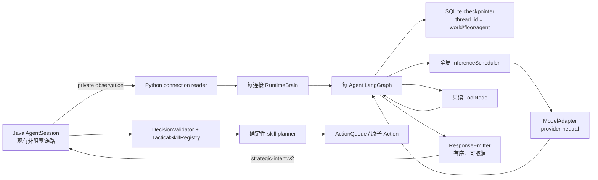

# Phase 3 Spec：单敌人有状态 Agent Runtime

## 0. 元数据

- **Phase**：3
- **状态**：Approved（具体模型服务接入延后）
- **作者与审查者**：Codex 起草；Builder 于 2026-08-13 批准实施并裁决 provider 延后配置
- **创建日期**：2026-08-02
- **基线分支**：`result`
- **基线 HEAD**：`e6befe6`（Phase 2.5 玩家输入节奏与巡视恢复已提交）
- **工作树状态**：从干净的 `e6befe6` 创建 `result`；运行生成物已排除
- **前一阶段 Completion**：`PHASE_2DOT5_COMPLETION.md`
- **适用产品基准**：[PROJECT_INTENT_zh-CN.md](../../../PROJECT_INTENT_zh-CN.md)、[DEVELOPMENT_ROADMAP.md](../../../DEVELOPMENT_ROADMAP.md)、[AI_TICK_ARCHITECTURE.md](../../../AI_TICK_ARCHITECTURE.md)
- **配套实现指南**：[PHASE_3_BUILD_GUIDE.md](PHASE_3_BUILD_GUIDE.md)

本文是已批准的实现契约，不描述已经完成的 Phase 3 能力。Builder 明确要求具体 API/provider
由其后续配置；本阶段实现 provider-neutral 接口、scripted model 与全部确定性边界，不引入
任何具体 provider SDK，也不把未执行的真实 provider smoke 写成完成证据。

### 0.1 批准前置条件

1. Builder 接受本文 6.1 节的锁定决定，尤其是 provider-neutral `ModelAdapter`、
   `strategic-intent.v2` 硬切和 Python SQLite checkpoint；具体 provider/API 配置延后。
2. [PHASE_2DOT5_SPEC.md](../phase-2.5/PHASE_2DOT5_SPEC.md) 与
   [PHASE_2DOT5_BUILD_GUIDE.md](../phase-2.5/PHASE_2DOT5_BUILD_GUIDE.md) 已全部实现并验收，且
   `PHASE_2DOT5_COMPLETION.md` 已记录通过证据。缺少该 Completion 时不得开始 Phase 3。
3. Phase 3 开工前记录 Phase 2.5 的最终 commit；若工作树仍有未提交改动，先明确变更归属和审计基线，
   不沿用本文创建时的 `bbd5dae...` 作为完成声明。

## 1. 必读输入与审计范围

### 1.1 已完整读取的基准文档

- [PROJECT_INTENT_zh-CN.md](../../../PROJECT_INTENT_zh-CN.md)：独立 Agent、有限知识、工具调用、
  checkpoint、异步运行与玩法目标。
- [DEVELOPMENT_ROADMAP.md](../../../DEVELOPMENT_ROADMAP.md)：文档优先级、INV-01–INV-09、
  Phase 3 边界和 Phase 4 交接。
- [AI_TICK_ARCHITECTURE.md](../../../AI_TICK_ARCHITECTURE.md)：当前 `poll → execute → commit → collect`
  骨架、Session 接线、时效与 Java 权威边界。
- [PHASE_2_COMPLETION.md](../phase-2/PHASE_2_COMPLETION.md)：真实交付、测试证据、已知限制和 Phase 3 首要入口。
- [PHASE_2DOT5_SPEC.md](../phase-2.5/PHASE_2DOT5_SPEC.md)：命名世界、玩家跨层状态、血包、敌人朝向/
  `maxHp`、半菱形 FOV、确定性巡视、Observation v2 与 trace 基线。
- [PHASE_2DOT5_BUILD_GUIDE.md](../phase-2.5/PHASE_2DOT5_BUILD_GUIDE.md)：Phase 3 开工前的实现顺序与验收门禁。
- `PHASE_2DOT5_COMPLETION.md`：Phase 2.5 实现后补充；Phase 3 开工时必须完整读取。
- [PHASE_SPEC_TEMPLATE.md](../../../PHASE_SPEC_TEMPLATE.md)：本 Spec 的强制章节与测试架构要求。

### 1.2 本文创建时审计的实现

下表记录 Phase 2 结束时的代码事实，只用于解释 Phase 3 的演进起点，不是 Phase 3 开工基线。
Phase 2.5 Completion 必须用实际实现替换这些旧事实。

| 范围 | 审计入口 | 与本阶段相关的事实 |
|------|----------|--------------------|
| Python wire contract | `agent/python/dungeonmind_agent/protocol.py` | 严格 NDJSON；只接受 `strategic-intent.v1` 与四个固定 skill |
| Python server | `agent/python/dungeonmind_agent/server.py` | 每连接创建一个 `DeterministicAgent`；handler 内同步处理 observation |
| Python fake brain | `agent/python/dungeonmind_agent/brain/deterministic.py` | 按私有 observation 产生硬编码 intent；只保存 feedback/event 列表 |
| Java wire contract | `byog/Bridge/AgentProtocol.java`、`AgentProtocolCodec.java` | Envelope、身份、载荷和严格 codec 已稳定；`Skill` 仍是 enum |
| Session | `byog/Bridge/AgentSession.java`、`SocketTransport.java` | 单 in-flight、有界队列、deadline、cancel、重连和关闭已实现 |
| 语义校验 | `byog/AI/DecisionValidator.java` | 身份、知识、当前前提和可达性校验已实现，但 skill 分支硬编码 |
| 意图与规划 | `StrategicIntent.java`、`ClassicalPlanner.java` | 内部意图只有固定字段；规划器按 enum 分支，尚无技能注册 seam |
| 控制权 | `IntentArbiter.java`、`IntentLease.java` | 远程 proposal 只有校验后才成为 Lease；反射和 fallback 已稳定 |
| 生产接线 | `byog/Entity/Enemy.java`、`AiTickLoop.java` | Session 已接入 poll/collect/close；游戏线程不直接等待 Python |
| Trace | `byog/Trace/AgentTrace.java` | 旧 `agent.trace.v1` 可关联请求、意图、动作、反馈和 fallback；Phase 2.5 会把它硬切为领域版本 |

### 1.3 Phase 3 开工时必须成立的 Phase 2.5 基线

- Envelope 为 `agent-session.v1`，并携带稳定 `worldId`；每次运行仍生成新的 `runId`。
- 私有观察为 `private-observation.v2`，self 至少包含位置、`hp`、`maxHp`、正式朝向，
  data 包含 `visionMode`；默认视野是朝向一侧的半菱形，苹果仍不进入 Agent observation。
- 命名世界用不透明 `worldId` 标识；覆盖同名世界会创建新 `worldId`，不会继承旧世界记忆。
- 当前楼层的敌人 `hp/maxHp`、朝向、FOV 模式与巡视状态均可精确存取；换层创建新敌人。
- Java gameplay trace 基线为 `agent-runtime.trace.v2`；旧决策和私有感知基线已分别改为
  `legacy-decision.trace.v1` 与 `private-perception.trace.v1`。
- Phase 2.5 仍使用 `strategic-intent.v1` 语义；Phase 3 必须一次性把 deterministic 与 model brain、
  Java/Python codec、fixtures 和 contract tests 全部切到 `strategic-intent.v2`。

### 1.4 已审计的测试与运行入口

- Java deterministic gate：`byog.Test.Phase2TestSuite`，100 tests；这是现有历史入口，
  新增测试与 Suite 不再使用开发阶段编号命名。
- Java 真实进程 integration：`byog.Test.AgentRuntimeIntegrationTest`，7 tests。
- Python：`python -m unittest discover -s agent/python/tests -v`，23 tests。
- Python runtime 模式：normal、delay、malformed、disconnect、no-read。
- Phase 2 Completion 记录的 Java/Python 验收均通过；Phase 3 开工时以 Phase 2.5 Completion 中记录的
  领域命名测试套件、跨语言 fixtures 和命令为准。本次只修改文档，不重复编译或运行测试。

### 1.5 当前工具链与官方依赖事实

本地审计时间为 2026-08-02：

- Python：3.14.6。
- pip：26.1.2；提供实验性的 `pip lock`，输出标准 `pylock.toml`。
- `uv`：当前机器未安装，因此本阶段不把它设为必要工具。
- 仓库当前没有 `pyproject.toml`、requirements 或 lock file。

本阶段查阅的易变化官方资料：

- [LangGraph 安装](https://docs.langchain.com/oss/python/langgraph/install)：Python 3.10+。
- [LangGraph persistence](https://docs.langchain.com/oss/python/langgraph/persistence)：checkpointer 通过
  `thread_id` 隔离线程状态。
- [LangChain Tools / ToolNode](https://docs.langchain.com/oss/python/langchain/tools)：
  `ToolNode`、`tools_condition` 和运行时 state 注入。
- [LangGraph SQLite checkpointer](https://reference.langchain.com/python/langgraph.checkpoint.sqlite/SqliteSaver)：
  SQLite saver 适合本地、小规模同步工作流，并提供内部锁。
- [PyPI: langgraph](https://pypi.org/project/langgraph/)、
  [langchain](https://pypi.org/project/langchain/)、
  [langgraph-checkpoint-sqlite](https://pypi.org/project/langgraph-checkpoint-sqlite/)、
  [pydantic](https://pypi.org/project/pydantic/)：用于记录本 Spec 创建时的稳定版本。
- [Python `pylock.toml` 规范](https://packaging.python.org/en/latest/specifications/pylock-toml/)
  与 [pip lock](https://pip.pypa.io/en/stable/cli/pip_lock/)。

版本事实只用于建立可重建基线。后续升级必须更新 lock、运行契约测试并记录实际版本，
不能把 `latest` 当作可复现依赖。

### 1.6 已发现的文档冲突

1. Roadmap 已加入 Phase 2.5 门禁；本文以 Phase 2.5 Completion 为唯一 Phase 3 开工证明，
   不再把 Phase 2 Completion 直接视为充分条件。
2. `AI_TICK_ARCHITECTURE.md` 3.1 和 3.5 的个别旧句仍称 `pollAgentMessages()` 为空操作；
   同文 4.6、5 节、当前 `Enemy.java` 和 Completion 均证明生产 Session 已接线。
3. 旧 `phase2.session.v1` 会在 Phase 2.5 被 `agent-session.v1` 硬切替换；Phase 3 不再保留、读取或
   生成该历史开发阶段编号值，也不提供双读迁移期。

## 2. 阶段目标与成功定义

本阶段结束后，显式启用 model brain 的单个 Enemy 能在独立 Python runtime 中加载自己的
checkpoint，通过脚本化 adapter 执行至少一次“模型接口 → 只读工具 → 模型接口 → 结构化意图”的条件循环，
再把 `strategic-intent.v2` proposal 交给现有 Java Session。Java 通过技能注册表、知识边界和
当前世界前提二次校验，把已支持 skill 确定性地规划为原子 Action；未知、非法、过期或不可达
proposal 无副作用地拒绝。多个 Enemy 可共享模型服务和全局调度器，但 checkpoint、消息、
工具 state 和 prompt 不串线；模型慢、失败、排队或超预算时，游戏线程继续使用现有 Lease、
反射或 `RuleBasedBrain`。

成功不等于“Python 能调用一次 API”。必须同时证明：

1. graph state 跨两次同 Agent 决策、进程重启和同一世界同层读档保持，跨 world/floor/Agent 隔离；
2. 至少一个验收请求真实经过非终止工具后再产生 proposal；
3. proposal 经 Python schema 与 Java 权威校验两层检查；
4. 受支持 skill 通过统一执行 seam 落为 Action，拒绝路径不改变 Lease/queue/entity；
5. 遭遇级并发、排队、调用和 token 预算可测且有界；
6. 模型、工具、延迟、token、validation 和 fallback 可按身份与 decisionId 关联查看。

## 3. 起始事实

### 3.1 已确认事实

| ID | 事实 | 证据 |
|----|------|------|
| F3-01 | Envelope 和 Session 身份已稳定，Java 每 Enemy 最多一个有效请求 | `AgentProtocol.java:16-20, 61-75`；`AgentSession.java`；Completion 7、11 节 |
| F3-02 | Python codec 是严格 schema，不允许额外字段或未知 skill | `protocol.py:11-31, 253-308` |
| F3-03 | Python server 在收到 observation 后同步调用 brain | `server.py:57-123` |
| F3-04 | 同步 handler 等待模型时无法读取同连接上的 `cancel_request` | 由 `server.py:62-123` 的单循环调用顺序直接推出 |
| F3-05 | 当前 brain 每连接隔离，但不使用模型、graph 或 checkpoint | `deterministic.py:16-49`；Completion 9、11.2 节 |
| F3-06 | Java 远程 intent 先过身份和语义校验，再安装 Lease | `DecisionValidator.java:93-237`；`IntentArbiter.java:110-136` |
| F3-07 | Java skill、参数和规划分支仍硬编码 | `AgentProtocol.java:37-43, 175-219`；`DecisionValidator.java:201-235`；`ClassicalPlanner.java:41-108` |
| F3-08 | 游戏 loop 已满足非阻塞、单 Action cadence 与 commit barrier | `AI_TICK_ARCHITECTURE.md` 2–6 节；Completion 5–7 节 |
| F3-09 | Python 依赖未声明、未锁定 | `agent/python/` 无依赖清单或 lock file |
| F3-10 | 当前 Agent trace 不含模型、工具、token 和模型排队字段 | `AgentTrace.java:31, 38-60, 344-477` |
| F3-11 | model/provider 没有被当前权威文档锁定 | Intent、Roadmap、架构文档均未指定具体模型 ID |
| F3-12 | 一 Enemy 一 TCP/IO thread 尚未做大规模压力验证 | Completion 9 节 |

### 3.2 从事实得出的设计推断

- Phase 3 的主要并发改动在 Python server/brain 边界；Java Socket 和 Game loop 无需重写。
- `Brain.handle() -> response` 不足以承载可取消模型调用。连接读取与推理执行必须解耦，
  且所有 response 写入需要单一有序 emitter。
- 只把 LangGraph 包装在硬编码函数外面不满足目标；graph 必须包含条件边、工具节点、
  有界循环和 checkpointer。
- 如果 `Skill` 继续是 enum、参数继续只允许 `targetPosition`，每次扩展都会改 Bridge codec；
  因而需要字符串 skill ID、受限 JSON 参数树和 Java registry 的二阶段校验。
- 模型预算属于 runtime 级共享资源；把它放入每 Agent graph state 会导致预算失真或上下文共享。

### 3.3 本阶段建议

- 保持 Phase 2.5 的 `agent-session.v1` Envelope 与 Session 状态机不变，只硬切 intent payload。
- 默认 normal 模式继续使用 deterministic brain；真实模型必须由显式 `--brain model` 开启。
- graph 只依赖 provider-neutral `ModelAdapter`。具体 provider、SDK、模型 ID 与凭据由 Builder
  后续配置，不在本阶段写死或安装。
- 本地小规模 checkpoint 使用 SQLite；测试使用 `InMemorySaver`，不引入向量数据库。
- Python model trace 单独记录模型和工具事实，并通过现有身份字段与 Java
  `agent-runtime.trace.v3` 关联；Phase 3 不向 Session 新增 trace 消息类型。

## 4. 需求追踪

| Requirement | 本阶段如何满足 | 验收证据 |
|-------------|----------------|----------|
| INV-01 独立身份 | checkpoint thread 与 graph state 按 `worldId/floorId/agentId` 隔离；请求仍以 run/session/generation/decision 判鲜 | STATE-ISOLATION-01–04、读档恢复与真实双连接 trace |
| INV-02 有限知识 | prompt 和工具只能读取 validated observation 与该 Agent checkpoint | KNOWLEDGE-BOUNDARY-01/02、Java no-cheat 回归 |
| INV-03 世界内通信 | 本阶段不提供跨 Agent 读写工具或共享黑板 | STATE-ISOLATION-03、代码审计 |
| INV-04 Java 权威 | Python 只提交 intent；registry/validator/planner 仍在 Java | SKILL-AUTHORITY-01–05 |
| INV-05 分层控制 | LLM 只选 skill/参数；移动、攻击、寻路、反射保持 Java 确定性 | SKILL-EXECUTION-01、AI-TICK-NONBLOCKING-01 |
| INV-06 严格契约 | Python Pydantic + strict codec；Java codec + skill registry 二次校验 | INTENT-CONTRACT-01–06 |
| INV-07 异步时效 | 连接读循环不等待模型；queued/running cancel 和迟到抑制 | CANCEL-01–04、AI-TICK-NONBLOCKING-01 |
| INV-08 可追踪评估 | runtime trace 记录 model/tool/latency/token/budget；ID 与 Java trace 对齐 | TRACE-CORRELATION-01–04 |
| INV-09 玩法价值 | 只交付最小 PATROL/CHASE/ATTACK/GUARD seam，不提前扩技能库 | 人工单守卫场景、Completion 风险记录 |

Phase 4 的持续反馈驱动重规划、多步骤执行和 plan/step outcome 关联只建立字段前置，不在本阶段
宣称完成。Phase 5 的敌人通信和 Phase 6 的完整本层记忆同样不提前满足。

## 5. 范围与非目标

### 5.1 In Scope

- Python 3.14、LangGraph、LangChain、Pydantic、SQLite checkpointer 的声明与锁定。
- 可替换 `RuntimeBrain`/factory/emitter 接口，保留 deterministic brain。
- 每连接独立 model brain 与按 `worldId/floorId/agentId` 隔离的 graph thread。
- 条件 Tool Calling loop、至少一个证据工具、终止 proposal 工具、最大轮数和 deadline。
- queued/running request 取消、迟到结果抑制和连接关闭资源释放。
- `strategic-intent.v2`：字符串 skill、受限参数、TTL、中断策略和 plan metadata。
- Java、Python、deterministic/model brain 与 fixtures 一次性硬切 `strategic-intent.v2`；旧 intent 拒绝。
- Java `TacticalSkill`/registry/validation/planning seam 与四个内置 skill 迁移。
- 遭遇级全局 inference scheduler：并发、队列、调用、token 预算。
- Python runtime trace 和现有 Java trace 的关联规范。
- Phase 2.5 的朝向、`hp/maxHp`、`visionMode` 和可见实体作为模型与只读工具的唯一感知输入。
- deterministic graph/model double 测试、真实 Python 进程 scripted integration，以及可注入的
  provider-neutral adapter contract。

### 5.2 Out of Scope

- 新增复杂战术 skill、自由文本技能脚本或 Python 直接生成 Java Action。
- 多步骤计划执行、反馈触发的持续 replan、计划暂停/恢复/修订语义。
- 敌人间通信、共享 prompt、共享 memory、共享黑板或 squad coordinator。
- 跨楼层记忆、玩家画像、向量检索、embedding、Chroma、模型微调。
- 补做命名存档、血包、敌人朝向/FOV/巡视或底部悬停 UI；这些必须在 Phase 2.5 已完成。
- Java 自动启动/关闭用户的 Python runtime。
- 修改 `Game.playWithInputString(String)` 或围绕该 legacy API 新建运行时。
- GUI overlay、完整成本仪表盘、云端 checkpoint、LangSmith 强依赖。
- 压测大量敌人并据此改变一 Enemy 一 Session 的既有架构。

## 6. 已锁定决定、假设与待决定项

本文为 Draft。6.1 中的决定在 Builder 批准本文后才成为锁定契约。

### 6.1 已锁定决定

#### D3-01：保留 Envelope、Session 和五段游戏 loop

`agent-session.v1` Envelope、八种消息、含 `worldId` 的身份元组、single in-flight、队列、deadline、
Socket ownership、`poll → execute → commit → collect` 均不重写。Phase 3 只演进 intent payload、
Python brain 和 Java skill seam。

#### D3-02：使用显式 LangGraph `StateGraph`

graph 至少包含 `prepare → model → tools → model → finalize` 的条件路径。不能用一次
`llm.invoke()` 加日志冒充 Agent graph，也不采用自动隐藏状态和停止条件的高层黑盒 agent。

#### D3-03：checkpoint key 是三元世界身份

LangGraph `thread_id` 必须由 `worldId/floorId/agentId` 无歧义编码。`runId`、`sessionEpoch`、
`requestGeneration` 和 `decisionId` 属于运行/请求身份，不进入长期 thread key。加载同一命名世界的
同一楼层可恢复相同 Enemy 的有界记忆；换层、新世界、同名覆盖产生的新 `worldId` 或缺失 checkpoint
都必须冷启动。不同 key 不得加载彼此状态。

#### D3-04：checkpoint 只保存有界、可审计状态

保存当前/上一 observation 标识、最近意图、决策计数、最近一条执行反馈摘要和本次 graph 消息；
不保存完整世界、不保存其他 Agent 信息、不无限累积 raw messages。SQLite 中的旧 floor 行可以作为
调试证据保留，但新 floor key 永远不可读取它；物理清理策略交给 Phase 6。

#### D3-05：具体 provider 由 Builder 后续配置

默认依赖不包含任何 provider SDK。graph 只依赖 `ModelAdapter`；scripted adapter 进入默认验收。
真实 `--brain model` 在未配置 provider adapter、模型 ID 与凭据时必须在 ready 前明确失败，不能
静默切回 deterministic。源码、配置样例、trace 和 fixture 均不得包含 API key。完成确定性实现后，
必须提醒 Builder 配置其实际 API，再单独执行真实 smoke。

#### D3-06：连接读循环与模型任务分离

handler 持续读取 observation、cancel、feedback 和 event。模型任务提交到 scheduler；response 通过
每连接的线程安全 `ResponseEmitter` 串行编号和写出。读取线程不得直接等待 provider 完成。

#### D3-07：取消是尽力停止资源，身份校验是最终安全边界

queued task 必须可取消；running provider call 若不能强制终止，结果必须被标记 abandoned 并禁止写回。
Python 即使取消失败，Java generation/decision 校验仍拒绝迟到结果。

#### D3-08：工具全部只读且来自当前私有 observation

本阶段工具固定为：列出可见实体、检查已观察 tile、读取 self 状态、预检 skill candidate、提交最终 intent。
前四者不得访问 socket、Java 对象、文件、网络、其他 checkpoint 或环境秘密；提交工具只写 graph
candidate，不修改游戏。至少调用一个非终止证据工具后才允许提交 intent。

`read_self` 与实体结果可返回 Observation v2 已有的 `hp/maxHp`、位置、正式朝向和 `visionMode`；
不得补算完整地图、背后目标或苹果位置。敌人的半菱形 FOV 是知识边界，不是 prompt 提示。

#### D3-09：每次决策有双重上限

默认最多 4 个工具批次、8 个工具调用、5 次模型调用，且总决策 deadline 默认 8 秒。
deadline 必须小于 Java hard deadline 的配置值；若运行配置不满足该关系，model brain 在 ready 前失败。

#### D3-10：`strategic-intent.v2` 使用字符串 skill 和受限 JSON 参数

Envelope `agent-session.v1` 不变。v2 intent 包含 `skill` 字符串、`parameters`、`confidence`、
`validForTicks`、安全中断策略和 runtime 生成的 `planMetadata`。Bridge codec 只校验受限 JSON 树；
具体参数 schema、知识来源、前提与规划由 Java skill registry 决定。

#### D3-11：全脑一次性硬切 intent v2

deterministic fake runtime、model brain、Python/Java codec、共享 fixtures 和 integration tests 必须在同一
实现增量全部改为产生或接受 `strategic-intent.v2`。Phase 3 不实现 v1/v2 双读、v1 adapter 或降级输出；
收到 `strategic-intent.v1` 时严格拒绝。硬切尚未全部通过前，不把新 runtime 接入生产启动路径。

#### D3-12：Java skill registry 是唯一远程执行 seam

所有远程 v2 proposal 都必须经 `TacticalSkillRegistry`。未知 skill、未知/缺失参数、类型或范围错误、
目标不在 observation、当前前提失效、目标不可达均返回类型化拒绝，且不改变 Lease、queue、cooldown 或 Entity。

#### D3-13：scheduler 共享资源，不共享上下文

全 runtime 共享并发 semaphore、有限等待队列和按 `runId/floorId` 统计的调用/token budget。
scheduler 只持有身份、预算计数和待执行 callable，不读取、合并或写入 Agent graph state。

#### D3-14：模型失败不伪装成模型成功

provider error、deadline、预算拒绝或无合法 proposal 时，Python 记录类型化失败，可发送
`protocol_error`，但不得悄悄生成 deterministic remote intent。Java 继续按已有 Lease/反射/fallback 运行。

#### D3-15：模型 trace 与 canonical gameplay trace 分离

Python 写 `agent-model.trace.v1` 结构化事件；稳定 fake-model 场景可以 canonical 比较，真实模型文本、
wall-clock、provider request ID 和自由 reasoning 只作 diagnostics。Java 在 Phase 2.5 的
`agent-runtime.trace.v2` 基础上加入稳定 skill/plan/step 关联字段后升级为 `agent-runtime.trace.v3`，
但不强行塞入 provider 细节。

#### D3-16：源码命名使用领域职责

新增生产类、方法、测试、配置键、日志和 schema 均不得含 `Phase`、`Step` 或开发路线编号。
文档、Test ID 和 Completion 可以保留项目管理阶段编号，但代码中的测试 ID 使用
`STATE-ISOLATION-01`、`SCHED-BUDGET-01` 等领域名。

### 6.2 暂时假设

| 假设 | 验证方式 | 被推翻时的影响 |
|------|----------|----------------|
| Python 3.14.6 与锁定包组合可在 Windows 安装 | 新建干净 venv，从 lock 安装并运行 import smoke | 调整版本或 Python 约束，重新生成 lock；不得跳过 lock |
| SQLite saver 足以承载当前少量 Enemy | 双 Agent 并发 graph contract 和短遭遇 integration | 只替换 `CheckpointStore`；不得改 Session 或共享 state |
| provider 返回 usage metadata | provider adapter contract test + 后续真实 smoke | token 预算改为预留上限并将实际值记为 unavailable；不得无限调用 |
| 8 秒 Python deadline 小于当前 Java 10 秒 hard deadline | 启动时比较配置 | 修改 runtime 配置，不修改 Java 时效语义 |
| 四个现有 skill 足以证明 registry seam | 固定单守卫场景与 Java registry tests | 仅新增一个最小示范 skill，需先更新本 Spec 范围 |

### 6.3 已采用的施工默认值

- provider SDK、模型 ID、鉴权环境变量名和真实 smoke 命令留给 Builder 配置。接入时只能增加具体
  adapter 与相应依赖锁，不改变 graph、Session、registry 或测试 doubles。
- Phase 3 必须从 Phase 2.5 Completion 记录的最终 commit 或完整工作树基线起步。优先使用干净 commit；
  若因在研工作无法提交，Completion 必须记录可复查的起始 diff，不能继续引用本文创建时的旧 HEAD。

本文没有剩余的玩法选择题。包安装兼容性、provider usage metadata 和 deadline 数值属于按 6.2 节验证的
实现事实；验证失败时按已写明的边界调整，不回头扩大产品范围。

## 7. 目标架构与数据流

### 7.1 组件边界



关键结论：模型服务、scheduler 和 checkpoint 存储可以共享进程资源，但 Agent state、prompt、
tool runtime 和结果身份不能共享。Java 仍是从 proposal 到世界变化的唯一通路。

### 7.2 一次正常决策

1. Java collect 后把私有 observation 放入既有 Session outbound queue。
2. Python reader 严格 decode，按连接 identity 创建或取得该 Enemy 的 `RuntimeBrain`。
3. brain 用三元 key 加载 checkpoint，把当前 observation 和 request identity 写入 graph input。
4. graph 的 model node 通过全局 scheduler 请求一次模型调用。
5. 模型调用 observation 工具；ToolNode 从当前 graph state 返回有限结果。
6. graph 再次调用模型；模型调用 `submit_strategic_intent`。
7. Python Pydantic、skill catalog 和 protocol codec 校验 proposal，runtime 写入 plan metadata。
8. emitter 再次检查 decision 未取消、连接仍属于同一 identity，然后按连接 messageSeq 写出 v2 intent。
9. Java Session 在 poll 阶段完成身份校验；registry 完成 skill、参数、知识、当前前提和可达性校验。
10. Arbiter 仅在 ACCEPTED 时安装 Lease；后续 action tick 经确定性 skill planner 得到至多一个 Action。

### 7.3 取消、超时和失败

- **取消先到**：queued task 被取消；立即返回 correlated `cancel_ack`；不得再发送 intent。
- **运行中取消**：设置 cancellation token，立即 ack；provider 返回后丢弃结果并记录 abandoned。
- **graph deadline**：终止后续轮次，记录 `DECISION_DEADLINE`，不生成替代 proposal。
- **scheduler queue 满**：返回 `QUEUE_FULL`，不阻塞 reader；Java 继续 fallback。
- **encounter budget 耗尽**：返回 `CALL_BUDGET_EXHAUSTED` 或 `TOKEN_BUDGET_EXHAUSTED`。
- **provider error**：记录 provider 分类与重试次数；本阶段每个模型调用最多一次 provider 级重试，
  总体仍受 deadline 和 budget 约束。
- **Python schema 失败**：最多允许 graph 在剩余轮数内自我修正；耗尽后无 proposal。
- **Java validation 失败**：保留当前 Lease/queue/cooldown；trace 记录拒绝结果。

### 7.4 state 生命周期

| 数据 | 创建者 | 可读/可写者 | 生命周期 |
|------|--------|-------------|----------|
| Envelope/request identity | Java Session | Python codec、brain、emitter；不可改写 | 单请求 |
| Current observation | Java PerceptionSystem | 当前 Agent graph/tools 只读 | 被同 Agent 下一 observation 替换 |
| Graph state | 当前 Agent graph | 仅相同 thread_id | 同 world/floor/agent；跨进程与同层读档可恢复 |
| SQLite checkpoint | CheckpointStore | LangGraph checkpointer | 进程重启后保留；其他 key 不可见 |
| Scheduler counters | InferenceScheduler | scheduler | 按 runtime 和 encounter key |
| Tool result | ToolNode | 当前 decision 的后续 model node | 单 decision，写入 checkpoint 的部分必须有界 |
| Strategic intent | Python graph/runtime | Java 只读校验；模型不能执行 | proposal/Lease TTL |
| World state | Java | Java 游戏引擎 | 权威游戏生命周期 |

## 8. 接口与数据契约

本节代码块均为**接口草图，不是可直接复制的源码**。实现必须补充仓库要求的简短方法注释、
参数校验和 Logger/错误处理。

### 8.1 Python 依赖基线

`agent/python/pyproject.toml` 直接依赖固定为：

| 包 | 版本 | 用途 |
|----|------|------|
| Python | `>=3.14,<3.15` | 与 Phase 2 验收环境一致 |
| `langgraph` | `1.2.10` | StateGraph、ToolNode、checkpointer 接口 |
| `langchain` | `1.3.14` | messages、tools、model abstraction |
| `langgraph-checkpoint-sqlite` | `3.1.0` | 本地持久 checkpoint |
| `pydantic` | `2.13.4` | graph DTO、tool args、intent schema |

`agent/python/pylock.toml` 由 Python 3.14.6 / pip 26.1.2 在当前 Windows 平台生成并提交。
它必须包含 transitive dependencies 与 artifact hashes。不得只提交一组松散的 `>=` 声明。

### 8.2 Python brain 与 emitter

```python
# 接口草图
class ResponseEmitter(Protocol):
    def emit(self, envelope: dict[str, Any]) -> EmitResult: ...

class RuntimeBrain(Protocol):
    def on_message(self, envelope: dict[str, Any]) -> None: ...
    def close(self) -> None: ...

class BrainFactory(Protocol):
    def create(
        self,
        context: ConnectionContext,
        emitter: ResponseEmitter,
    ) -> RuntimeBrain: ...
```

约束：

- factory 每连接创建独立 brain；共享 scheduler/checkpointer/model adapter 只能通过显式只读服务引用注入。
- emitter 是该连接 response messageSeq 的唯一分配者，也是 Socket 写入的唯一入口。
- brain 不接触 raw socket、Java 对象或未校验 JSON。
- `close()` 幂等，取消 queued work，抑制 running result，并释放 graph/checkpoint 引用。

### 8.3 Agent key 与 thread_id

```python
# 接口草图
class AgentKey(BaseModel, frozen=True):
    world_id: str
    floor_id: int
    agent_id: str

    def thread_id(self) -> str: ...
```

编码使用长度前缀或 canonical JSON 后的 URL-safe base64；禁止简单用未转义 `:` 拼接。
相同三元组必须得到相同 ID，不同三元组必须得到不同 ID。thread metadata 同时保存原始三字段，
方便 trace 审计。`runId` 不属于 AgentKey，但必须随每次请求进入 graph state 和 trace，供迟到结果校验。

### 8.4 Graph state

```python
# 接口草图
class AgentGraphState(TypedDict):
    messages: Annotated[list[AnyMessage], add_messages]
    agent_key: AgentKeyData
    run_id: str
    session_epoch: int
    decision_id: str
    observation_seq: int
    request_generation: int
    observation: ObservationModel
    previous_intent: StrategicIntentModel | None
    recent_feedback: ActionFeedbackModel | None
    decision_count: int
    tool_batches: int
    tool_calls: int
    evidence_tool_used: bool
    candidate_intent: StrategicIntentModel | None
    deadline_ns: int
```

Graph node 名称使用稳定领域职责：`prepare_context`、`invoke_model`、`execute_tools`、
`finalize_intent`、`reject_decision`。不得把开发阶段编号写进节点或 trace。

### 8.5 工具契约

| Tool | 输入 | 输出 | 权限 |
|------|------|------|------|
| `list_visible_entities` | 可选 type filter | 当前 observation 中匹配实体的受限 DTO | 只读当前 observation |
| `inspect_visible_tile` | `x`, `y` | 已观察 tile DTO 或 `UNKNOWN_TO_AGENT` | 只读当前 observation |
| `read_self` | 无 | 位置、`hp/maxHp`、朝向、`visionMode` | 只读当前 Observation v2 self/data |
| `check_skill_candidate` | skill + parameters | Python 侧初筛结果和原因 | 只读 capability/observation，不代表 Java 接受 |
| `submit_strategic_intent` | v2 intent proposal | terminal accepted/rejected | 只写 candidate_intent |

`submit_strategic_intent` 必须检查：

- 已调用至少一个非终止证据工具；
- skill 出现在 observation capabilities；
- 参数通过 Pydantic 和 Python 侧 skill catalog；
- `validForTicks` 在 1–60；
- `respondToAdjacentThreat=true`；
- 未超过 tool/model/deadline/budget；
- request 未取消。

Python 初筛不是权威校验。任何“看起来可达”或“玩家仍在那里”的结论仍由 Java 当前世界决定。

### 8.6 InferenceScheduler

```python
# 接口草图
class InferenceScheduler:
    def submit(self, request: ModelCallRequest) -> ScheduledCall: ...
    def cancel(self, call_id: str) -> CancelResult: ...
    def close(self) -> None: ...
```

`ModelCallRequest` 只含：encounter key、agent key、decisionId、deadline、预计输入 token、
最大输出 token 和 provider callable。scheduler 不接收 observation 或 messages 的可检查副本。

默认预算：

| 项目 | 默认值 | 语义 |
|------|--------|------|
| model concurrency | 2 | 同时实际运行的 provider call |
| queued model calls | 8 | 等待 semaphore 的调用；满时立即拒绝 |
| model calls / encounter | 64 | `runId/floorId` 内所有 Agent graph 的 model node 总和 |
| total tokens / encounter | 100,000 | input + output；预留后按 usage reconciliation |
| output tokens / call | 512 | provider 上限与预算预留 |
| provider retry / call | 1 | 只重试明确 transient failure，仍计入调用预算 |

实际配置可更小，不能用 0、负值或无限值。若 provider 无 usage metadata，按预留上限记账并在 trace
标记 `usageEstimated=true`。

### 8.7 `strategic-intent.v2`

```json
{
  "intentVersion": "strategic-intent.v2",
  "skill": "CHASE",
  "parameters": {
    "targetPosition": {"x": 12, "y": 7}
  },
  "confidence": 0.86,
  "validForTicks": 12,
  "interruptPolicy": {
    "engageVisiblePlayer": true,
    "respondToAdjacentThreat": true,
    "allowLocalReroute": true
  },
  "planMetadata": {
    "planId": "decision-42:plan",
    "stepId": "intent-0",
    "revision": 0
  }
}
```

字段规则：

| 字段 | 必填 | 规则 |
|------|------|------|
| `intentVersion` | 是 | 精确为 `strategic-intent.v2` |
| `skill` | 是 | 非空 ASCII 大写领域 ID；长度 1–64；具体支持集由 capability/registry 决定 |
| `parameters` | 是 | 受限 JSON object；深度、键数、数组长度、字符串长度沿用 frame guard 的子限制 |
| `confidence` | 是 | finite number，0.0–1.0 |
| `validForTicks` | 是 | integer，1–60 |
| `interruptPolicy` | 是 | 三个 boolean；相邻威胁响应必须为 true |
| `planMetadata` | 是 | runtime 生成；模型不能覆盖 request/decision identity |

受限 JSON 参数只允许 null、boolean、signed 64-bit integer、finite double、受限 string、array 和 object。
禁止重复键、非有限数、任意类名、序列化对象和代码片段。Java codec 负责结构限制，skill registry
负责字段名、类型、范围、知识与前提。

### 8.8 intent v2 硬切

- `strategic-intent.v2` 是 Phase 3 唯一可生成、解析和执行的 intent payload。
- `strategic-intent.v1` 与未知 intent version 都返回 `UNKNOWN_PAYLOAD_VERSION`，不猜测、不宽松解析。
- deterministic brain 与 model brain 使用相同 v2 DTO、fixtures 和 Python encoder。
- Java codec 解码后只产生 `SkillInvocation(skillId, parameters, planMetadata)`，不存在 legacy adapter。
- Envelope 保持 Phase 2.5 的 `agent-session.v1`，因为 framing、方向与 Session 语义未变。

### 8.9 Java skill seam

```java
// 接口草图
public interface TacticalSkill {
    String id();
    SkillValidation validate(
            SkillInvocation invocation, SkillValidationContext context);
    StrategicIntent toIntent(
            SkillInvocation invocation, PlanMetadata metadata);
    List<Action> planBounded(
            StrategicIntent intent, SkillPlanningContext context, int maxActions);
    boolean canResume(StrategicIntent intent, ReflexObservation observation);
}
```

`TacticalSkillRegistry`：

- 构造时拒绝空 ID、重复 ID 和 null definition；注册后不可变。
- `standard()` 只含四个现有 skill。
- lookup 未命中返回 `UNKNOWN_SKILL`。
- validator 先完成通用身份/版本/TTL/policy 校验，再调用 definition。
- planner 只接受已解析为内部 `StrategicIntent` 的注册 skill；不从 wire Map 临时取值。
- `Enemy`、`IntentArbiter` 和测试通过注入或同一个 immutable `standard()` 实例使用 registry，
  不各自维护一份 skill switch。

### 8.10 Java validation result

现有 `ValidationResult` 保持类型化，并补充：

- `PARAMETER_LIMIT_EXCEEDED`
- `MISSING_REQUIRED_PARAMETER`
- `UNKNOWN_PARAMETER`
- `PARAMETER_TYPE_MISMATCH`
- `PARAMETER_OUT_OF_RANGE`
- `SKILL_PRECONDITION_FAILED`

为避免“validate 后再用另一套 switch 翻译”，新增 detailed result：

```java
// 接口草图
public record DecisionValidation(
        ValidationResult result,
        StrategicIntent intent,
        InterruptPolicy interruptPolicy) {
    public boolean accepted() { ... }
}
```

`IntentArbiter` 只在 `accepted()` 时使用返回的 intent/policy 创建 Lease。保留旧 `validate()` wrapper
供迁移测试使用，但它必须委托同一 detailed path。

### 8.11 runtime 配置

Python CLI 新增稳定领域参数：

```text
--brain deterministic|model
--checkpoint-db <path>
--runtime-trace <path>
--decision-timeout-seconds 8
--max-tool-batches 4
--max-tool-calls 8
--max-model-calls-per-decision 5
--max-concurrent-model-calls 2
--max-queued-model-calls 8
--max-model-calls-per-encounter 64
--max-tokens-per-encounter 100000
--max-output-tokens 512
```

约束：

- deterministic/fault modes 保持无第三方网络调用。
- model 模式未提供 model/key、checkpoint path 不可创建、预算非法或 Python deadline 不小于
  Java hard deadline 时，不输出 ready。
- API key 只从环境读取，不提供 `--api-key`。
- ready envelope 增加不敏感的 `brain`、`model`、`checkpoint` 状态；不输出 secret 或完整路径凭据。
- `.venv/`、checkpoint DB、runtime trace、`.env` 必须被 Git 忽略。

## 9. 逐文件变更计划

| 文件 | 新建/修改 | 责任 | 关键变更 | 不应包含 |
|------|-----------|------|----------|----------|
| `agent/python/pyproject.toml` | 新建 | Python 项目与直接依赖 | 固定 Python/四个直接包、测试入口元数据 | secret、具体 provider SDK |
| `agent/python/pylock.toml` | 新建 | 可重复安装 | pip 生成的完整 lock + hashes | 手工删减 transitive 包 |
| `.gitignore` | 修改 | 本地运行产物隔离 | `.venv`、SQLite、runtime trace、`.env` | 忽略源码或 fixtures |
| `agent/python/dungeonmind_agent/config.py` | 新建 | CLI/env 配置校验 | brain、model、deadline、tool/scheduler/budget | API key 值日志 |
| `brain/base.py` | 新建 | brain/factory/emitter 最小接口 | 异步结果和幂等 close 语义 | socket、完整 world |
| `brain/factory.py` | 新建 | 按模式构建每连接 brain | 注入共享只读服务与 Agent 私有实例 | 全局共享 Agent state |
| `brain/deterministic.py` | 修改 | 可重复 fake brain | 适配新 `RuntimeBrain`，改用 v2 输出并保持确定性 | v1 adapter、模型依赖 |
| `brain/graph_agent.py` | 新建 | 有状态 model brain | request/cancel/feedback/event、graph invocation、迟到抑制 | raw socket、Java Action |
| `graph/state.py` | 新建 | AgentKey、Pydantic DTO、Graph state | 有界 state 与 thread_id | 其他 Agent context |
| `graph/tools.py` | 新建 | Observation v2 只读/终止工具 | self/实体/tile state 注入、类型化错误 | 文件/网络/隐藏世界访问 |
| `graph/workflow.py` | 新建 | StateGraph 与条件边 | tool loop、轮数/deadline/终止 | 无限循环、黑盒 create_agent |
| `checkpoint.py` | 新建 | saver 生命周期 | InMemory 测试、SQLite 生产、严格序列化 | 向量 DB、跨 floor lookup |
| `model/adapter.py` | 新建 | provider-neutral 调用接口 | usage、错误分类、cancel token | Agent state |
| `model/scheduler.py` | 新建 | 全局推理资源 | 并发、队列、预算、取消、关闭 | prompt 合并、上下文共享 |
| `observability.py` | 新建 | Python model trace | `agent-model.trace.v1`、sink、字段脱敏 | raw reasoning、API key |
| `server.py` | 修改 | 连接/reader/emitter 生命周期 | factory、非阻塞 model dispatch、有序写、cancel 可读 | provider 逻辑 |
| `run.py` | 修改 | CLI 入口 | 构造 config/services/server、ready 前校验 | 自动修改 Java 配置 |
| `protocol.py` | 修改 | Python intent v2 wire contract | 受限 JSON、plan metadata、严格拒绝旧版本 | v1 双读、宽松 unknown field |
| `agent/contract/README.md` | 修改 | 跨语言契约说明 | v2、参数限制、硬切策略 | prompt/模型实现 |
| `agent/python/README.md` | 修改 | Python 操作说明 | 环境、两种 brain、配置、trace、故障定位 | 把 fake 写成真实模型 |
| `agentarchitecture.md` | 修改 | 当前 runtime 架构 | brain factory、graph、scheduler、checkpoint 边界 | 覆盖 Session 事实 |
| `byog/Bridge/AgentProtocol.java` | 修改 | Java intent v2 DTO | string skill、受限参数、plan metadata | v1 兼容构造、skill 语义/规划 |
| `byog/Bridge/AgentProtocolCodec.java` | 修改 | 严格 JSON 编解码 | v2 dispatch、参数树限制、fixtures、旧版拒绝 | registry 规则、v1 双读 |
| `byog/AI/SkillInvocation.java` | 新建 | 规范化 skill 请求 | skill ID、immutable args | Socket DTO 泄漏 |
| `byog/AI/PlanMetadata.java` | 新建 | plan correlation | planId、stepId、revision | 多步执行状态机 |
| `byog/AI/TacticalSkill.java` | 新建 | 技能校验/执行接口 | context、validate、plan、resume | 开发阶段命名 |
| `byog/AI/TacticalSkillRegistry.java` | 新建 | immutable registry | lookup、重复检查、standard registry | 动态脚本执行 |
| `byog/AI/BuiltinTacticalSkills.java` | 新建 | 四个现有 skill definition | 迁移当前知识/前提/规划规则 | 新复杂技能 |
| `byog/AI/DecisionValidator.java` | 修改 | 通用 + registry 校验 | detailed result、无副作用拒绝 | 第二份 skill switch |
| `byog/AI/StrategicIntent.java` | 修改 | 内部已验证 intent | skillId、plan metadata、v2 构造 | raw unvalidated Map、v1 wrapper |
| `byog/AI/ClassicalPlanner.java` | 修改 | 确定性规划 primitive | 公共 BFS/Action helper 供 skill 使用 | 远程 schema 判断 |
| `byog/AI/IntentArbiter.java` | 修改 | Lease adoption/resume | 使用 detailed validation 和 registry resume | provider/Tool Calling |
| `byog/Entity/Enemy.java` | 修改 | 生产 skill 执行接线 | 使用统一 registry，trace plan/skill 关联 | 模型调用、Socket IO |
| `byog/Trace/AgentTrace.java` | 修改 | Java 侧新增稳定关联字段 | `agent-runtime.trace.v3`、skillId、planId、stepId | raw prompt/reasoning/token 明细 |
| `agent/contract/fixtures/` | 修改 | 跨语言 v2 样例 | 合法/非法 payload、旧版拒绝与 canonical JSON | v1 兼容 fixture、gameplay golden |
| `agent/python/tests/` | 修改/新建 | Python contracts | graph、state、tools、scheduler、cancel、v2 hard cut | 默认真实 API |
| `byog/Test/AgentProtocolContractTest.java` | 修改 | v2 Java contract | codec、fixture 与旧版拒绝 | 开发阶段编号类名 |
| `byog/Test/TacticalSkillRegistryTest.java` | 新建 | registry/authority | 参数、知识、可达、执行 | 复制 planner |
| `byog/Test/AgentRuntimeTestSuite.java` | 新建 | 单一 deterministic gate | 直接列 leaf tests 一次 | Suite 嵌套 |
| `byog/Test/AgentRuntimeIntegrationTest.java` | 修改 | 真实 Python 进程 + scripted adapter | graph、cancel、budget、trace | 默认真实 provider |

## 10. 实施顺序

详细解释见 [PHASE_3_BUILD_GUIDE.md](PHASE_3_BUILD_GUIDE.md)。以下顺序是依赖约束，不是 ticket 列表。

### Step 3.1：固定依赖与纯接口 seam

- **输入**：当前 Python standard-library runtime。
- **改动**：提交 pyproject/lock；提取 brain/factory/emitter；deterministic 行为不变。
- **验证**：干净 venv lock install；Phase 2.5 Completion 记录的 Python contract tests 通过。
- **artifact**：可替换 brain 边界和可重建环境。

### Step 3.2：硬切 intent v2 与跨语言 fixtures

- **输入**：Phase 2.5 的 v1 codec 与 `agent-session.v1` Envelope。
- **改动**：v2 DTO、受限参数树、plan metadata；deterministic/model brain 与双语言 codec 同时硬切。
- **验证**：Python/Java 对同一合法与非法 v2 fixture 给出一致结果；v1 fixture 被两侧明确拒绝。
- **artifact**：`strategic-intent.v2` contract。

### Step 3.3：建立 Java skill registry

- **输入**：规范化 SkillInvocation。
- **改动**：registry、四个 built-in、detailed validation、planner/resume 接线。
- **验证**：四个 skill 的确定性行为回归；v2 unknown/illegal/unreachable 无副作用拒绝；支持 skill 落为有界 Action。
- **artifact**：可扩展而不修改 Bridge 的确定性执行 seam。

### Step 3.4：建立 Agent state 与 checkpoint

- **输入**：AgentKey 和 v2 DTO。
- **改动**：有界 graph state、InMemory/SQLite store、thread_id、feedback state update。
- **验证**：同一 world/floor/agent 跨进程与同层读档恢复；不同 world/agent/floor 隔离；新 run/重连 epoch 不分裂 thread。
- **artifact**：独立持久 state。

### Step 3.5：实现有界 Tool Calling graph

- **输入**：state、scripted model double、五个 tools。
- **改动**：StateGraph、条件边、计数、deadline、proposal finalize。
- **验证**：scripted model 明确走 `model → evidence tool → model → submit`；无限 tool script 被上限终止。
- **artifact**：不依赖真实 API 的可确定验证 graph。

### Step 3.6：让连接在推理期间继续读 cancel

- **输入**：RuntimeBrain graph invocation。
- **改动**：reader/model task/emitter 分离；queued/running cancel；close 抑制结果。
- **验证**：运行中收到 cancel 立即 ack；provider 稍后返回也不发送 intent；messageSeq 单调。
- **artifact**：可取消异步 Python runtime。

### Step 3.7：加入全局 scheduler 与预算

- **输入**：所有 model node 统一 ModelAdapter。
- **改动**：并发、有限队列、encounter call/token counters、usage reconciliation。
- **验证**：两个 Agent 上下文不共享；并发/队列/调用/token 都不超过配置；队列满不阻塞 reader。
- **artifact**：遭遇级推理资源边界。

### Step 3.8：固定 provider-neutral adapter contract 与 trace

- **输入**：deterministic graph contracts 全通过。
- **改动**：`ModelAdapter`、scripted adapter、model config seam 与 `agent-model.trace.v1`；不安装具体 provider SDK。
- **验证**：未配置 provider 时 model 模式 ready 前失败；adapter contract、错误分类、usage 与 trace 脱敏通过 doubles。
- **artifact**：后续只需增加具体 adapter 与凭据配置即可启用的 provider seam。

### Step 3.9：生产接线、回归与交接

- **输入**：所有模块 artifact。
- **改动**：Java/Python 生产接线、README/architecture、默认 gate、scripted integration 与 Completion。
- **验证**：第 11.5 节命令；Phase 2.5 Completion 的全部领域回归与五种故障模式通过；真实 smoke 等 Builder 配置 API 后另行执行。
- **artifact**：`PHASE_3_COMPLETION.md` 与 Phase 4 输入。

## 11. 测试与验收矩阵

### 11.1 测试架构摘要

| 项目 | 本阶段决定 |
|------|------------|
| 单一 deterministic 入口 | Java `AgentRuntimeTestSuite` 直接列所有 leaf class；Python unittest discovery；不嵌套旧 Suite |
| integration 入口 | `AgentRuntimeIntegrationTest` 独立启动真实 Python/TCP，并覆盖 scripted adapter；每步和总进程都有界 |
| provider smoke | 不进入本阶段默认 gate；实现完成后提醒 Builder 配置其实际 API，再按 adapter 文档执行一次有界 smoke |
| shared fixture | `agent/contract/fixtures` 是 v2 唯一跨语言 payload 样例，并含旧版拒绝样例；现有 EncounterHarness 仍是 Java tick coordinator |
| production seam | Game/Enemy 继续使用真实 AiTickLoop/Session；测试不复制 tick 或用反射访问私有方法 |
| model double | scripted tool-calling model 实现 ModelAdapter，不复制 graph/ToolNode/validator |
| canonical artifact | 只锁 wire fixture 和 scripted runtime trace；真实模型文本/轨迹不做 byte golden |
| 排除项 | 真实 API、性能压测和人工游戏场景分别独立运行 |

所有新增代码测试名、失败消息或可检索注释使用下表领域 Test ID，不使用 Phase/Step 编号。

### 11.2 Intent 与 skill authority

| Test ID | 场景 | 断言 | 自动/人工 | 对应需求 |
|---------|------|------|-----------|----------|
| INTENT-CONTRACT-01 | v2 fixture 双语言 round trip | Python/Java canonical bytes 一致 | 自动 | D3-10/11 |
| INTENT-CONTRACT-02 | v2 合法 CHASE | deterministic/model DTO 与 Python/Java codec 字段一致 | 自动 | D3-10/11 |
| INTENT-CONTRACT-03 | v2 unknown field/duplicate/depth/size/non-finite | 两侧类型化拒绝 | 自动 | INV-06 |
| INTENT-CONTRACT-04 | v1 或未知 intent version | `UNKNOWN_PAYLOAD_VERSION`，无副作用 | 自动 | D3-11 |
| INTENT-CONTRACT-05 | 模型伪造 plan/request identity | runtime 覆盖 plan metadata，不能改 envelope identity | 自动 | INV-06 |
| INTENT-CONTRACT-06 | v2 arbitrary nested parameter object | 只通过结构 guard；registry 决定 skill schema | 自动 | D3-10/12 |
| SKILL-AUTHORITY-01 | unknown skill | `UNKNOWN_SKILL`；Lease/queue/entity 不变 | 自动 | INV-04/06 |
| SKILL-AUTHORITY-02 | 缺失/未知/错类型/越界参数 | 精确 ValidationResult；无副作用 | 自动 | D3-12 |
| SKILL-AUTHORITY-03 | target 不在源 observation | `TARGET_NOT_KNOWN` | 自动 | INV-02 |
| SKILL-AUTHORITY-04 | target 当前不可达或前提过时 | 明确拒绝；不生成随机远程 Action | 自动 | INV-04 |
| SKILL-EXECUTION-01 | 四个 built-in 合法 intent | 通过 registry 产生有界确定性 Action | 自动 | INV-05 |
| SKILL-REGISTRY-01 | 重复 ID / registry immutable | 构造失败；运行中不可变 | 自动 | D3-12 |

### 11.3 State、graph 与知识边界

| Test ID | 场景 | 断言 | 自动/人工 | 对应需求 |
|---------|------|------|-----------|----------|
| STATE-ISOLATION-01 | 同 key 连续两决策 | decision_count/previous_intent 从 checkpoint 恢复 | 自动 | INV-01 |
| STATE-ISOLATION-02 | worldId、agentId 或 floorId 不同 | messages、feedback、intent 完全隔离 | 自动 | INV-01/03 |
| STATE-ISOLATION-03 | scheduler 服务共享 | scheduler 不可读取 graph state；prompt 无其他 Agent 数据 | 自动/审计 | INV-01/03 |
| STATE-ISOLATION-04 | 同世界同层读档后 runId 改变 | checkpoint 恢复，但旧 run/generation 的迟到结果不能发出 | 自动 integration | INV-01/07 |
| KNOWLEDGE-BOUNDARY-01 | 工具查询未观察坐标 | 返回 `UNKNOWN_TO_AGENT`，不读完整地图 | 自动 | INV-02 |
| KNOWLEDGE-BOUNDARY-02 | prompt capture | 只含当前 observation 与本 Agent 有界 checkpoint | 自动 | INV-02 |
| KNOWLEDGE-BOUNDARY-03 | 背后玩家或苹果存在 | 模型/tools 看不到背后玩家与苹果；不从世界或存档补全 | 自动 | D3-08 |
| SELF-STATE-01 | self 工具读取受伤敌人 | 返回准确 `hp/maxHp`、朝向、位置与 `visionMode` | 自动 | D3-08 |
| TOOL-LOOP-01 | scripted 正常路径 | model → evidence tool → model → submit 确实发生 | 自动 | Phase 3 成功定义 |
| TOOL-LOOP-02 | 直接 submit、未取证 | 工具拒绝并允许剩余轮次修正 | 自动 | D3-08 |
| TOOL-LOOP-03 | 无限工具调用 script | 在批次/调用/模型上限内终止，无 intent | 自动 | D3-09 |
| TOOL-LOOP-04 | tool 参数非法/抛错 | 类型化 ToolMessage；不泄露 traceback/secret | 自动 | INV-06 |

### 11.4 调度、取消与非阻塞

| Test ID | 场景 | 断言 | 自动/人工 | 对应需求 |
|---------|------|------|-----------|----------|
| CANCEL-01 | queued decision cancel | task 未开始、立即 ack、无 intent | 自动 | D3-07 |
| CANCEL-02 | running decision cancel | ack 后 provider 迟到结果被抑制 | 自动 | D3-07 |
| CANCEL-03 | connection close | queued work 取消；running result 不写 socket | 自动 | D3-06/07 |
| CANCEL-04 | 新 generation 到达 | 旧 graph result 不能占用新 request identity | 自动 | INV-07 |
| SCHED-CONCURRENCY-01 | 多 Agent 同时请求 | actual provider concurrency 不超过配置 | 自动 | D3-13 |
| SCHED-QUEUE-01 | 等待队列饱和 | 新调用立即明确拒绝；reader 仍处理 cancel/heartbeat | 自动 | INV-07 |
| SCHED-BUDGET-01 | call budget 耗尽 | 后续 model node 不调用 provider | 自动 | D3-13 |
| SCHED-BUDGET-02 | token budget 预留/结算 | 总记账不超上限；缺 usage 时用估计值 | 自动 | D3-13 |
| AI-TICK-NONBLOCKING-01 | Python model 慢/排队/失败 | Java logical tick 与本地行为继续 | 自动 integration | INV-07 |

### 11.5 Trace、真实模型与回归

| Test ID | 场景 | 断言 | 自动/人工 | 对应需求 |
|---------|------|------|-----------|----------|
| TRACE-CORRELATION-01 | scripted 完整闭环 | model/tool/intent/adopt/action 共享 identity + decisionId | 自动 | INV-08 |
| TRACE-CORRELATION-02 | budget/failure/fallback | 原因类型化且能关联 Java takeover | 自动 | INV-08 |
| TRACE-CORRELATION-03 | 双 Agent | runtime trace 不混 agentId/thread_id | 自动 | INV-01/08 |
| TRACE-CORRELATION-04 | secret/reasoning 审计 | 无 API key、raw prompt、完整自由 reasoning | 自动/审计 | D3-15 |
| PROVIDER-CONFIG-01 | Builder 后续配置实际 API | 真实 provider 至少一次 tool round，v2 intent 被 Java 接受并执行；未配置前标记未验证 | 人工/有界脚本 | provider 兼容证据 |
| REGRESSION-01 | Phase 2.5 Completion 的 deterministic/integration commands | 命名存档、跨层 HP、血包、朝向/FOV、巡视、UI、contract/no-cheat 与 runtime 回归均通过 | 自动 | 前置基线 |
| REGRESSION-02 | bridge disabled | 不创建 provider/scheduler 调用，本地游戏行为继续 | 自动 | D3-01/14 |

### 11.6 验证命令

实现完成后由 Completion 记录准确命令、测试数、耗时和结果。规划入口为：

```powershell
# 干净 Python 环境与锁文件安装
python -m venv agent/python/.venv
& agent/python/.venv/Scripts/python.exe -m pip install --upgrade pip==26.1.2
& agent/python/.venv/Scripts/python.exe -m pip install -r agent/python/pylock.toml

# Python deterministic contracts
& agent/python/.venv/Scripts/python.exe -m unittest discover `
    -s agent/python/tests -v

# Java 编译与单一 deterministic gate
$javaSources = Get-ChildItem byog -Recurse -Filter *.java |
    ForEach-Object { $_.FullName }
javac -encoding UTF-8 -cp "..\library-sp18\javalib\*" -d out $javaSources
java "-Dfile.encoding=UTF-8" `
    -cp "out;..\library-sp18\javalib\*" `
    org.junit.runner.JUnitCore byog.Test.AgentRuntimeTestSuite

# 真实 Python 进程 + scripted model integration
java "-Dfile.encoding=UTF-8" `
    -cp "out;..\library-sp18\javalib\*" `
    org.junit.runner.JUnitCore byog.Test.AgentRuntimeIntegrationTest

# 真实 provider smoke：待 Builder 配置实际 API/adapter 后，按对应 adapter 文档执行
```

`PROVIDER-CONFIG-01` 不进入默认 gate；未配置 API 时必须记录为未验证，不得伪造通过。

## 12. Observability 与运行证据

### 12.1 Python runtime trace schema

版本：`agent-model.trace.v1`。稳定事件类型：

- `DECISION_QUEUED`
- `DECISION_STARTED`
- `MODEL_CALL_STARTED`
- `MODEL_CALL_COMPLETED`
- `MODEL_CALL_FAILED`
- `TOOL_CALL_STARTED`
- `TOOL_CALL_COMPLETED`
- `TOOL_CALL_REJECTED`
- `INTENT_PROPOSED`
- `INTENT_SCHEMA_REJECTED`
- `DECISION_CANCELLED`
- `DECISION_DEADLINE`
- `BUDGET_REJECTED`
- `DECISION_ABANDONED`
- `CHECKPOINT_WRITTEN`

每条结构化事件至少含：

```text
schemaVersion, eventSeq, worldId, runId, floorId, agentId,
sessionEpoch, observationSeq, decisionId, requestGeneration,
eventType, graphNode, modelCallIndex, toolCallId, toolName,
queueDepth, activeModelCalls, inputTokens, outputTokens,
usageEstimated, elapsedMs, resultCode
```

### 12.2 canonical 与 diagnostics

- **canonical**：scripted model 的节点顺序、tool 名称、resultCode、预算计数和关联 ID；不含墙钟时间。
- **diagnostics**：`elapsedMs`、provider/model ID、request ID、token usage、exception 分类。
- **禁止记录**：API key、authorization header、完整 raw prompt、完整 raw provider response、自由 reasoning。
- **可选摘要**：经字段白名单后的 observation 计数、skill ID、参数键名和 Pydantic 错误代码。

### 12.3 Java 侧关联

`AgentTrace` 在 Phase 2.5 的 `agent-runtime.trace.v2` 上增加可空 `skillId/planId/stepId`。这些字段会
改变 canonical JSON，因此 Phase 3 固定升级为 `agent-runtime.trace.v3`；不得让 v2 同时表示两套结构。
Python `agent-model.trace.v1` 与 Java v3 至少通过 `worldId/runId/floorId/agentId/decisionId` 关联。

### 12.4 Completion 必须保留的证据

- 依赖 lock 的 hash 或 Git blob ID、Python/pip/package 实际版本。
- deterministic Java/Python 测试数与结果。
- scripted integration 的 runtime trace 与 Java trace 关联片段。
- 若 Builder 已配置实际 API，则记录 model ID、调用数、token、耗时、工具名和最终 Java validation；否则明确记为未验证。
- 并发、队列、call/token budget 的峰值与拒绝证据。
- cancellation、provider failure 和 Java fallback 的关联证据。

## 13. 失败处理、兼容与迁移

### 13.1 降级路径

| 失败 | Python 行为 | Java 行为 |
|------|-------------|-----------|
| model 配置/凭据缺失 | model 模式 ready 前失败 | bridge 连接不上，继续本地 fallback |
| provider transient error | 最多一次受预算约束的重试 | 等待期间继续 Lease/reflex/fallback |
| provider permanent error | 记录失败，不伪造 intent | hard deadline/cancel 后本地接管 |
| graph/tool 上限 | 类型化终止，无 proposal | 当前 Lease 或 fallback |
| scheduler queue/budget | 立即拒绝本次 model call | 游戏线程不受影响 |
| checkpoint 写失败 | 当前决策失败并记录；不以内存状态假装已持久化 | fallback |
| v2 Python schema 失败 | 有界自我修正，耗尽后失败 | 无远程副作用 |
| Java registry 拒绝 | 保留旧 Lease/queue/cooldown/entity | trace 记录 validation result |
| connection close | brain close、queued cancel、running abandoned | Session 重连/epoch 规则 |

### 13.2 Wire 硬切

1. 在隔离分支中同时修改 Java/Python codec、deterministic brain、model brain、共享 fixtures 和 tests。
2. registry 接管四个既有 skill，所有输出统一为 `strategic-intent.v2`。
3. 双语言 v2 contract、旧版拒绝与 integration 全部通过后，才把新 runtime 标记为 ready。
4. 不提供 v1 adapter、双读窗口或降级输出；开发阶段无法读取的旧 fixture 直接更新或删除。

### 13.3 配置与默认行为

- `agent.bridge.enabled=false` 默认不变。
- Python `--brain deterministic` 保持 fake runtime 和故障模式可用。
- model 模式必须显式选择，不能因机器上偶然存在 API key 自动启用。
- Java game properties 不保存 provider/model/token budget；这些属于外部 runtime 配置。

### 13.4 存档与 checkpoint

- Java 读档会创建新 `runId`，但同一存档的 `worldId/floorId/agentId` 不变，因此会恢复该世界该楼层
  对应 Enemy 的 Python checkpoint。新 run identity 只用于拒绝旧请求和迟到结果。
- 进入新楼层、创建新世界、覆盖同名世界产生新 `worldId` 或 checkpoint 缺失时冷启动；不做跨层记忆。
- Session、Lease 和 ActionQueue 仍不进入 Java save data。
- SQLite 文件是 runtime 工作数据，不是游戏存档；损坏或缺失时不得改变 Java 世界事实。
- Phase 3 不承诺 checkpoint schema 的跨版本长期迁移；同一提交内必须可恢复，schema 变化需版本化。

### 13.5 半完成状态防护

- 依赖/lock 未就绪：只允许 deterministic brain。
- v2 硬切未双语言通过：deterministic 与 model brain 都不得接入新生产启动路径。
- registry 未接管四技能：不得发送 v2。
- graph 无 scripted contracts：不得运行真实 provider。
- scheduler/取消未通过：不得把 server model 模式标为 ready。
- smoke 未证明真实 tool loop：不得关闭 Phase 3。

## 14. 风险与停止条件

### 14.1 主要风险

| 风险 | 后果 | 缓解 |
|------|------|------|
| handler 被模型阻塞 | cancel 无法读取、连接资源泄漏 | D3-06 reader/task/emitter 分离 |
| LangGraph 只是包装单次模型 | 学习目标和 Roadmap 未满足 | TOOL-LOOP-01 强制真实条件循环 |
| checkpoint key 冲突 | Agent 上下文串线 | 无歧义编码 + STATE-ISOLATION tests |
| generic parameters 过宽 | codec 绕过 schema/资源攻击 | 受限 JSON guard + registry schema |
| Python 初筛被当权威 | 隐藏信息或非法动作生效 | Java detailed validation 唯一权威 |
| provider call 无法取消 | token/并发持续占用 | abandoned 抑制 + scheduler slot 直到真实返回 |
| token usage 缺失 | 预算失真 | 预留上限并标记 estimated |
| 真实模型测试不确定/收费 | CI 抖动与意外成本 | scripted 默认 gate + 单次显式 smoke |
| SQLite/serializer 不安全 | 本地 checkpoint 反序列化风险 | 只保存受限 DTO、strict serializer、工作数据不受外部输入 |
| 继续扩技能或计划 | Phase 4/7 范围泄漏 | 固定四 skill，触发停止条件 |

### 14.2 停止条件

出现以下任一情况，停止实现并回到 Specification/Decision：

- 需要让 Java 游戏线程等待 model Future、Socket 或 checkpoint。
- 需要把完整 world、其他 Enemy observation 或共享 prompt 交给某 Agent。
- 需要改写 Session 身份、deadline、队列或 commit barrier 才能接模型。
- provider 无法在配置上限制输出或无法提供可靠 tool call 结构。
- 为支持 skill 必须允许 Python 发送任意 Action、类名、脚本或反射调用。
- 需要实现多步骤 plan execution、事件触发 replan 或跨 Agent 通信才能通过当前测试。
- 干净环境无法从 lock 安装，或锁定版本存在已知安全/兼容问题。
- 真实 smoke 只能通过放宽 Java validator 或读取隐藏信息。

## 15. Definition of Done

- [ ] Builder 已批准本 Spec，且 Phase 2.5 Completion 与最终实现基线满足 0.1 节门禁。
- [ ] `pyproject.toml` 与 `pylock.toml` 已提交，干净 Python 3.14 环境可重复安装。
- [ ] deterministic brain 和 Phase 2.5 记录的五种 runtime 故障模式保持可用。
- [ ] 每连接 brain/factory/emitter 边界存在，reader 在模型运行时仍能处理 cancel。
- [ ] LangGraph 包含显式条件 Tool Calling loop、最大轮数和 deadline。
- [ ] Agent state/checkpoint 按 `worldId/floorId/agentId` 隔离，并可跨同层读档与 runtime 重启恢复。
- [ ] 新 run/session/generation/decision identity 会阻止旧结果写入已恢复的 checkpoint/连接。
- [ ] `strategic-intent.v2` 双语言 codec、全脑输出、fixtures 和旧版拒绝全部通过，无 v1 兼容层。
- [ ] Observation v2 的 `hp/maxHp`、朝向和 `visionMode` 可被模型/tools 读取，但背后玩家、苹果和完整地图不可见。
- [ ] 四个现有 skill 已迁移到 immutable Java registry 和统一 deterministic execution seam。
- [ ] 未知、非法、不可知、过期或不可达 intent 显式拒绝且无副作用。
- [ ] 全局 model concurrency、queue、call 和 token budget 均有自动化边界证据。
- [ ] queued/running cancel、deadline、close 和迟到结果抑制均通过。
- [ ] Python runtime trace 与 Java trace 可按 identity/decision/plan 关联。
- [ ] 新增源码标识符、测试名、日志和配置键没有 Phase/Step 开发编号。
- [ ] Java `AgentRuntimeTestSuite` 是 leaf-only、无嵌套、无重复计数的默认 deterministic gate。
- [ ] deterministic tests 不使用真实网络、GUI、默认存档或 `Thread.sleep()`。
- [ ] integration tests 有总超时、进程清理、端口 0 和可定位状态。
- [ ] scripted model 证明模型—工具—模型—intent—Java Action 闭环；真实 provider smoke 等 Builder 配置 API 后补验。
- [ ] bridge disabled、Python 失败和 provider 未配置均不会破坏本地游戏。
- [ ] 默认 gate 输出简洁，生产 DEBUG/INFO 不灌入成功日志。
- [ ] 没有引入多 Agent 共享上下文、通信、向量记忆或复杂多步计划。
- [ ] 自动化命令、测试数、耗时、model ID、token/预算证据和已知偏差已记录。
- [ ] `PHASE_3_COMPLETION.md` 已生成并回填最终 commit 或明确工作树基线。
- [ ] 第 16 节 artifacts 已完整交给 Phase 4。

## 16. 下一阶段交接

### 16.1 Phase 4 可以依赖

- 可重建的 Python/LangGraph/checkpointer 依赖与 lock，以及 provider-neutral adapter contract。
- 每 Agent `worldId/floorId/agentId` checkpoint thread 和有界 graph state。
- 有界、可取消、可追踪的 model/tool loop。
- `strategic-intent.v2`、planId/stepId/revision 与严格旧版拒绝。
- immutable Java `TacticalSkillRegistry`、四个 built-in skill 和 detailed validation。
- encounter 级 scheduler/budget 和 provider usage trace。
- scripted model、checkpoint、scheduler、跨语言 fixture 和真实进程 harness。
- scripted model 的 model/tool/intent/action 关联证据；真实 provider 证据待配置后补充。

### 16.2 Phase 4 不得假设

- action feedback 已自动触发模型重规划；Phase 3 只保存最近反馈并等待下一请求。
- plan metadata 已构成多步骤计划状态机。
- 任意 skill 都支持暂停、局部修正、恢复或 completion condition。
- Python checkpoint 是跨楼层长期记忆或 Java 存档文件的一部分；它只以稳定世界/楼层/Enemy 身份
  与读档过程关联，缺失时允许冷启动。
- provider 调用可以被底层强制中止；运行中取消仍可能只抑制结果。
- 多个 Enemy 可以共享 messages、memory、intent 或知识。
- model 输出比 Java validator 更权威。

### 16.3 Phase 4 首要入口

在不改变 Session、私有知识、registry 和 scheduler 边界的前提下，把结构化 `ActionOutcome`
写回同一 Agent graph state，定义事件触发器、多步骤计划的有界执行契约，以及 plan/step 的
成功、失败、暂停、取消和 replan 关联。

## 附录 A：Spec 自检

- [x] 已先阅读 Intent、Roadmap 标题一及全文、跨阶段架构、Phase 2 Completion 与 Phase 2.5 规划文档。
- [x] 已审计当前分支、HEAD、工作树、Python/Java 代码和测试入口。
- [x] 已核对易变化依赖的官方资料，没有沿用旧 Build Guide 的 0.x 版本。
- [x] 已区分当前事实、设计推断、拟议决定和未来 Phase。
- [x] 已记录 Roadmap 状态与当前实现的冲突。
- [x] 已给出数据所有权、接口、逐文件计划、实施顺序和失败路径。
- [x] 已定义 leaf-only 默认 gate、独立 scripted integration 和延后的 provider smoke。
- [x] 已避免在拟议生产标识符中使用开发阶段编号。
- [x] 已把真实模型文本排除在 canonical golden 之外。
- [x] 已明确下一阶段可以依赖与不得假设的事项。
