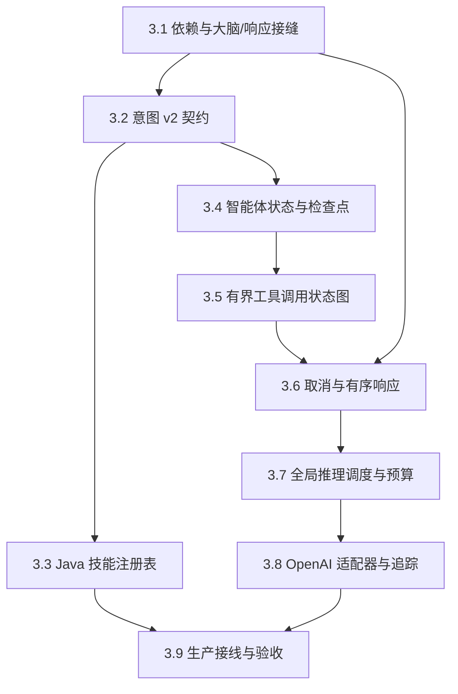

# Phase 3：单敌人有状态智能体实施指南

这是一份面向实现者（Builder）的易读版构建指南（Build Guide）。它说明怎样按依赖顺序完成 Phase 3，
不记录项目推进过程，也不替代 [PHASE_3_SPEC.md](PHASE_3_SPEC.md) 中的正式契约（contract）与验收矩阵。

开始编码前，必须确认两件事：

1. [PHASE_3_SPEC.md](PHASE_3_SPEC.md) 已获批准。
2. [PHASE_2DOT5_COMPLETION.md](PHASE_2DOT5_COMPLETION.md) 已满足全部验收条件并明确最终基线。

如果本文与规范（Spec）冲突，以规范为准；如果文档与代码事实冲突，先记录差异并确认迁移方案。

## 读完后你应该能做什么

你将把现有的确定性外部运行时扩展为单敌人 `Agent Runtime`（智能体运行时）：

- Python 通过显式 `StateGraph`（状态图）运行有界的模型—工具—模型循环。
- 每个敌人的状态按世界、楼层和敌人身份隔离，并能从检查点（checkpoint）恢复。
- Python 只提交战略意图（strategic intent）；Java 继续校验并执行动作。
- 模型调用受并发、队列、次数、令牌（token）和截止时间（deadline）限制。
- 取消、超时、模型失败或预算耗尽时，Java `Game Loop`（游戏循环）继续运行。
- Python `model trace`（模型追踪）可以与 Java `gameplay trace`（游戏追踪）关联，但不保存密钥、
  原始提示词（raw prompt）、原始响应（raw response）或自由推理内容（reasoning）。

本文不实现多步计划执行、反馈触发的立即重规划、敌人之间的通信、跨楼层长期记忆或新的复杂战术技能。

## 先建立正确的系统模型

### 三条循环互不替代

| 循环 | 所在位置 | 主要职责 | 结束条件 |
|------|----------|----------|----------|
| `Game Loop` | Java 游戏线程 | `poll`（轮询消息）、`execute`（执行动作）、`commit`（提交世界变化）、`collect`（收集反馈） | 游戏退出 |
| 连接读取循环（connection reader loop） | Python 连接处理器（handler）线程 | 解码并分派观察、取消、反馈和事件 | 连接或服务关闭 |
| 智能体状态图循环（Agent graph loop） | Python 模型工作线程 | 模型调用、工具调用（Tool Calling）、意图提交和检查点写入 | 提交、取消、超时或次数耗尽 |

连接读取循环不能同步等待模型，否则同一连接上的取消消息无法及时处理。状态图也不能直接写套接字，
否则多个并发结果会争用 `messageSeq`（消息序号）并造成数据帧（frame）交错。

### Phase 3 必须建立的扩展接缝

扩展接缝（seam）是可以替换一侧实现、同时保持另一侧稳定的明确接口边界。Phase 3 不是把模型逻辑
直接塞进现有代码，而是建立以下四类接缝：

| 扩展接缝（seam） | 主要组件 | 隔离的变化 |
|------------------|----------|------------|
| 大脑与响应接缝 | `RuntimeBrain`（运行时大脑接口）、`BrainFactory`（大脑工厂）、`ResponseEmitter`（响应发送器） | 连接读取、决策执行与套接字写入互不绑死 |
| 状态与工具接缝 | `AgentGraphState`（智能体状态图状态）、`ToolNode`（工具执行节点）、检查点存储 | 模型只能通过当前敌人的有界状态读取证据 |
| 模型服务接缝 | `ModelAdapter`（模型适配器）、`InferenceScheduler`（推理调度器） | 状态图不依赖具体服务提供方，并统一经过预算与取消 |
| 意图与技能接缝 | `strategic-intent.v2`（战略意图 v2 协议）、`TacticalSkillRegistry`（战术技能注册表） | Python 只提出意图，Java 负责校验、规划和执行 |

后续步骤中的接口、适配器和注册表都是这些接缝的具体实现，而不是四条新的运行链路。

### 一次成功决策的最短路径

```text
Java 生成当前敌人的 `Observation`（私有观察快照）
  → Python 按 worldId / floorId / agentId 加载检查点
  → 模型读取当前敌人的可见证据
  → 只读工具返回观察范围内的信息
  → 模型提交 strategic-intent.v2
  → Python 严格编码并发送提案
  → Java 校验身份、参数、知识来源、前提与可达性
  → 意图仲裁器安装 `Lease`（意图租约）
  → 战术技能规划器生成有界的原子 `Action`（动作）
  → 世界提交屏障（commit barrier）统一提交变化
  → 动作结果（ActionOutcome）反馈给同一敌人的状态
```

Phase 3 只要求把最近反馈保存到状态，并让后续请求可以读取。反馈立即触发持续重规划属于 Phase 4。

## 不可破坏的边界

1. **Java 游戏线程不得等待外部运行时。** `Enemy`（敌人实体）、`AiTickLoop`（智能体节拍协调器）
   和 `Game`（游戏入口与主循环）不得等待模型任务、读取套接字或访问检查点。
2. **Python 只能提出意图。** Python 不返回 Java 类名、脚本、世界补丁或可直接执行的动作。
3. **Java 是世界权威。** 所有远程提案都必须经过 `DecisionValidator`（决策校验器）和
   `TacticalSkillRegistry`（战术技能注册表），然后才可能成为动作。
4. **每个智能体只能读取自己的知识。** 工具和提示词（prompt）只能使用当前私有观察与同一检查点中的有界状态。
5. **共享资源不等于共享上下文。** 多个敌人可以共享模型客户端、线程池、并发许可和预算计数器，
   但不能共享消息、观察、工具结果或意图。
6. **取消结果与释放资源是两件事。** 迟到结果必须失效；无法中止的模型调用仍占用并发名额，
   直到它真实返回。
7. **保持现有动作节奏。** 每个敌人在一次冷却机会中至多执行一个动作；全部敌人执行后统一提交世界变化。
8. **源码使用领域命名。** 新增生产代码、测试、日志和配置键不得包含开发阶段编号。

## 实施路线

每个顶级步骤与 Spec 第 10 节严格对应。只有当前步骤的阶段闸门（stage gate）通过后，才继续下一步。



## 3.1 固定依赖并建立可替换的大脑接缝（seam）

### 目标

先让 Python 环境可重复安装，再建立大脑与响应接缝（brain/emitter seam），把大脑实现（brain）与
套接字写入分开。后续状态图、模型服务提供方（provider）和取消链都依赖这个稳定边界。
每个增量先由确定性测试替身（deterministic double）验证，再接入真实模型服务。

### 改动位置

- 新建 `agent/python/pyproject.toml` 和 `agent/python/pylock.toml`。
- 新建 `dungeonmind_agent/config.py`。
- 新建 `brain/base.py` 和 `brain/factory.py`。
- 修改 `brain/deterministic.py`、`server.py`、`run.py` 与根目录 `.gitignore`。

### 实施要点

1. 按 Spec 8.1 声明直接依赖，并生成包含传递依赖与哈希的依赖锁定文件（lock file）。
2. 定义 `RuntimeBrain`（运行时大脑接口）、`BrainFactory`（大脑工厂）和
   `ResponseEmitter`（响应发送器）。
3. 工厂为每条连接创建独立大脑实例；共享服务只通过显式依赖注入（dependency injection）传入。
4. 将 `DeterministicAgent`（确定性智能体）适配到新接口。它仍保持原有确定性行为。
5. 所有响应都交给 `ResponseEmitter`；大脑实现不能直接操作原始套接字。
6. `.venv`、SQLite 数据库、运行时追踪文件和 `.env` 都必须被 Git 忽略。

### 必须保持

- `AgentSession`（敌人外部会话管理器）、`SocketTransport`（套接字传输器）和 Java 游戏循环不变。
- 每条连接独立维护 `messageSeq`、反馈、事件与取消状态。
- 确定性模式不创建模型客户端、推理调度器或检查点数据库。

### 阶段闸门

- 干净虚拟环境（virtual environment）可以从依赖锁定文件安装。
- 现有 Python 契约测试全部通过。
- 两条连接仍分别从自己的首个消息序号开始。
- 确定性模式没有外部网络调用或模型运行时副作用。

详细验收见 Spec `REGRESSION-01` 和 `STATE-ISOLATION-02`。

## 3.2 一次性切换到 `strategic-intent.v2`

### 目标

让确定性大脑、模型大脑、Java/Python 编解码器（codec）和跨语言测试样例（fixture）共享唯一的
意图数据传输对象（Data Transfer Object, DTO）。本步骤不修改会话状态机。

### 改动位置

- 修改 Python `protocol.py`，并新增或调整意图模型定义。
- 修改 `Bridge`（Java 协议桥接层）中的 `byog/Bridge/AgentProtocol.java` 和 `AgentProtocolCodec.java`。
- 更新 `agent/contract/fixtures/` 与两种语言的契约测试。

### 实施要点

1. `strategic-intent.v2` 必须包含字符串技能标识、受限 JSON 参数、置信度、有效期、
   中断策略和运行时生成的计划元数据（plan metadata）。
2. 模型不能提供或覆盖世界、运行、楼层、敌人、会话、请求或决策身份。
3. Java 与 Python 同时限制嵌套深度、对象键数、数组长度、字符串长度和数值范围。
4. 拒绝重复字段、未知顶层字段、非有限数和超限结构。
5. `strategic-intent.v1` 与其他未知版本统一返回 `UNKNOWN_PAYLOAD_VERSION`。
6. 合法样例可以比较规范化字节（canonical bytes）；非法样例只固定拒绝代码，不固定内部异常文本。

### 必须保持

- 信封（Envelope）仍为 `agent-session.v1`。
- 私有观察仍为 `private-observation.v2`。
- 八种消息类型、换行分隔 JSON（newline-delimited JSON, NDJSON）、数据帧分隔（framing）、64 KiB 数据帧上限、
  会话取消语义和背压（backpressure）不变。
- 不增加 v1/v2 双读、旧版适配器或降级输出。

### 阶段闸门

- Spec `INTENT-CONTRACT-01–06` 全部通过。
- Java 与 Python 对所有共享样例给出相同接受或拒绝结果。
- 两种大脑都只输出 v2；旧 v1 输入被明确拒绝。

## 3.3 建立 Java 意图与技能接缝（intent/skill seam）

### 目标

在模型可以返回任意字符串技能前，先建立唯一的 Java 校验与执行接缝。远程提案不得绕过这个入口。

### 改动位置

- 新建 `SkillInvocation.java`、`PlanMetadata.java`、`TacticalSkill.java`、
  `TacticalSkillRegistry.java` 和 `BuiltinTacticalSkills.java`。
- 修改 `DecisionValidator.java`、`StrategicIntent.java`、`IntentArbiter.java`、
  `ClassicalPlanner.java` 与 `Enemy.java`。

### 实施要点

1. 将已解码的远程输入转换为 `SkillInvocation`（技能调用），只保留不可变（immutable）参数和已验证的基础字段。
2. `TacticalSkill`（战术技能定义）统一负责参数规则、知识来源、当前前提、内部意图转换、
   有界动作规划和反射覆盖（Reflex Override）后的恢复条件。
3. `TacticalSkillRegistry` 构造完成后不可变；空标识、重复标识和空定义在构造时直接失败。
4. 按 PATROL（巡视）、CHASE（追击）、ATTACK（攻击）、GUARD（守卫）的顺序迁移现有四个技能，
   每次只迁移一个并运行回归。
5. `DecisionValidation`（决策校验结果）同时携带类型化结果、已验证意图和中断策略，
   避免校验后再走另一套分支进行转换。
6. 通用身份、版本、有效期和安全策略仍由 `DecisionValidator` 处理，不复制到每个技能定义。
7. 已验证远程目标不可达时必须拒绝，不能退回随机移动。

### 必须保持

- 拒绝不能改变当前意图租约、排队决策、动作队列、冷却计数、敌人位置或生命值。
- `IntentArbiter`（意图仲裁器）只消费已接受的详细校验结果。
- 本地旧行为如仍需保留随机后备路径，必须与远程技能路径明确分开。

### 阶段闸门

- 四个现有技能的行为回归通过。
- Spec `SKILL-AUTHORITY-01–04` 与 `SKILL-EXECUTION-01` 通过。
- 测试加入临时技能时不需要修改 Bridge 编解码器。
- 远程技能规则不再分散在校验器、仲裁器和规划器的多份条件分支中。

## 3.4 建立隔离且有界的智能体状态

### 目标

让同一世界、同一楼层、同一敌人的状态可以跨连接和运行时重启恢复，同时确保不同身份之间完全隔离。
检查点只保存智能体上下文，不保存或替代 Java 世界状态。状态图状态（graph state）是一次状态图运行中
由各节点共享的类型化数据；检查点保存器（checkpointer）在状态图步骤后持久化这份有界状态。

### 改动位置

- 新建 `graph/state.py` 和 `checkpoint.py`。
- 在模型大脑中接入检查点存储（checkpoint store）。

### 实施要点

1. 使用 `worldId / floorId / agentId` 构成 `AgentKey`（智能体键）。
2. `thread_id` 使用规范 JSON 加 URL 安全 Base64，或长度前缀编码；不得直接用未转义分隔符拼接。
3. `runId`、`sessionEpoch`、`requestGeneration` 和 `decisionId` 只表示运行或请求身份，
   不进入长期检查点键。
4. 先用 `InMemorySaver`（内存检查点保存器）验证恢复与隔离，再接入
   `SqliteSaver`（SQLite 检查点保存器）。
5. 检查点连接和关闭由一个组件集中管理，工具和状态图节点不得各自打开数据库。
6. 状态只保留当前观察、上一意图、最近一条反馈、决策计数和本轮所需的有限消息窗口。
7. 不保存完整世界、其他敌人的信息、原始提示词、模型原始响应或自由推理内容。

### 必须保持

- 同一世界同层读档可以恢复同一敌人的状态，但新 `runId` 仍使旧请求和迟到结果失效。
- 新世界、新楼层、覆盖同名世界产生的新 `worldId` 或缺失检查点都必须冷启动。
- SQLite 文件是外部运行时工作数据，不是 Java 游戏存档。

### 阶段闸门

- Spec `STATE-ISOLATION-01–04` 全部通过。
- 同一敌人在断线重连、运行时重启和同层读档后恢复；不同世界、楼层或敌人不恢复彼此状态。
- 两个敌人并发写入 SQLite 时不报错、不串线。
- 检查点中没有其他敌人的观察、API 密钥或无限增长的消息历史。

## 3.5 用脚本化模型建立有界工具调用状态图

### 目标

先用脚本化模型（scripted model）证明节点、工具权限和停止条件，再接真实模型服务。
脚本化模型只模拟模型消息和工具调用请求，不复制状态图路由、工具节点或 Java 校验逻辑。

### 改动位置

- 新建 `graph/tools.py` 和 `graph/workflow.py`。
- 新建模型适配接口及脚本化实现。
- 在 `graph/state.py` 中补充本轮调用计数和截止时间。

### 工具边界

| 工具 | 作用 | 允许读取 |
|------|------|----------|
| `list_visible_entities` | 列出当前可见实体 | 当前观察中的实体列表 |
| `inspect_visible_tile` | 查看已观察坐标 | 当前观察中的可见地块 |
| `read_self` | 读取自身位置、生命值、朝向和视野模式 | 当前观察的 self/data |
| `check_skill_candidate` | 做 Python 侧结构预检 | 当前能力清单与观察；不能代表 Java 接受 |
| `submit_strategic_intent` | 保存最终候选并终止本轮 | 只写当前候选；不修改游戏 |

所有工具都返回结构化结果。未知信息返回稳定错误码，例如 `UNKNOWN_TO_AGENT`、
`UNSUPPORTED_SKILL`、`INVALID_ARGUMENTS` 或 `EVIDENCE_REQUIRED`，不返回异常堆栈。

### 状态图

使用显式 `StateGraph`，以节点（node）承载职责，并通过条件边（conditional edge）决定下一步；
`ToolNode` 执行经过白名单约束的工具。整体流程如下：

```text
prepare_context
  → invoke_model
      → 有工具调用且未超限：execute_tools
      → 已有候选意图：finalize_intent
      → 无工具调用、超限或超时：reject_decision
  → execute_tools
      → invoke_model
```

每次路由前检查取消标记和单调时钟截止时间，并分别统计工具批次、工具调用次数和模型调用次数。
至少使用一个非终止证据工具后，`submit_strategic_intent` 才能成功。

### 必须保持

- 工具只能看见视野（field of view, FOV）裁剪后的半菱形私有观察，不能访问完整地图、Java 对象、
  存档或其他检查点。
- 最终输出必须通过同一 `Pydantic`（数据校验模型）和 v2 协议编解码器。
- 真实模型服务不进入本步骤的默认测试。

### 阶段闸门

- Spec `TOOL-LOOP-01–04` 与 `KNOWLEDGE-BOUNDARY-01/02` 通过。
- 正常脚本明确走过“模型 → 证据工具 → 模型 → 提交”。
- 直接提交先得到 `EVIDENCE_REQUIRED`，并能在剩余轮次内修正。
- 无限工具调用会被批次、调用次数、模型次数或截止时间中的最先到达者终止。

## 3.6 让连接在模型运行期间仍可取消

### 目标

把连接读取、模型任务和响应写入分开，使模型等待不会阻塞取消、心跳或其他协议消息。
保持单一在途请求（single in-flight）语义：每个敌人最多只有一个当前有效的远程决策请求。

### 改动位置

- 修改 `server.py`、模型大脑和 `ResponseEmitter`。
- 为每次决策建立取消标记与响应资格检查。

### 实施要点

1. 连接处理器收到观察后，只做校验和任务提交，然后立即回到读取循环。
2. 所有模型任务进入统一调度路径，不为每个响应临时创建线程。
3. `ResponseEmitter` 持有连接级锁，是消息序号分配、编码、写入和刷新唯一入口。
4. 收到取消请求时，先核对决策身份，再标记取消、请求调度器取消并立即发送取消确认（`cancel_ack`）。
5. 等待队列中的任务必须能在开始前取消。
6. 正在运行且无法中止的模型调用只能标记为已放弃（abandoned）；返回后不得发送意图。
7. 连接关闭时依次禁止新任务、取消排队任务、抑制运行中结果、停止发送并有界关闭共享资源。

### 必须保持

- Python 的取消用于节省资源；Java 的请求代次和决策身份仍是迟到结果失效的最终边界。
- `cancel_ack` 不能提前释放仍在运行的模型调用所占并发名额。
- 关闭过程不能无限等待底层无法取消的模型调用。

### 阶段闸门

- Spec `CANCEL-01–04` 全部通过。
- 模型调用阻塞时，读取循环仍能处理取消和心跳。
- 取消确认、协议错误和模型结果的消息序号严格递增。
- 连接关闭后，不再向旧套接字写入意图。
- Java 原有硬截止时间、请求代次和迟到结果测试不变。

## 3.7 加入全局推理调度与预算

### 目标

所有模型节点都通过 `InferenceScheduler`（推理调度器），统一限制实际并发、等待队列、
每次遭遇的调用次数和令牌用量。

### 改动位置

- 新建 `model/scheduler.py`。
- 让所有模型节点通过统一 `ModelCallRequest`（模型调用请求）进入调度器。
- 在配置中加入 Spec 8.11 定义的上限。

### 调度顺序

```text
检查遭遇级调用与令牌预算
  → 尝试进入有限等待队列
  → 等待全局并发许可
  → 再次检查取消和截止时间
  → 调用模型服务
  → 按实际用量或预留量结算令牌
  → 释放并发许可
```

预算键使用 `runId / floorId`，表示一次楼层遭遇。`agentId` 不进入预算键，否则每个敌人都会获得一份完整预算。
调度器只接收身份、预算数据和可调用对象（callable）；提示词与消息保存在闭包（closure）中，
不能成为共享可读数据。全局并发许可由信号量（semaphore）表达。

### 令牌结算

- 调用前预留预计输入令牌与最大输出令牌。
- 服务返回用量元数据（usage metadata）时按实际值结算。
- 服务不返回用量时保留预留值，并标记 `usageEstimated=true`。
- 已发出的失败调用仍计入调用预算。
- 每次重试（retry）都算新的模型调用；适配器不得隐藏无限重试。

### 阶段闸门

- Spec `SCHED-CONCURRENCY-01`、`SCHED-QUEUE-01` 和 `SCHED-BUDGET-01/02` 通过。
- 峰值并发、队列深度、调用次数和令牌用量不超过配置。
- 队列已满时立即明确拒绝，连接读取循环不被阻塞。
- 双敌人提示词捕获中不存在交叉内容。
- 并发测试使用事件或屏障（barrier），不使用固定休眠猜测时序。

## 3.8 接入 OpenAI 适配器与运行时追踪

### 目标

在确定性状态图、取消和预算边界通过后，用 `ModelAdapter`（模型适配器）建立模型服务接缝
（provider seam），隔离具体模型服务，
并建立经过脱敏的 Python 运行时追踪。

### 改动位置

- 新建 `model/adapter.py` 和 `model/openai_adapter.py`。
- 新建 `observability.py`。
- 修改配置、启动入口与就绪消息（ready message）。

### 模型适配器

状态图只依赖统一适配接口，不能直接导入 `ChatOpenAI`（OpenAI 聊天模型客户端）。OpenAI 适配器负责：

- 从已校验配置取得模型标识；
- 从环境读取 `OPENAI_API_KEY`，但不打印或持久化；
- 绑定五个工具的结构；
- 设置输出上限、超时和至多一次明确的暂时性错误（transient error）重试；
- 将消息、工具调用和用量转换为内部数据对象；
- 将错误分为暂时错误、永久错误（permanent error）、超时和取消。

模型标识不得写死，也不能使用浮动的 `latest` 别名作为验收基线。

### 启动前校验

模型模式在绑定端口和输出就绪消息前，必须确认：模型标识非空、密钥存在、检查点与追踪路径可用、
各项上限合法，并且 Python 决策超时小于 Java 硬截止时间。失败时以非零状态退出并给出不含密钥的原因；
不得悄悄切回确定性模式。

### 运行时追踪

`agent-model.trace.v1` 使用线程安全、事件序号单调的 NDJSON 追踪输出（trace sink）。它只记录：

- 模型调用的开始、完成与失败；
- 工具名称、调用标识和结果代码；
- 队列深度、实际并发和预算状态；
- 令牌用量及其是否为估算值；
- 意图是否通过 Python 结构校验并被发送；
- 决策是否取消、超时或被放弃。

规范证据（canonical evidence）只保留稳定节点顺序、工具名、结果码、预算计数和关联身份；
诊断信息（diagnostics）可以包含耗时、模型标识、服务请求标识和令牌用量。

两者都不得记录 API 密钥（API key）、授权头（authorization header）、完整 raw prompt、完整 raw response
或 reasoning，也不得泄露服务响应正文（provider response body）。

### 阶段闸门

- 模型模式缺少模型标识或密钥时不会输出就绪消息；确定性模式仍可正常启动。
- Spec `TRACE-CORRELATION-01–04` 使用脚本化模型全部通过。
- 追踪中没有密钥、授权信息、原始提示词或其他敌人的数据。
- 适配器能稳定分类错误，并且不泄露模型服务的原始响应正文。

## 3.9 接入生产路径并完成验收

### 目标

把前面已经独立验证的协议、技能注册表、状态图、调度器和模型适配器接入现有 Java/Python 链路，
完成确定性回归、真实进程集成测试（integration test）和一次显式凭据化冒烟测试（smoke test）。

### 生产数据流

模型大脑继续使用现有 `submit_intent` 消息，不新建 HTTP、WebSocket、MCP 服务或 Java 回调。

```text
AgentSession 身份校验
  → DecisionValidator 通用检查
  → TacticalSkillRegistry 查找技能
  → 技能参数、知识来源、当前世界和可达性检查
  → DecisionValidation 返回已验证意图
  → IntentArbiter 安装 Lease
  → 技能规划器（planner）写入 ActionQueue（原子动作队列）
  → Enemy 每次冷却只执行一个 Action
  → EntityManager（实体管理器）经过 commit barrier 统一提交世界变化
```

Java 追踪格式升级为 `agent-runtime.trace.v3`，用 `worldId / runId / floorId / agentId / decisionId`
与 Python 追踪关联，并增加技能、计划和步骤标识。拒绝路径只记录类型化结果，不用异常堆栈表达业务语义。

### 脚本化端到端测试

`ModelRuntimeIntegrationTest`（模型运行时集成测试）启动真实 Python 子进程并通过 TCP 通信，
但使用脚本化模型。它至少证明：

1. Java 发送包含世界身份、自身生命值、朝向和视野模式的私有观察。
2. Python 确实执行两次模型调用和至少一个证据工具。
3. v2 意图被 Java 注册表接受。
4. 动作执行并在统一提交后生效。
5. 反馈写回同一敌人的状态。
6. Python 与 Java 追踪中的身份、决策和计划可以关联。
7. 同层读档恢复检查点，同时拒绝旧运行的迟到结果。

测试必须使用系统分配端口、分段等待与总超时，并且只关闭自己创建的子进程。

### 真实模型冒烟测试

脚本化测试证明控制流正确；真实模型冒烟测试只证明当前模型服务、模型标识与工具调用接口兼容。
它不是行为质量评测，也不应断言自然语言或完整轨迹与固定答案完全相同。

真实冒烟测试必须满足：

- 密钥只通过进程环境提供。
- 使用明确模型标识、单次决策、短截止时间、小输出上限和小遭遇预算。
- 输入是固定的单守卫无用户数据场景。
- 至少完成一次模型调用、一个非终止证据工具、后续模型调用和合法 v2 提案。
- 主验收场景至少有一次提案被 Java 接受并产生动作。
- 记录模型标识、工具名、调用次数、令牌、延迟和校验结果，但不记录密钥或自由推理。

### 阶段闸门

- Spec 11.2–11.5 的自动化矩阵全部通过。
- 旧确定性故障模式、网络传输、游戏行为和禁用 Bridge 的回归通过。
- 真实模型冒烟测试成功，且 Python 与 Java 追踪可以关联。
- 只有所有门禁都有实际证据时，才编写 `PHASE_3_COMPLETION.md` 并关闭本阶段。

## 文件阅读顺序

### Python

1. `agent/python/dungeonmind_agent/config.py`
2. `agent/python/dungeonmind_agent/brain/base.py`
3. `agent/python/dungeonmind_agent/server.py`
4. `agent/python/dungeonmind_agent/brain/factory.py`
5. `agent/python/dungeonmind_agent/brain/graph_agent.py`
6. `agent/python/dungeonmind_agent/graph/state.py`
7. `agent/python/dungeonmind_agent/graph/workflow.py`
8. `agent/python/dungeonmind_agent/graph/tools.py`
9. `agent/python/dungeonmind_agent/model/scheduler.py`
10. `agent/python/dungeonmind_agent/model/openai_adapter.py`
11. `agent/python/dungeonmind_agent/checkpoint.py`
12. `agent/python/dungeonmind_agent/observability.py`
13. `agent/python/dungeonmind_agent/protocol.py`

### Java

1. `byog/Bridge/AgentProtocol.java`
2. `byog/Bridge/AgentProtocolCodec.java`
3. `byog/AI/SkillInvocation.java`
4. `byog/AI/TacticalSkill.java`
5. `byog/AI/TacticalSkillRegistry.java`
6. `byog/AI/BuiltinTacticalSkills.java`
7. `byog/AI/DecisionValidator.java`
8. `byog/AI/IntentArbiter.java`
9. `byog/AI/ClassicalPlanner.java`
10. `byog/Entity/Enemy.java`
11. `byog/Trace/AgentTrace.java`

这些是目标入口，其中部分文件将在相应步骤中新建。实际类名如因领域职责需要调整，应同步更新本节和最终交接文档。

## 最终验证命令

以下命令只在阶段 3.9 执行。真实模型冒烟测试不进入默认持续集成（Continuous Integration, CI）。

```powershell
# Python 契约与单元测试
& agent/python/.venv/Scripts/python.exe -m unittest discover `
    -s agent/python/tests -v

# Java 全量编译
$javaSources = Get-ChildItem byog -Recurse -Filter *.java |
    ForEach-Object { $_.FullName }
javac -encoding UTF-8 -cp "..\library-sp18\javalib\*" -d out $javaSources

# Java 确定性验收入口
java "-Dfile.encoding=UTF-8" `
    -cp "out;..\library-sp18\javalib\*" `
    org.junit.runner.JUnitCore byog.Test.AgentRuntimeTestSuite

# 真实 Python 进程与脚本化模型集成测试
java "-Dfile.encoding=UTF-8" `
    -cp "out;..\library-sp18\javalib\*" `
    org.junit.runner.JUnitCore byog.Test.ModelRuntimeIntegrationTest

# 套接字传输独立回归
java "-Dfile.encoding=UTF-8" `
    -cp "out;..\library-sp18\javalib\*" `
    org.junit.runner.JUnitCore byog.Bridge.SocketTransportTest

# 显式凭据化真实模型冒烟测试
& agent/python/.venv/Scripts/python.exe agent/python/model_smoke.py `
    --model $env:DUNGEONMIND_MODEL
```

## 故障定位

| 现象 | 先检查 | 不要先改 |
|------|--------|----------|
| 模型模式没有就绪消息 | 配置、密钥、检查点路径和追踪路径的启动前校验 | Java 校验规则 |
| 已就绪但没有模型调用 | 大脑工厂是否选择模型模式，决策任务是否提交 | `SocketTransport` |
| 取消后仍返回意图 | 读取循环是否阻塞，发送前是否检查响应资格 | 只依赖 Java 丢弃迟到结果 |
| 工具能看到隐藏地块 | 工具是否只读取当前观察索引 | 为调试传入完整世界 |
| Python 接受但 Java 编解码器拒绝 | 共享样例和受限 JSON 的边界是否一致 | 忽略未知字段 |
| Java 编解码器接受但技能注册表拒绝 | 技能参数、知识来源和当前前提 | 绕过注册表直接规划 |
| 两个敌人的状态串线 | 检查点键、每连接实例和提示词捕获 | 为每个敌人创建独立密钥 |
| 并发超过上限 | 并发许可是否覆盖完整模型调用 | 收到取消确认就提前释放许可 |
| 令牌预算为负或超限 | 调用前预留和返回后结算 | 忽略缺失的用量数据 |
| 动作无法关联模型决策 | 决策、计划和步骤标识是否贯穿发送、校验、租约与追踪 | 保存自由推理代替关联标识 |

## 最终验收清单

### 协议与 Java 权威

- [ ] 所有大脑、编解码器和共享样例都只使用 `strategic-intent.v2`。
- [ ] 旧意图版本被严格拒绝，没有兼容层。
- [ ] 四个内置技能已进入不可变 Java 注册表。
- [ ] 未知、非法、不可知、过期或不可达的意图被无副作用拒绝。
- [ ] 已支持技能只能通过统一入口生成有界、确定性的原子动作。

### 状态、知识与工具

- [ ] 检查点按世界、楼层和敌人隔离；同层读档与运行时重启可以恢复。
- [ ] 新运行、会话、请求代次和决策身份能阻止旧结果污染当前状态。
- [ ] 正常路径真实经过模型、证据工具、模型和提交工具。
- [ ] 工具调用次数、模型调用次数和截止时间都能终止错误循环。
- [ ] 工具与提示词只包含当前私有观察和本敌人的有界状态。

### 取消、预算与失败

- [ ] 模型运行时，连接读取循环仍能处理取消。
- [ ] 排队取消、运行中放弃、连接关闭和新请求代次都不会发送迟到意图。
- [ ] 并发、队列、调用次数和令牌预算不超过配置。
- [ ] 模型失败不会伪装成远程决策成功，Java 后备策略（fallback）继续运行。

### 证据与交接

- [ ] 默认测试不访问真实付费模型、不打开图形界面、不写默认玩家存档，也不依赖固定休眠判断时序。
- [ ] 真实进程集成测试有总超时并能清理自己创建的子进程和端口。
- [ ] 真实模型冒烟测试记录模型、工具、令牌、延迟、校验和动作证据。
- [ ] Python 与 Java 追踪可以按身份、决策和计划关联。
- [ ] 追踪中没有密钥、授权信息、完整提示词、完整模型响应或自由推理。
- [ ] `PHASE_3_COMPLETION.md` 只记录实际执行结果、偏差和最终交接，不把计划命令当成完成证据。

完成以上条件后，Phase 4 才能依赖稳定的状态、工具、意图与技能接缝（state/tool/intent/skill seam），
在不改变现有会话、私有知识和推理预算边界的前提下，加入反馈事件触发、多步执行以及重新规划
（replanning）。
