# DungeonMind AgentSession 架构

> 状态：当前无网络核心实现说明
>
> 更新时间：2026-07-31
>
> 范围：`AgentSession` 的身份、请求生命周期、deadline、取消、有界邮箱、
> `TransportEndpoint`、`AgentTransport`、关闭语义与确定性测试
>
> 不包含：真实 Socket/NDJSON IO worker、指数退避线程、Python Agent runtime、
> `Enemy`/`Game` 生产接线、Tool Calling 和多 Agent 协作

---

## 0. 先读这一页

`AgentSession` 已经实现为一个可确定性测试的纯 Java 会话核心，但尚未接入正式游戏运行时和真实网络。

| 能力 | 状态 | 当前行为 |
|------|------|----------|
| 每 Enemy 独立身份 | **已实现** | 每个 Session 固定 `runId / floorId / agentId`，独立维护 epoch、generation 和队列 |
| 单 in-flight 请求 | **已实现** | 同时最多存在一个 `currentRequest` 或一个等待确认的 `cancelledRequest` |
| observation 合并 | **已实现** | 未发送 observation 原位替换；已被 transport 取走后只更新 `latestObservation` |
| soft/hard deadline | **已实现** | 使用注入的 `MonotonicClock`，不依赖 wall-clock 或 `Thread.sleep()` |
| cancel grace | **已实现** | 未收到匹配 ack 时进入断线/重建路径 |
| outbound/inbound 背压 | **已实现** | 邮箱有界；低优先级合并/丢弃，关键消息拒绝会显式降级 |
| 完整请求身份校验 | **已实现** | 旧 run、楼层、Agent、epoch、generation、decision 或 observation 均不能生效 |
| 游戏线程 Handler 边界 | **已实现** | 只有 `pollInbound()` 调用 `AgentHandler` |
| 幂等、永久 close | **已实现** | close 后请求、发送、入站和重连都不能重新激活 |
| transport 生命周期控制 | **已实现** | 注入的 `AgentTransport` 接收 start、rebuild 和永久 close |
| 内存 transport 测试 seam | **已实现** | 测试 transport 同时实现控制面并通过 endpoint 驱动数据面 |
| TCP IO worker | **未实现** | 当前没有 Socket、reader、writer 或后台线程 |
| 生产 Game/Enemy 接线 | **未实现** | 正式 `pollAgentMessages()` / `collectAgentUpdates()` 尚未持有 Session |
| Python runtime | **未实现** | 当前没有跨进程往返 |

读图时使用以下约定：

- **实线**：当前代码已经存在并由测试真实执行。
- **虚线**：已锁定的接入位置或后续模块，当前没有生产调用。
- **game-thread API**：只做内存状态转换和有界 enqueue/drain，不能阻塞。
- **transport endpoint**：未来由唯一 IO worker 持有；当前由内存 fake transport 驱动。
- **transport control**：Session 调用 `AgentTransport` 发出非阻塞的重建或关闭命令。

---

## 1. AgentSession 是什么

### 1.1 它是会话边界，不是大脑

`AgentSession` 回答的是：

```text
这条会话属于哪个 Enemy？
现在是否已有远程请求？
一条返回还属于当前世界和当前请求吗？
消息进入哪个有界邮箱？
Agent 何时只是慢，何时必须取消？
断线、协议失败或关闭后怎样使旧结果永久失效？
```

它不回答：

```text
应该 CHASE、ATTACK、PATROL 还是 GUARD？
目标位置是否合法、可见或可达吗？
下一步应该生成哪个 MoveAction？
Enemy 能否穿墙、碰撞或直接修改世界？
```

这些职责仍分别属于 `DecisionValidator`、`IntentArbiter`、`ClassicalPlanner`、
`Action` 和 Java 权威世界。

### 1.2 每个 Enemy 一份 Session

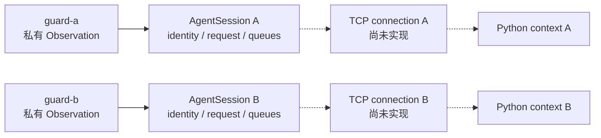

两份 Session 不共享：

- `sessionEpoch`
- `requestGeneration`
- `messageSeq`
- `currentRequest`
- `latestObservation`
- inbound/outbound queue
- pending events
- lifecycle events

因此 A 的响应不能被 B 接受，B 的拥塞也不会占用 A 的 request state。

---

## 2. 当前模块连接图

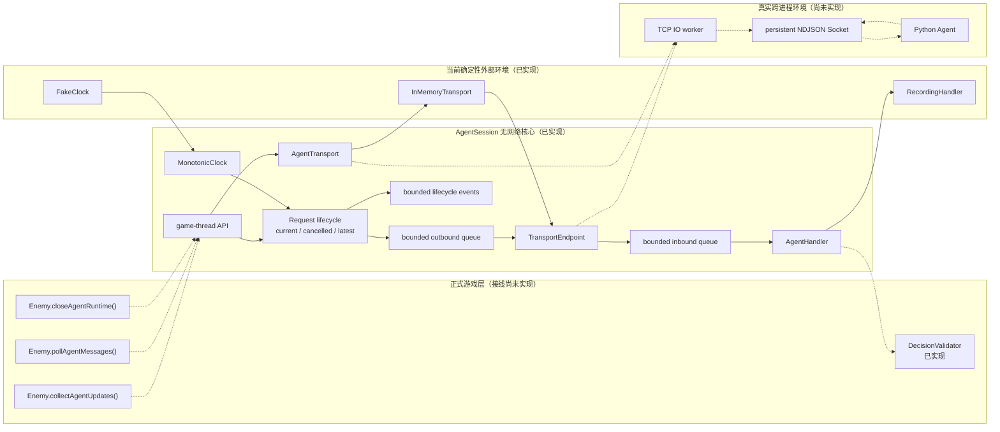

当前真正闭合的是：

```text
ObservationEnvelope
  → AgentSession.requestIntent()
  → bounded outbound queue
  → InMemoryTransport 取出
  → 测试构造 submit_intent / cancel_ack
  → TransportEndpoint.offerInbound()
  → bounded inbound queue
  → AgentSession.pollInbound()
  → RecordingHandler
```

当前尚未闭合的是：

```text
Enemy collect
  ⇢ AgentSession
  ⇢ TCP IO worker
  ⇢ Python Agent
  ⇢ submit_intent
  ⇢ Enemy poll
  ⇢ DecisionValidator / IntentArbiter
```

---

## 3. 数据所有权与线程边界

### 3.1 AgentSession 持有的数据

| 数据 | 作用 | 生命周期 |
|------|------|----------|
| `runId / floorId / agentId` | 固定世界身份 | 整个 Session |
| `sessionEpoch` | 区分物理连接 | 每次连接成功递增 |
| `requestGeneration` | 使旧远程工作永久失效 | hard timeout、有效断线或协议降级时递增 |
| `nextOutboundMessageSeq` | 当前 epoch 的 outbound 诊断序号 | 新 epoch 清零 |
| `highestInboundMessageSeq` | 拒绝重复或倒退消息 | 新 epoch 重置为 `-1` |
| `currentRequest` | 当前仍可能正常完成的请求 | 单 request |
| `cancelledRequest` | 已作废、等待 cancel ack 的旧请求 | cancel grace 内 |
| `latestObservation` | 下一次请求应使用的最新私有快照 | 当前 Enemy/楼层 |
| `requestPending` | 旧请求结束后是否应立即发新请求 | 当前 Session |
| outbound queue | Java 想交给 transport 的信封 | 有界 Session 邮箱 |
| inbound queue | transport 已解码、等待游戏线程处理的信封 | 有界 Session 邮箱 |
| pending events | 按事件类型和实体合并的最新事件 | 最多配置容量 |
| lifecycle events | 类型化的状态与失败诊断 | 最近 256 条 |
| `closed` | 永久终止标记 | 一旦为 true 永不恢复 |

### 3.2 三个对象不能混为一个

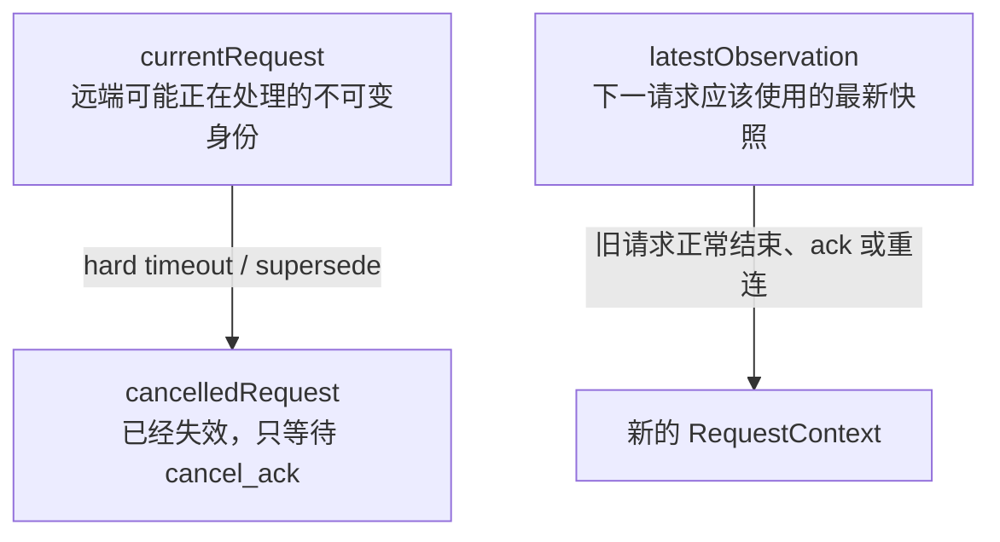

- `currentRequest` 不能因为新 observation 到来就随意改成另一个已发送请求。
- `cancelledRequest` 的 generation 是旧值；`requestGeneration` 已经递增。
- `latestObservation` 可以持续更新，但不能让旧响应冒充基于新观察的结果。

### 3.3 当前并发边界

`AgentSession` 的状态方法使用同步保护。接口按所有者分成两组：

| 所有者 | 允许调用 |
|--------|----------|
| 游戏线程 | `requestIntent`、`sendActionFeedback`、`sendWorldEvent`、`sendHeartbeat`、`advanceRequestLifecycle`、`supersedeCurrentRequest`、`pollInbound`、状态 getter |
| transport owner | `markConnecting`、`markConnected`、`markDisconnected`、`pollOutbound`、`offerInbound`、`reportProtocolFailure` |
| Session → transport | `start`、`requestRebuild`、`close`；实现必须非阻塞 |

最重要的边界是：

```text
transport owner 只把已解码消息放入 inbound queue
游戏线程调用 pollInbound 时才触发 AgentHandler
```

因此未来 IO worker 即使收到合法 `submit_intent`，也不能直接移动 Enemy、修改 Lease 或调用 Planner。

当前没有真实 IO thread；`AgentSessionTest.InMemoryTransport` 扮演 transport owner，以确定顺序手动驱动端点。

---

## 4. RequestContext：一次请求的不可变证据

每次真正开始 observation request 时，Session 创建一个 `RequestContext`：

```text
Identity
  ├─ runId
  ├─ floorId
  ├─ agentId
  ├─ sessionEpoch
  └─ requestGeneration

RequestContext
  ├─ decisionId
  ├─ observationSeq
  ├─ requestGeneration
  ├─ requestedAtNanos
  ├─ sourceObservation
  └─ sentEvents
```

它同时服务三个目的：

1. 对收到的 `submit_intent` 做 request-level identity 校验。
2. 给 `DecisionValidator` 保留当时真正发送的私有 observation。
3. 计算 soft/hard deadline，不受之后 `latestObservation` 变化影响。

### 4.1 未发送 observation 的安全替换

如果 observation 信封仍在 outbound queue，说明 transport 还没有取走它。此时新 observation 可以替换
queue 中的旧信封，并创建新的不可变 `RequestContext`：

```text
保留：decisionId、requestGeneration、requestedAtNanos
更新：observationSeq、sourceObservation、sentEvents、envelope logicalTick
```

deadline 起点不会被连续 observation 无限向后推。

### 4.2 已发送请求不能改写

一旦 transport 已经 `pollOutbound()` 取走 observation：

```text
currentRequest 保持原样
latestObservation 更新
requestPending = true
```

旧请求完成或取消后，Session 才使用 `latestObservation` 创建下一份新请求。

---

## 5. requestIntent() 的真实分支

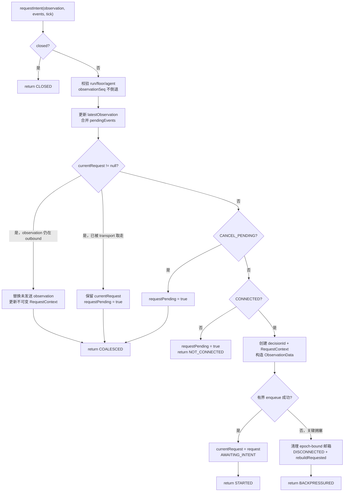

`RequestStartResult` 描述的是本地 Session 行为：

| 返回值 | 含义 |
|--------|------|
| `STARTED` | 新 observation request 已进入本地 outbound queue |
| `COALESCED` | 已存在请求；最新快照已合并或等待下一请求 |
| `NOT_CONNECTED` | 保存了最新快照，但当前不能开始请求 |
| `BACKPRESSURED` | observation 作为关键消息无法入队，Session 已进入重建路径 |
| `CLOSED` | Session 已永久关闭 |

`STARTED` 不表示 Python 已收到，更不表示已经产生 intent。

---

## 6. 正常 request/response 时序

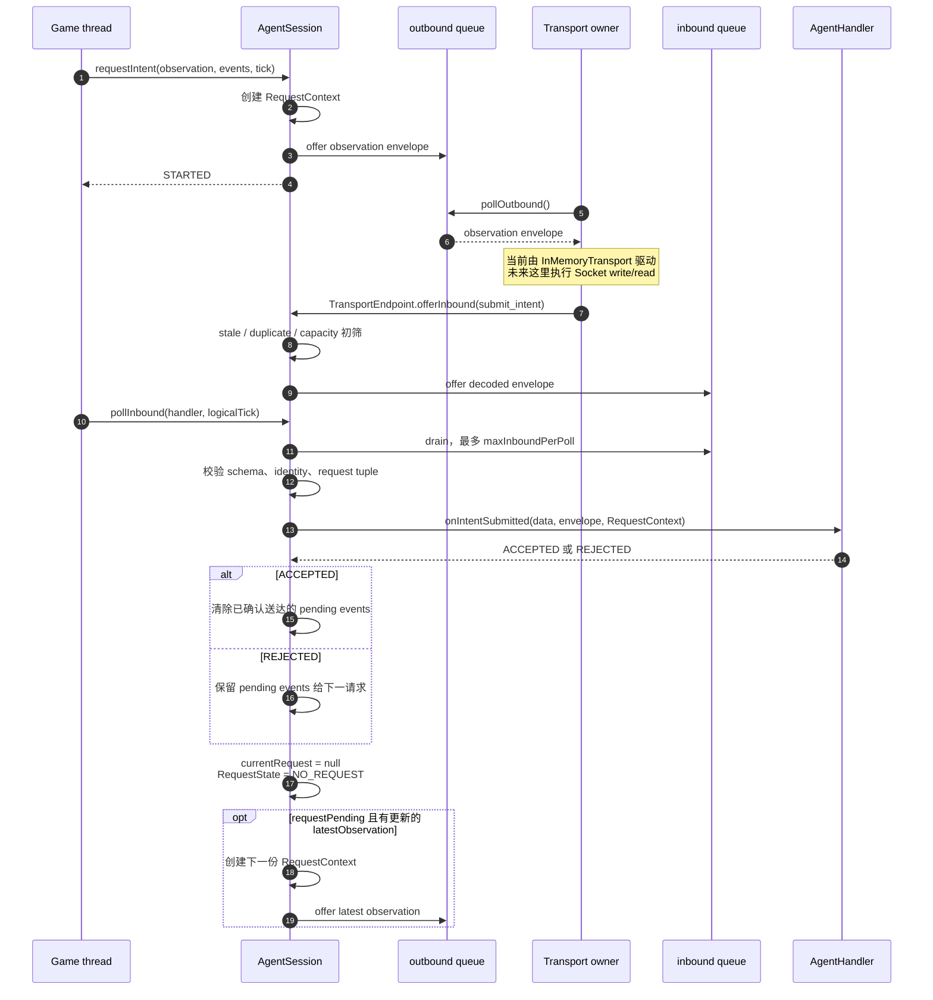

Session 在调用 Handler 前只确认“这确实是当前请求的响应”。它不决定该 intent 的战术内容是否可执行；
Handler 接入生产路径后仍必须把 proposal 交给 `DecisionValidator` 和 `IntentArbiter`。

---

## 7. 请求状态机与三段 deadline

### 7.1 RequestState

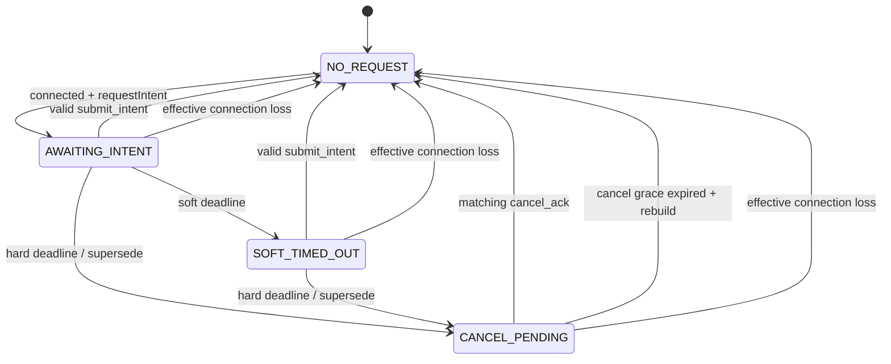

### 7.2 时间线

```text
request started
      |
      | 默认 1500 ms
      v
SOFT_TIMED_OUT
  - 只说明 Agent 较慢
  - currentRequest 保留
  - generation 不变
  - 不清理游戏中的 Lease 或 ActionQueue
      |
      | 从 request 起总计默认 10000 ms
      v
CANCEL_PENDING
  - currentRequest → cancelledRequest
  - requestGeneration++
  - 旧 submit_intent 立即失效
  - enqueue cancel_request，payload 携带旧 generation
      |
      | 默认再等待 500 ms
      v
仍无 matching cancel_ack
  - request state 回到 NO_REQUEST
  - ConnectionState → DISCONNECTED
  - rebuildRequested = true
  - latestObservation 保留
```

### 7.3 为什么先递增 generation

hard timeout 或 supersede 的顺序是：

```text
1. 保存旧 RequestContext 为 cancelledRequest
2. requestGeneration++
3. 删除仍未发送的旧 observation
4. enqueue cancel_request(old decisionId, old generation)
5. RequestState = CANCEL_PENDING
```

这样，即使旧 `submit_intent` 与 `cancel_request` 在传输中交错，旧响应也无法通过当前 generation 校验。

### 7.4 cancel_ack 后的行为

只有同时匹配以下字段的 ack 才能释放取消状态：

```text
current run / floor / agent / sessionEpoch
+ cancelledRequest.decisionId
+ cancelledRequest.requestGeneration
```

匹配后：

1. 调用 `AgentHandler.onCancelAcknowledged()`。
2. 删除仍在 outbound 中的对应 cancel message。
3. 清除 `cancelledRequest`。
4. 仅当取消期间收到更新 observation、即 `requestPending=true` 时，才立即用当前 generation 创建下一请求。

没有更新 observation 时，ack 只结束取消状态，不会重复发送旧快照。

---

## 8. ConnectionState、TransportEndpoint 与 AgentTransport

### 8.1 当前连接状态机

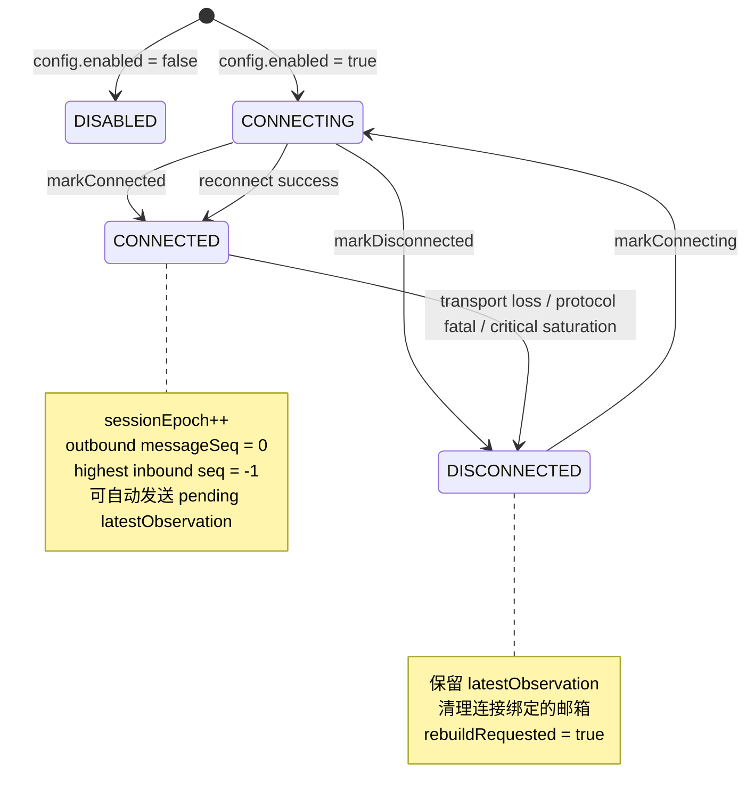

`closed` 不塞进 `ConnectionState`。它是正交、永久的终止标记：

```text
任何 ConnectionState + closed=false → Session 仍可能推进
任何 ConnectionState + closed=true  → 永久终止，不再重连
```

### 8.2 TransportEndpoint 的职责

| 方法 | 当前作用 | 未来 IO worker 的调用位置 |
|------|----------|--------------------------|
| `markConnecting()` | 标记连接尝试 | connect 前 |
| `markConnected(tick)` | 打开新 epoch、重置 message seq | connect 成功后 |
| `markDisconnected(detail, tick)` | 失效连接绑定的请求和邮箱 | EOF/IO error 后 |
| `pollOutbound()` | 非阻塞取得一个待发送 envelope | write loop |
| `offerInbound(envelope, tick)` | 非阻塞放入已解码 envelope | read/decode 后 |
| `reportProtocolFailure(failure, tick)` | 报告 framing/codec failure | frame reader/codec 失败后 |
| `isRebuildRequested()` | 查询 Session 是否要求重建物理连接 | worker control loop |
| `acknowledgeRebuildRequest()` | worker 确认已看到重建请求 | 开始 teardown/reconnect 时 |

`TransportEndpoint` 是数据面和连接事件入口；`AgentTransport` 是生命周期控制面：

| 方法 | Session 何时调用 | 实现契约 |
|------|------------------|----------|
| `start(endpoint)` | enabled Session 构造完成时 | 保存 endpoint、启动所有权逻辑，不阻塞 |
| `requestRebuild()` | cancel grace、协议致命错误、关键 outbound 饱和或连接丢失 | 关闭当前物理连接并安排重连，不阻塞 |
| `close()` | Session 首次永久关闭 | 幂等关闭并唤醒阻塞工作 |

### 8.3 当前尚未实现的连接行为

以下配置已经存在于 `AgentSessionConfig`，但当前还没有后台 worker 消费它们：

- host / port
- reconnect initial / max delay
- max frame bytes
- shutdown join 上限

Session 现在会同时设置 `rebuildRequested=true` 并调用注入 transport 的 `requestRebuild()`。
内存 transport 会立即模拟物理 teardown；兼容构造器使用 no-op transport。真实 Socket 创建、
reader 唤醒和 backoff 仍由尚未实现的 TCP worker 负责。

---

## 9. inbound 路径：先入队，再在游戏线程处理

### 9.1 transport owner 的初筛

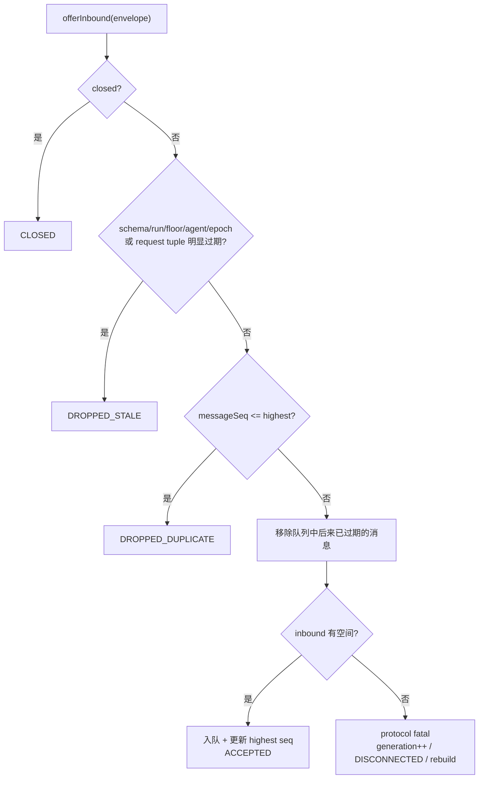

transport owner 不能在这里调用 Handler。协议失败会暂存为 `pendingProtocolFailure`，直到下一次
`pollInbound()` 才交给游戏线程。

### 9.2 pollInbound() 的处理

每次调用最多处理 `maxInboundPerPoll` 条，默认值为 8：

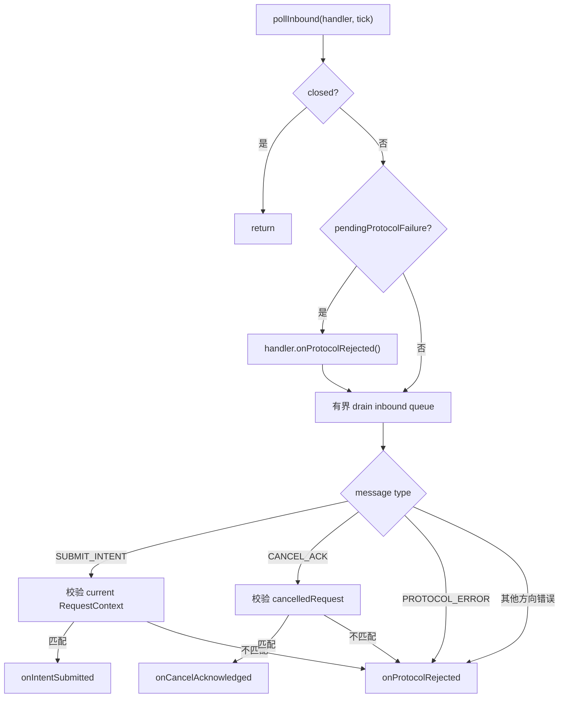

### 9.3 submit_intent 必须匹配的身份

| 层级 | 必须匹配 |
|------|----------|
| envelope schema | `phase2.session.v1` |
| envelope identity | `runId / floorId / agentId / sessionEpoch` |
| envelope metadata | 非空 `messageId`，当前 epoch 单调 `messageSeq` |
| request identity | 当前 `requestGeneration / decisionId / observationSeq` |
| Session 状态 | `AWAITING_INTENT` 或 `SOFT_TIMED_OUT`，且存在 `currentRequest` |

Session 校验通过不等于 intent 可以执行。skill、参数、TTL、私有知识来源、当前世界边界和可达性仍由
`DecisionValidator` 二次校验。

---

## 10. outbound 路径与背压

### 10.1 默认容量

| 资源 | 默认容量 |
|------|----------|
| outbound queue | 32 |
| inbound queue | 16 |
| pending events | 16 |
| 每次 `pollInbound` drain | 8 |
| lifecycle events | 256（固定诊断窗口） |

所有游戏线程 enqueue 都立即返回，不等待 transport 或 Python。

### 10.2 EnqueueResult

```text
ACCEPTED
COALESCED
DROPPED_LOW_PRIORITY
REJECTED_CRITICAL
CLOSED
```

| 结果 | 精确含义 |
|------|----------|
| `ACCEPTED` | 已进入本地 outbound queue |
| `COALESCED` | 已替换同类未发送消息，只保留最新值 |
| `DROPPED_LOW_PRIORITY` | 本地拥塞时明确丢弃低优先级消息 |
| `REJECTED_CRITICAL` | 关键消息未入队，调用方不能假装交付成功 |
| `CLOSED` | Session 已永久关闭 |

### 10.3 满队列处理顺序

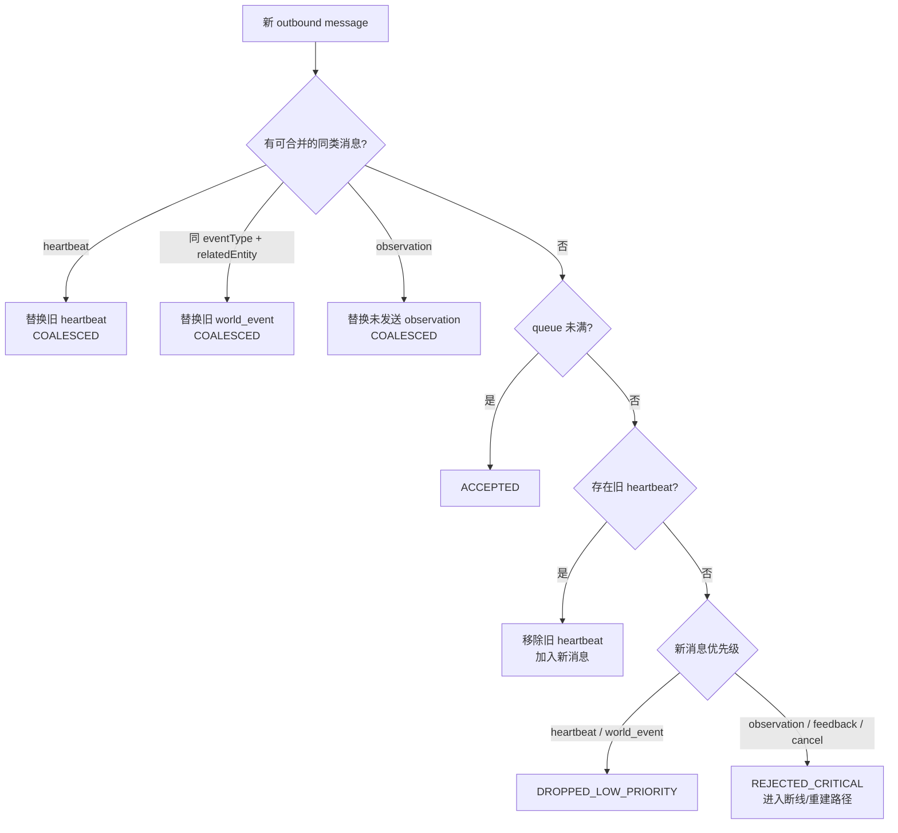

### 10.4 各消息的语义

| 消息 | 合并键 | 满时最后手段 |
|------|--------|--------------|
| heartbeat | 全 Session 只保留一个 | 丢弃 |
| observation | 当前未发送 observation | 关键拒绝并重建 |
| world_event | `eventType + relatedEntityId` | 丢弃 outbound，但 pending map 保留最新事件 |
| action_feedback | 不合并 | 关键拒绝并重建 |
| cancel_request | 不合并 | 关键拒绝并重建 |

### 10.5 pending events

pending events 使用单独的有界 `LinkedHashMap`：

- 同 `eventType + relatedEntityId` 更新为最新事件。
- 达到容量后，新 key 会淘汰最旧 key，并记录低优先级丢弃事件。
- observation request 会保存当时的 event snapshot 到 `RequestContext.sentEvents`。
- Handler 接受 intent 后，只清除仍等于已发送版本的事件；期间更新过的同 key 事件继续保留。
- Handler 拒绝 intent 时不清除 sent events，下一请求会再次携带它们。

---

## 11. 失败路径

| 失败 | 当前 Session 行为 | 不会发生 |
|------|--------------------|----------|
| soft deadline | `SOFT_TIMED_OUT`，请求继续等待 | 不 cancel、不清 Java Lease |
| hard deadline | generation++，进入 `CANCEL_PENDING` | 旧 intent 不再有效 |
| cancel grace 过期 | `DISCONNECTED`、调用 transport 重建 | 不并发启动新旧远程工作 |
| transport 断线且有活动请求 | generation++、清连接邮箱、请求重建、保留 latest | 不调用 Handler 修改 Enemy |
| inbound overflow | protocol fatal、generation++、调用 transport 重建 | 不阻塞 producer |
| decoder/framing failure | 暂存 typed failure，下一次 poll 报告 | IO owner 不直接调用 Handler |
| critical outbound 饱和 | `REJECTED_CRITICAL`、清邮箱、调用 transport 重建 | 不静默丢 feedback/cancel |
| Handler 拒绝 intent | 记录 typed rejection、保留 sent events | 不把未采纳结果当成完成 |
| stale/duplicate inbound | 明确丢弃并记录 lifecycle event | 不改变当前 request |
| identity mismatch | 不触发 intent handler | 不修改 Lease/Queue/cooldown |
| Session closed | 所有未来操作保持终止结果 | 不重新连接或重新激活 queue |

失败路径只管理会话状态。游戏中“旧 Lease 继续、本地 fallback 或 Reflex 接管”的行为属于
`Enemy`/`IntentArbiter`，将在生产接线时保持独立。

---

## 12. close() 的终止语义

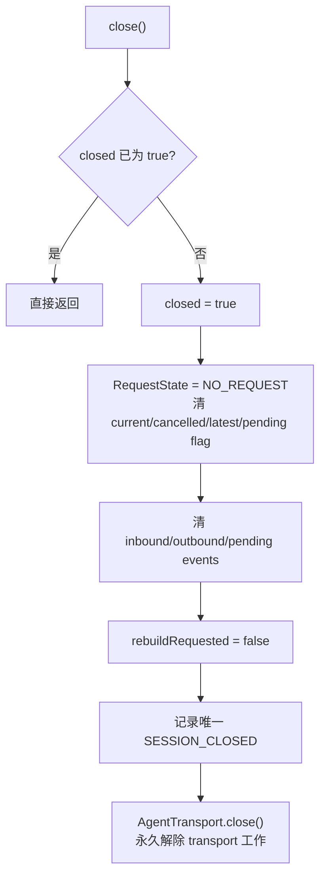

close 后：

| 调用 | 结果 |
|------|------|
| `requestIntent` | `CLOSED` |
| `sendActionFeedback` | `CLOSED` |
| `sendWorldEvent` | `CLOSED` |
| `sendHeartbeat` | `CLOSED` |
| `TransportEndpoint.offerInbound` | `CLOSED` |
| `TransportEndpoint.markConnected` | 无效果 |
| `pollInbound` | 不调用 Handler |
| `AgentTransport.close` | 恰好调用一次 |
| 再次 `close()` | 安全返回 |

当前 Session 已发出 transport close 命令。未来 Socket worker 必须在该命令中关闭物理 Socket
以解除阻塞 read，再按 `shutdownJoinMs` 做有界 join。

---

## 13. 配置快照

`AgentSessionConfig` 通过 Builder 一次性创建不可变配置：

| 配置 | 默认值 | 当前是否被核心使用 |
|------|--------|--------------------|
| enabled | `false` | 是 |
| host | `127.0.0.1` | 尚未被网络层使用 |
| port | `9876` | 尚未被网络层使用 |
| soft deadline | `1500 ms` | 是 |
| hard deadline | `10000 ms` | 是 |
| cancel grace | `500 ms` | 是 |
| outbound capacity | `32` | 是 |
| inbound capacity | `16` | 是 |
| pending event capacity | `16` | 是 |
| max inbound per poll | `8` | 是 |
| max frame bytes | `65536` | 尚未被 frame reader 使用 |
| reconnect initial | `250 ms` | 尚未被 worker 使用 |
| reconnect max | `4000 ms` | 尚未被 worker 使用 |
| shutdown join | `1000 ms` | 尚未被 worker 使用 |
| heartbeat ticks | `120` | 尚未接入生产调度 |
| capabilities | `PATROL/CHASE/ATTACK/GUARD` + 属性 | observation 序列化时使用 |

已实现的构造校验：

- `port` 在 1–65535。
- `soft > 0`，`hard > soft`。
- `cancelGrace > 0`。
- inbound/outbound/pending capacity 至少为 4。
- 每次 poll drain 至少为 1。
- frame size 在 1024–1,048,576 bytes。
- `reconnectMax >= reconnectInitial > 0`。
- deadline 必须能安全转换为纳秒。
- capability 的视野、攻击和移动参数必须在合法下界。

当前 Builder 对非法值抛出 `IllegalArgumentException`。把 properties 读取失败记录到 `Logger` 并回退默认值，
属于后续 `GameConfig` 启动边界接线工作。

---

## 14. 类型化生命周期事件

Session 保存最近 256 条 `LifecycleEvent`。每条包含：

```text
LifecycleEventType
logicalTick
sessionEpoch
requestGeneration
decisionId（可空）
detail
```

当前事件类型覆盖：

| 类别 | 类型 |
|------|------|
| 连接 | `CONNECTION_CONNECTING`、`CONNECTION_OPENED`、`CONNECTION_LOST` |
| 请求 | `REQUEST_STARTED`、`REQUEST_COMPLETED`、`REQUEST_REJECTED`、`OBSERVATION_COALESCED` |
| deadline/cancel | `AGENT_SLOW`、`CANCELLATION_STARTED`、`CANCELLATION_ACKNOWLEDGED`、`CANCELLATION_GRACE_EXPIRED` |
| inbound | `INBOUND_REJECTED`、`INBOUND_PROTOCOL_FATAL` |
| outbound | `OUTBOUND_LOW_PRIORITY_DROPPED`、`OUTBOUND_CRITICAL_REJECTED` |
| transport | `TRANSPORT_CONTROL_FAILED` |
| 生命周期 | `SESSION_CLOSED` |

这是当前状态机的有界、类型化诊断窗口，还不是最终 `AgentTrace` canonical schema。
后续 trace 接入应消费这些语义，不应把毫秒耗时或自由文本 detail 当作 canonical 正确性字段。

---

## 15. 当前测试覆盖

[`AgentSessionTest`](byog/Test/AgentSessionTest.java) 使用：

- `FakeClock`：直接推进纳秒值，不等待现实时间。
- `InMemoryTransport`：实现 `AgentTransport`，并通过 endpoint 取得 outbound、注入 inbound。
- `RecordingHandler`：记录 intent、cancel ack、protocol rejection 和 intent 处理结果。
- 真实 `PerceptionSystem`：生成私有 `ObservationEnvelope`。
- deterministic `IdGenerator`：固定 decision/message ID。

| 测试行为 | 主要证明 |
|----------|----------|
| disabled Session | 不启动 transport，关闭仍幂等 |
| 未发送 observation 替换 | queue 内只保留最新快照，仍只有一个请求 |
| 已发送请求期间的新 observation | 当前请求身份不变，最新快照等待下一请求 |
| soft deadline | 不取消、不递增 generation |
| hard deadline | generation 先失效，cancel 携带旧 generation |
| matching cancel ack | ack 后才启动最新请求 |
| 无新 observation 的 cancel ack | 不重复发送旧 observation |
| Handler 拒绝 intent | sent events 保留到下一请求 |
| cancel grace | 超时后请求重建，新连接进入新 epoch |
| heartbeat eviction | 关键消息优先移除 heartbeat |
| 满邮箱 observation 合并 | 不增加队列长度 |
| critical outbound saturation | 显式拒绝并进入重建路径 |
| cancel 的 critical saturation | generation 只递增一次并请求一次 transport 重建 |
| inbound overflow | Handler 运行前即 protocol fatal |
| 完整身份字段变异 | 任一关键字段错误都不能进入 intent handler |
| world event 合并 | 合并键正确且 pending storage 有界 |
| close 两次 | 幂等且永久 |
| 两个 Enemy Session | 身份、队列、generation 和响应不串线 |

2026-07-31 的验证结果：

```text
统一 deterministic gate
OK (89 tests)
```

这些测试不访问真实端口、不启动 Python、不使用 `Thread.sleep()`。

---

## 16. 接入 AI Tick 的位置

未来接线不能另建一套 Game Loop，只能填入现有
`poll → execute → commit → collect` seam：

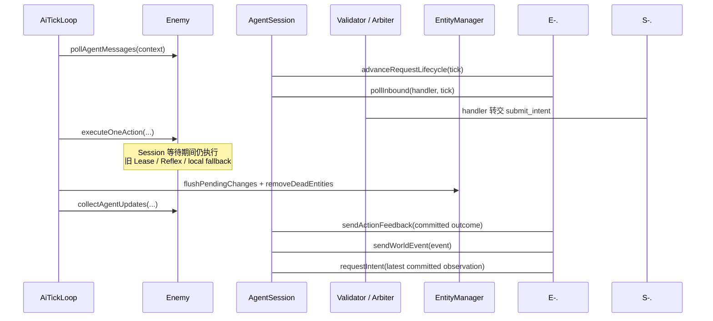

必须保持：

1. remote response 只在 poll 阶段进入 Validator/Arbiter。
2. execute 中不等待 Session。
3. feedback 和下一 observation 只读取 commit 后世界。
4. AgentSession 失败不能清除仍有效的 Java Lease。
5. Session 关闭属于 Enemy 死亡、离层和游戏退出的生命周期清理。

---

## 17. 当前未实现模块

### 17.1 TCP IO worker

后续 worker 需要：

- 唯一持有 Socket。
- persistent NDJSON read/write。
- 真正按 UTF-8 bytes 限制 frame。
- 读写均能持续推进，不能让永久阻塞 read 饿死 outbound。
- EOF、IO error 和 fatal protocol failure 转成 `TransportEndpoint` 事件。
- 250 → 500 → 1000 → 2000 → 4000 ms 指数退避。
- close Socket 解除阻塞 read，并做有界 join。

### 17.2 Python deterministic runtime

后续 Python 端需要：

- 每条连接独立 Agent context。
- 严格解析相同 schema。
- 只根据当前私有 observation 产生白名单 skill。
- 支持 normal、delay、malformed、disconnect、no-read 故障模式。

### 17.3 Enemy/Game 生产接线

后续 Java 生产路径需要：

- 每个 Enemy attach/detach 自己的 AgentSession。
- 新游戏、读档和换层创建新 run/session identity。
- Enemy 死亡、离层和退出关闭 Session。
- `AgentHandler` 把合法 request response 转交 `DecisionValidator`。
- bridge disabled 时不创建网络线程，但仍保持现有本地 AI Tick。

这些模块未完成前，不应把 Session 当前的内存 round-trip 描述为 Java ↔ Python 端到端闭环。

---

## 18. 必须长期保持的不变量

1. 一个 Enemy 一份独立 Session，不共享请求上下文。
2. 同时最多一个有效 in-flight；取消未确认前不启动并发新请求。
3. `latestObservation` 可以变化，已发送的 `RequestContext` 不能被偷换。
4. hard timeout、有效断线和 fatal failure 后，旧 generation 永远不能生效。
5. IO/transport owner 不调用 Enemy、Validator、Arbiter 或 Planner。
6. Handler 只由游戏线程上的 `pollInbound()` 调用。
7. inbound/outbound/pending events 全部有界，拥塞不能阻塞游戏线程。
8. critical feedback/cancel 不能静默丢失。
9. Session 只验证会话与请求身份，Java Validator 仍负责世界合法性。
10. `closed=true` 是永久终态。
11. monotonic time 只计算外部等待；`logicalTick` 只表达游戏因果。
12. AgentSession runtime state 不进入存档。

---

## 19. 最短代码阅读顺序

想理解当前 Session，只需按以下顺序：

1. [`AgentSession` 的公开 enum 与 RequestContext](byog/Bridge/AgentSession.java)
2. [`requestIntent` 与 `startLatestRequest`](byog/Bridge/AgentSession.java)
3. [`advanceRequestLifecycle`、`beginCancellation` 与 cancel ack](byog/Bridge/AgentSession.java)
4. [`enqueueOutbound` 与 pending event 合并](byog/Bridge/AgentSession.java)
5. [`TransportEndpoint`、`enqueueInbound` 与 `pollInbound`](byog/Bridge/AgentSession.java)
6. [`AgentTransport`](byog/Bridge/AgentTransport.java)
7. [`AgentHandler`](byog/Bridge/AgentHandler.java)
8. [`AgentSessionConfig`](byog/Bridge/AgentSessionConfig.java)
9. [`MonotonicClock`](byog/Bridge/MonotonicClock.java)
10. [`AgentProtocol` 与 codec](byog/Bridge/AgentProtocol.java)
11. [`AgentSessionTest`](byog/Test/AgentSessionTest.java)

读完第 3 项可以理解 single in-flight 和 deadline；读完第 5 项可以理解线程边界和背压；
读完第 11 项可以看到所有当前状态转换怎样被确定性复现。
