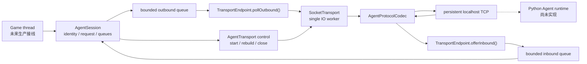
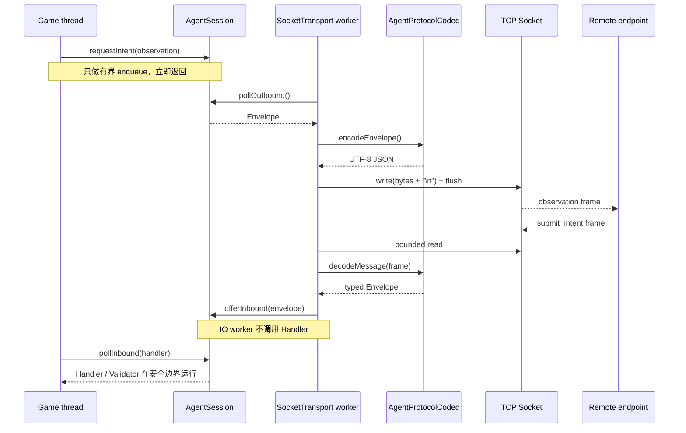
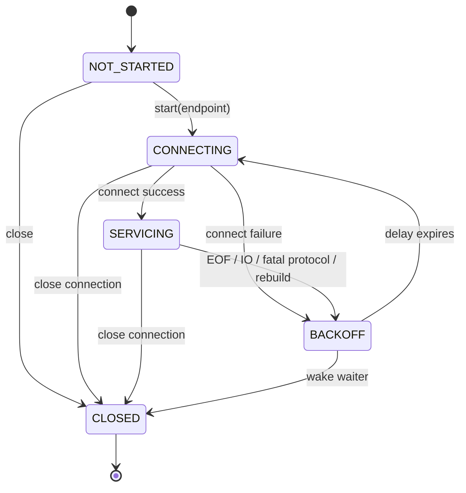
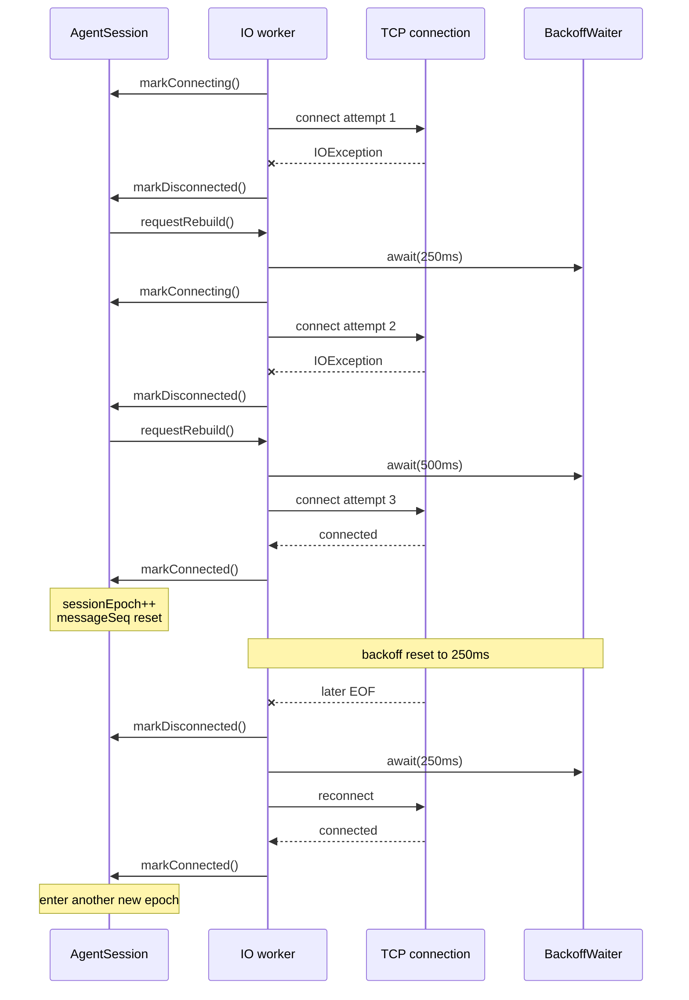
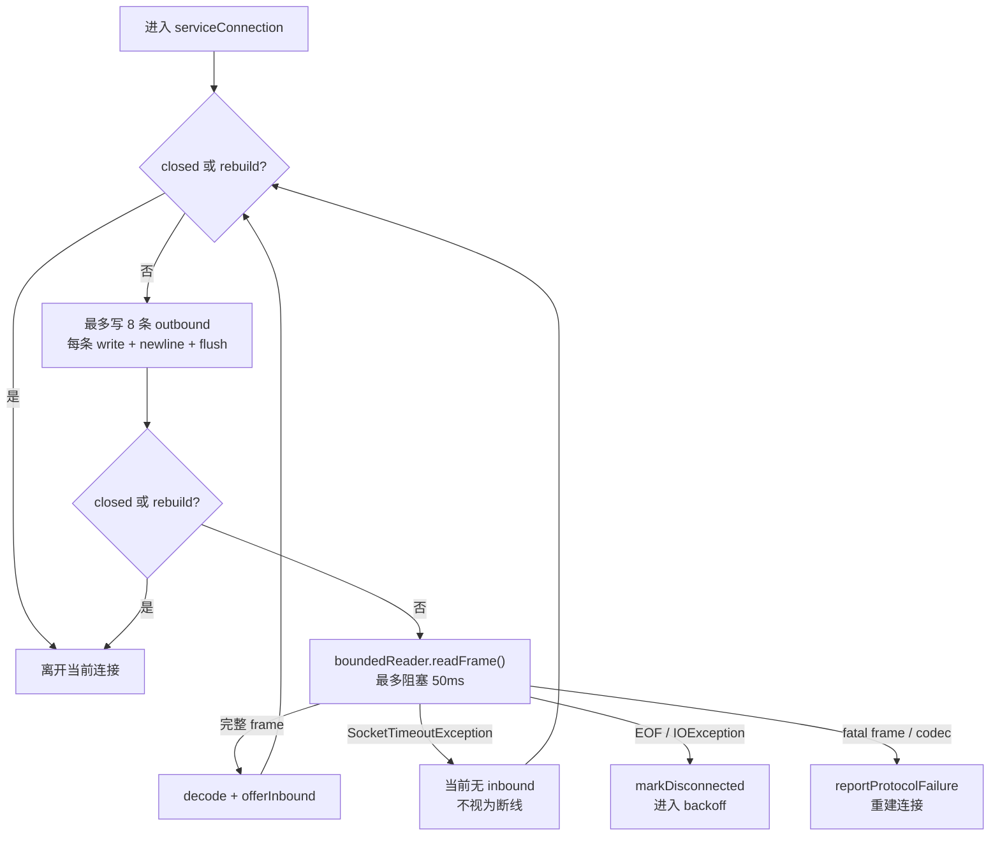
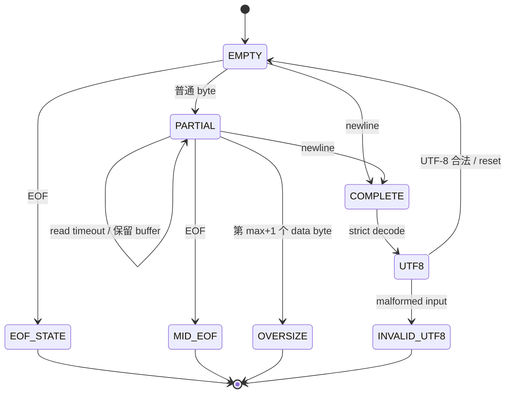
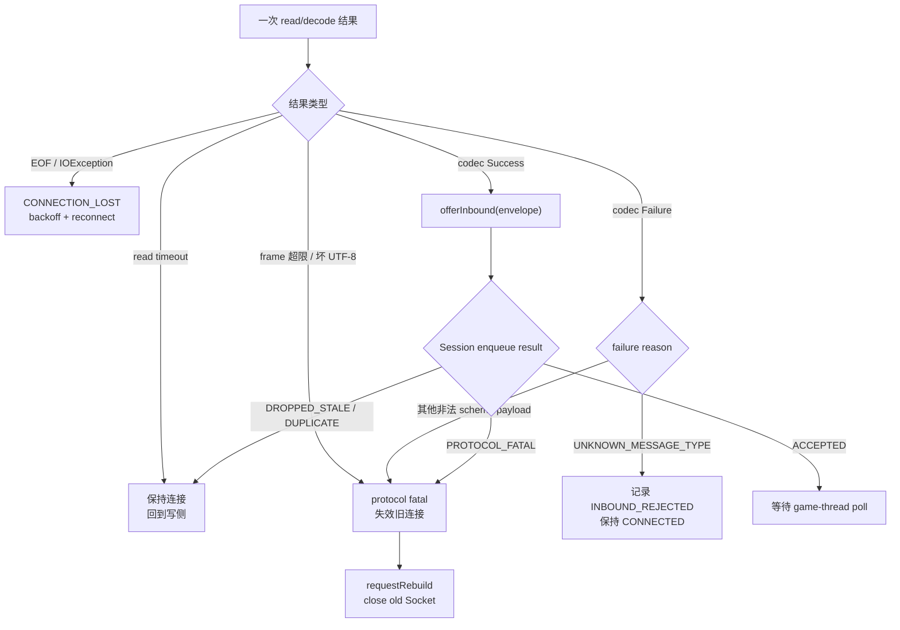
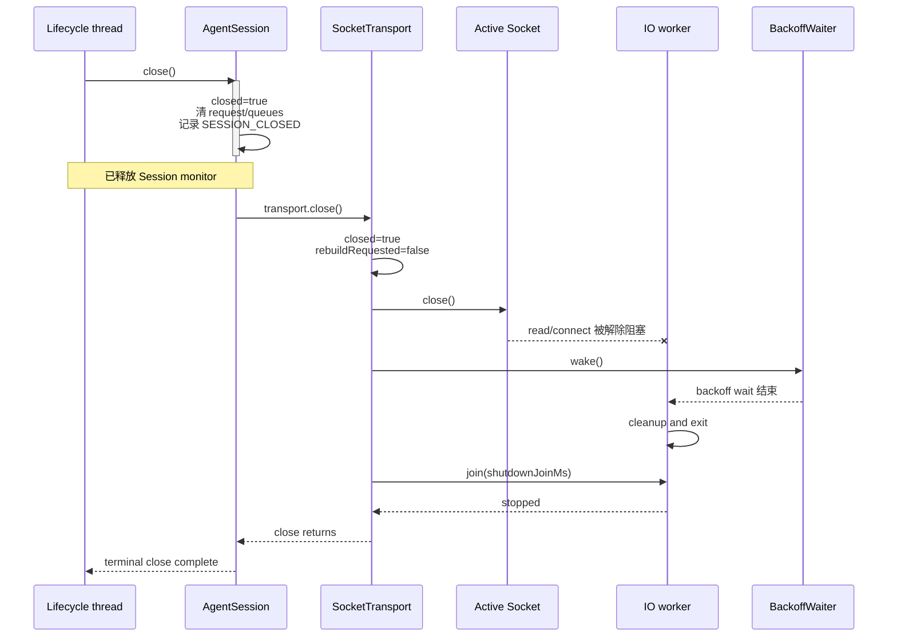

# DungeonMind SocketTransport 架构

> 状态：TCP/NDJSON transport 当前实现说明
>
> 更新时间：2026-07-31
>
> 范围：`SocketTransport`、唯一 IO worker、持久 TCP、NDJSON framing、UTF-8、
> 双向调度、断线重连、指数退避、协议失败、terminal close 与测试 seam
>
> 不包含：Python Agent runtime、`Enemy`/`Game` 生产接线、Intent 语义校验、
> Action 执行、模型调用和多 Agent 协作

---

## 0. 先读这一页

`SocketTransport` 是 `AgentSession` 的生产网络实现。它把 Session 的两个有界内存队列接到
localhost TCP，但不理解 Enemy 应该采取什么策略，也不允许网络线程直接修改游戏世界。

| 能力 | 状态 | 当前行为 |
|------|------|----------|
| 每 Session 独立 transport | **已实现** | 默认启用构造路径为每个 Session 创建自己的 `SocketTransport` 和 worker |
| 唯一 Socket IO owner | **已实现** | connect/read/write/flush 只在 worker thread 上执行 |
| 持久 TCP | **已实现** | 一次连接持续承载多条双向 NDJSON 消息 |
| 双向持续推进 | **已实现** | 每轮有界写出，再做 50ms 短读；阻塞读不会永久饿死 outbound |
| 有界 frame reader | **已实现** | 按 UTF-8 bytes 限制 frame，超限时不继续积累大字符串 |
| 严格 UTF-8 | **已实现** | malformed/unmappable byte sequence 被拒绝 |
| typed codec | **已实现** | 复用 `AgentProtocolCodec`，不在 transport 内复制 JSON schema |
| EOF/IO failure | **已实现** | 进入 Session 断线路径，关闭旧连接并后台重连 |
| 指数退避 | **已实现** | 默认 `250 → 500 → 1000 → 2000 → 4000 ms` |
| 新连接 epoch | **已实现** | connect 成功后由 Session 递增 `sessionEpoch` 并重置 message sequence |
| terminal close | **已实现** | 关闭 Socket 解除 read/connect，唤醒 backoff，并有界 join worker |
| localhost 双向测试 | **已实现** | 真实 Socket 上完成 Java 写出与读回解码 |
| Python server | **未实现** | 当前没有正式跨进程 Agent 往返 |
| Game/Enemy 接线 | **未实现** | 正式游戏当前不会创建启用的远程 Session |

最重要的边界：

```text
Game thread
  只 enqueue / poll Session 内存状态

SocketTransport worker
  只 connect / encode / write / read / decode / enqueue

AgentHandler
  只在 Game thread 调用 pollInbound() 时运行
```

相关文档：

- [`session.md`](session.md)：Session 身份、请求、deadline、队列和状态机。
- [`AI_TICK_ARCHITECTURE.md`](AI_TICK_ARCHITECTURE.md)：Game Loop、AI Tick 和控制层。
- [`PHASE_2_SPEC.md`](PHASE_2_SPEC.md)：Phase 2 的锁定契约与验收矩阵。

---

## 1. SocketTransport 是什么

### 1.1 它是字节传输层，不是 Agent

`SocketTransport` 回答的是：

```text
什么时候连接 localhost server？
怎样把 Envelope 写成一条完整 NDJSON frame？
怎样从连续 TCP byte stream 中切出消息？
读写如何都获得执行机会？
断线后等多久再连？
怎样让 close 解除阻塞 read？
哪些 framing/codec failure 会触发重建？
```

它不回答：

```text
Enemy 应该 CHASE 还是 PATROL？
远程 intent 是否符合当前私有观察？
目标是否可见、可达或仍然有效？
ActionQueue 应该装入什么动作？
玩家和 Enemy 是否发生碰撞？
```

后面这些职责属于：

| 职责 | 所有者 |
|------|--------|
| 会话身份、request、generation、epoch | `AgentSession` |
| JSON schema 与类型化 payload | `AgentProtocolCodec` |
| intent 的权限和世界语义 | `DecisionValidator` |
| 控制优先级和 lease | `IntentArbiter` |
| 路径与原子动作 | `ClassicalPlanner` / `Action` |
| 世界事实和实体提交 | Java Game / `EntityManager` |

### 1.2 为什么单独做 transport

如果把 Socket 直接写进 `Enemy.updateAI()` 或 `Game`：

- 网络延迟会阻塞游戏线程；
- reconnect、deadline 和动作决策会耦合成一个大状态机；
- 单元测试必须打开真实端口；
- IO thread 可能越过 Validator 直接修改 Enemy；
- close、换层和死亡时更容易遗留旧线程。

当前拆分保持：

```text
AgentSession = 会话语义与有界邮箱
SocketTransport = 物理 TCP 生命周期与 bytes
AgentProtocolCodec = Envelope ↔ JSON
```

---

## 2. 当前模块连接图



实线已经实现。虚线表示后续 Python runtime。

当前默认构造关系：

```text
new AgentSession(config, identity, clock)
  → new SocketTransport(config)
  → config.enabled == true 时 transport.start(endpoint)
  → config.enabled == false 时不启动 worker
```

显式依赖注入构造器仍然保留，因此 Session 状态机测试继续使用内存 transport。

---

## 3. 线程与所有权

### 3.1 唯一 worker

每个启动的 `SocketTransport` 创建一个 daemon thread：

```text
dungeonmind-agent-io-<sequence>
```

它是该 transport 的唯一 connect/read/write/flush owner。

| 操作 | 正常调用线程 |
|------|--------------|
| `ConnectionFactory.create()` | IO worker |
| `Socket.connect()` | IO worker |
| `Socket.setSoTimeout()` | IO worker |
| `InputStream.read()` | IO worker |
| `OutputStream.write()/flush()` | IO worker |
| `TransportEndpoint.pollOutbound()` | IO worker |
| `TransportEndpoint.offerInbound()` | IO worker |
| `requestRebuild()` | Session/game lifecycle thread |
| `Socket.close()` 用于解除阻塞 | lifecycle thread 或 worker cleanup |
| bounded `join()` | terminal shutdown path |

显式 close 是所有权规则的唯一例外：另一个线程可以关闭 Socket，目的是让阻塞中的 worker
立即获得 `SocketException`/EOF 并退出。它不能从另一个线程执行普通 read/write。

### 3.2 不调用游戏对象

worker 不持有也不调用：

- `Enemy`
- `Player`
- `EntityManager`
- `DecisionValidator`
- `IntentArbiter`
- `ClassicalPlanner`
- `ActionQueue`

收到合法 `submit_intent` 时，worker 也只做：

```text
decode
  → offerInbound(envelope)
  → 返回 IO loop
```

真正的 Handler 和 Validator 只会在游戏线程下一次 `pollInbound()` 时运行。

### 3.3 正常双向往返时序

下面同时标出线程边界和消息方向。remote endpoint 当前由 localhost 测试实现，后续替换为
Python runtime 时不改变 Java 侧顺序。



### 3.4 同步边界

Transport 自身使用：

- `volatile`：`endpoint`、`rebuildRequested`、`closed`；
- `lifecycleLock`：worker、active connection 的注册与读取；
- `MonitorBackoffWaiter` 内部 monitor：可唤醒退避等待；
- Session 自己的同步：inbound/outbound queue 和状态。

Transport 不持有 Session monitor 执行阻塞 IO。`AgentSession.close()` 也先在自身同步块内进入终态，
再在同步块外调用 transport close，避免 Session lock 与 worker join 形成锁等待。

---

## 4. Transport 生命周期

### 4.1 高层状态

`SocketTransport` 不再复制一套公开 ConnectionState；公开状态仍由 `AgentSession` 持有：

```text
DISABLED | CONNECTING | CONNECTED | DISCONNECTED
```

Transport 内部只保存物理控制事实：

```text
endpoint
worker
activeConnection
rebuildRequested
closed
```



### 4.2 start

`start(endpoint)`：

1. 保存唯一 `TransportEndpoint`；
2. 创建 daemon worker；
3. 立即返回；
4. worker 在后台执行 connect。

同一个 transport 重复 `start()` 是编程错误，会抛出 `IllegalStateException`。

### 4.3 建立连接

每次尝试：

```text
endpoint.markConnecting()
  → ConnectionFactory.create()
  → 注册 activeConnection
  → connect(host, port, connectTimeout)
  → setReadTimeout(50ms)
  → 创建 buffered input/output
  → endpoint.markConnected(-1)
  → serviceConnection()
```

连接对象在调用 connect 前就注册为 active，保证 terminal close 可以关闭仍在连接中的 Socket。

内部 connect timeout：

```text
min(reconnectInitialMs, shutdownJoinMs)
```

随后限制到合法的正 `int` 范围。这样 connect 不会无界超过正常关闭预算。

### 4.4 连接成功

`endpoint.markConnected()` 让 Session：

- `sessionEpoch++`；
- outbound `messageSeq` 从 0 重新开始；
- `highestInboundMessageSeq` 重置；
- `ConnectionState = CONNECTED`；
- 清除已观察到的 rebuild request；
- 如果保存了 latest observation/request pending，启动新 request。

Transport 的 backoff 也重置为初始值。

### 4.5 连接失败或丢失

connect/read/write 的 `IOException` 会调用：

```text
endpoint.markDisconnected(detail, -1)
```

Session 随后：

- 失效与旧连接绑定的 in-flight request；
- 必要时递增 `requestGeneration`；
- 清理连接级 inbound/outbound；
- 保留 `latestObservation`；
- 进入 `DISCONNECTED`；
- 调用 `transport.requestRebuild()`。

worker 清理旧 connection，确认 rebuild request，然后进入 backoff。

---

## 5. 指数退避

### 5.1 默认序列

配置默认值：

```text
initial = 250ms
max     = 4000ms
```

连续连接失败：

```text
attempt 1 fails → wait 250
attempt 2 fails → wait 500
attempt 3 fails → wait 1000
attempt 4 fails → wait 2000
attempt 5 fails → wait 4000
later failures  → wait 4000
```

使用饱和式翻倍，不允许 long overflow。

### 5.2 成功后重置

只要一次物理 connect 成功，后续断线的第一段等待重新从 250ms 开始：

```text
250 → 500 → connect success
                   |
                   +→ later disconnect → 250
```

这和 `sessionEpoch` 的含义一致：新物理连接是新 epoch，不继承旧连接的 message sequence。



### 5.3 为什么当前没有 jitter

当前目标是 localhost 且 Enemy 数量有限，规范锁定的是确定性的指数序列，所以没有加入随机 jitter。
若未来大量 Session 同时重连导致 herd effect，应在新的规模验证后再决定，不能悄悄改变现有测试契约。

### 5.4 可唤醒等待

生产 `MonitorBackoffWaiter`：

- 使用 monitor wait，不 busy-spin；
- 对 spurious wakeup 重新计算剩余单调时间；
- terminal close 调用 `wake()`；
- close 后不会重新 connect。

测试注入 fake waiter，可以直接记录 `250/500/...`，不使用 `Thread.sleep()`。

---

## 6. 为什么读写都能持续推进

### 6.1 风险

一个线程如果这样写：

```text
connect
read forever
write only after read returns
```

那么连接没有 inbound 时，后来进入 outbound queue 的 observation 永远不会发出。

### 6.2 当前调度

每轮：

```text
最多写 8 条 outbound
  → flush 每条 frame
  → 尝试读取 1 条 frame
  → read 最长阻塞 50ms
  → timeout 后回到循环
```

伪代码：

```text
while not closed and not rebuildRequested:
    drainOutbound(max=8)
    if closed or rebuildRequested:
        return

    try:
        frame = boundedReader.readFrame(input)
        decodeAndOffer(frame)
    catch SocketTimeoutException:
        continue
```

性质：

- outbound 在没有 inbound 时最多等待一个短读周期；
- inbound 很多时，每读一条仍会回到写侧；
- outbound 很多时每轮最多发 8 条，读侧不会永久饥饿；
- 游戏线程从不参与这个循环。

这里的 50ms 是 transport polling 参数，不是游戏逻辑 deadline，也不进入 canonical gameplay trace。



---

## 7. NDJSON 写出

### 7.1 一条 Envelope 的路径

```text
AgentSession outbound queue
  → TransportEndpoint.pollOutbound()
  → AgentProtocolCodec.encodeEnvelope()
  → UTF-8 bytes
  → 检查 byte length
  → write(bytes)
  → write('\n')
  → flush()
```

TCP 只看到 bytes，不知道 observation、feedback 或 heartbeat。

### 7.2 为什么检查 UTF-8 byte length

下面是错误检查：

```text
json.length()
```

它统计 Java UTF-16 code units，不等于 wire bytes。中文等字符通常占多个 UTF-8 bytes。

当前实现先编码 UTF-8：

```text
bytes.length > maxFrameBytes
  → FRAME_TOO_LARGE
  → 不写任何 byte
  → protocol fatal / rebuild
```

frame limit 不包含最后的 NDJSON `\n` delimiter。

### 7.3 为什么每条 flush

当前是 localhost、低吞吐控制消息。每条 frame flush：

- 让 observation/cancel 不滞留在用户态缓冲；
- 时序更容易测试和诊断；
- 避免等待另一条消息才真正发送。

若未来性能数据证明需要 batching，应保持 frame 边界和有界延迟后再调整。

---

## 8. 有界 NDJSON 读取

### 8.1 TCP 没有消息边界

一次 socket read 可能得到：

```text
半条 JSON
一条完整 JSON
两条 JSON 的组合
上一条尾部 + 下一条头部
```

因此不能假设“一次 read 就是一条消息”。

### 8.2 BoundedFrameReader

`BoundedFrameReader` 持有一个当前 frame 的 byte buffer：

```text
read byte
  ├─ '\n' → 完成 frame
  ├─ EOF 且 buffer 空 → connection EOF
  ├─ EOF 且 buffer 非空 → mid-frame EOF
  ├─ 已有 max bytes 且又来一个 byte → FRAME_TOO_LARGE
  └─ 其他 byte → append
```

初始 buffer capacity 最多 4096 bytes，但可以增长到配置上限。

### 8.3 精确上限

若 limit 为 65,536：

```text
65,536 bytes + '\n' → 接受
65,537th data byte   → 立即拒绝
```

第 65,537 个 byte 不会写入 frame buffer，也不会继续等待完整超大字符串。

### 8.4 timeout 不会丢半帧

read timeout 可能发生在：

```text
{"schemaVer
             ↑ timeout
```

reader 对象在整个物理连接期间复用，所以 timeout 只退出本次 read 调度，不 reset buffer。
下一轮继续读取剩余 bytes。

只有：

- 完整 `\n` frame；
- connection teardown；
- fatal framing failure

才结束当前积累。



图中的 `COMPLETE → UTF8 → EMPTY` 只表示 framing 完成；后续 JSON decode 仍可能产生 schema failure。

### 8.5 严格 UTF-8

完成 byte frame 后使用 `CharsetDecoder`：

```text
malformed input     → REPORT
unmappable character → REPORT
```

坏 UTF-8 不会被替换成 `�` 后继续解析。当前映射为 typed `JSON_SYNTAX` failure，并带
`frame is not valid UTF-8` detail。

---

## 9. 解码与 inbound

### 9.1 复用 codec

Transport 不自己判断 JSON 字段。完整 frame 交给：

```java
AgentProtocolCodec.decodeMessage(
        frame,
        config.getMaxFrameBytes(),
        AgentProtocolCodec.DEFAULT_MAX_DEPTH);
```

因此最大 JSON depth 仍为 16，重复 key、类型错误、未知字段、非法数字等规则都只有一个来源。

### 9.2 成功路径

```text
frame
  → DecodeResult.Success(envelope)
  → logicalTick 非负检查
  → endpoint.offerInbound(envelope, envelope.logicalTick)
```

Session endpoint 再执行：

- run/floor/agent/epoch 的明显 stale 检查；
- inbound `messageSeq` duplicate 检查；
- inbound queue capacity 检查。

Transport 不重复这些 Session 规则。

### 9.3 stale 和 duplicate

`offerInbound()` 返回：

```text
DROPPED_STALE
DROPPED_DUPLICATE
```

时，worker 继续保持连接。这些是旧/重复消息，不是 frame 边界破坏。

### 9.4 inbound overflow

有效关键消息无法放入有界 inbound queue 时，Session 返回：

```text
PROTOCOL_FATAL
```

Transport 将当前连接结束并进入重建。游戏线程不会因为 producer 太快而阻塞。

---

## 10. Fatal 与 recoverable failure

### 10.1 当前分类

| 失败 | 连接行为 |
|------|----------|
| frame 超过 byte limit | fatal，重建 |
| 坏 UTF-8 | fatal，重建 |
| mid-frame EOF | connection lost，重连 |
| JSON syntax/schema failure | fatal，重建 |
| JSON depth > 16 | fatal，重建 |
| known message 的非法 payload | fatal，重建 |
| negative `logicalTick` | fatal，重建 |
| inbound critical overflow | fatal，重建 |
| unknown future message type | recoverable，报告并保持连接 |
| stale identity | 丢弃并保持连接 |
| duplicate message sequence | 丢弃并保持连接 |
| read timeout | 正常调度边界，不是失败 |



### 10.2 unknown message type 为什么不掉线

相同 envelope version 下，未来 runtime 可能发送 Java 当前版本不认识的兼容诊断消息。

当前路径：

```text
UNKNOWN_MESSAGE_TYPE
  → endpoint.reportRecoverableProtocolFailure()
  → Session 记录 INBOUND_REJECTED
  → 下一次 game-thread poll 通知 AgentHandler
  → 当前 request/lease/world 不变
  → Socket 保持 CONNECTED
```

recoverable 不等于宽松执行。未知消息永远不能产生 intent 或 Action。

### 10.3 fatal failure 为什么不直接调用 Handler

IO worker 只能把 typed failure 暂存到 Session。下一次 `pollInbound()` 才调用：

```text
AgentHandler.onProtocolRejected(failure)
```

因此即使输入恶意或损坏，网络线程也不会回调 Enemy。

---

## 11. Rebuild

### 11.1 谁会请求 rebuild

Session 在以下情况调用 `transport.requestRebuild()`：

- cancel grace expired；
- fatal codec/framing failure；
- inbound critical overflow；
- critical outbound saturation；
- connection lost；
- Session 判断旧物理连接必须作废。

### 11.2 requestRebuild 做什么

```text
rebuildRequested = true
close(activeConnection)
立即返回
```

它不 join，不在调用线程重新 connect，也不等待 worker 确认。

worker 被 Socket close 唤醒后：

1. 离开当前 service loop；
2. 清理旧 connection；
3. `acknowledgeRebuildRequest()`；
4. 执行 backoff；
5. 创建新物理连接。

### 11.3 为什么 Session 和 Transport 都有 rebuild flag

- Session flag 表示会话状态机已经要求物理重建；
- Transport flag 表示 worker 控制循环必须离开当前 connection。

worker 同时观察两者并显式 ack，避免控制请求只停留在其中一侧。

---

## 12. Terminal close

### 12.1 close 顺序

`AgentSession.close()`：

```text
Session synchronized block
  → closed=true
  → 清 request/queue/pending state
  → 记录 SESSION_CLOSED
离开 Session lock
  → transport.close()
```

`SocketTransport.close()`：

```text
transport closed=true
rebuildRequested=false
close(activeConnection)
wake(backoffWaiter)
join(worker, shutdownJoinMs)
```



### 12.2 为什么先离开 Session lock

worker 可能正准备调用 endpoint。如果 Session 持有自身 monitor 再 join worker：

```text
close thread 持有 Session lock，等待 worker
worker 等待 Session lock，无法退出
```

当前实现先完成 Session 终态，再释放 lock，然后关闭/等待 worker，消除这条锁环。

### 12.3 close 的永久性

close 后：

- 不再 connect；
- 不再 rebuild；
- 不再从 outbound 取消息；
- endpoint inbound 返回 `CLOSED`；
- Session send/request 返回 `CLOSED`；
- 第二次 close 立即返回。

worker 是 daemon 只作为最后防护，不代表可以接受线程泄漏；若超过 join 上限仍未停止，
通过 `Logger.error()` 报告。

---

## 13. 配置

来自 [`AgentSessionConfig`](byog/Bridge/AgentSessionConfig.java)：

| 配置 | 默认值 | 用途 |
|------|--------|------|
| `enabled` | `false` | false 时 Session 不启动 transport |
| `host` | `127.0.0.1` | Python runtime 地址 |
| `port` | `9876` | Python runtime 端口 |
| `maxFrameBytes` | `65,536` | 单条 NDJSON data frame 最大 UTF-8 bytes |
| `reconnectInitialMs` | `250` | 首次/重置后的重连等待 |
| `reconnectMaxMs` | `4,000` | 退避上限 |
| `shutdownJoinMs` | `1,000` | terminal worker join 上限 |

Transport 内部固定调度参数：

| 参数 | 当前值 | 含义 |
|------|--------|------|
| read poll timeout | `50ms` | 没有 inbound 时回到写侧的最大等待 |
| writes per cycle | `8` | 每轮写侧 batch 上限 |
| JSON max depth | `16` | 由 codec 默认值提供 |

Session 的 soft/hard deadline 与 cancel grace 不在 transport 内计算。

---

## 14. 测试 seam

### 14.1 为什么不只测真实 Socket

真实 localhost 测试可以证明：

- Java 标准 Socket 能连接；
- NDJSON 能真实写出；
- inbound bytes 能真实读回；
- persistent connection 双向工作。

但它不适合精确控制：

- 前两次 connect 失败、第三次成功；
- backoff 记录必须正好是 250/500；
- worker 正好阻塞在 read；
- 第 65,537 个 byte 立即失败；
- 半帧中间正好发生 timeout。

因此 transport 保留最小注入 seam。

### 14.2 可注入接口

`SocketTransport` 内部 package seam：

```text
ConnectionFactory
  → create TransportConnection

TransportConnection
  → connect / setReadTimeout / input / output / close

BackoffWaiter
  → await(delayMs) / wake()
```

生产实现：

```text
JavaSocketConnection
MonitorBackoffWaiter
```

测试实现：

- recording connection；
- scheduled connect failure；
- polling input；
- blocking input；
- immediate/holding waiter；
- counting byte input。

### 14.3 当前自动测试

[`SocketTransportTest`](byog/Bridge/SocketTransportTest.java) 共 9 个测试：

| 测试 | 主要证明 |
|------|----------|
| localhost 双向 NDJSON | 真实 Socket 写 heartbeat，并读回 protocol diagnostic |
| worker thread ownership | connect/read/write 来自同一 worker，不是测试/game thread |
| reconnect/backoff/epoch | 250/500，成功重置，重建后 epoch++ |
| close unblocks reader | 阻塞 read 被 close 唤醒，worker 在上限内结束 |
| oversize inbound | 第一个超限 byte 立即失败 |
| partial frame timeout | timeout 前 bytes 在下一轮继续使用 |
| malformed UTF-8 | strict decoder 拒绝坏 byte sequence |
| oversize outbound | 检查发生在任何 write 前 |
| unknown message type | Handler 收到 typed rejection，连接保持 CONNECTED |

当前联合验证：

```text
Phase2TestSuite + SocketTransportTest
OK (98 tests)
```

Transport 测试曾连续重复 5 次，均为：

```text
OK (9 tests)
```

---

## 15. 当前尚未接线的部分

### 15.1 Python deterministic runtime

后续 server 需要：

- 监听 `127.0.0.1:9876`；
- 每条 TCP connection 保持独立 Agent context；
- 严格使用相同 envelope/payload schema；
- 持续读取 observation/feedback/event；
- 返回 `submit_intent` 和 `cancel_ack`；
- 提供 normal/delay/malformed/disconnect/no-read 故障模式。

Transport 不负责启动 Python 进程。

### 15.2 Game/Enemy 生产接线

后续 Java 路径需要：

- 每个 Enemy 创建自己的启用 Session；
- `pollAgentMessages()` 在 game-thread 安全边界 drain inbound；
- `collectAgentUpdates()` enqueue observation/feedback；
- Enemy 死亡、换层、退出时 close；
- bridge disabled 时不创建 worker；
- runtime 不可达时继续本地 fallback。

这些完成前，当前结果只能称为“真实 Java TCP transport”，不能称为完整 Java ↔ Python ↔ Action 闭环。

---

## 16. 常见错误实现

### 16.1 在 Game thread 直接 new Socket

后果：连接失败或 read 卡住时游戏停止推进。

正确边界：Game thread 只调用 Session 的非阻塞 queue API。

### 16.2 使用 `BufferedReader.readLine()` 后才检查大小

后果：对方可以发送没有换行的巨大输入，先迫使 JVM 分配巨大 String。

正确边界：先用 `BoundedFrameReader` 按 byte 累积和拒绝，再 decode UTF-8。

### 16.3 按 `String.length()` 限制 frame

后果：多字节 UTF-8 内容绕过 wire limit。

正确边界：写侧检查 UTF-8 `bytes.length`。

### 16.4 一个线程永久 read

后果：outbound observation/cancel 永远无法写出。

正确边界：短读 timeout + bounded write batch。

### 16.5 IO worker 直接调用 Enemy

后果：跨线程世界修改、跳过 Validator、不可重复竞态。

正确边界：worker 只 offer inbound，Handler 只由 game-thread poll 调用。

### 16.6 只设置 closed flag

后果：worker 仍阻塞在 Socket read 或 backoff wait。

正确边界：close active Socket + wake waiter + bounded join。

### 16.7 每毫秒 reconnect

后果：无 server 时占 CPU、刷日志、多个 Enemy 同时打满连接尝试。

正确边界：配置化、封顶的指数退避。

### 16.8 把所有未知输入都宽松解析

后果：未来字段可能被错误理解为可执行 intent。

正确边界：只把 unknown message type 当 recoverable diagnostic；未知内容仍不执行。

---

## 17. 长期不变量

1. 一个启动的 transport 只有一个 IO worker。
2. 普通 connect/read/write/flush 只能由 worker 调用。
3. lifecycle thread 只能通过 close Socket 解除阻塞，不能参与普通 IO。
4. worker 不调用 Enemy、Validator、Arbiter、Planner 或 Action。
5. 游戏线程不等待 connect、read、write、backoff 或远程响应。
6. 一条 NDJSON frame 以 `\n` 结束，frame limit 按 UTF-8 data bytes 计算。
7. reader 在超限 byte 到达时立即失败，不能先构造无界 String。
8. partial frame 在 read timeout 后必须保留。
9. malformed UTF-8 不得替换后继续解析。
10. fatal failure 必须使旧物理连接失效。
11. reconnect 成功必须进入新 `sessionEpoch`。
12. backoff 成功连接后必须重置。
13. unknown compatible message 不执行，也不必破坏健康连接。
14. terminal close 后不得重连。
15. close 必须解除阻塞 read，并且 join 有上限。
16. transport diagnostic wall time 不进入 deterministic gameplay evidence。

---

## 18. 故障定位

### 18.1 连不上 server

检查顺序：

```text
config.enabled 是否为 true
  → host/port 是否正确
  → Session 是否真的构造
  → worker 是否启动
  → ConnectionState 是否 CONNECTING/DISCONNECTED
  → localhost server 是否监听
  → backoff 是否按 250/500/... 推进
```

### 18.2 已连接但 Python 收不到 observation

```text
Session 是否 CONNECTED
  → requestIntent 是否产生 outbound
  → outbound queue 是否被 worker poll
  → encode 是否成功
  → frame 是否超 64KiB
  → output.write + flush 是否发生
  → Python 是否持续 read
```

### 18.3 Java 收到 bytes 但没有 intent

```text
是否读到 '\n'
  → UTF-8 是否合法
  → codec 是否 Success
  → logicalTick 是否非负
  → Session identity/epoch 是否匹配
  → messageSeq 是否 stale/duplicate
  → inbound queue 是否有空间
  → game thread 是否调用 pollInbound
  → Validator 是否接受 intent
```

### 18.4 close 后还有 worker

```text
AgentSession.close 是否执行
  → 是否在 Session lock 外调用 transport.close
  → active connection 是否已注册
  → Socket.close 是否解除 read/connect
  → backoff waiter 是否 wake
  → shutdownJoinMs 是否合理
  → Logger 是否报告 join 超时
```

---

## 19. 最短阅读顺序

想理解当前 transport，只需按以下顺序：

1. [`AgentTransport`](byog/Bridge/AgentTransport.java)
2. [`SocketTransport.start/requestRebuild/close`](byog/Bridge/SocketTransport.java)
3. [`runIoLoop` 与 `runOneConnection`](byog/Bridge/SocketTransport.java)
4. [`serviceConnection` 与 `drainOutbound`](byog/Bridge/SocketTransport.java)
5. [`BoundedFrameReader`](byog/Bridge/SocketTransport.java)
6. [`acceptInboundFrame`](byog/Bridge/SocketTransport.java)
7. [`AgentSession.TransportEndpoint`](byog/Bridge/AgentSession.java)
8. [`AgentSession.openConnection/loseConnection/protocolFatal`](byog/Bridge/AgentSession.java)
9. [`AgentSessionConfig`](byog/Bridge/AgentSessionConfig.java)
10. [`AgentProtocolCodec`](byog/Bridge/AgentProtocolCodec.java)
11. [`SocketTransportTest`](byog/Bridge/SocketTransportTest.java)

读完第 4 项可以理解双向公平性；读完第 6 项可以理解 frame 和 failure 边界；
读完最后一项可以看到真实 Socket 与确定性 failure injection 怎样互补。
